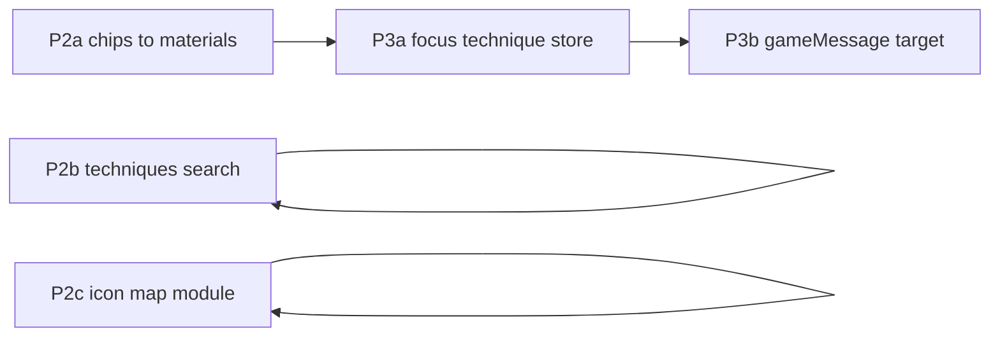

# Энциклопедия техники: следующий инкремент (P2–P3)

**Контекст:** каркас P0–P1c и P1.5 уже есть: [`buildEncyclopediaTechniqueSections`](src/lib/encyclopedia/encyclopedia-technique-sections.ts), [`TechniquesSection`](src/components/encyclopedia/techniques-section.tsx), [`EncyclopediaTechniqueCard`](src/components/encyclopedia/encyclopedia-technique-card.tsx), фокус материала через [`encyclopediaFocusMaterialId`](src/store/slices/encyclopedia-slice.ts) в [`encyclopedia-screen.tsx`](src/components/screens/encyclopedia-screen.tsx).

Ниже — работы по **§4** дорожной карты: **P2a–P2c**, затем **P3a–P3b** (и при желании **P3c**).

---

## P2a — Переход к материалам с карточки техники

**Цель:** клик по связанным материалам открывает вкладку **Материалы**, выставляет фокус и скролл (как сейчас для `encyclopediaFocusMaterialId`).

**Изменения:**

- В [`encyclopedia-technique-card.tsx`](src/components/encyclopedia/encyclopedia-technique-card.tsx): вынести «сырые» `relatedMaterialIds` из только collapsible в явную секцию **«Связанные материалы»** (или кликабельные `Badge` / `Button` variant ghost) с подписью из [`materialById`](src/data/materials) (`identity.name`, fallback — `id`).
- По клику вызывать **`setEncyclopediaFocusMaterialId(catalogId)`** (как в [`encyclopedia-slice.ts`](src/store/slices/encyclopedia-slice.ts)); вкладка «Материалы» уже переключается существующей логикой экрана.
- Учесть **legacy-ключи ремонта** в [`repairCard`](src/lib/encyclopedia/encyclopedia-technique-sections.ts): для P2a либо не показывать чипы без `materialById[id]`, либо показывать с подписью «склад / legacy» без навигации — чтобы не слать несуществующий каталожный id в фокус.

**Проверка:** ручной смоук: вкладка Техники → клик по чипу → Материалы + скролл к карточке.

---

## P2b — Поиск по техникам

**Цель:** debounced поле в шапке раздела **Техники** (имя и при необходимости `id`), фильтрация списков карточек без пересборки моделей из реестров.

**Изменения:**

- В [`techniques-section.tsx`](src/components/encyclopedia/techniques-section.tsx): локальный state + `useMemo` фильтр по `model.name`, `model.ref.id`, опционально строки из `summaryRows`; debounce ~200–300 ms (отдельный хук или `useDeferredValue` для простого варианта).
- Пустое состояние: «ничего не найдено» при ненулевом запросе.

---

## P2c — Единый маппинг иконок (и опционально подписей)

**Цель:** Lucide по `kind` в одном месте (roadmap P2c), чтобы не дублировать при переиспользовании.

**Изменения:**

- Новый модуль, например [`src/lib/encyclopedia/encyclopedia-technique-kind-ui.ts`](src/lib/encyclopedia/encyclopedia-technique-kind-ui.ts): экспорт `getEncyclopediaTechniqueKindIcon(kind)` и при необходимости коротких меток для a11y.
- Рефактор [`encyclopedia-technique-card.tsx`](src/components/encyclopedia/encyclopedia-technique-card.tsx) — импорт из модуля; палитру карточки можно оставить в компоненте или вынести рядом, на усмотрение объёма PR.

---

## P313a — Фокус техники в store

**Цель:** симметрия с материалами: `encyclopediaFocusTechniqueRef: EncyclopediaTechniqueRef | null` и `setEncyclopediaFocusTechniqueRef`, **без persist** (как `encyclopediaFocusMaterialId`).

**Изменения:**

- [`encyclopedia-slice.ts`](src/store/slices/encyclopedia-slice.ts): поля + action; сброс в тех же местах частичного сброса состояния, что и для других полей энциклопедии (см. существующие `set({ ... })` при merge/reset).
- [`encyclopedia-screen.tsx`](src/components/screens/encyclopedia-screen.tsx): `useEffect` — при ненулевом фокусе техники переключить вкладку **Техники**, `queueMicrotask` + `setTimeout` скролл к `[data-encyclopedia-technique-kind][data-encyclopedia-technique-id]` с `CSS.escape`, затем сброс фокуса (зеркально материалам).

**Тест (лёгкий):** при необходимости юнит на `techniqueRefToStableKey` / селектор; DOM-тест опционален.

---

## P3b — Навигация из сообщений

**Цель:** расширить [`GameMessageNavigationTarget`](src/types/game-message.ts) так, чтобы сообщение могло задать **технику** (пара `{ kind, id }`), а обработчик клика по сообщению вызывал `setEncyclopediaFocusTechniqueRef`.

**Изменения:**

- Добавить опциональное поле вроде `techniqueRef?: EncyclopediaTechniqueRef` (или `entityKind` + структурированный payload — главное **не** полагаться на один `entityId` без `kind`).
- Найти место разбора `navigationTarget` для экрана энциклопедии (message list / [`encyclopedia-slice`](src/store/slices/encyclopedia-slice.ts) / UI ленты) и подключить ветку для техники.
- При необходимости короткая запись в [`docs/04_TYPES_SYSTEM.md`](docs/04_TYPES_SYSTEM.md) для `GameMessage`.

---

## P3c (низкий приоритет)

- Persist **`lastEncyclopediaTab`**: `'materials' | 'techniques'` в slice + partialize в persist store; восстановление при открытии экрана. Согласовать с [`cloud-save-feature.ts`](src/lib/cloud-save-feature.ts), если поле должно уезжать в облако.

---

## Вне этого пакета (как в roadmap)

- **P5** (Крафтовая линия в кузнице) и **P1.5c** (контент `microTasks`) — отдельные итерации.
- **Фаза 4** (экспертиза техник) — отдельное ТЗ.

## Порядок PR (рекомендация)

1. **PR1:** P2a + P2c (связь с материалами + вынос иконок).
2. **PR2:** P2b (поиск).
3. **PR3:** P3a + P3b (фокус техники + сообщения).
4. **PR4 (опц.):** P3c persist вкладки.

После merge — строка в **§13** [`ENCYCLOPEDIA_MATERIALS_TECHNIQUES_ROADMAP.md`](docs/ENCYCLOPEDIA_MATERIALS_TECHNIQUES_ROADMAP.md).

## Проверки

`npm run type-check`, `npm run lint`, `npm run test`, `npm run build` (как в [AGENTS.md](AGENTS.md)).
