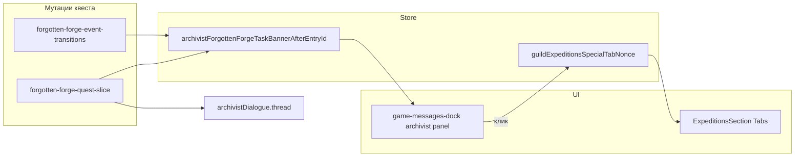

# Блок задачи FF в чате архивариуса

## Контекст

- Реплики чата: [`archivistDialogue.thread`](src/types/forgotten-forge-quest.ts) (`ArchivistThreadEntry[]`), рендер в [`game-messages-dock.tsx`](src/components/layout/game-messages-dock.tsx) (канал `archivist`).
- Текущая цель для UI уже есть: [`getForgottenForgeProgressLine(step, status)`](src/store/slices/forgotten-forge-quest-slice.ts) + [`FORGOTTEN_FORGE_PROGRESS_LINES`](src/data/quests/forgotten-forge.ts) (та же логика, что у карточки [`ForgottenForgeQuestCard`](src/components/guild/forgotten-forge-quest-card.tsx)).
- Переходы квеста разбросаны по:
  - [`forgotten-forge-quest-slice.ts`](src/store/slices/forgotten-forge-quest-slice.ts) (`selectArchivistChoice`, `advanceForgottenForgeAfterExpedition`, `tickForgottenForgeQuestAvailability`, …)
  - [`forgotten-forge-event-transitions.ts`](src/lib/quests/forgotten-forge-event-transitions.ts) (патчи алтарь/крафт), применяются в [`use-forgotten-forge-quest-events.ts`](src/hooks/use-forgotten-forge-quest-events.ts) через `useGameStore.setState(patch)`.
- Подвкладка «Особые задания» сейчас **только локальный state**: `expeditionSubTab` в [`expeditions-section.tsx`](src/components/guild/expeditions-section.tsx) (строки ~109–110, `Tabs` ~431–443). Нужен триггер из store (nonce), аналогичный [`messagesDockOpenNonce`](src/store/slices/forgotten-forge-quest-slice.ts).

## Архитектура решения

1. **Якорь в store** (одна кнопка, «привязка» к одному `id` реплики)
   - Новое поле, например `archivistForgottenForgeTaskBannerAfterEntryId: string | null` в [`ForgottenForgeQuestSliceState`](src/store/slices/forgotten-forge-quest-slice.ts) (initial `null`).
   - Экспортируемый хелпер `taskBannerAnchorFromThread(thread): string | null` — **id последней реплики с `speaker === 'archivist'`** после применённого обновления thread (соответствует «после сообщения, после которого произошло переключение», если переход завершает архивариус).
   - При каждом `set`, который меняет `archivistDialogue.thread` в контексте квеста, добавлять в патч: `archivistForgottenForgeTaskBannerAfterEntryId: taskBannerAnchorFromThread(newThread)` (если в конце нет реплики архивариуса — `null`, на всякий случай).
   - **`resetForgottenForgeQuestDev`**: сбрасывать в `null`. **`completeForgottenForgeQuestDev`**: по желанию оставить `null` (чат не трогается).
   - Охватить все пути: `tickForgottenForgeQuestAvailability` (интро), все ветки `selectArchivistChoice` с итоговым `set`, все ветки `advanceForgottenForgeAfterExpedition`, плюс расширить `ForgottenForgeEventPatch` и каждый `return` в [`forgotten-forge-event-transitions.ts`](src/lib/quests/forgotten-forge-event-transitions.ts) полем якоря (вычислять из `archivistDialogue.thread` в патче).

2. **Персист и облако**
   - Добавить ключ в [`partialize`](src/store/game-store-composed.ts) рядом с `archivistDialogue`.
   - Расширить [`ForgottenForgePersistPayload`](src/lib/normalize-forgotten-forge-persist.ts), парсинг в `normalizeForgottenForgePersistFromSave`, тест(ы) в [`normalize-forgotten-forge-persist.test.ts`](src/lib/normalize-forgotten-forge-persist.test.ts).
   - В [`use-cloud-save.ts`](src/hooks/use-cloud-save.ts): включить поле в объект `forgottenForgePersist` при сохранении и в `setState` при `applyLoadedData`.

3. **Навигация «Гильдия → Экспедиции → Особые задания»**
   - В [`AdditionalState`](src/store/game-store-composed.ts): `guildExpeditionsSpecialTabNonce: number` (initial `0`), **не** в `partialize` (эфемерный intent).
   - Новое cross-slice действие, например `navigateToGuildForgottenForgeSpecialQuest`: `currentScreen: 'guild'`, `guildScreenTab: 'expeditions'`, инкремент `guildExpeditionsSpecialTabNonce`.
   - В [`ExpeditionsSection`](src/components/guild/expeditions-section.tsx): `useLayoutEffect` по `guildExpeditionsSpecialTabNonce` (игнорируя `0`), вызывать `setExpeditionSubTab('special')` при каждом увеличении nonce.

4. **UI в чате** ([`game-messages-dock.tsx`](src/components/layout/game-messages-dock.tsx))
   - В `map` по `archivistThread`: после пузыря с `e.id === archivistForgottenForgeTaskBannerAfterEntryId` вставить блок (только если якорь найден в текущем thread и `forgottenForgeQuest.status` не `locked` и не `completed`).
   - Кнопка с точным заголовком: **«Обновление задачи: Эхо забытой кузни»**; под кнопкой текст задачи — `getForgottenForgeProgressLine(q.step, q.status)` (для `available`/`active`; при `completed` блок скрыт).
   - `onClick` / tap: вызвать новое действие навигации из store.

5. **Тесты и регрессия**
   - Обновить/дополнить [`forgotten-forge-event-transitions.test.ts`](src/lib/quests/forgotten-forge-event-transitions.test.ts): в патче при наличии нового `thread` ожидать непустой якорь = id последней реплики архивариуса (по сценариям, где добавляются строки).
   - `npm run type-check`, `npm run test`, `npm run lint`.

## Замечания по продукту

- На очень узком viewport тосты уже могут быть сверху; целевая навигация по кнопке всё равно ведёт на нужную подвкладку.
- Если когда-нибудь появится обновление thread **без** реплики архивариуса в конце, якорь станет `null` и блок скроется до следующего «нормального» перехода — при необходимости это можно сузить отдельной доработкой.
