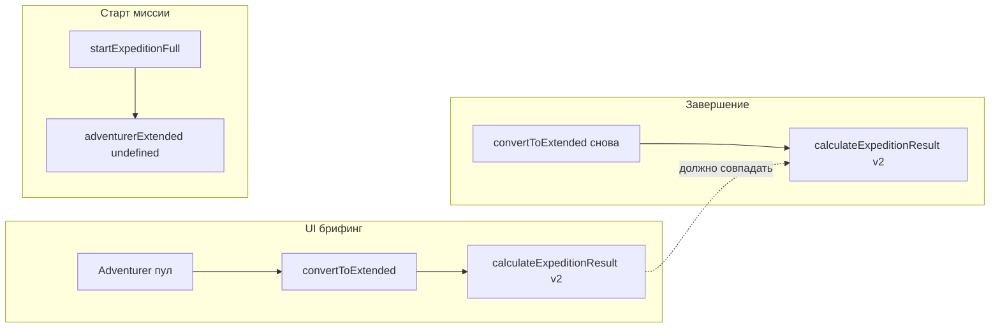

# План: пул искателей и калькулятор v2 (фаза 3)

## Проблема (текущее состояние)

- При выборе искателя **с доски** UI считает прогноз через `selectedExtendedAdventurer || convertToExtended(selectedAdventurer)` (`[expeditions-section.tsx](src/components/guild/expeditions-section.tsx)`).
- При `**startExpeditionFull`** в активную экспедицию передаётся `extendedAdventurer` **только** если выбран extended из найма; иначе — `undefined` (`[guild-expedition-cross-slice.ts](src/store/cross-slice/guild-expedition-cross-slice.ts)` ~127–135).
- В `**completeExpeditionFull`** тогда используется `convertToExtended(expedition.adventurerData)` — тот же путь, но **каждый раз заново**: `identity.createdAt`/`expiresAt`, случайный `portraitId`, и слой из `**generateExtendedAdventurer(1)`** даёт новую «личность»/strength/weakness при каждом вызове (`[adventurer-converter.ts](src/lib/adventurer-converter.ts)`).

Итог: возможен разъезд прогноза в брифинге и факта на завершении; часть полей пула **не** попадает в v2 (`**uniqueBonuses: []`**, случайный портрет, фиксированная `**rarity: common`**, личность не с карточки).

## Рекомендуемые этапы

### Этап 1 — Снимок extended при старте (инвариант прогноз = факт)

- В `[expeditions-section.tsx](src/components/guild/expeditions-section.tsx)` в `handleStartExpedition`: если `selectedExtendedAdventurer` нет, вычислять `**const extended = convertToExtended(selectedAdventurer)**` и передавать его **четвёртым** аргументом в `startExpeditionFull` (как при найме).
- Проверить другие вызовы `startExpeditionFull` (если есть) на тот же паттерн.
- **Критерий:** в `ActiveExpedition` всегда лежит один и тот же `adventurerExtended` для пула, что и использовался в прогнозе в этом сеансе; завершение берёт `**expedition.adventurerExtended`** и не «перекидывает» личность между стартом и концом из-за повторной генерации.

Зависимости: без изменения логики `convertToExtended` уже стабилизирует поведение, если генератор внутри конвертера остаётся недетерминированным между **разными** запусками миссий — но один запуск старт→финиш станет согласованным.

### Этап 2 — Перенос данных пула в extended (минимальный честный маппинг)

Файл `[adventurer-converter.ts](src/lib/adventurer-converter.ts)`:

- `**uniqueBonuses`:** не обнулять; маппить `Adventurer.uniqueBonuses` в формат extended по тому же принципу, что `**mapDataUniqueBonusesToExtended`** в `[adventurer-generator-extended.ts](src/lib/adventurer-generator-extended.ts)` (те же id каталога `[unique-bonuses](src/data/unique-bonuses.ts)`).
- `**identity.portraitId`:** использовать `adventurer.portrait` (или согласованное преобразование), убрать `Math.random` для стабильности.
- `**combat.rarity`:** либо вывести эвристикой от `skill`/уровня, либо оставить `common` с явным комментарием в коде и в аудите (если в данных пула нет редкости — решение продукта).

Опционально в том же PR или отдельно:

- Заменить вызов `**generateExtendedAdventurer(1)`** как источник personality/strengths/weaknesses на **детерминированный** вариант: например, внутренний **seeded RNG** от хэша `adventurer.id` + стабильный выбор подмножеств (или отдельная функция «fillDefaultsFromSeed» без глобального `Math.random`). Это убирает скачки между сессиями для одного и того же id пула.

### Этап 3 — Тесты и регрессии

- Добавить `[adventurer-converter.test.ts](src/lib/adventurer-converter.test.ts)` (или рядом с модулем): фикстура `Adventurer` с `uniqueBonuses` и `traits` → ожидания на длину/поля extended; при введении seed — два вызова `convertToExtended` с тем же id дают идентичные personality/strengths (если зафиксировано в ТЗ этапа 2).
- Прогнать существующие тесты: `[guild-expedition-cross-slice.test.ts](src/store/cross-slice/guild-expedition-cross-slice.test.ts)`, `[expedition-start-validation](src/lib/expedition-start-validation.test.ts)` при необходимости.

### Этап 4 — Документация

- Обновить **§3.5** и таблицу фазы 3 в [EXPEDITION_AND_ADVENTURER_AUDIT.md](docs/systems/EXPEDITION_AND_ADVENTURER_AUDIT.md): что сделано (снимок при старте, маппинг бонусов, портрет), что намеренно отложено (полная редкость пула, личность с карточки, если не вводились новые поля в `Adventurer`).

## Риски и границы

- Усиление маппинга может **изменить баланс** экспедиций для пула (раньше `uniqueBonuses` не влияли на v2).
- `generateExtendedAdventurer` сейчас без seed — глубокая детерминизация затрагивает много случайных вызовов; разумно делать **узкий** seeded слой только для полей, которые сейчас берутся из «одного вызова» генератора в `convertToExtended`.

## Порядок внедрения

Рекомендуется: **Этап 1** (быстрый выигрыш по согласованности) → **Этап 2** (данные) → **Этап 3** (тесты) → **Этап 4** (доки). Этап 2b (полный seed) — отдельным коммитом/PR по желанию.