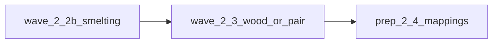

# Следующие шаги после §12 (волны A2)

## Контекст

- Зафиксировано в [docs/MATERIALS_SINGLE_SOURCE_ROADMAP.md](docs/MATERIALS_SINGLE_SOURCE_ROADMAP.md): **§11** последняя строка (2.2 подволна 1), **§12** — «продолжение 2.2» затем **2.3**.
- Область плавки и точки кода: [src/lib/craft/a2-smelting-domain-scope.ts](src/lib/craft/a2-smelting-domain-scope.ts).
- Ремонт и пулы по-прежнему идут через [src/lib/craft/inventory-check.ts](src/lib/craft/inventory-check.ts) (`getAvailableAmountForResourceKey` и связка с [src/lib/store-utils/repair-utils.ts](src/lib/store-utils/repair-utils.ts)); любая смена начислений в `resources` **обязана** сохранять согласованность «суммарного доступного» для `ResourceKey`.
- Отображение в селекторах всё ещё завязано на `resources.*`: [src/store/selectors/index.ts](src/store/selectors/index.ts) (форматирование iron/coal/…); любой перенос канона на stash потребует либо чтения stash в тех же селекторах, либо ухода потребителей на `useMaterialAmount` / общий хелпер «доступно по ключу».

## 1. Подволна 2.2 (завершение домена плавки)

**Цель:** там, где игровая логика уже списывает из `materialStash`, **не плодить расхождение** из-за путей начисления, которые пишут только в `resources`, и по возможности сделать **единый канал начисления** для сырья/топлива/продуктов домена (как для выхода горна через `addMaterialToStash` в [game-store-composed.ts](src/store/game-store-composed.ts)).

Практический порядок:

1. **Инвентаризация начислений:** пройти grep/вызовы `grantResourceKeyFromWorld` и прямые инкременты `resources` для ключей из `SMELTING_CHAIN_RESOURCE_KEYS` (магазин [material-shop.ts](src/data/material-shop.ts) + [shop-screen.tsx](src/components/screens/shop-screen.tsx), экспедиции [guild-expedition-cross-slice.ts](src/store/cross-slice/guild-expedition-cross-slice.ts), квесты, награды). Для каждого пути: либо перевести на `addMaterialToStash(catalogId)` при известном id (как в лавке для `stashMaterialId`), либо оставить мост с **TODO + ссылка на §11** (если блокер — persist/UI).
2. **Совместимость сейва:** старые сохранения могут держать руду только в `resources`; до явной миграции или финала **2.4** сохранить корректное `getAvailableAmountForResourceKey` (уже «stash + resources») и не ломать сценарий «починил → потратил».
3. **Тесты:** расширить [inventory-check.test.ts](src/lib/craft/inventory-check.test.ts) или узкий store-тест: начисление только через stash для одного ключа домена → расход через существующий путь → ожидаемые остатки; при наличии тестов только на `resources` — обновить ожидания.
4. **Док PR / roadmap:** одна строка **§11**; **§12** — «2.2 закрыт для плавки» или «2.2b остаток: миграция persist»; ручной смоук **§3.6** после значимой смены начислений.

## 2. Волна 2.3 — следующий домен (рекомендация: дерево / планки)

По таблице фазы 2 в roadmap: **дерево** (и при необходимости пара с камнем — один PR не раздувать).

1. Добавить scope-файл по образцу `a2-smelting-domain-scope.ts` (например `a2-wood-domain-scope.ts`): перечень `materialId` / `ResourceKey`, точки `inventory-check`, горна/обработки, store.
2. Подключить **тот же** механизм: `canDebitManyFromStash` / `tryDebitManyFromStash` для согласованного подмножества операций домена; зачисления продуктов — через `getGrantTargetMaterialId` / `addMaterialToStash` где уже есть маппинг.
3. **Тест цепочки** для домена (как блок **smelting domain** в [inventory-check.test.ts](src/lib/craft/inventory-check.test.ts)).
4. Строка **§11** + обновление **§12** (следующий шаг → второй домен **2.3** или старт **2.4** при накоплении мёртвых маппингов).

## 3. Подготовка к 2.4 (точечно, не big-bang)

После 2–3 доменов: в [inventory-check.ts](src/lib/craft/inventory-check.ts) пометить/удалить таблицы мостов только для ключей, по которым **все** read/write прошли волну; контракт + `inventory-check.test.ts` должны остаться зелёными. [RESOURCE_TRANSFORMATION_MAP.md](docs/RESOURCE_TRANSFORMATION_MAP.md) — только если менялись id в данных переработки.

## 4. §10 и 0.2

- **§10:** отмечать `[x]` только по факту закрытого инварианта; не трогать пункты лавки/ENC/forbidden-imports в рамках этой волны, если они не выполняются кодом.
- **0.2:** при появлении явных `materialId` в [repair-system.ts](src/data/repair-system.ts) / данных перековки — добавить сканер в [material-catalog-contract.ts](src/lib/materials/material-catalog-contract.ts) (**§8.5**); иначе не раздувать scope.

## Критерии готовности PR каждой подволны

- `npm run test`, `type-check`, `build` как в [AGENTS.md](AGENTS.md).
- Нет регрессии: `getAvailableAmountForResourceKey` для ключей волны согласован с UI ремонта/горна.
- Контракт материалов без новых висячих id.
