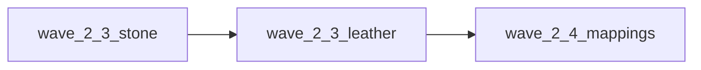

# Следующие шаги A2 (после дерева)

## Текущая точка

- Сделано: **2.2** (плавка + лавка + тесты grant→spend), **2.3 дерево** — [`a2-wood-domain-scope.ts`](src/lib/craft/a2-wood-domain-scope.ts), тест `wood_planks` в [`inventory-check.test.ts`](src/lib/craft/inventory-check.test.ts).
- Референс по форме волны: [`a2-smelting-domain-scope.ts`](src/lib/craft/a2-smelting-domain-scope.ts) (таблица начислений + ключи).
- Карьер в данных: рецепт `stone_blocks` в [`refining-recipes.ts`](src/data/refining-recipes.ts) (`stone` → `stoneBlocks`, здание `quarry`); стадия `REFINING_INPUT_STAGE`: `stone` → `basic_stone`; выход в stash через `getGrantTargetMaterialId('stoneBlocks')` → `processed_stone` (как у планок).

## 1. Волна 2.3 — камень (карьер)

1. Добавить [`src/lib/craft/a2-stone-domain-scope.ts`](src/lib/craft/a2-stone-domain-scope.ts) по образцу wood/smelting: `ResourceKey` `stone` / `stoneBlocks`, рецепт `stone_blocks`, ссылки на [`inventory-check`](src/lib/craft/inventory-check.ts), [`game-store-composed`](src/store/game-store-composed.ts) (`startRefiningWithResources` / `completeRefiningWithResources`), таблица начислений (лавка/экспедиции/заказы/`grantResourceKeyFromWorld` — что уже есть).
2. Тест цепочки в [`inventory-check.test.ts`](src/lib/craft/inventory-check.test.ts): оплата **только из stash** (например `basic_stone` и при необходимости другие id пула `stone` из `getMaterialIdsMappedToResourceKey` / фикстура как в тесте для дерева).
3. Ручной смоук **§3.6**: карьер до `stoneBlocks` + ремонт на том же сейве (описание PR).

## 2. Волна 2.3 — кожа

1. [`a2-leather-domain-scope.ts`](src/lib/craft/a2-leather-domain-scope.ts): пул `leather` ↔ `raw_leather` и прочие id из [`inventory-check`](src/lib/craft/inventory-check.ts) (`CORE_MATERIAL_TO_RESOURCE`), точки списания (крафт v2, ремонт через [`repair-utils`](src/lib/store-utils/repair-utils.ts) / `getAvailableAmountForResourceKey`).
2. Убедиться, что **начисления** (экспедиции, квесты) не создают рассинхрона «только `resources.leather` без stash»; при нахождении — перевести на `addMaterialToStash` / тот же контракт, что лавка (**2.2b**).
3. Узкий тест: доступность/списание пула `leather` из stash-only (по аналогии с рудой/деревом), если нет пересечения с уже существующими кейсами.

**Ограничение:** не трогать **фазу 3** (операции в техниках) в том же PR.

## 3. Волна 2.4 (после камня+кожи)

1. Пройти [`inventory-check.ts`](src/lib/craft/inventory-check.ts): для ключей доменов, где все read/write идут через stash+`getAvailableAmountForResourceKey`, пометить или сузить мёртвые ветки **только** с проверкой: persist ([`migrateLegacyMaterialResourcesToStash`](src/lib/craft/inventory-check.ts) / версия в [`game-store-composed`](src/store/game-store-composed.ts)), тесты [`inventory-check.test.ts`](src/lib/craft/inventory-check.test.ts), контракт.
2. [`RESOURCE_TRANSFORMATION_MAP.md`](docs/RESOURCE_TRANSFORMATION_MAP.md) — только если менялись id в `refining-recipes` или маппингах.

## 4. Документация и 0.2

- После каждой подволны: строка **§11**, обновление **§12** / при необходимости **§13** в [`MATERIALS_SINGLE_SOURCE_ROADMAP.md`](docs/MATERIALS_SINGLE_SOURCE_ROADMAP.md).
- **§10:** галочки только по факту; **0.2:** сканер в [`material-catalog-contract.ts`](src/lib/materials/material-catalog-contract.ts) — если в данных появятся явные `materialId` в ремонте/перековке.

## Критерии PR

- `npm run test`, `type-check`, `build` ([`AGENTS.md`](AGENTS.md)).
- Зелёный `material-catalog-contract`; нет регрессии пулов для ремонта/горна/карьера.
