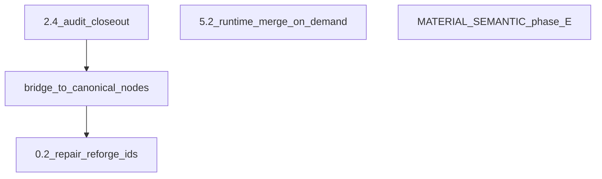

# Следующие этапы работ по материалам

**Опорный документ:** [docs/MATERIALS_SINGLE_SOURCE_ROADMAP.md](docs/MATERIALS_SINGLE_SOURCE_ROADMAP.md) (§11, §12). Ритуал PR: одна строка §11, CI по [AGENTS.md](AGENTS.md), при смене склада/горна — смоук §3.6.

**Текущая база:** [CORE_MATERIAL_TO_RESOURCE](src/lib/craft/inventory-check.ts) сведён к **сплавам** и **`processed_wood` / `processed_stone`**; руды и базовые металлы — в [WORLD_RESOURCE_TO_RESOURCE_KEY](src/lib/materials/world-resource-inventory-bridge.ts) (**2.4g**). Сегмент моста металлов пуст; **`getMetalMaterialsRuntimeMerged`** пока используется только внутри слоя данных ([metals-runtime-merge.ts](src/data/materials/metals-runtime-merge.ts), тесты).

---

## 1. Bridge → канонические узлы (фаза 5+, малые PR)

По той же схеме, что **Cu/Sn/Ag/Au**: полноценные файлы в [library/](src/data/materials/library/), подключение в [material-registry-core.ts](src/data/materials/library/material-registry-core.ts) (или соответствующий сегмент домена), затем удаление `pick` из bridge.

| Домен | Файл bridge | Id для выноса |
|--------|-------------|---------------|
| Кожа | [registry-bridge-leather-nodes.ts](src/data/materials/library/bridge/registry-bridge-leather-nodes.ts) | `hardened_leather` (1) — логичный первый PR |
| Камень | [registry-bridge-stone-nodes.ts](src/data/materials/library/bridge/registry-bridge-stone-nodes.ts) | `basic_stone`, `marble`, `processed_stone` (3) |
| Древесина | [registry-bridge-wood-nodes.ts](src/data/materials/library/bridge/registry-bridge-wood-nodes.ts) | `maple`, `walnut`, `mahogany`, `processed_wood` (4) |

**Риски / проверки:** дубликатов `identity.id` в [allMaterials](src/data/materials/library/material-registry-manifest.ts) не должно быть; **`getInventoryCheckCoreWorldKeyOverlap()`** пустой; [material-catalog-contract](src/lib/materials/material-catalog-contract.ts) зелёный; при затрагивании маппинга — [RESOURCE_TRANSFORMATION_MAP.md](docs/RESOURCE_TRANSFORMATION_MAP.md) §8.

**Особенность:** `processed_wood` / `processed_stone` уже в **CORE** как маппинг на `planks` / `stoneBlocks`; узлы каталога для ENC/отображения должны остаться согласованы с этим (как сейчас для bridge-копий).

---

## 2. Закрытие хвоста **2.4** (аудит, без лишних переносов)

- Зафиксировать в §11/аудите, что **сплавы и processed_*** намеренно остаются в ядре (см. текущий [inventory-check.ts](src/lib/craft/inventory-check.ts) ~55–76).
- Пройтись по [a2-phase24-bridge-audit.ts](src/lib/craft/a2-phase24-bridge-audit.ts): нет противоречий с фактическим **CORE** / **WORLD**.
- Новые переносы **CORE → WORLD** только если появится согласованный поднабор id и **пустое** пересечение (тест [inventory-check-core-world-contract.test.ts](src/lib/craft/inventory-check-core-world-contract.test.ts)).

---

## 3. Хвост **0.2** — реальные `catalogMaterialSpendIds`

Сейчас пилот: `bloodstone` в [repair-system.ts](src/data/repair-system.ts) + тест в [material-catalog-contract.test.ts](src/lib/materials/material-catalog-contract.test.ts).

**Дальше:** когда в рецептах ремонта/перековки появятся осмысленные траты по **каталожным** id (не только `ResourceKey`), заполнять **`catalogMaterialSpendIds`** / аналог в [reforge-techniques-registry.ts](src/data/reforge/reforge-techniques-registry.ts); убрать или заменить демо-id, если он перестанет быть нужен. Сканер уже собирает их в [collectRepairReforgeCatalogMaterialIds](src/lib/materials/material-catalog-contract.ts).

---

## 4. **5.2** — рантайм-слияние по месту

Прямых потребителей **`metalMaterials`** вне [src/data/materials](src/data/materials) сейчас нет. Держать правило: любой новый код, которому нужен полный **`Material[]` по металлам с числами каталога**, берёт **`getMetalMaterialsRuntimeMerged`** / **`getMetalMaterialRuntimeMerged`** из [materials/index.ts](src/data/materials/index.ts); прилагательные — по-прежнему через [legacy-material-adjectives.ts](src/data/materials/legacy-material-adjectives.ts), без цикла с merge.

Опционально (отдельный PR): постепенно урезать дубль чисел в [metals.ts](src/data/materials/metals.ts), когда крафт полностью опирается на каталог.

---

## 5. Семантика и тесты (низкий приоритет относительно bridge)

По [MATERIAL_SEMANTIC_PROCESS_ROLES.md](docs/MATERIAL_SEMANTIC_PROCESS_ROLES.md): расширение **фазы E** (ремонт, систематический охват id с реальным списанием) — по мере продукта, не блокирует вынос bridge.

---

## Рекомендуемый порядок исполнения

1. **1× PR:** `hardened_leather` → [library/leathers/](src/data/materials/library/leathers/) + пустой/урезанный leather-bridge.
2. **1× PR:** каменный bridge (3 id) или дробить по одному id при конфликтах.
3. **1× PR:** деревянный bridge (4 id).
4. Параллельно по необходимости: **§2** аудит 2.4 + **§3** данные ремонта/reforge; **§4** по факту новых экранов/утилит.
