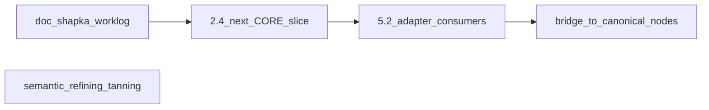

# Следующие шаги по материалам (после закрытого пакета next steps)

**База:** источник правды — [docs/MATERIALS_SINGLE_SOURCE_ROADMAP.md](docs/MATERIALS_SINGLE_SOURCE_ROADMAP.md) (§11, §12); приложенный `.cursor/plans/*.plan.md` не трогать.

**Уже закрыто в репозитории (не повторять):** 2.4d–2.4f; 3.3–3.4 (в т.ч. `refining_tanning`, `forge_basic_leather_tan` без дубля рецепта); 4.x — склейка `craftStageInsertions` ∪ `processingOperations` в [src/lib/craft/processing-technique-stage-insertions.ts](src/lib/craft/processing-technique-stage-insertions.ts) + интеграционные сценарии (в т.ч. боевая техника + плавка в [src/lib/craft/process-generator.integration.test.ts](src/lib/craft/process-generator.integration.test.ts)); 5.2 prelude + [src/data/materials/metals-runtime-merge.ts](src/data/materials/metals-runtime-merge.ts); 5.3–5.4 — [src/data/materials/library/bridge/](src/data/materials/library/bridge/index.ts); 0.2 — `catalogMaterialSpendIds` + сбор в [src/lib/materials/material-catalog-contract.ts](src/lib/materials/material-catalog-contract.ts).

---

## 1. Документация (узкий PR)

- Привести **шапку** roadmap (строка «Статус»): сейчас устарело относительно §11 (нет **2.4f**, `library/bridge/`, `getMetalMaterialsRuntimeMerged`, сканера 0.2 с `catalogMaterialSpendIds`).
- При желании: поправить **старые строки §11**, где ещё фигурирует удалённый `inventory-mapped-legacy-nodes.ts` (например запись «Волны A–E»), чтобы не вводили в заблуждение.

---

## 2. Волна 2.4 (продолжение) — руды / металлы / сплавы

**Контекст:** в [src/lib/craft/inventory-check.ts](src/lib/craft/inventory-check.ts) в `CORE_MATERIAL_TO_RESOURCE` остаётся крупный блок (`*_ore`, слитковые id, сплавы) — см. текущий файл около строк 55–91.

**Цель:** переносить поднаборы в [src/lib/materials/world-resource-inventory-bridge.ts](src/lib/materials/world-resource-inventory-bridge.ts) только при:

- пустом `getInventoryCheckCoreWorldKeyOverlap()` ([src/lib/craft/inventory-check-core-world-contract.test.ts](src/lib/craft/inventory-check-core-world-contract.test.ts));
- обновлении [src/lib/craft/a2-phase24-bridge-audit.ts](src/lib/craft/a2-phase24-bridge-audit.ts);
- регрессии: [src/lib/craft/inventory-check.test.ts](src/lib/craft/inventory-check.test.ts), [src/store/resources-stash-debit.test.ts](src/store/resources-stash-debit.test.ts), контракт каталога;
- при смене трактовок — [docs/RESOURCE_TRANSFORMATION_MAP.md](docs/RESOURCE_TRANSFORMATION_MAP.md); **STORE_VERSION** — только при смене инварианта сейва.

**Риск:** порядок списания пулов и экономика (см. предупреждение в исходном плане про `leather`); для металлов — согласовать с плавкой/лавкой/заказами. Делать **малые подволны** (например только id, уже однозначно «world-first» по аудиту).

---

## 3. Волна 5.2 — подключить рантайм-слияние к потребителям

**Сейчас:** [src/data/materials/adapter.ts](src/data/materials/adapter.ts) по-прежнему тянет «сырой» список `metalMaterials` для `LEGACY_MATERIAL_ADJECTIVES` (строки с `...metalMaterials`); [getMaterialAsLegacy](src/data/materials/adapter.ts) уже идёт из каталога.

**Следующий шаг:** точечно перевести оставшиеся места, где нужен **полный** legacy-список металлов с числами каталога, на `getMetalMaterialsRuntimeMerged` / `getMetalMaterialRuntimeMerged` из [src/data/materials/metals-runtime-merge.ts](src/data/materials/metals-runtime-merge.ts) (избегая циклов импорта — при необходимости дублировать минимальную логику только для прилагательных или хранить прилагательные в данных каталога в отдельной волне).

---

## 4. Bridge — от `pick()` к каноническим узлам (фаза 5+)

**Сейчас:** узлы в [src/data/materials/library/bridge/](src/data/materials/library/bridge/index.ts) строятся через `pickBridgeMaterialNode` от эталонов (`iron`, `oak`, …).

**Цель roadmap:** для каждого id моста — полноценный файл в [src/data/materials/library/](src/data/materials/library/) (металлы/древесина/камень/кожа), затем исключение из сегмента bridge и упрощение manifest/satellites — **отдельными PR по одному домену или по одному id**, с прогоном контракта.

---

## 5. Семантика и согласованность

- Убедиться, что [docs/MATERIAL_SEMANTIC_PROCESS_ROLES.md](docs/MATERIAL_SEMANTIC_PROCESS_ROLES.md) отражает процесс **`refining_tanning`** (тип уже в [src/types/materials/material-process.ts](src/types/materials/material-process.ts)); при необходимости добавить строку в таблицу фаз §4 и кросс-ссылку на кожу / `tannery`.

---

## 6. Хвост 0.2 (данные)

- Инфраструктура готова: при появлении реальных **`catalogMaterialSpendIds`** в [src/data/repair-system.ts](src/data/repair-system.ts) (`REPAIR_TYPES`) или [src/data/reforge/reforge-techniques-registry.ts](src/data/reforge/reforge-techniques-registry.ts) контракт подхватит их автоматически; имеет смысл добавить **один** детерминированный тест контракта с тестовым id (или временной fixture — только если не портит продуктовые данные).

---

## Ритуал на каждый PR

- Одна строка в **§11** [MATERIALS_SINGLE_SOURCE_ROADMAP.md](docs/MATERIALS_SINGLE_SOURCE_ROADMAP.md).
- CI: `npm run test`, `type-check`, `lint`, `build` ([AGENTS.md](AGENTS.md)).
- После правок склада/горна — ручной смоук **§3.6** (roadmap).
