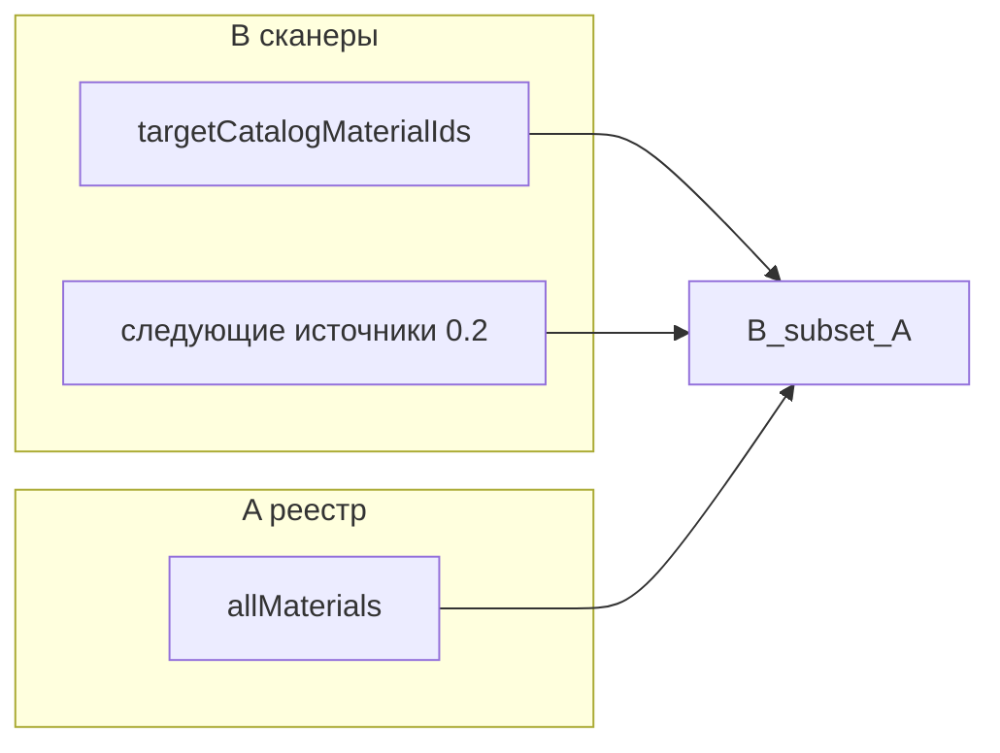

# Первые шаги по MATERIALS_SINGLE_SOURCE_ROADMAP

## Контекст

Реализация по дорожной карте **ещё не начата** (файла контракта в коде нет). Источник правды по `materialId` для фазы 0 — сборка в [`src/data/materials/library/index.ts`](src/data/materials/library/index.ts): `allMaterials` → `materialById`. Контракт из **§8** проверяет **B ⊆ A**, где **A** = множество `identity.id` из `allMaterials`.

## Шаг 1 — Пакет **0.1** (первый PR, обязательный)

**Цель:** зелёный CI ловит «висячие» `materialId` в выбранных потребителях, без смены игрового поведения.

**Действия:**

1. Добавить модуль контракта, например:
   - [`src/lib/materials/material-catalog-contract.ts`](src/lib/materials/material-catalog-contract.ts) — функции: `getRegistryMaterialIds()` (из `allMaterials`), `assertNoUnknownMaterialRefs(consumerIds, registry, context)`, опционально сбор **diff** для сообщений об ошибке.
   - [`src/lib/materials/material-catalog-contract.test.ts`](src/lib/materials/material-catalog-contract.test.ts) — основной тест **B ⊆ A**.

2. **Множество A:** все `m.identity.id` для `m` из `allMaterials` (импорт из `@/data/materials/library`).

3. **Первые сканеры B** (как в **§7**, пакет 0.1 — «2–3 источника»):
   - Все id из **`targetCatalogMaterialIds`** в [`src/data/material-processing-techniques.ts`](src/data/material-processing-techniques.ts) (пройти реестр техник, собрать union).
   - Второй сканер на выбор, если с первым PR зелёный и мало строк: например строковые поля **`materialId`** в [`src/data/altar/altar-phase-material-balance.ts`](src/data/altar/altar-phase-material-balance.ts) и/или `requiredMaterials` из [`src/data/altar/altar-phases-config.ts`](src/data/altar/altar-phases-config.ts) — это сразу закрывает часть **§3.6** по алтарю **или** оставить на **0.2**, если первый PR нужен минимальным. Рекомендация: если алтарь даёт мало id и всё из реестра — включить в **0.1**; иначе второй сканер — только **`material-shop.ts`** (офферы до зачистки **1b** тоже должны быть ⊆ A).
   - Третий — по согласованию с объёмом диффа (лавка vs алтарь).

4. **Allowlist:** пустой массив или комментируемые записи «осознанное исключение» — только если тест иначе невозможен; иначе **сначала починить данные**, не раздувать allowlist.

5. **Опционально в том же PR** (одна проверка, ~5 строк): дубликаты `id` в `allMaterials` — сейчас [`Object.fromEntries`](src/data/materials/library/index.ts) молча перезаписывает ключи; раннее обнаружение дубликата сильно помогает до фазы **1.1**. Если найдутся дубли — отдельный микрофикс данных **в том же PR**, что контракт.

**Критерий готовности:** `npm run test` + CI; правило **§7.1** после каждого PR.

---

## Шаг 2 — Пакет **0.2** (серия маленьких PR)

**Правило:** один новый тип источников за PR; каждый PR добавляет функцию-сканер и строку/блок в регистре сканеров контракта.

**Рекомендуемый порядок** (гибко, но логично по рискам из **§3.6**):

1. Алтарь: `altar-phase-material-balance`, `altar-phases-config` (если не вошло в 0.1).
2. [`src/lib/craft/inventory-check.ts`](src/lib/craft/inventory-check.ts): ключи/значения маппингов, которые трактуются как каталожные id (аккуратно: не смешивать с «чистыми» `ResourceKey`, если их нельзя однозначно отнести к A без таблицы — тогда сканировать только явные `materialId`/поля документа **RESOURCE_TRANSFORMATION_MAP**).
3. [`src/data/refining-recipes.ts`](src/data/refining-recipes.ts) → извлечь связанные с каталогом id по существующим хелперам/константам (см. уже существующие тесты [`src/lib/craft/inventory-check.test.ts`](src/lib/craft/inventory-check.test.ts)).
4. Константы ремонта: [`src/store/cross-slice/repair-cross-slice.ts`](src/store/cross-slice/repair-cross-slice.ts) и связанные данные стоимости, где есть `materialId`.
5. Реестр перековки: [`src/data/reforge/reforge-techniques-registry.ts`](src/data/reforge/reforge-techniques-registry.ts) — только строковые ссылки на материалы, если есть; id техник обработки **не обязаны** быть в A, но полезно не смешивать проверки в одном сканере без ясной схемы.
6. Фрагмент экспедиций/наград — когда ядро стабильно (в **§9** допускается неполное покрытие до подключения модуля).

После каждого PR: контракт зелёный; при срабатывании — либо правка данных, либо узкое исключение с комментарием в коде теста.

---

## Шаг 3 — Параллельно (не блокирует 0.1–0.2)

- **0.3:** черновик типов `ProcessingOperation` / расширение [`MaterialProcessingTechnique`](src/types/...) в [`src/types/`](src/types/) без смены рантайма горна — отдельный PR, только типы + компиляция.
- **Фаза 1b** ([`game-layout.tsx`](src/components/layout/game-layout.tsx), [`shop-screen`](src/components/screens/shop-screen.tsx), [`material-shop.ts`](src/data/material-shop.ts)): по **§7.1** можно вынести **раньше** больших A2-изменений; после **1b.4** добавить сканер офферов в контракт.

---

## Шаг 4 — Пакет **0.4** (стоп перед **2.1**)

- Зафиксировать решение **A2** и список модулей на снос: запись в **§11** roadmap и при необходимости уточнение **§10**.
- Короткая производная «техника → затронутые `materialId`» (тест или комментарий к сканерам) — для перековки/алтаря.

---

## Что сознательно не делаем в первых шагах

- **Фаза 1.1** (единый manifest реестра) и **2.x** (A2 в store) — после **0.4**.
- **Big-bang:** не трогать одновременно реестр, склад и горн без промежуточного зелёного контракта (**§7.1**).

---

## Проверка готовности (карта **§13**)

| Этап | Готово когда |
|------|----------------|
| Старт работ | PR **0.1** в merge |
| Массовые переименования id / крупные волны склада | После **0.2** (алтарь/ремонт/перековка в сканерах) + **0.4** |
