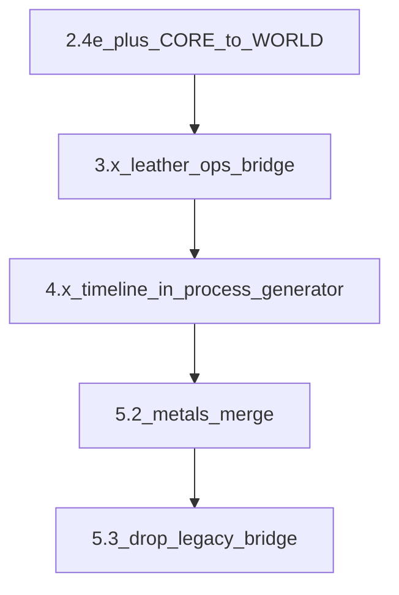

# План следующих шагов (после §11 / §12)

Источник правды по «что уже есть»: [docs/MATERIALS_SINGLE_SOURCE_ROADMAP.md](docs/MATERIALS_SINGLE_SOURCE_ROADMAP.md) (**§12** «Дальше в коде», **§11** worklog). Файл `.cursor/plans/*.plan.md` **не** правится.

## Рекомендуемый порядок PR

---

## 1. Волна 2.4 (продолжение после **2.4d**)

**Цель:** ещё один узкий домен из [`CORE_MATERIAL_TO_RESOURCE`](src/lib/craft/inventory-check.ts) перенести в [`WORLD_RESOURCE_TO_RESOURCE_KEY`](src/lib/materials/world-resource-inventory-bridge.ts) (или иначе сузить таблицу), с сохранением **пустого** `getInventoryCheckCoreWorldKeyOverlap()` и без смены экономики.

- Опора: [a2-phase24-bridge-audit.ts](src/lib/craft/a2-phase24-bridge-audit.ts), кандидаты — каменные/кожевенные id только из world-добычи, или поднабор, который однозначно «world-first».
- После PR: [inventory-check.test.ts](src/lib/craft/inventory-check.test.ts), [resources-stash-debit.test.ts](src/store/resources-stash-debit.test.ts), [material-catalog-contract.ts](src/lib/materials/material-catalog-contract.ts) — зелёные.
- Документация: абзац **§8.2** (снимок scope), строка **§11**, уточнение **§12**; [RESOURCE_TRANSFORMATION_MAP.md](docs/RESOURCE_TRANSFORMATION_MAP.md) — только если меняются **id** цепочек.
- **STORE_VERSION** / [cloud-save-feature.ts](src/lib/cloud-save-feature.ts) — только при смене инварианта сейва.

---

## 2. Волна 3.x

**3.2 (кожа и прочий остаток):** если в [material-processing-techniques.ts](src/data/material-processing-techniques.ts) по геймдизайну нужны техники с `processingOperations` для цепочек кожи — добавить пакетно; пороги/валидатор в [material-processing-techniques-operations.test.ts](src/data/material-processing-techniques-operations.test.ts).

**3.3 (глубже):** расширить [getEffectiveRefiningRecipeId](src/lib/craft/processing-technique-refining-bridge.ts) (например вывод из `processingOperations` ↔ один `refiningRecipeId` по конвенции) и при необходимости протянуть в путь старта горна, если где-то есть связка «техника → рецепт» помимо уже сделанных [inventory-check / PartMaterialProcessingPanel / process-generator](src/lib/craft/inventory-check.ts).

**3.4:** при смысловом разнообразии — не все техники должны иметь только `refining_smelting`; сверка с [MATERIAL_SEMANTIC_PROCESS_ROLES.md](docs/MATERIAL_SEMANTIC_PROCESS_ROLES.md) и при необходимости уточнение [MaterialProcessKind](src/types/materials/material-process.ts) (отдельный малый PR при расширении словаря).

---

## 3. Волна 0.2 (ремонт / перековка)

- Когда в [repair-system.ts](src/data/repair-system.ts) / данных reforge появятся явные **`materialId`**: заполнить [collectRepairReforgeCatalogMaterialIds](src/lib/materials/material-catalog-contract.ts) (сейчас заглушка `[]`).

---

## 4. Волна 4.x

- Инкрементально переиспользовать [timeline-composition.ts](src/lib/craft/timeline-composition.ts) внутри [process-generator.ts](src/lib/craft/process-generator.ts) (сначала `applyTechniqueMods` / вставки обработки — узкие коммиты).
- Расширить [process-generator.integration.test.ts](src/lib/craft/process-generator.integration.test.ts) (ещё 1–2 комбинации боевых + обработки).
- При смене поведения — точечно [CRAFT_SYSTEM_ROADMAP.md](docs/systems/CRAFT_SYSTEM_ROADMAP.md).

---

## 5. Волна 5.x

- **5.1 (дожим ENC):** группы UI, блок «как получить», обратный индекс «материал ← техники обработки с выходом» (Vitest или маленький сборщн id в `src/lib/materials/`). Сортировка по tier уже через [encyclopedia-display-order.ts](src/lib/materials/encyclopedia-display-order.ts) на [encyclopedia-screen.tsx](src/components/screens/encyclopedia-screen.tsx).
- **5.2:** пакетное слияние [metals.ts](src/data/materials/metals.ts) / **`metalMaterials`** с каталогом; опора на [metals-catalog-alignment.test.ts](src/data/materials/metals-catalog-alignment.test.ts).
- **5.3:** удаление [inventory-mapped-legacy-nodes.ts](src/data/materials/library/bridge/inventory-mapped-legacy-nodes.ts) и перенос узлов в основной реестр — **одним крупным или несколькими узкими PR**; до этого держать [forbidden-legacy-bridge-imports.test.ts](src/lib/materials/forbidden-legacy-bridge-imports.test.ts).
- **5.4:** финальный проход **§8.2** по scope, актуализация [RESOURCE_TRANSFORMATION_MAP.md](docs/RESOURCE_TRANSFORMATION_MAP.md) и ссылок в гайдах по факту id.

---

## Ритуал на каждый PR

- Одна строка в **§11** на пакет.
- CI: `npm run test`, `type-check`, `lint` (0 errors), `build` — [AGENTS.md](AGENTS.md).
- Ручной смоук **§3.6** после значимых правок склада / горна.
