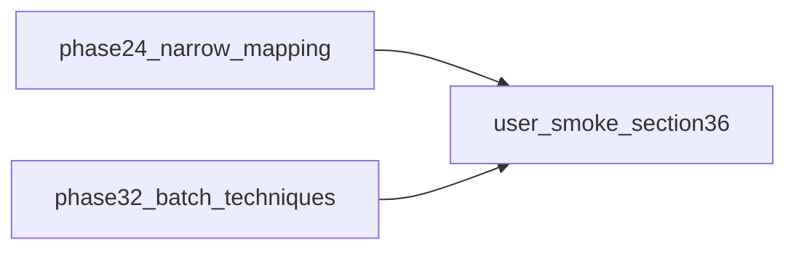

# Следующие шаги (после 2.4a/b и черновика 3.1)

## Ручной смоук §3.6 — смогу ли я сам?

**Нет.** Смоук из [§3.6](docs/MATERIALS_SINGLE_SOURCE_ROADMAP.md) и [§12](docs/MATERIALS_SINGLE_SOURCE_ROADMAP.md) (плавка, пилорама, карьер `stone_blocks`, ремонт на смеси старого/нового сейва после миграции **`STORE_VERSION` 30**) — это проверка в **реальном клиенте** (локальный `npm run dev`, `localStorage`, клики). У агента нет доступа к вашему браузеру и сохранениям.

Что можно сделать **вместо / в дополнение** от меня в коде:

- Поддерживать и расширять **Vitest**: уже есть цепочки в [`src/lib/craft/inventory-check.test.ts`](src/lib/craft/inventory-check.test.ts), [`src/store/resources-stash-debit.test.ts`](src/store/resources-stash-debit.test.ts), миграция [`migrateLegacyMaterialResourcesToStash`](src/lib/craft/inventory-check.ts); при необходимости — узкий интеграционный тест на `repair-cross-slice` / списание с `materialStash` (без UI).
- Вы **прогоняете** чеклист §12 один раз перед мержем **2.4**-ветки и при следующих изменениях склада.

---

## Приоритет 1 — **2.4** (продолжение): сужение dual-path

Опора: [`a2-phase24-bridge-audit.ts`](src/lib/craft/a2-phase24-bridge-audit.ts), [`inventory-check.ts`](src/lib/craft/inventory-check.ts) (`CORE_MATERIAL_TO_RESOURCE`, `MATERIAL_TO_RESOURCE`, `applyCraftingCostSpend`, `getGrantTargetMaterialId`).

Рекомендуемый порядок работ:

1. **Аудит записей** (grep): кто ещё пишет в `resources.*` через `addResource` / прямой slice / квесты для ключей из пулов A2 — зафиксировать в worklog **§11** или в комментарии к узкому PR.
2. **Выбрать первый безопасный поднабор** строк для удаления/слияния (критерий плана: «согласованный поднабор») так, чтобы не ломать `getAvailableAmountForResourceKey` и ремонт.
3. **Тесты до мержа:** [`inventory-check.test.ts`](src/lib/craft/inventory-check.test.ts), [`resources-stash-debit.test.ts`](src/store/resources-stash-debit.test.ts), [`material-catalog-contract`](src/lib/materials/material-catalog-contract.ts).
4. **Persist:** новый сдвиг только если меняется инвариант сейва; иначе при сужении маппинга может хватить текущего **v30** (повторная миграция уже идемпотентна). При **STORE_VERSION++** — чеклист в [`cloud-save-feature.ts`](src/lib/cloud-save-feature.ts).
5. **Документация:** строка **§11**; **§12** — что осталось по 2.4; [`RESOURCE_TRANSFORMATION_MAP.md`](docs/RESOURCE_TRANSFORMATION_MAP.md) — только если меняются id цепочек.

Skill-чеклист PR: [`.cursor/skills/materials-a2-wave/SKILL.md`](.cursor/skills/materials-a2-wave/SKILL.md).

---

## Приоритет 2 — **3.2** (и далее 3.x)

Черновик **3.1** уже в [`material-processing-techniques.ts`](src/data/material-processing-techniques.ts) + [`material-processing-techniques-operations.test.ts`](src/data/material-processing-techniques-operations.test.ts).

Следующие шаги по [§7 фаза 3](docs/MATERIALS_SINGLE_SOURCE_ROADMAP.md):

- Пакетами **3–5 техник** добавить `processingOperations` (I/O когда появятся в данных — валидатор уже проверяет ⊆ каталога).
- По мере готовности — точечная связка с [`process-generator.ts`](src/lib/craft/process-generator.ts) (не big-bang); обновить при необходимости [CRAFT_SYSTEM_ROADMAP](docs/systems/CRAFT_SYSTEM_ROADMAP.md).

Держать **отдельно** от крупного diff **2.4** (как в исходном плане).

---

## Приоритет 3 — **0.2** (наблюдение)

Пока в [`repair-system.ts`](src/data/repair-system.ts) / данных перековки нет явных **`materialId`** — новый сканер в контракте не добавлять; при появлении — строка в [`material-catalog-contract.ts`](src/lib/materials/material-catalog-contract.ts).

---

## Приоритет 4 — **§10** roadmap

Отмечать `[x]` **только по факту** (лавка, forbidden-imports и т.д.) — отдельный короткий проход, когда соответствующие задачи реально закрыты в коде.

---

## Краткая схема потока

