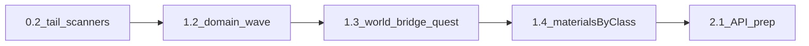

# Следующие шаги по MATERIALS_SINGLE_SOURCE_ROADMAP

## Текущая база (уже в репозитории)

- Контракт: [`src/lib/materials/material-catalog-contract.ts`](src/lib/materials/material-catalog-contract.ts) — сканеры техник, алтарь, лавка, `inventory-check` + `REFINING_INPUT_STAGE_MATERIAL_ID`, локации, **MISSION_REGISTRY**, **PRIMARY_LOOT_MATERIAL_IDS**.
- Реестр: [`src/data/materials/library/material-registry-manifest.ts`](src/data/materials/library/material-registry-manifest.ts) + тест уникальности.
- CLI: `npm run audit:materials`; skill — блок в [`.cursor/skills/material-definition-wizard/SKILL.md`](.cursor/skills/material-definition-wizard/SKILL.md).
- Черновик A2: JSDoc в [`src/store/slices/resources-slice.ts`](src/store/slices/resources-slice.ts); канон для крафта — отсылка в [`docs/systems/CRAFT_SYSTEM_ROADMAP.md`](docs/systems/CRAFT_SYSTEM_ROADMAP.md).

## 1. Добор фазы 0.2 (по одному типу источника на PR)

Цель: не оставлять строковые идентификаторы вне контракта.

| Приоритет | Источник | Действие |
|-----------|----------|----------|
| A | [`src/data/expedition-templates.ts`](src/data/expedition-templates.ts) | Поле **`bonusResources[].resource`** сейчас не покрыто сканером. Либо доказать, что в рантайме не используется как `materialId`, либо добавить **отдельный сканер** (или привести к каталожным id и проверять B ⊆ A). |
| B | [`src/data/refining-recipes.ts`](src/data/refining-recipes.ts) | Сверить: все **выходы/входы**, которые должны быть в каталоге A, уже попадают через `REFINING_INPUT_STAGE_MATERIAL_ID` и маппинги в [`inventory-check`](src/lib/craft/inventory-check.ts). При расхождении — **узкий сканер** по полям рецептов (без смешения с «чистым» RawResource без узла). |
| C | Ремонт / перековка | Как в §7 пакет **0.2**: сканер **только если** в данных появятся явные **`materialId`**; иначе одна строка worklog «пропуск осознанный». |

После каждого PR: зелёные [`material-catalog-contract.test.ts`](src/lib/materials/material-catalog-contract.test.ts), `npm run audit:materials`, строка в **§11** [MATERIALS_SINGLE_SOURCE_ROADMAP.md](docs/MATERIALS_SINGLE_SOURCE_ROADMAP.md).

## 2. Фаза 1.2–1.4 — волны реестра (из §7)

Следовать правилу **одна волна ≈ один PR** + контракт.

- **1.2:** Первая доменная волна (например `library/metals` + базовые `ores`) — декларация только через manifest/импорты, без «теневого» concat.
- **1.3:** Очередные волны: `worldResourceNodes`, bridge, quest-узлы — по объёму дробить.
- **1.4:** [`src/data/materials/index.ts`](src/data/materials/index.ts) — **`materialsByClass`** и аналоги только **производные** от `allMaterials` / тегов класса, согласованность с [`collections/`](src/data/materials/collections/).

## 3. Подготовка к фазе 2 (до пакета 2.2)

- Сверить чеклист **[§13](docs/MATERIALS_SINGLE_SOURCE_ROADMAP.md)** с фактическим scope (контракт в CI, A2 в §11.1).
- **2.1:** Зафиксировать контракт публичных методов store (начисление/списание по `materialId`) — расширить заготовку в `resources-slice` или вынести в короткий блок в [`game-store-composed.ts`](src/store/game-store-composed.ts) **без** полной миграции до **2.2**.
- Заложить **тесты цепочек** для первого домена (наследие: [`inventory-check.test.ts`](src/lib/craft/inventory-check.test.ts), при наличии — expedition chain tests из §7.1).

## 4. Документация после каждой значимой волны

По чеклисту в конце плана пользователя (и в §12 roadmap):

1. [docs/MATERIALS_SINGLE_SOURCE_ROADMAP.md](docs/MATERIALS_SINGLE_SOURCE_ROADMAP.md) — статус, **§11** worklog, **§12** «следующий шаг».
2. [docs/RESOURCE_TRANSFORMATION_MAP.md](docs/RESOURCE_TRANSFORMATION_MAP.md) — только если менялись цепочки id в данных переработки.
3. **§10** — снимать `[x]` только по достигнутым инвариантам (магазин, ENC без теневых списков, §8.2 и т.д.).

## 5. Вне скоупа ближайших волен (ориентир)

Фазы **3–5** (операции в техниках, динамический timeline, слияние `metalMaterials`, удаление bridge) — после стабилизации **1.x** и первых волн **2.x**; не смешивать с добором сканеров в одном монолитном PR.
