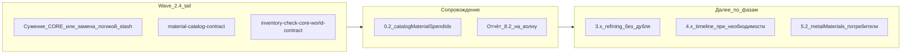

# План работ по следующим шагам MATERIALS_SINGLE_SOURCE_ROADMAP

## Исходная точка (зафиксировано в документе)

- В шапке и **§12**: закрыты **2.4d–2.4g**, волны **A2** по доменам, большая часть **3.x / 4.x / 5.1–5.4**, удалён pick-мост `library/bridge/`.
- В коде [`inventory-check.ts`](src/lib/craft/inventory-check.ts) в **`CORE MATERIAL_TO_RESOURCE`** сейчас остаются только **сплавы** (включая `*_alloy`), **`processed_wood` → `planks`**, **`processed_stone` → `stoneBlocks`** — см. комментарии и [`a2-phase24-bridge-audit.ts`](src/lib/craft/a2-phase24-bridge-audit.ts) (блок «итог 2.4»).
- Следующая работа по roadmap — не повторять уже сделанное, а идти по очереди **§12 «Дальше в коде»** + незакрытым чекбоксам **§10**.

---

## Блок A — Фаза 2.4 (хвост): ядро маппинга и dual-path

**Цель:** уменьшить или убраить остаточный dual-path для материалов, которые всё ещё идут через **`CORE_MATERIAL_TO_RESOURCE`**, не нарушая инвариант **пустое пересечение CORE∩WORLD** ([`getInventoryCheckCoreWorldKeyOverlap`](src/lib/craft/inventory-check.ts)).

Рекомендуемая нарезка PR (один смысл на PR, как **§7.0**):

1. **Подволна «сплавы / слитки»**  
   - Проработать для `steel`, `*_alloy`, `bronze` и т.д.: единый путь **списания/начисления** через `materialStash` и согласованность с пулами `ResourceKey` (слитки в `ALLOY_RECIPES` и `grantResourceKeyFromWorld` / домены A2).  
   - Опираться на существующие scope-файлы и тесты: [`a2-smelting-domain-scope.ts`](src/lib/craft/a2-smelting-domain-scope.ts), [`inventory-check.test.ts`](src/lib/craft/inventory-check.ts), [`inventory-check-core-world-contract.test.ts`](src/lib/craft/inventory-check-core-world-contract.test.ts).  
   - После изменений — обновить **§8.2**-снимок в roadmap (как уже делалось для волн d–g) и при необходимости [`RESOURCE_TRANSFORMATION_MAP.md`](docs/RESOURCE_TRANSFORMATION_MAP.md).

2. **Подволна «промежуточные обработанные: planks / stoneBlocks»**  
   - `processed_wood` / `processed_stone`: либо перенос в ту же модель, что мир/WORLD (если по политике пула), либо явное документирование «почему остаются в CORE» до следующей волны — но цель **§11.1** — убрать долгий dual-path.  
   - Регресс: блоки wood/stone/leather в [`inventory-check.test.ts`](src/lib/craft/inventory-check.test.ts), смоук из **§12** (пилорама, карьер).

3. **Persist / миграция**  
   - Повторный sweep `migrateLegacyMaterialResourcesToStash` только если новая волна снова трогает ключи `resources.*` — иначе не поднимать `STORE_VERSION` без нужды (в worklog уже было «STORE_VERSION не менялся» на части волн).

**Критерий выхода волны:** зелёный контракт, пустое CORE∩WORLD, обновлённый аудит [`a2-phase24-bridge-audit.ts`](src/lib/craft/a2-phase24-bridge-audit.ts), ручной смоук **§12** для затронутых сценариев.

---

## Блок B — Остаток 0.2: контракт и сканеры

**Цель:** при любой новой трате по каталогу — **B ⊆ A** остаётся истиной.

- Расширять [`material-catalog-contract.ts`](src/lib/materials/material-catalog-contract.ts): сбор **`catalogMaterialSpendIds`** из ремонта ([`repair-system.ts`](src/data/repair-system.ts)), перековки ([`reforge-techniques-registry.ts`](src/data/reforge/reforge-techniques-registry.ts)), и новых систем по мере появления (дорожная карта прямо говорит: ремонт в основном ещё **`CraftingCost` / ResourceKey** — сканер по `materialId` добивается по данным).  
- Согласовать с **§8.5**: тест в том же PR или следующим, что добавляет новый **источник** ссылок на `materialId`.

---

## Блок C — Фаза 3.x: `refining-recipes` и операции

**Цель:** меньше дубля «техника ↔ рецепт горна».

- Использовать уже введённый мост [`processing-technique-refining-bridge.ts`](src/lib/craft/processing-technique-refining-bridge.ts) + [`getEffectiveRefiningRecipeId`](src/lib/craft/processing-technique-refining-bridge.ts) там, где ещё жёстко читают `refiningRecipeId` ([`inventory-check.ts`](src/lib/craft/inventory-check.ts), UI [`PartMaterialProcessingPanel.tsx`](src/components/forge/craft-v2/planner/PartMaterialProcessingPanel.tsx), [`process-generator.ts`](src/lib/craft/process-generator.ts)) — по образцу уже сделанных пилотов (см. **§11**).  
- Пакетами **3–5 техник** переносить источник правды в **`processingOperations`**, ослабляя записи в [`refining-recipes.ts`](src/data/refining-recipes.ts), с тестами из [`material-processing-techniques-operations.test.ts`](src/data/material-processing-techniques-operations.test.ts) / bridge-тестов.

---

## Блок D — Фаза 4.x (по необходимости)

**Цель:** единый контур композиции таймлайна.

- Уже есть [`timeline-plan-contract.ts`](src/types/craft/timeline-plan-contract.ts), [`timeline-composition.ts`](src/lib/craft/timeline-composition.ts), интеграции в [`process-generator.ts`](src/lib/craft/process-generator.ts). Следующий шаг — только если появится разрыв между **вставками обработки** и боевыми модами: довести **`processingOperations` → стадии** в том же слое, что и боевые `processMods`, с тестом уровня [`process-generator.integration.test.ts`](src/lib/craft/process-generator.integration.test.ts).

---

## Блок E — Фаза 5.x: баланс и потребители

- **5.2:** новые фичи, завязанные на числа металлов, подключать через [`getMetalMaterialsRuntimeMerged`](src/data/materials/metals-runtime-merge.ts) / [`metals-catalog-alignment.test.ts`](src/data/materials/metals-catalog-alignment.test.ts); сокращать прямые зависимости от сырого [`metals.ts`](src/data/materials/metals.ts) без merge.  
- **§10 хвосты:** опционально обратный индекс «материал ← техники с выходом»; явная политика «нет скрытых дублей экономики» — тест или реестр исключений с комментарием.  
- **§10 / §7:** явно сверять каждый пакет с таблицей **§8.5** (тесты обязательны; CLI/Skill по желанию).

---

## Порядок выполнения и регресс

Рекомендуемый порядок: **A (2.4 хвост) → B (0.2 при каждом новом потребителе) → C → при необходимости D → E**.

На каждый PR: `lint`, `test`, `type-check`, `build` (как [AGENTS.md](AGENTS.md)); после волн склада/id — чеклист **§12** (миграция v30, плавка, пилорама, карьер, ремонт); при смене алтаря/перековки — точечно **§3.6**.

---

## Ключевые файлы (якоря)

| Назначение | Файл |
|------------|------|
| Ядро маппинга + траты | [`src/lib/craft/inventory-check.ts`](src/lib/craft/inventory-check.ts) |
| Аудит 2.4 | [`src/lib/craft/a2-phase24-bridge-audit.ts`](src/lib/craft/a2-phase24-bridge-audit.ts) |
| Мост мира | [`src/lib/materials/world-resource-inventory-bridge.ts`](src/lib/materials/world-resource-inventory-bridge.ts) |
| Контракт каталога | [`src/lib/materials/material-catalog-contract.ts`](src/lib/materials/material-catalog-contract.ts) |
| Техники и операции | [`src/data/material-processing-techniques.ts`](src/data/material-processing-techniques.ts) |
| Чеклист PR волны A2 | [`.cursor/skills/materials-a2-wave/SKILL.md`](.cursor/skills/materials-a2-wave/SKILL.md) |
