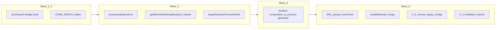

# План следующих шагов по [MATERIALS_SINGLE_SOURCE_ROADMAP.md](docs/MATERIALS_SINGLE_SOURCE_ROADMAP.md)

Опора на актуальную очередь **[§12](docs/MATERIALS_SINGLE_SOURCE_ROADMAP.md)** и worklog **§11** (строка про волны A–E). План взят **не из** `.cursor/plans/*.plan.md` — только из репозитория.

## Порядок пакетов (как в §12 + здравый смысл зависимостей)

Не смешивать крупный **[`inventory-check.ts`](src/lib/craft/inventory-check.ts)** с массовыми правками **[`material-processing-techniques.ts`](src/data/material-processing-techniques.ts)** в одном PR.

---

## 1. Волна 2.4 (продолжение) — склад и маппинг

**Цель:** пакетами сужать или удалять строки **`CORE_MATERIAL_TO_RESOURCE`** и согласованные таблицы в [`inventory-check.ts`](src/lib/craft/inventory-check.ts), сверяясь с [`a2-phase24-bridge-audit.ts`](src/lib/craft/a2-phase24-bridge-audit.ts) и [`world-resource-inventory-bridge.ts`](src/lib/materials/world-resource-inventory-bridge.ts).

- Выбрать **один домен/поднабор** строк за PR; после каждого PR: зелёные [`inventory-check.test.ts`](src/lib/craft/inventory-check.test.ts), [`resources-stash-debit.test.ts`](src/store/resources-stash-debit.test.ts), [`material-catalog-contract.ts`](src/lib/materials/material-catalog-contract.ts) (сканеры).
- Зафиксировать scope в отчёте **§8.2** дорожной карты (нет незакрытых `error` по заявленному объёму).
- **`STORE_VERSION` / [`cloud-save-feature.ts`](src/lib/cloud-save-feature.ts)** — только если меняется инвариант сейва; иначе опираться на существующий sweep **v30** (§12).
- **[`RESOURCE_TRANSFORMATION_MAP.md`](docs/RESOURCE_TRANSFORMATION_MAP.md)** — править только если меняются **id** цепочек.
- Строка **§11** + уточнение **§12** «что осталось по 2.4»; при необходимости обновить шапку **статуса** в §1 (сейчас она короче, чем §11 последняя строка).

**Смоук:** чеклист **§12 / §3.6** после значимого diff склада.

---

## 2. Волна 3.x — техники обработки и горн

**3.2 (остаток):** в [`material-processing-techniques.ts`](src/data/material-processing-techniques.ts) добить `processingOperations` у техник, где ещё пусто (по реестру: в т.ч. **кожа**, прочие ветки из плана «сталь/золото/мифрил/дерево/камень/кожа» — сверить с фактическим файлом), поднять/уточнить пороги в [`material-processing-techniques-operations.test.ts`](src/data/material-processing-techniques-operations.test.ts).

**3.3 (рантайм):** вынести использование [`getEffectiveRefiningRecipeId`](src/lib/craft/processing-technique-refining-bridge.ts) в путь **горна** — [`completeRefiningWithResources` / `completeRefining`](src/store/game-store-composed.ts) + согласование с [`refining-recipes.ts`](src/data/refining-recipes.ts). Отдельный узкий PR «один смысл» для [`process-generator.ts`](src/lib/craft/process-generator.ts) (вставка этапов обработки), чтобы не смешивать со сносом `inventory-check`.

**3.4:** расширить **`targetSemanticProcessRoles`** там, где это убирает длинные **`targetCatalogMaterialIds`**, с опорой на [`MATERIAL_SEMANTIC_PROCESS_ROLES.md`](docs/MATERIAL_SEMANTIC_PROCESS_ROLES.md); инвариант **I/O ⊆ реестр** — как в валидаторе операций.

---

## 3. Волна 0.2 (наблюдение)

- Сканер в [`material-catalog-contract.ts`](src/lib/materials/material-catalog-contract.ts) для **ремонта/перековки** — **только** когда в [`repair-system.ts`](src/data/repair-system.ts) / данных reforge появятся явные **`materialId`** (как уже задокументировано в §11/§12).

---

## 4. Волна 4.x — таймлайн

- Перенос логики из [`timeline-composition.ts`](src/lib/craft/timeline-composition.ts) в единый генератор этапов ([`process-generator.ts`](src/lib/craft/process-generator.ts)) **после** стабильных данных **3.2** и задела **3.3**.
- Добавить/расширить интеграционные тесты «план → порядок этапов» (несколько комбинаций обработки + боевых `processMods`); при смене поведения — точечно [`CRAFT_SYSTEM_ROADMAP.md`](docs/systems/CRAFT_SYSTEM_ROADMAP.md).

---

## 5. Волна 5.x — ENC, металлы, чистка

Когда **2.x** и **3.x** не ломают контракт и экономику:

- **5.1 ENC:** группы, «как получить», обратный индекс «материал ← техники с выходом» (опционально скрипт/Vitest), использование [`encyclopedia-display-order.ts`](src/lib/materials/encyclopedia-display-order.ts) в UI списков где уместно.
- **5.2:** слияние **`metalMaterials`** / [`metals.ts`](src/data/materials/metals.ts) с каталогом пакетами; опора на [`metals-catalog-alignment.test.ts`](src/data/materials/metals-catalog-alignment.test.ts).
- **5.3:** удаление [`inventory-mapped-legacy-nodes.ts`](src/data/materials/library/bridge/inventory-mapped-legacy-nodes.ts) и аналогов — **по одному модулю** на PR при большом диффе.
- **5.4:** тест запрещённых импортов (legacy bridge после фазы 5), финальный задел **§8.2** по scope, актуализация карты ресурсов и гайдов по факту id.

---

## Ритуал на каждый PR

- **§11:** одна строка worklog на значимый пакет.
- **CI:** `npm run test`, `type-check`, `lint` (0 errors), `build` — как в [AGENTS.md](AGENTS.md).
