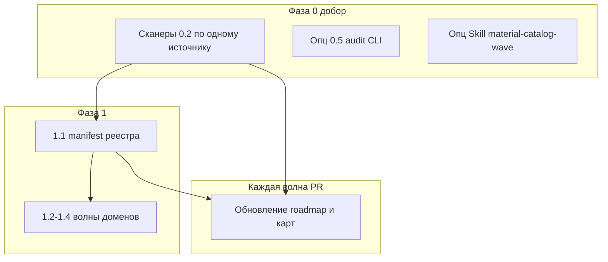

# Следующие шаги по MATERIALS_SINGLE_SOURCE_ROADMAP

## Контекст

Текущее ядро: [`src/lib/materials/material-catalog-contract.ts`](src/lib/materials/material-catalog-contract.ts) — пять сканеров (техники обработки, алтарь, лавка, `inventory-check` + `REFINING_INPUT_STAGE_MATERIAL_ID`, локации экспедиций). Дорожная карта: **§12** перечисляет добор **0.2**, **0.5**, Skill, **1.1**; планирование всегда в паре с **§8.5**.

## Волна A — Добор 0.2 (по одному PR на новый тип источника)

Цель: не оставлять «тихие» `materialId` вне контракта перед **2.x**.

Приоритетный порядок (гибко, но документировать в **§11** что сделано):

| Источник | Файлы / модули | Примечание |
|----------|----------------|------------|
| Награды шаблонов / событий экспедиций | [`expedition-templates.ts`](src/data/expedition-templates.ts), [`modules/expeditions/data/events`](src/modules/expeditions/data/events) | Сейчас контракт покрывает только `LOCATION_REGISTRY.resources` — бонусы `resource: string` могут не совпадать с каталожными id без явного сканера |
| Полный проход `refining-recipes` | [`refining-recipes.ts`](src/data/refining-recipes.ts) | Сейчас покрыто через `REFINING_INPUT_STAGE_MATERIAL_ID` + маппинги; при необходимости — извлечь все id, которые должны быть в A (без смешения с «чистыми» RawResource без каталога) |
| Ремонт | [`repair-system.ts`](src/data/repair-system.ts), константы в [`constants.ts`](src/lib/store-utils/constants.ts) | Только если появятся явные `materialId`; иначе пропустить с пометкой в **§11** |

Критерий PR: зелёный [`material-catalog-contract.test.ts`](src/lib/materials/material-catalog-contract.test.ts); **§8.5** строка **0.1–0.2**.

## Волна B — Опционально 0.5 и Skill (**§8.5**)

- **0.5:** скрипт `npm run audit:materials` — тонкая обёртка над `runMaterialCatalogContractChecks()` (или общий экспорт движка из [`material-catalog-contract.ts`](src/lib/materials/material-catalog-contract.ts)), запись в [`package.json`](package.json).
- **Skill:** расширить [`.cursor/skills/material-definition-wizard/SKILL.md`](.cursor/skills/material-definition-wizard/SKILL.md) или отдельный skill `material-catalog-wave` со ссылкой на **§8** дорожной карты.

## Волна C — Фаза 1.1: единый manifest реестра

- Ввести явную точку сборки `allMaterials` / `materialById` (manifest или один barrel в [`src/data/materials/library/`](src/data/materials/library/) / соседний файл), как в **§7** пакет **1.1**.
- Тест уникальности id (уже частично в контракте через `findDuplicateRegistryMaterialIds`) — оставить/перенести ближе к manifest.
- После каждой волны **1.2–1.4**: обновлять сканеры контракта при новых типах ссылок; **§8.5** строка **1.1–1.4**.

## Волна D — Согласование с CRAFT_SYSTEM_ROADMAP

- В [`docs/systems/CRAFT_SYSTEM_ROADMAP.md`](docs/systems/CRAFT_SYSTEM_ROADMAP.md): одна явная отсылка на [MATERIALS_SINGLE_SOURCE_ROADMAP.md](docs/MATERIALS_SINGLE_SOURCE_ROADMAP.md) как канон по каталогу / складу / обработке (без дублирования полного ТЗ).

## Волна E — Подготовка к фазе 2 (**2.1**)

- Убедиться по **§13**: список модулей A2 в **§11.1** актуален; набросок контракта API `addMaterialToStash` / единого списания в store (типы или короткий doc-комментарий в [`resources-slice.ts`](src/store/slices/resources-slice.ts) / composed store) — **без** полной A2 до явного пакета **2.2**.

---

## Финальный шаг каждой волны: актуализация документации

**Обязательно после каждого значимого PR** (не откладывать на конец фазы):

1. **[docs/MATERIALS_SINGLE_SOURCE_ROADMAP.md](docs/MATERIALS_SINGLE_SOURCE_ROADMAP.md)**  
   - Шапка **«Статус»** при необходимости.  
   - **§11 Worklog:** одна строка: пакет / волна / какие сканеры или manifest затронуты.  
   - **§12:** при сдвиге приоритетов — обновить «следующий шаг».  
   - Если закрыт подпункт **0.2** — кратко отметить в тексте пакета **0.2** или в worklog.

2. **Точечные карты при изменении цепочек id:** [docs/RESOURCE_TRANSFORMATION_MAP.md](docs/RESOURCE_TRANSFORMATION_MAP.md) (по правилам проекта при правке данных переработки).

3. **§10 чеклист** — снять или оставить `[ ]` осознанно, если инвариант ещё не выполнен.

4. При новых типах в **`src/types/`** — одна строка в [docs/04_TYPES_SYSTEM.md](docs/04_TYPES_SYSTEM.md) (как для `ProcessingOperation`).

5. При смене UX материалов/лавки — [docs/LEGACY_UI.md](docs/LEGACY_UI.md) при необходимости.

Так дорожная карта остаётся **операционным источником правды** о прогрессе, а не архивным ТЗ.
