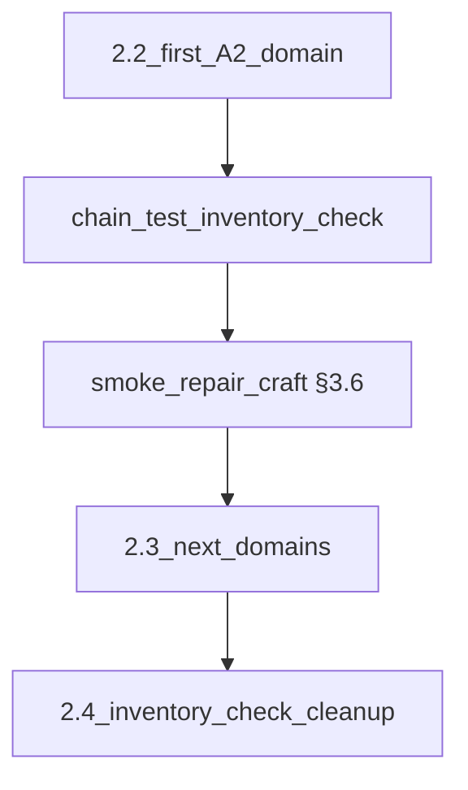

# Следующие шаги (после текущего §12)

## Где мы сейчас

- **Контракт:** [`src/lib/materials/material-catalog-contract.ts`](src/lib/materials/material-catalog-contract.ts) покрывает основные потребители + миссии, primary loot, `expeditionTemplates.bonusResources`, полный проход [`refining-recipes`](src/data/refining-recipes.ts).
- **Реестр:** [`material-registry-core.ts`](src/data/materials/library/material-registry-core.ts) + [`material-registry-satellites.ts`](src/data/materials/library/material-registry-satellites.ts) → [`material-registry-manifest.ts`](src/data/materials/library/material-registry-manifest.ts); [`materialsByClass`](src/data/materials/index.ts) только от `allMaterials`.
- **A2 черновик:** [`src/store/contracts/material-stash-a2-draft.ts`](src/store/contracts/material-stash-a2-draft.ts); реальный store по-прежнему через `resources` + `materialStash` + [`inventory-check.ts`](src/lib/craft/inventory-check.ts).

Коллекции ([`src/data/materials/collections/metals.ts`](src/data/materials/collections/metals.ts) и др.) уже строятся от `allMaterials.filter` — лишний «третий» срез для **1.4** не требуется; при желании добавить **один тест согласованности** `materialsByClass.metal` vs `metalsCollection` (множества id должны совпасть).

## 1. Пакет 2.2 — первая волна A2 (ядро плана)

Цель по [§7 фаза 2](docs/MATERIALS_SINGLE_SOURCE_ROADMAP.md): для **одного ограниченного домена** убрать двойственность «и `ResourceKey`, и stash» в пользу канона **`materialId`** в операциях этого домена, без ломания всего persist разом.

**Рекомендуемый первый домен** (как в таблице §7): **плавка / металлическая цепочка** (руда → слиток в плане крафта): затрагивают [`inventory-check.ts`](src/lib/craft/inventory-check.ts), [`resources-slice.ts`](src/store/slices/resources-slice.ts), [`use-craft-v2.ts`](src/hooks/use-craft-v2.ts) / кросс-слайсы, при необходимости persist в [`game-store-composed.ts`](src/store/game-store-composed.ts).

Практический порядок волны:

1. **Инвентаризация:** перечислить для выбранного домена все места чтения/записи `resources.*` vs `materialStash` (grep по ключам домена и по `getGrantTargetMaterialId` / `spendCraftingCostWithStash`).
2. **Поведение:** для согласованного подмножества операций перевести «источник правды» на `materialStash` (или на единый хелпер списания из черновика **2.1**); оставить минимальный мост в `resources` только если UI/заказ ещё не готов — с явным TODO и датой снятия в §11.
3. **Тест цепочки:** расширить [`src/lib/craft/inventory-check.test.ts`](src/lib/craft/inventory-check.test.ts) (или добавить узкий `*.test.ts` рядом с cross-slice) сценарием: начальное состояние → списание по рецепту/крафту домена → ожидаемый `materialStash` / отсутствие расхождений с инвариантом волны.
4. **Смоук §3.6:** в описании PR — один проход «крафт с обработкой» + **ремонт** на том же сейве, если ремонт использует те же пулы [`repair-cross-slice`](src/store/cross-slice/repair-cross-slice.ts).

После PR: worklog **§11**, обновить **§12** (следующий шаг → **2.3** или добор 2.2, если домен разбит на подволны).

## 2. Остаток 0.2 — ремонт / перековка

- Просканировать данные: [`repair-system.ts`](src/data/repair-system.ts), реестры перековки — появились ли явные **`materialId`** (не только `ResourceKey`).
- Если да — новая строка в `SCANNERS` контракта; если нет — одна строка в **§11** «пропуск осознанный» (как уже заведено в §12).

## 3. Гигиена реестра (низкий риск, по необходимости)

- При росте объёма: разнести [`material-registry-satellites.ts`](src/data/materials/library/material-registry-satellites.ts) на отдельные файлы по миру / bridge / quest (**§7.1**, один тип сегмента на PR).
- Опционально: тест «`materialsByClass` vs `collections`» на равенство множеств id по классу.

## 4. Документация и §10

После каждой значимой волны ([§4 плана пользователя](file:///c%3A/Users/user/.cursor/plans/materials_roadmap_next_c281dd06.plan.md)):

- [docs/MATERIALS_SINGLE_SOURCE_ROADMAP.md](docs/MATERIALS_SINGLE_SOURCE_ROADMAP.md): **статус**, **§11**, **§12**; [docs/RESOURCE_TRANSFORMATION_MAP.md](docs/RESOURCE_TRANSFORMATION_MAP.md) — только если менялись id в данных переработки.
- **§10:** отмечать `[x]` только по факту (магазин/ENC/forbidden-imports/§8.2 — по мере выполнения; не «галочки вперёд»).

## 5. За горизонтом ближайшей итерации

- **2.3–2.4:** следующие домены (дерево, камень, кожа) и чистка временных маппингов в `inventory-check`.
- **Фаза 3+** ([§7](docs/MATERIALS_SINGLE_SOURCE_ROADMAP.md)) — операции в техниках, timeline, **5.x** — не смешивать с 2.2 в одном большом PR.
