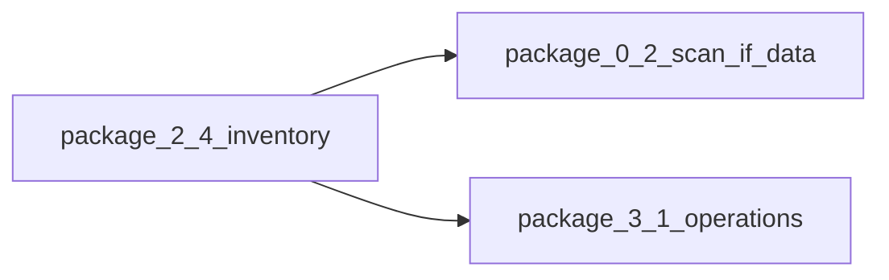

# Следующие задачи (после A2 доменов 2.3)

## Где мы

- По [docs/MATERIALS_SINGLE_SOURCE_ROADMAP.md](docs/MATERIALS_SINGLE_SOURCE_ROADMAP.md) **§12**: волны **2.2–2.3** по доменам закрыты scope-файлами и тестами; **2.4** пока только комментарии в коде.
- Skill для PR: [`.cursor/skills/materials-a2-wave/SKILL.md`](.cursor/skills/materials-a2-wave/SKILL.md) (чеклист смоука, контракт, §11).

## Пакет A — фаза **2.4** (снятие dual-path)

**Цель:** уменьшить долговременные мосты `ResourceKey` ↔ `materialStash` там, где все игровые пути уже канонично stash+`getAvailableAmountForResourceKey`, без поломки старых сейвов.

1. **Аудит:** пройти [`src/lib/craft/inventory-check.ts`](src/lib/craft/inventory-check.ts) (`CORE_MATERIAL_TO_RESOURCE`, `RESOURCE_GRANT_STASH_FALLBACK`, `getGrantTargetMaterialId`, spend order в `applyCraftingCostSpend`). Зафиксировать список ключей, для которых **никто** больше не полагается только на `resources.*` для экономики (grep начислений: `addResource`, прямые записи в slice, квесты).
2. **Миграция persist:** если меняется ожидаемая форма сейва (например обнуление поля после переноса), подготовить шаг `migrate` в [`src/store/game-store-composed.ts`](src/store/game-store-composed.ts): `STORE_VERSION++`, вызов/расширение [`migrateLegacyMaterialResourcesToStash`](src/lib/craft/inventory-check.ts) или узкий пост-проход; checklist облака — [`src/lib/cloud-save-feature.ts`](src/lib/cloud-save-feature.ts) при включённом Turso.
3. **Код:** удалять или упрощать ветки **только** пакетами с зелёными [`src/lib/craft/inventory-check.test.ts`](src/lib/craft/inventory-check.test.ts), [`src/store/resources-stash-debit.test.ts`](src/store/resources-stash-debit.test.ts), `material-catalog-contract`.
4. **Доки:** строка **§11**, **§12** (статус 2.4); [docs/RESOURCE_TRANSFORMATION_MAP.md](docs/RESOURCE_TRANSFORMATION_MAP.md) — только при смене id цепочек.

**Критерий выхода 2.4 (частичный):** хотя бы один согласованный поднабор маппинга помечен как удалённый или сведён к одному пути; CI зелёный; ручной смоук **§3.6** (плавка + пилорама + карьер + ремонт) на смеси старого/нового сейва при наличии миграции.

## Пакет B — остаток **0.2** (наблюдение)

- При появлении явных **`materialId`** в [`src/data/repair-system.ts`](src/data/repair-system.ts) / данных перековки — новая строка сканера в [`src/lib/materials/material-catalog-contract.ts`](src/lib/materials/material-catalog-contract.ts) (**§8.5**). Иначе не расширять scope.

## Пакет C — старт **фазы 3** (отдельный PR от 2.4)

По таблице **§7** пакет **3.1**: ввести **операцию** в данных (поле или реестр), **одна** техника обработки как эталон, тест валидатора; затем **3.2** пакетами по 3–5 техник. Не смешивать с удалением маппингов **2.4** в одном огромном diff.

Опорные файлы: [`src/types/materials/processing-operations.ts`](src/types/materials/processing-operations.ts), [`src/data/material-processing-techniques.ts`](src/data/material-processing-techniques.ts), [`src/lib/craft/process-generator.ts`](src/lib/craft/process-generator.ts), [docs/systems/CRAFT_SYSTEM_ROADMAP.md](docs/systems/CRAFT_SYSTEM_ROADMAP.md).

## Пакет D — документация (низкий приоритет)

- Одна строка в **§8** roadmap: ссылка на skill **materials-a2-wave** как опциональный чеклист волны A2 (дублирует AGENTS — по желанию).
- **§10:** отмечать `[x]` только по факту (лавка/forbidden-imports и т.д.).

## Рекомендуемый порядок PR

1. **2.4a** — аудит + документ в §11/§12 без удаления кода (или минимальные dead-code комментарии).
2. **2.4b** — миграция + сужение маппинга под множество ключей с тестами.
3. **3.1** — эталон техники с операциями (отдельная ветка).
