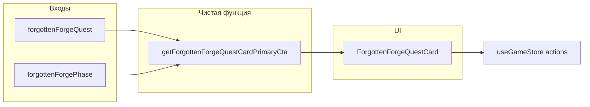

# План: редизайн карточки квеста FF (Осособые задания)

## Контекст

Сейчас [`src/components/guild/forgotten-forge-quest-card.tsx`](src/components/guild/forgotten-forge-quest-card.tsx) показывает текст прогресса с боковой границей, опционально «Следующая цель экспедиции», две равнозначные кнопки («Архивариус» и «К экспедициям») и **нет** визуальной полосы прогресса. Редизайн описан в рабочем документе; в коде шаги квеста v2 — `0…18` ([`FORGOTTEN_FORGE_QUEST_STEP_MAX`](src/types/forgotten-forge-quest.ts)), фазы UI — [`QuestPhase`](src/store/slices/forgotten-forge-quest-slice.ts) (`intro`, `awaiting_expedition`, `post_expedition_dialogue`, `open`, …).

## Архитектура решения

Хелпер не импортирует React и не вызывает store: возвращает дискриминированный union, например `kind: 'expedition' | 'forge' | 'altar' | 'archivist' | 'none'` плюс подписи для кнопки (и при необходимости идентификатор иконки Lucide). Карточка мапит `kind` на уже существующие экшены: `onGoToExpeditionsTab`, `navigateToForgeTab('craft')`, `setCurrentScreen('altar')`, `openMessagesDock('archivist')`.

**Правила CTA (согласовать с матрицей в спеке и существующими гейтами):**

- Экспедиции: `forgottenForgePhase === 'awaiting_expedition'` и есть ожидание похода ([`getForgottenForgeExpeditionExpectation`](src/data/quests/forgotten-forge.ts)(step)); для шагов с выбором (3, 5, 6) primary остаётся экспедиции, блоки Switch/кнопок — без изменения логики.
- Шаг **9**: если `waitingForCraftAfterPhase2` — **кузница** (согласовано с [`getForgottenForgeAltarPhaseBlockHint`](src/lib/altar/altar-quest-gates.ts)); иначе при `open` / стройке — **алтарь** (фаза II до крафта).
- Стройка алтаря: шаги **8, 14, 16, 17** при осмысленной фазе (`open` или когда игрок не в диалоге экспедиции) — **экран зачарований** (`setCurrentScreen('altar')`).
- Диалоги: `intro`, `post_expedition_dialogue` — primary **«К архивариусу»** (открытие дока); при `available` до старта — уточнить по текущему UX (скорее archivist или none + только вторичная кнопка).
- Шаги **0, 7** и прочие «только сюжет»: не показывать дублирующую экспедицию, если ожидания похода нет.

Точные ветки зафиксировать в unit-тестах по примерам из [`forgotten-forge-advance.test.ts`](src/lib/quests/forgotten-forge-advance.test.ts) и [`altar-quest-gates.test.ts`](src/lib/altar/altar-quest-gates.test.ts).

## Задачи по файлам

1. **Новый модуль** [`src/lib/quests/forgotten-forge-quest-card-cta.ts`](src/lib/quests/forgotten-forge-quest-card-cta.ts)  
   - Функция `getForgottenForgeQuestCardPrimaryCta` с аргументами `(quest: ForgottenForgeQuestState, phase: QuestPhase)` (импорт типа `QuestPhase` из slice или вынести тип в `types`/маленький `lib/quests/types` — по желанию, минимизировать циклы).  
   - **Тест** [`src/lib/quests/forgotten-forge-quest-card-cta.test.ts`](src/lib/quests/forgotten-forge-quest-card-cta.test.ts): шаги 0, 7, 8, 9 ± `waitingForCraftAfterPhase2`, 11–13, 14–18 × фазы `awaiting_expedition` / `open` / `post_expedition_dialogue`.

2. **Данные (опционально)** [`src/data/quests/forgotten-forge.ts`](src/data/quests/forgotten-forge.ts)  
   - Если общая строка для шага 9 в [`FORGOTTEN_FORGE_PROGRESS_LINES`](src/data/quests/forgotten-forge.ts) слишком расплывчата при ожидании крафта: добавить вторую ключевую ветку (например хелпер `getForgottenForgeProgressLineForCard(step, waitingForCraft)`) **или** оставить один источник и подменять только в карточке — на усмотрение при реализации.

3. **UI** [`src/components/guild/forgotten-forge-quest-card.tsx`](src/components/guild/forgotten-forge-quest-card.tsx)  
   - Импорт [`Progress`](src/components/ui/progress) по образцу [`recovery-quest-card.tsx`](src/components/guild/recovery-quest-card.tsx).  
   - Подсчёт процента: `Math.round((step / FORGOTTEN_FORGE_QUEST_STEP_MAX) * 100)` для активного квеста, `100` для `completed`. Подпись этапа: единый формат («Этап N из 19» для step 0–18 или эквивалент — выбрать один и использовать везде).  
   - Блок «Текущая цель»: `rounded-lg border border-stone-700/80 bg-stone-900/40`, текст цели + **одна** `Button` default (primary) из хелпера.  
   - Вторичная `Button` outline: «Поговорить с архивариусом»; убрать параллельную «К экспедициям», когда primary уже expedition.  
   - Убрать или сократить строку `expectedLocName`, если текст цели и CTA её покрывают.  
   - Обновить микрокопирайт блоков шагов 3 / 5 / 6 по §5 спеки.  
   - Состояния `locked` / `completed` и dev-кнопки сохранить; при необходимости добавить полоску 100% только для completed.

4. **Опционально (фаза C)** [`src/components/enchantment/altar-quest-goal.tsx`](src/components/enchantment/altar-quest-goal.tsx) — привести отступы/обёртку к тому же паттерну блока цели, что и в гильдии (без дублирования строк — импорт хелпера текста, если вынесен).

## Проверка

- `npm run type-check`, `npm run test` (новый тест + существующие квест/алтарь).  
- Ручной прогон: несколько шагов, шаг 9 с флагом крафта, мобильная ширина вкладки «Особые задания» в [`expeditions-section.tsx`](src/components/guild/expeditions-section.tsx).

## Вне скоупа (фаза D из спеки)

Мини-трек шагов, тосты техник, бейджи макрофаз I–V — отдельные задачи после стабилизации карточки.
