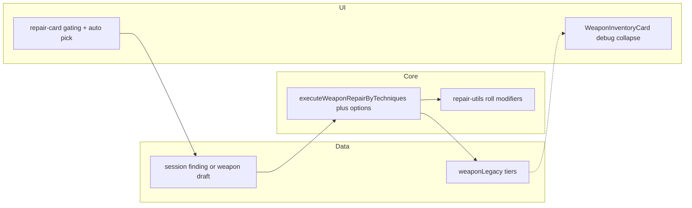

# План: переработка ремонта (модель v2)

## Контекст

Целевая модель зафиксирована в документе: подраздел **«Согласованная модель v2»** в [docs/systems/REPAIR_UI_UX_REDESIGN_SPEC.md](docs/systems/REPAIR_UI_UX_REDESIGN_SPEC.md) (§2.1 в смысле содержания, §9.1.1 — качество диагностики).

Текущая база: ручной ремонт через `[executeWeaponRepairByTechniques](src/store/cross-slice/repair-cross-slice.ts)` (уже пишет `repairResolveCountByTagId` / `archivedDamageTagIds` при успехе); авто-ремонт — `[claimWeaponAutoRepair](src/store/cross-slice/repair-cross-slice.ts)`; UI — `[repair-card.tsx](src/components/ui/repair-card.tsx)` + `[damage-tag-inspection-options.ts](src/data/weapon-damage/damage-tag-inspection-options.ts)`; карточка клинка на верстаке — `[weapon-inventory-card.tsx](src/components/forge/weapon-inventory-card.tsx)` (`context="repairBench"`).

## Фаза 0 — Отладочный слой §9.1 на карточке оружия (верстак)

**Цель:** показать «под капотом», как к накоплению меты относятся уже существующие поля `weaponLegacy`, без ожидания полной модели v2.

**Поведение:**

- В **нижней части** карточки оружия, когда клинок на верстаке (`[WeaponInventoryCard](src/components/forge/weapon-inventory-card.tsx)` с `context="repairBench"`, либо эквивалентная зона в `[repair-section.tsx](src/components/forge/repair-section.tsx)` — зафиксировать один вариант в PR).
- Блок **свёрнут по умолчанию** (`Collapsible`): заголовок вроде «Скрытый учёт (§9.1)» / «Под капотом» — чтобы не шуметь в обычной игре.
- Внутри при раскрытии:
  - `**archivedDamageTagIds`** — список id с **человекочитаемыми подписями** из `[damage-tag-registry](src/data/weapon-damage/damage-tag-registry.ts)` (`getDamageTagById`), при отсутствии — сырой id.
  - `**repairResolveCountByTagId`** — таблица или список «тег → сколько раз устранён ремонтом» (только ненулевые / все ключи из архива — на усмотрение, главное — видно число).
- После появления полей **tier-диагностики** (фаза 1–2) — **дополнить** тот же блок счётчиками `precise` / `risky` / `skipped` по тегам (без дублирования второго UI).

**Нефункционально:** стили в духе существующих `muted` / `text-xs`, без «игрового» обещания игроку — можно пометить как отладочную строку мелким серым («данные для зачарования, скрытые в бою»).

**Зависимости:** нет (данные уже пишутся в `repair-cross-slice`). **Порядок:** можно выполнить **до или параллельно** фазе 1 — сразу видно эффект починок.

**Критерий готовности:** после успешного ремонта с снятием тега обновляются числа в свёртке без перезагрузки страницы (реактивность от стора).

## Фаза 1 — Данные и контракты

- Ввести тип `**RepairDiagnosisTier**`: `'precise' | 'risky' | 'skipped'` (например в `[src/types/weapon-damage.ts](src/types/weapon-damage.ts)`).
- Расширить `**WeaponLegacy**` персистируемыми полями под §9.1.1. Разумный MVP: **счётчики по tier и тегу**, чтобы не терять историю при повторных ремонтах:
  - например `repairDiagnosisPreciseCountByTagId`, `repairDiagnosisRiskyCountByTagId`, `repairDiagnosisSkippedCountByTagId` (все `Record<string, number>`, опционально), либо одна мапа `repairDiagnosisByTagId: Record<string, { precise: number; risky: number; skipped: number }>` — выбрать одну схему и зафиксировать в `[docs/04_TYPES_SYSTEM.md](docs/04_TYPES_SYSTEM.md)`.
- Обновить `[ensureWeaponLegacy](src/lib/weapon-damage/weapon-legacy.ts)` и `[migrateCraftedWeaponV2DamageFields](src/lib/weapon-damage/migrate-crafted-weapon-damage.ts)` для новых полей.
- Чеклист облака: `[src/lib/cloud-save-feature.ts](src/lib/cloud-save-feature.ts)` (JSON внутри `weaponInventory` уже `unknown`; явных колонок Turso не требуется, если не добавляют отдельные поля в БД).

## Фаза 2 — Контекст ремонта и начисление tier

- Расширить сигнатуру `**executeWeaponRepairByTechniques`** (и тип в `[game-store-composed.ts](src/store/game-store-composed.ts)`) опциональным **контекстом диагностики**, например:
  - `diagnosisMode: 'manual_inspection' | 'auto_pick' | 'auto_repair'`
  - для ручного пути: `inspectionByTagId?: Record<string, { hypothesisCorrect: boolean }>` (по активным тегам на момент снятия), чтобы при успешном снятии тега выставить tier: `precise`/`risky`; для `auto_pick` / `auto_repair` — всегда `skipped` при записи меты (или только при фактическом снятии тега).
- В блоке успешного снятия тегов (там же, где сейчас инкремент `repairResolveCountByTagId`) **добавить инкремент соответствующих счётчиков tier** по каждому снятому `tagId`.
- Для `**claimWeaponAutoRepair`**: при снятии тегов / завершении авто-ремонта записывать `**skipped`** для затронутых тегов (как в спеке: resolve может расти, tier диагностики — «не честный осмотр»).
- Юнит-тесты: `[repair-cross-slice.test.ts](src/store/cross-slice/repair-cross-slice.test.ts)` — сценарии precise/risky/skipped; миграция — `[migrate-crafted-weapon-damage.test.ts](src/lib/weapon-damage/migrate-crafted-weapon-damage.test.ts)`.

## Фаза 3 — Риск и модификаторы броска/стоимости

- Определить **машиночитаемый `finding`** (минимум: `tagId` + `hypothesisCorrect: boolean` + опционально `findingId` из данных осмотра) — в отдельном модуле рядом с `[damage-tag-inspection-options.ts](src/data/weapon-damage/damage-tag-inspection-options.ts)` или расширить его.
- Ввести константы штрафов/наценок в `[src/lib/store-utils/constants.ts](src/lib/store-utils/constants.ts)` (например `REPAIR_WRONG_HYPOTHESIS_SUCCESS_PENALTY`, `REPAIR_AUTO_PICK_MATERIAL_MARKUP`) и кратко зафиксировать в `[docs/utils/FORMULAS.md](docs/utils/FORMULAS.md)`.
- **Неверная гипотеза:** в `[executeRepairWithPlanCosts](src/lib/store-utils/repair-utils.ts)` (или обёртке) применить **модификатор к успеху броска** / итоговым потерям при сохранении текущей модели `RepairType` — одна точка вместо размазывания по UI.
- **Авто-подбор:** при расчёте `resolveWeaponRepairPlanEconomy` / списании перед ремонтом — **наценка на материалы** (или фикс золота через существующий `grantResourceKeyFromWorld` / `spendResource`), если `diagnosisMode === 'auto_pick'`.
- *Опционально позже:* этап «переделка» как отдельный шаг в `[use-weapon-repair-stage-run](src/hooks/use-weapon-repair-stage-run.ts)` — не блокировать MVP, если штраф к броску уже даёт ощущение риска.

## Фаза 4 — UI: осмотр даёт данные, авто-подбор, копирайт

- `[repair-card.tsx](src/components/ui/repair-card.tsx)`:
  - Убрать поведение «квиз сам добавляет технику в выбор»; вместо этого после выбора гипотезы **автоматически формировать допустимый набор** из реестра (`getApplicableRepairTechniquesForTags`) с учётом `finding`, либо только **разблокировать** выбор без дублирования.
  - До осмотра по тегу (или до «пропуска»): **заблокировать или пометить как «?»** часть техник / показать диапазон «неопределённости» (если есть API из `repair-utils`/`getRepairOptionsForWeapon`).
  - Кнопка **«Кузнец подберёт техники»**: заполняет техники по тегам, помечает сессию как `auto_pick`, показывает **цену** (наценка), при старте передаёт в store `diagnosisMode: 'auto_pick'`.
  - В блоке «Дополнительно» у авто-ремонта — **одна подсказка** про отсутствие бонуса диагностики к зачарованию (как в спеке).
  - Короткие строки **«Диагноз: уверенный / ошибочный»** по тегам после осмотра.
- Синхронизация: `useWeaponRepairStageRun` и `lockedTechniqueIdsRef` должны получать согласованный список техник при смене `finding`.

## Фаза 5 — Документация и приёмка

- Обновить спеку **§7 Worklog** при необходимости (одна запись о закрытии v2-MVP).
- Прогон: `npm run type-check`, `npm run test`, `npm run build`.

## Риски и упрощения

- **Объём UI:** гейтинг техник до осмотра можно сделать **поэтапно**: сначала tier + штрафы + авто-подбор с ценой; «полный диапазон 60–85%» — когда появится функция расчёта диапазона из `repair-utils`.
- **Согласованность:** все пути снятия тега (ручной, авто-подбор, авто-ремонт) должны проходить через **одну** функцию записи tier, чтобы не разъехались меты.

