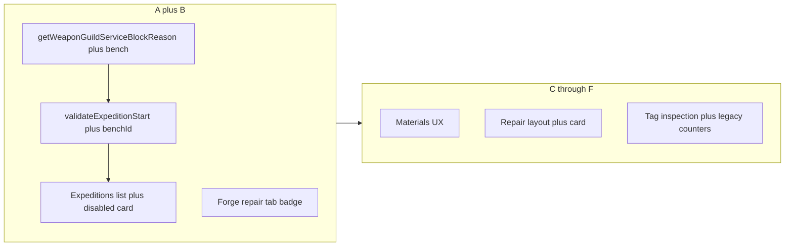

# План внедрения Repair UI/UX (по §6 спеки)

## Контекст

- **Источник правды по блокировке:** расширить [src/lib/guild-weapon-service-eligibility.ts](src/lib/guild-weapon-service-eligibility.ts) — сейчас `getWeaponGuildServiceBlockReason(weapon)` не знает про [repairBenchWeaponId](src/store/slices/craft-slice.ts).
- **Валидация экспедиции:** [src/lib/expedition-start-validation.ts](src/lib/expedition-start-validation.ts) вызывает eligibility без `repairBenchWeaponId`; [src/store/cross-slice/guild-expedition-cross-slice.ts](src/store/cross-slice/guild-expedition-cross-slice.ts) передаёт в `validateExpeditionStart` только поля без верстака.
- **Заказы NPC:** [src/store/cross-slice/order-cross-slice.ts](src/store/cross-slice/order-cross-slice.ts) — тот же вызов; нужно прокинуть `repairBenchWeaponId` из `get()`.
- **Гильдия UI:** [src/components/guild/expeditions-section.tsx](src/components/guild/expeditions-section.tsx) строит `availableWeapons` фильтром и не показывает клинок на верстаке, если он отфильтрован (например низкая прочность); [WeaponSelectionCard](src/components/guild/expeditions/WeaponSelectionCard.tsx) уже поддерживает `canSelect` / `reason` — расширить под «На ремонте».
- **Кузница:** [src/components/screens/forge-screen.tsx](src/components/screens/forge-screen.tsx) — добавить бейдж на вкладку «Ремонт» при `repairBenchWeaponId != null`.

---

## Этап A — Правила (без крупного UI)

1. **Сигнатура eligibility** — добавить второй аргумент, например `repairBenchWeaponId: string | null` (или опциональный объект опций), и **первым приоритетом** возвращать причину, если `weapon.id === repairBenchWeaponId`. Текст — согласованный с §4 спеки.
2. `**validateExpeditionStart`** — расширить [ValidateExpeditionStartInput](src/lib/expedition-start-validation.ts) полем `repairBenchWeaponId: string | null`; передавать его в `getWeaponGuildGuildServiceBlockReason` (исправить опечатку в имени при реализации — имя функции без дубля «Guild»).
3. **Store** — в `startExpeditionFull` передавать `state.repairBenchWeaponId` в `validateExpeditionStart`. В `completeOrder` / экшен заказа — передавать `repairBenchWeaponId` в eligibility.
4. **UI экспедиции** — все вызовы `validateExpeditionStart` в [expeditions-section.tsx](src/components/guild/expeditions-section.tsx) (useMemo `expeditionLaunchCheck`) дополнить `repairBenchWeaponId` из стора.
5. **Тесты** — [guild-weapon-service-eligibility.test.ts](src/lib/guild-weapon-service-eligibility.test.ts): кейс «id совпадает с верстаком»; [expedition-start-validation.test.ts](src/lib/expedition-start-validation.test.ts): отказ при `repairBenchWeaponId === weapon.id`.

**§9.3:** отдельную ветку под «тип миссии» не добавлять — только общие правила (уже так).

---

## Этап B — Бейдж «Ремонт» и список оружия в гильдии

1. **[forge-screen.tsx](src/components/screens/forge-screen.tsx)** — на кнопке вкладки «Ремонт» при `repairBenchWeaponId` показать `Badge` с `1` (как у «Инвентарь»).
2. **Список для отображения** — вместо узкого `availableWeapons` собрать список оружия для грида:
  - базово: как сейчас (прочность, не в экспедиции, атака ≥ min при выбранной экспедиции);
  - **если** `repairBenchWeaponId` указывает на клинок, **отсутствующий** в этом списке (отфильтрован), **добавить** его отдельно с флагом `isOnRepairBench: true` и `canSelect: false`.
  - для всех оружий с `weapon.id === repairBenchWeaponId`: `canSelect: false`, причина из eligibility (тот же текст).
3. **[WeaponSelectionCard](src/components/guild/expeditions/WeaponSelectionCard.tsx)** — при `!canSelect`: `cursor-not-allowed`, не вызывать `onSelect`; опционально бейдж «На ремонте» и `Tooltip` / `aria-describedby` с `reason`; визуально приглушить сильнее причине «на ремонте» (отдельный от низкой прочности стиль по желанию).
4. **canSelectWeapon** — учесть верстак (или опираться на общий helper с eligibility).

Проверить [recruitment-interface](src/components/guild/recruitment-interface.tsx) на выбор оружия; при наличии — тот же паттерн или явный комментарий «out of scope».

---

## Этап C — Материалы «как в крафте»

Файлы: [src/components/ui/repair-card.tsx](src/components/ui/repair-card.tsx), [src/lib/store-utils/repair-utils.ts](src/lib/store-utils/repair-utils.ts), навигация к крафту — паттерны из [CraftContainerV2](src/components/forge/craft-v2) / `navigateToForgeTab`.

- Таблица «нужно / есть» по `resolveWeaponRepairPlanEconomy` + `buildWeaponRepairPlan`.
- Кнопка перехода к крафту недостающего ресурса (если в проекте уже есть аналог).
- Чекбокс закупки только для ресурсов из магазина; иначе короткая строка про добычу.
- Кнопка «Начать ремонт» активна только при закрытой экономике или валидной закупке.

---

## Этап D — Каноничная карточка и layout

Файлы: [repair-section.tsx](src/components/forge/repair-section.tsx), [repair-card.tsx](src/components/ui/repair-card.tsx), [weapon-inventory-card.tsx](src/components/forge/weapon-inventory-card.tsx).

- Сетка: слева карточка как в инвентаре (общая оболочка или `variant="repairBench"`), справа панель осмотра/техник (пока можно заглушку до E).
- Мобильный: зафиксировать один вариант из §5 спеки в worklog.

---

## Этап E — Осмотр по тегам + §9.2 UI

1. **Данные** — новый модуль опций осмотра (например `damage-tag-inspection-options.ts`) по §2 спеки.
2. **UI** — кликабельные теги, панель 2–3 вариантов, фидбек, привязка к `getApplicableRepairTechniquesForTags`.
3. **Убрать из первой линии** «Осмотреть глубже»; **авто-ремонт** — оставить в коде, вынести в сворачиваемый блок «Дополнительно» ([§9.2](docs/systems/REPAIR_UI_UX_REDESIGN_SPEC.md)).

**§9.1 — скрытый учёт** — при успешном ремонте, снимающем тег:

- инкремент счётчика по `tagId` (структура на [WeaponLegacy](src/types/weapon-repair.ts) / расширение рядом с `hiddenMarks` в [weapon-legacy.ts](src/lib/weapon-damage/weapon-legacy.ts));
- архив снятых тегов не терять при обновлении `activeDamageTags`.

Логику инкремента вешать на существующий cross-slice ремонта (например [repair-cross-slice](src/store/cross-slice/repair-cross-slice.ts)), не дублировать в UI.

---

## Этап F — Закрытие

- Тесты: персист счётчиков §9.1, загрузка сохранения; при необходимости — компонентный сценарий для disabled-карточки.
- Документация типов: [docs/04_TYPES_SYSTEM.md](docs/04_TYPES_SYSTEM.md); [cloud-save-feature.ts](src/lib/cloud-save-feature.ts) / API при новых полях оружия.
- Бэклог: тикет «разблокировка авто-ремонта по прокачке» (§9.2).
- `npm run lint`, `npm run test`, `npm run build`.

---

## Рекомендуемый порядок работ в спринте

1. **Сначала A+B** — закрывает эксплойт и соответствует спеке по гильдии/кузнице; быстрый smoke.
2. Затем **C** (качество жизни ремонта), параллельно можно начинать **D** после B.
3. **E** — самый объёмный (контент + UI + §9.1); разбить на под-PR при необходимости (сначала данные + счётчики, потом UI осмотра).

## Риски

- **Облако:** любые новые поля оружия — строго по чеклисту Turso/Zod.
- **Список гильдии:** краевой случай — меч на верстаке с прочностью ≤10; этап B явно добавляет такой клинок в отображение.

