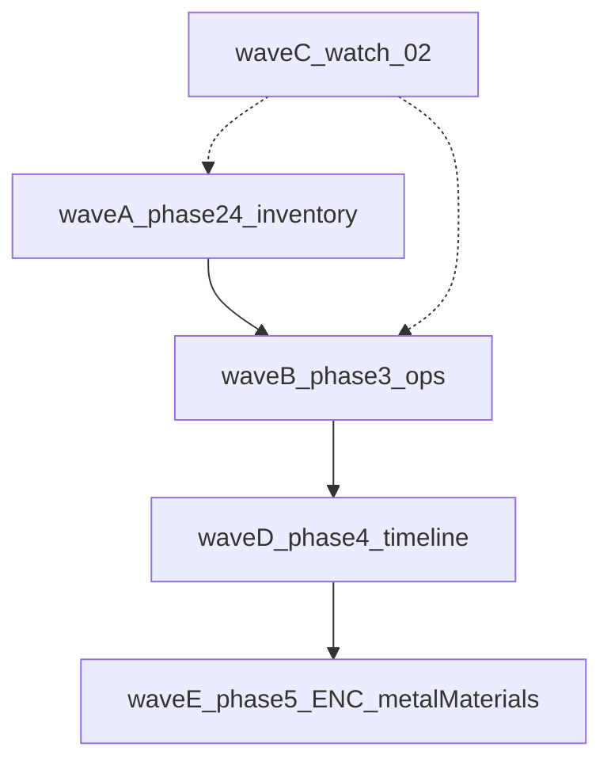

# План дальше по дорожной карте материалов

Опора: [docs/MATERIALS_SINGLE_SOURCE_ROADMAP.md](docs/MATERIALS_SINGLE_SOURCE_ROADMAP.md) (**§7** пакеты, **§8.5** инструменты, **§3.6** пересечения, **§12** очередь). От карты не отклоняемся: не смешивать фазу **5** (ENC / `metalMaterials`) с незакрытой **2.4** и богатым **3.x** в одном «бог-модуле».

---

## Волна A — закрытие **фазы 2**, пакет **2.4**

**Цель по карте:** «сверка `inventory-check` с реестром; удаление временных таблиц … после волны» (**§7**, пакет **2.4**).

1. **Аудит + поднабор:** опираться на [a2-phase24-bridge-audit.ts](src/lib/craft/a2-phase24-bridge-audit.ts); выбрать первый согласованный набор строк/веток в [inventory-check.ts](src/lib/craft/inventory-check.ts) (`CORE_MATERIAL_TO_RESOURCE`, дубликаты с [world-resource-inventory-bridge.ts](src/lib/materials/world-resource-inventory-bridge.ts), при необходимости узкие правки `applyCraftingCostSpend`).
2. **Критерии мержа:** зелёные [inventory-check.test.ts](src/lib/craft/inventory-check.test.ts), [resources-stash-debit.test.ts](src/store/resources-stash-debit.test.ts), [material-catalog-contract.ts](src/lib/materials/material-catalog-contract.ts). Отчёт **§8.2** по scope волны без новых `error`.
3. **Persist:** новый `STORE_VERSION` только если меняется инвариант сейва; иначе идемпотентный sweep **v30** может остаться достаточным (**§12**). При bump — [cloud-save-feature.ts](src/lib/cloud-save-feature.ts).
4. **Документация:** строка **§11**; обновить **§12** «что осталось по 2.4»; [RESOURCE_TRANSFORMATION_MAP.md](docs/RESOURCE_TRANSFORMATION_MAP.md) — **только** если меняются id цепочек.
5. **Смоук:** чеклист **§12** / **§3.6** после значимого diff склада.

Чеклист PR по желанию: [.cursor/skills/materials-a2-wave/SKILL.md](.cursor/skills/materials-a2-wave/SKILL.md).

---

## Волна B — **фаза 3** (техники и операции)

**Уже есть:** **3.1** эталон + **3.2** первая пачка (**§11**).

1. **3.2 (продолжение):** пакетами **3–5** техник дописать `processingOperations` в [material-processing-techniques.ts](src/data/material-processing-techniques.ts); валидатор [material-processing-techniques-operations.test.ts](src/data/material-processing-techniques-operations.test.ts). Оставшиеся: сталь/золото/мифрил, дерево/камень/кожа (как в реестре техник), без big-bang.
2. **3.3:** по карте — ослабить зависимость от `refiningRecipeId` у **части** техник, синхронизировать с горном ([refining-recipes.ts](src/data/refining-recipes.ts), [game-store-composed / completeRefining](src/store/game-store-composed.ts)); отдельный PR.
3. **3.4:** универсальные техники через **теги/роли** ([MATERIAL_SEMANTIC_PROCESS_ROLES.md](docs/MATERIAL_SEMANTIC_PROCESS_ROLES.md)) вместо длинных `targetCatalogMaterialIds` где уместно; контракт **I/O ⊆ реестр**.
4. **Связка с рантаймом:** точечно [process-generator.ts](src/lib/craft/process-generator.ts) — как в **§7.0** «один смысл на PR»; при смене поведения — [CRAFT_SYSTEM_ROADMAP.md](docs/systems/CRAFT_SYSTEM_ROADMAP.md) и смоук **§3.6** (крафт с обработкой).

Волна **B** не смешивать с крупным diff **2.4** в одном PR.

---

## Волна C — **наблюдение 0.2**

По **§7** пакет **0.2** и [repair-system.ts](src/data/repair-system.ts) / данные перековки: **новый сканер** в [material-catalog-contract.ts](src/lib/materials/material-catalog-contract.ts) — **только** при появлении явных `materialId` в этих данных; иначе не расширять scope.

---

## Волна D — **фаза 4** (таймлайн крафта)

Старт **после** устойчивой **3.2** (и по возможности задела **3.3**), в порядке **§7**:

- **4.1** — контракт «план → список этапов» (типы + документ).
- **4.2** — обработка в композицию (операции уже в данных).
- **4.3** — боевые техники и снятие лишних веток `stageType`.

---

## Волна E — **фаза 5** (ENC, баланс, чистка)

Только когда **2.x** и **3.x** не блокируют экономику и контракт.

| Пакет | Содержание (из §7) |
|-------|-------------------|
| **5.1** | ENC: группы, сортировка, «как получить», обратный индекс техник — **здесь** наведение порядка в подаче стадий (руда/слиток и т.д.) без нарушения **один `materialId` = один узел**. |
| **5.2** | `metalMaterials` / [metals.ts](src/data/materials/metals.ts) — слияние с каталогом пакетами. |
| **5.3** | Удаление bridge / [inventory-mapped-legacy-nodes](src/data/materials/library/bridge/inventory-mapped-legacy-nodes.ts) и т.п. — по одному модулю на PR при большом диффе. |
| **5.4** | forbidden-imports, финальный контракт **§8.2**, актуализация [RESOURCE_TRANSFORMATION_MAP.md](docs/RESOURCE_TRANSFORMATION_MAP.md), [MATERIALS_ADDING.md](docs/data/MATERIALS_ADDING.md) → ссылка на этот roadmap. |

---

## Попутно по карте

- **§10:** отмечать `[x]` только по факту закрытия в коде (как недавно для лавки / `ResourceBar`).
- **§11:** одна строка на каждый значимый пакет.
- **§9.1 / §6:** без «вечных» мостов; миграции — только пока удобно до релиза.

