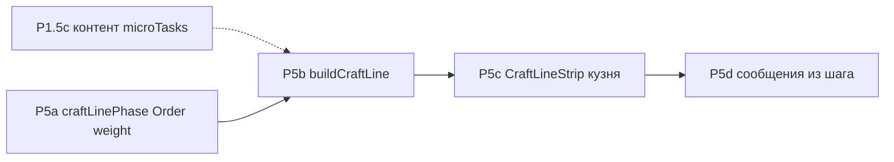

# План: Крафтовая линия (фаза P5) по ENC roadmap

## Контекст (уже есть в репозитории)

- Черновик порядка этапов: [`src/lib/craft/timeline-composition.ts`](src/lib/craft/timeline-composition.ts) (`CraftTimelineStageRef`, `CraftTimelinePlanDraft`, вставки из `processingOperations`, зеркало `processMods`).
- Исполняемые этапы крафта: [`src/lib/craft/process-generator.ts`](src/lib/craft/process-generator.ts) → `CraftStageInstance[]`.
- UI прогресса по **этапам рецепта**: [`src/components/forge/craft-v2/craft-progress.tsx`](src/components/forge/craft-v2/craft-progress.tsx) (категории, полоски по `CraftStageInstance`).
- Микрозадачи для ENC и нормализация шагов: [`src/lib/encyclopedia/expand-technique-display-steps.ts`](src/lib/encyclopedia/expand-technique-display-steps.ts), тип [`TechniqueMicroTask`](src/types/encyclopedia-techniques.ts).

Цель P5 — не заменить `process-generator` одним коммитом, а **добавить слой «Крафтовая линия»** (§12): блок = техника, подсегменты = микрозадачи, доли времени, порядок по **фазам линии** (§12.3), затем UI и сообщения (§10.4 п.6).

## Параллельно (не блокирует код P5b)

- **P1.5c:** поэтапное заполнение `microTasks` (и при необходимости `durationWeight`) в данных; мелкие PR. Чем богаче данные, тем осмысленнее полоса и тесты «плавка → ковка».

## P5a — данные порядка и веса (roadmap таблица §4, §12.3)

1. **Типы фазы линии** — зафиксировать enum/union в [`src/types/`](src/types/) (имена из §12.3: например `material_preparation` → `recipe_forming` → `craft_finishing`; финальные строки — одно место в `types/`, ссылка из [`docs/04_TYPES_SYSTEM.md`](docs/04_TYPES_SYSTEM.md) при необходимости).
2. **Поля на техниках:**
   - На боевых [`Technique`](src/types/craft-v2.ts) / данных [`src/data/techniques`](src/data/techniques): `craftLinePhase`, опционально `craftLineOrder`.
   - На [`MaterialProcessingTechnique`](src/data/material-processing-techniques.ts): то же; дефолты в коде сборки = фаза подготовки материала.
3. **Расширить [`TechniqueMicroTask`](src/types/encyclopedia-techniques.ts)** опциональным `durationWeight` (§10.2 «позже durationWeight» + таблица P5a).
4. **Дефолты:** для существующих записей — выставить фазы/порядок так, чтобы без ручного заполнения сохранялся текущий смысловой порядок (обработка раньше приёмов ковки); зафиксировать в unit-тесте «типовой план» (§12.3 валидация в roadmap).
5. **Согласовать с** [`docs/utils/FORMULAS.md`](docs/utils/FORMULAS.md) при появлении новых полей, влияющих на длительность/доли (кратко, без дублирования ENC).

## P5b — `buildCraftLine` и согласование с таймлайном

1. **Модель сегмента** §12.4: ввести `CraftLineSegment` (поля: `techniqueRef`, `microTaskIndex`, `durationShare`, `colorToken`, `label` — минимум из roadmap; при необходимости узкие расширения для привязки к `CraftStageInstance` / `stageType`).
2. **Реализовать** `buildCraftLine(...)` в [`src/lib/craft/`](src/lib/craft/) (новый модуль, напрямую рядом с `timeline-composition.ts` / `process-generator.ts`):  
   - вход: контекст плана (рецепт, выбранные техники обработки и ковки, уже согласованный порядок этапов или мост из `generateCraftStages`);  
   - упорядочивание блоков: `craftLinePhase` → `craftLineOrder` → стабильный тай-брейк по id (§12.3);  
   - внутри блока: микрозадачи из `expandTechniqueToDisplaySteps` или явные `microTasks`; **нормализация долей** так, чтобы сумма `durationShare` по всем микроэтапам линии = 1 (§12.1, P5b).
3. **Связь с существующим кодом:** не ломать `generateCraftStages` с первого PR; на первом шаге P5b допустимо строить линию **параллельно** (для UI/тестов), затем сузить дублирование с `process-generator` (как в §10.4: одна трассируемая цепочка).
4. **Тесты (Vitest):**  
   - сумма долей = 1;  
   - сценарий «плавка/обработка перед приёмом ковки» (§12.3);  
   - снапшот или контрактное количество сегментов для фиксированного фикстурного плана (см. риск про рассинхрон в §4.1 roadmap).

## P5c — UI полосы в кузне

1. **Общий компонент** (roadmap §6 / §12.2): например [`src/components/shared/process-line-view.tsx`](src/components/shared/process-line-view.tsx) или [`src/components/forge/craft-v2/CraftLineStrip.tsx`](src/components/forge/craft-v2/CraftLineStrip.tsx) — один источник сегментов + текущий индекс/прогресс.
2. **Интеграция в Craft v2:** подключить к [`craft-container.tsx`](src/components/forge/craft-v2/craft-container.tsx) / рядом с [`craft-progress.tsx`](src/components/forge/craft-v2/craft-progress.tsx): сначала **дополняющий** показ (полоса по `buildCraftLine`), без немедленного удаления текущего списка этапов — до стабилизации; затем при желании слить визуальную иерархию.
3. **A11y:** не только цвет — порядковый номер / `aria-label` для активного подсегмента (как в §4.1 риски ENC).

## P5d — сообщения прогресса

1. Точка сборки текста из **текущей микрозадачи** (label + шаблон с частью/материалом) — [`src/hooks/use-craft-v2.ts`](src/hooks/use-craft-v2.ts) и/или места, где сейчас `startMessage` / хардкод (§10.6).
2. Инвентаризация дублей строк; поэтапный deprecation параллельных списков фраз для **основного** потока крафта (критерий §10.6).

## Вне первой волны P5 (явно по roadmap)

- **Ремонт, перековка, алтарь** — тот же контракт `CraftLineSegment` / компонент полосы, отдельные PR-волны после кузни (§12.2, §6 roadmap).
- **Облако / persist:** новые поля прогресса по микрозадачам — только после согласования с [`src/lib/cloud-save-feature.ts`](src/lib/cloud-save-feature.ts) и материаловым roadmap (§3.6 MSS), если понадобится сохранять субэтап.

## Критерий готовности волны

- P5a: типы и дефолты в данных не ломают существующий крафт; тест на порядок фаз.
- P5b: `buildCraftLine` + тесты долей и порядка.
- P5c: полоса видна в кузне на типовой сборке.
- P5d: хотя бы один путь прогресса берёт подпись из активной микрозадачи; список хардкода для этого пути сокращён или помечен deprecated.
