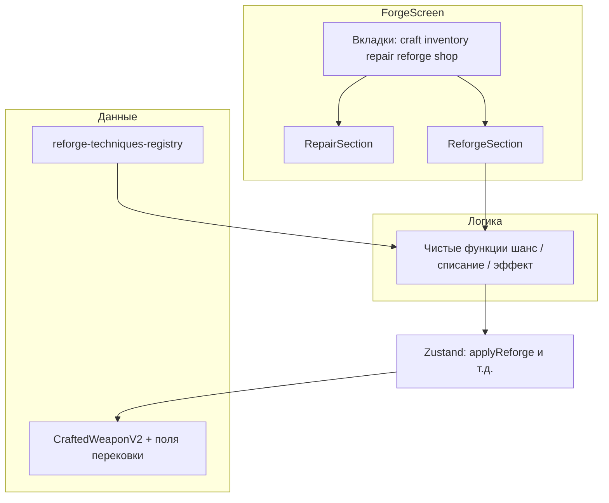

# Перековка: документация и план внедрения

## 1. Правки документации (переименование и размещение)

**Цель терминологии:** везде, где сейчас фигурирует рабочее имя «Горн душ», заменить на **«Перековка»**; убрать формулировки про блок «под ремонтом» / «в карточке ремонта» как единственное место.

**Файлы для правки (поиск по строкам `Горн`, `горн`, при необходимости `reforge` в заголовках):**

- [docs/systems/ENCHANTMENT_MODULE_PHASE1.md](docs/systems/ENCHANTMENT_MODULE_PHASE1.md) — заголовок, §1.2, §2 scope, §3.1, §5.2, worklog, критерии.
- [docs/systems/ENCHANTMENT_AWAKENING_CONCEPT.md](docs/systems/ENCHANTMENT_AWAKENING_CONCEPT.md) — вводный абзац, терминология, «Разблокировка», цепочка прогрессии, «Пре-зачарование (до алтаря)», часть VIII (фаза 1).
- [docs/systems/ENCHANTMENT_MODULE_PHASE1_GAME_DESIGN_TZ.md](docs/systems/ENCHANTMENT_MODULE_PHASE1_GAME_DESIGN_TZ.md) — если там остались «Горн душ» / старый user flow (блок под ремонтом).

**Новая каноническая формулировка размещения UI:**

- **Кузница** → основные вкладки: … → **Ремонт** → **Перековка** → … (следующая после «Ремонт» — сейчас это «Магазин»; **«Перековка» вставляется между «Ремонт» и «Магазин»**, чтобы соответствовать запросу «после Ремонт»).

Дополнительно в [ENCHANTMENT_MODULE_PHASE1.md](docs/systems/ENCHANTMENT_MODULE_PHASE1.md) коротко описать соответствие коду: вкладка = новое значение `ForgeMainTab`, контент = новый `ReforgeSection` (см. ниже).

---

## 2. Архитектура внедрения в коде

### Этап A — Навигация кузницы

| Шаг | Действие |
|-----|----------|
| A1 | Расширить тип `ForgeMainTab` в [src/store/game-store-composed.ts](src/store/game-store-composed.ts): добавить `'reforge'`. Обновить `navigateToForgeTab`, persist merge default, экспорт в [src/store/index.ts](src/store/index.ts). |
| A2 | В [src/components/screens/forge-screen.tsx](src/components/screens/forge-screen.tsx): кнопка вкладки «Перековка» **после** «Ремонт», **перед** «Магазин»; иконка (например `Hammer` / `Sparkles` из `lucide-react`); ветка контента `mainTab === 'reforge' ? <ReforgeSection />`. |
| A3 | Создать [src/components/forge/reforge-section.tsx](src/components/forge/reforge-section.tsx) — контейнер по аналогии с [repair-section.tsx](src/components/forge/repair-section.tsx): выбор оружия с верстака, заглушка или полный UI. |

**Выбор оружия:** минимально — **тот же** `repairBenchWeaponId`, что и для ремонта (игрок ставит клинок на верстак во вкладке «Ремонт», переключается на «Перековку» с тем же id). Опционально позже: переименовать в коде в нейтральное `forgeBenchWeaponId` одним PR (не обязательно в первой итерации).

### Этап B — Данные и типы

| Шаг | Действие |
|-----|----------|
| B1 | Новый модуль реестра, например [src/data/reforge/reforge-techniques-registry.ts](src/data/reforge/reforge-techniques-registry.ts) (или `weapon-reforge/`): записи с `id`, `reforgeType: 'awakenScar' \| 'buffStat'`, условия разблокировки, ссылка `sourceCraftTechniqueId?`, стоимость/лестница (как данные), диапазоны для buff. |
| B2 | Типы в [src/types/](src/types/) — расширение экземпляра: флаг успешного пробуждения шрама перековкой, счётчики/суммы buff, пометки по шрамам (`awakened` на записи шрама — если модель шрамов уже есть; иначе временная структура). Синхронизация с [docs/04_TYPES_SYSTEM.md](docs/04_TYPES_SYSTEM.md). |
| B3 | [src/lib/save-payload-schema.ts](src/lib/save-payload-schema.ts), [src/lib/cloud-save-feature.ts](src/lib/cloud-save-feature.ts) — новые поля оружия. |

### Этап C — Чистая логика

| Шаг | Действие |
|-----|----------|
| C1 | Модуль [src/lib/reforge/](src/lib/reforge/) (имя на усмотрение): `canApplyReforge`, расчёт шанса для `awakenScar`, списание `warSoul`, пересчёт тира души (использовать существующие хелперы из [src/data/war-soul-tiers.ts](src/data/war-soul-tiers.ts) при необходимости), применение buff к атаке/max прочности. |
| C2 | Unit-тесты рядом: `*.test.ts` — успех/неудача awaken, лимиты buff, недостаточно души, нет шрамов. |

### Этап D — Store и UI перековки

| Шаг | Действие |
|-----|----------|
| D1 | Action в [game-store-composed.ts](src/store/game-store-composed.ts) или cross-slice [src/store/cross-slice/](src/store/cross-slice/): `applyReforgeTechnique(weaponId, techniqueId)` с вызовом чистой логики и обновлением инвентаря. |
| D2 | Компонент карточки перековки (например `reforge-card.tsx` в `components/forge/` или `components/ui/`): список техник, состояния (заблокировано, мало души, шанс %, счётчик buff), тосты, кнопки подтверждения по геймдизайну. |
| D3 | Убедиться, что **RepairCard** не раздувается: перековка **не** встраивается в [repair-card.tsx](src/components/ui/repair-card.tsx), а живёт на вкладке «Перековка». |

### Этап E — Гейт экрана «Зачарования»

| Шаг | Действие |
|-----|----------|
| E1 | Хелпер доступа к tier-2 / `getAvailableLocations` — один источник правды. |
| E2 | [src/components/screens/altar-screen.tsx](src/components/screens/altar-screen.tsx): замок + плейсхолдер после открытия (по [ENCHANTMENT_MODULE_PHASE1.md](docs/systems/ENCHANTMENT_MODULE_PHASE1.md)). |

### Этап F — Зависимость от шрамов

- Если на экземпляре **ещё нет** полей шрамов в сохранении — техники `awakenScar` показывать отключёнными с тултипом «Нет шрамов» или скрывать до готовности данных.
- Координация с платформой стихий / [ELEMENTAL_PLATFORM_IMPLEMENTATION.md](docs/systems/ELEMENTAL_PLATFORM_IMPLEMENTATION.md) — отдельная подзадача, не блокирует вкладку и buff-перековку.

---

## 3. Порядок работ (рекомендуемый)

1. **Документация** — переименование и вкладка (быстро, снимает расхождение с продуктом).
2. **A1–A3** — вкладка + пустой `ReforgeSection` с текстом «в разработке» или минимальным списком (вертикальная нарезка).
3. **B1–B2 + C1** — реестр-заглушка + одна техника `buffStat` без шрамов (быстрый вертикальный срез).
4. **D1–D2** — связка store + UI.
5. **B3** — сейв.
6. **C2** — тесты.
7. **awakenScar + шанс** — после появления/стабилизации данных шрамов на оружии.
8. **E** — гейт алтаря параллельно или после первого рабочего buff-потока.

---

## 4. Риски и решения

- **Два смысла «пробуждение»:** в UI и типах различать перековку шрама и миссию пробуждения древа (имена полей/копирайт) — уже зафиксировано в каноне.
- **Порядок вкладок:** «Магазин» сдвигается вправо; проверить мобильный `overflow-x-auto` — новая вкладка не должна ломать вёрстку.
