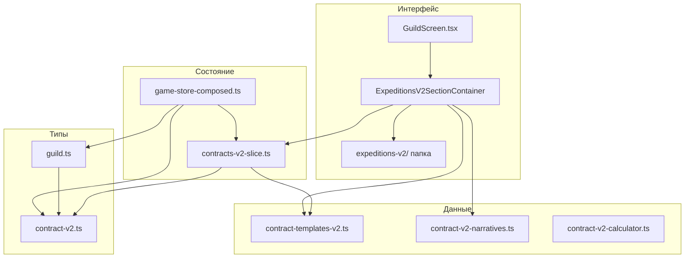

---
todos:
  - id: "1"
    content: "Удалить вкладку из GuildScreen.tsx"
  - id: "2"
    content: "Удалить папку компонентов expeditions-v2"
  - id: "3"
    content: "Удалить контейнер ExpeditionsV2SectionContainer"
  - id: "4"
    content: "Удалить slice contracts-v2-slice.ts"
  - id: "5"
    content: "Очистить импорты из game-store-composed.ts"
  - id: "6"
    content: "Удалить contractsV2 из GuildState в guild.ts"
  - id: "7"
    content: "Удалить типы contract-v2.ts"
  - id: "8"
    content: "Удалить данные contract-templates-v2.ts и narratives"
  - id: "9"
    content: "Удалить утилиту contract-v2-calculator.ts"
---

# Полное удаление системы Экспедиции v2

## Обзор

Полностью удалить систему "Экспедиции v2" (Трёхсторонний контракт) из проекта, включая все компоненты, типы, store и данные.

---

## Файлы для удаления

### Компоненты (папка целиком)
- `src/components/guild/expeditions-v2/` — 9 файлов

### Контейнер
- `src/components/guild/containers/ExpeditionsV2SectionContainer.tsx`

### Store
- `src/store/slices/contracts-v2-slice.ts`

### Типы
- `src/types/contract-v2.ts`

### Данные
- `src/data/contract-templates-v2.ts`
- `src/data/contract-v2-narratives.ts`

### Утилиты
- `src/lib/contract-v2-calculator.ts`

---

## Файлы для изменения

### 1. `src/components/guild/GuildScreen.tsx`
- Удалить импорт `ExpeditionsV2SectionContainer` (строка 14)
- Удалить иконку `Sparkles` из lucide-react (строка 9)
- Изменить `grid-cols-5` на `grid-cols-4` (строка 156)
- Удалить `TabsTrigger` для `expeditions-v2` (строки 165-169)
- Удалить `TabsContent` для `expeditions-v2` (строки 188-190)

### 2. `src/store/game-store-composed.ts`
- Удалить импорт `createContractsV2Slice` (строка 154)
- Удалить импорт `ContractsV2Actions` (строка 155)
- Удалить импорт `ContractsV2State` (строка 156)
- Удалить spread `...createContractsV2Slice()` (строка 357)
- Удалить `contractsV2: ContractsV2State` из `CrossSliceActions` (строка 252)
- Удалить `& ContractsV2Actions` из типа `GameStore` (строка 323)
- Удалить мерж `contractsV2` в функции `merge` (строки 1450-1454)

### 3. `src/types/guild.ts`
- Удалить импорт `ContractsV2State` (строка 10)
- Удалить импорт `initialContractsV2State` (строка 11)
- Удалить поле `contractsV2` из интерфейса `GuildState` (строки 160-161)
- Удалить `contractsV2` из `initialGuildState` (строка 318)

---

## Диаграмма зависимостей

---

## Порядок удаления

1. Удалить вкладку из `GuildScreen.tsx` (чтобы не было ссылок на удаляемые файлы)
2. Удалить папку `src/components/guild/expeditions-v2/`
3. Удалить `ExpeditionsV2SectionContainer.tsx`
4. Очистить `game-store-composed.ts` от импортов и использования slice
5. Удалить `contracts-v2-slice.ts`
6. Очистить `guild.ts` от поля `contractsV2`
7. Удалить `contract-v2.ts`
8. Удалить `contract-templates-v2.ts` и `contract-v2-narratives.ts`
9. Удалить `contract-v2-calculator.ts`
