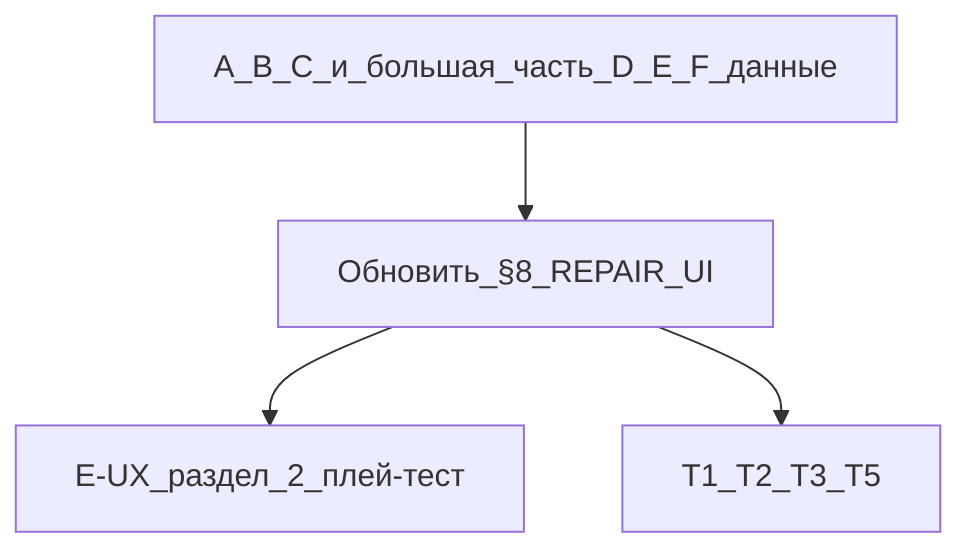

# План: разбить §8 и зафиксировать оставшуюся работу

## Что уже сделано (проверка кода — не повторять)

### Этап A (правила гильдии / эксплойты)

- `[getWeaponGuildServiceBlockReason](src/lib/guild-weapon-service-eligibility.ts)` принимает `repairBenchWeaponId`; блокировка «на верстаке» с единым текстом.
- Проброс в `[expedition-start-validation.ts](src/lib/expedition-start-validation.ts)`, `[order-cross-slice.ts](src/store/cross-slice/order-cross-slice.ts)`, UI гильдии `[expeditions-section.tsx](src/components/guild/expeditions-section.tsx)` (`canSelectWeapon`, `displayWeapons`).
- Тесты: `[guild-weapon-service-eligibility.test.ts](src/lib/guild-weapon-service-eligibility.test.ts)` (кейс верстака), `[expedition-start-validation.test.ts](src/lib/expedition-start-validation.test.ts)` (repairBench в контексте).
- **§9.3:** отдельной ветки под PvE нет — соответствует спеке.

### Этап B (видимость «в ремонте»)

- Бейдж вкладки «Ремонт»: `[forge-screen.tsx](src/components/screens/forge-screen.tsx)` — при `repairBenchWeaponId != null` показывается индикатор (как у инвентаря).
- Список в гильдии: `displayWeapons` добавляет клинок на верстаке; `[WeaponSelectionCard](src/components/guild/expeditions/WeaponSelectionCard.tsx)` — `isRepairBench`, бейдж «На ремонте», `aria-disabled={!canSelect}`, `title` с причиной.
- `[recruitment-interface.tsx](src/components/guild/recruitment-interface.tsx)` — **не** выбирает оружие (оружие приходит пропом); отдельная проверка верстака **не требуется** по смыслу этапа B в §6.

### Этап C (материалы «как в крафте»)

- В `[repair-card.tsx](src/components/ui/repair-card.tsx)`: `buildWeaponRepairPlan` / `resolveWeaponRepairPlanEconomy`, таблица «есть / нужно», сообщение про недоступные в магазине ресурсы, чекбокс «Закупить недостающее», кнопка «Перейти к крафту / переработке» (`navigateToForgeTab('craft')`).

### Этап D (карточка и layout)

- Верстак: `[repair-section.tsx](src/components/forge/repair-section.tsx)` + `[WeaponInventoryCard](src/components/forge/weapon-inventory-card.tsx)` `context="repairBench"` + `[repair-card](src/components/ui/repair-card.tsx)`.
- Worklog **2026-04-05**: порядок блоков на карточке оружия и вёрстка repair-card (автоподбор, «Отключить автоподбор»).

### Разделение E: что закрыто отдельно

| Подпункт          | Суть                                                                                   | Статус                                                                                                                                             |
| ----------------- | -------------------------------------------------------------------------------------- | -------------------------------------------------------------------------------------------------------------------------------------------------- |
| **E-§9.2**        | Авто-ремонт не в первой линии, золото, автоподбор f(attack), эпика под «Дополнительно» | **Готово** (worklog 2026-04-04/05 + [REPAIR_TECH_DEBT §7](docs/systems/REPAIR_TECH_DEBT_AND_BALANCE_PLAN.md))                                      |
| **E-§9.1 данные** | `repairResolveCountByTagId`, `archivedDamageTagIds`                                    | **Готово** в `[repair-cross-slice.ts](src/store/cross-slice/repair-cross-slice.ts)` + `[weapon-legacy.ts](src/lib/weapon-damage/weapon-legacy.ts)` |
| **E-§9.1.1**      | `repairDiagnosis*CountByTagId`, `RepairDiagnosisTier`                                  | **Готово** + unit-тест в `[repair-cross-slice.test.ts](src/store/cross-slice/repair-cross-slice.test.ts)`                                          |
| **E-UX §2**       | Плей-тест: осмотр не должен дублировать блок техник; выбор направлений из таблицы §2   | **Не закрыто** — итерация дизайна/контента, не «ещё раз внедрить MVP осмотра» (клик по тегу и гипотезы уже есть в `repair-card`)                   |

### Этап F

- Типы и описание полей: `[docs/04_TYPES_SYSTEM.md](docs/04_TYPES_SYSTEM.md)` (строка про `WeaponLegacy` и §9.1/§9.1.1).
- `[cloud-save-feature.ts](src/lib/cloud-save-feature.ts)` перечисляет поля legacy для облака.
- **Не сделано как явный артефакт:** отдельный тикет «разблокировка авто-ремонта по прокачке» (§9.2) — только если ведёте внешний трекер; в репозитории достаточно строки в §8/§9.

### Техдолг из REPAIR_TECH_DEBT (вне закрытого §7)

- **T1** — рефакторинг таблиц риска в `repair-system.ts` при необходимости.
- **T2** — синхронизация UI ↔ store при смене ручной/автоподбор осмотра.
- **T3** — интеграционный тест «теги → осмотр → этапы → успех» + `weaponLegacy`.
- **T5** — расширение метрики мощности (сейчас атака в `[repair-balance.ts](src/lib/store-utils/repair-balance.ts)`).

---

## Работы по документу (единственное обязательное изменение в этой задаче)

1. **Переписать [REPAIR_UI_UX_REDESIGN_SPEC.md](docs/systems/REPAIR_UI_UX_REDESIGN_SPEC.md) §8** в виде вложенного чеклиста, например:
  - **A** — подпункты с [x] и ссылками на файлы/тесты.
  - **B** — [x], примечание про recruitment-interface.
  - **C** — [x], ссылка на блок материалов в `repair-card`.
  - **D** — [x] для текущего layout; опционально подпункт **[~] Мобильный вариант A/B/C зафиксирован в worklog §7** — либо отметить «канон = текущая вёрстка» одной строкой в worklog, либо оставить [ ] если продукт ждёт явного выбора.
  - **E** — разнести на **E-§9.2 [x]**, **E-§9.1 / §9.1.1 данные [x]**, **E-UX §2 (полировка осмотра) [ ]** с отсылкой к §2 «Плей-тест» и T2/T3.
  - **F** — [x] типы/облако-чеклист; [ ] T3 интеграционный тест; [ ] опционально компонентный тест disabled в гильдии; [ ] внешний тикет на разблокировку авто-ремонта (если нужен).
2. **Кратко обновить «Сводку §9 vs этапы»** в §6 (таблица ~стр. 301), если там этапы E/F описаны как «всё в одном E» — чтобы не противоречило новому §8.
3. **Не дублировать** правки в [DAMAGE_INVESTIGATION_AND_REPAIR_SYSTEM.md](docs/systems/DAMAGE_INVESTIGATION_AND_REPAIR_SYSTEM.md) и [REPAIR_TECH_DEBT_AND_BALANCE_PLAN.md](docs/systems/REPAIR_TECH_DEBT_AND_BALANCE_PLAN.md), кроме одной перекрёстной ссылки из REPAIR_UI («чеклист §8 синхронизирован с T1–T3»), если уместно в одну строку.

---

## Оставшаяся продуктово-инженерная работа (после правки дока — по приоритету)

1. **T3** — интеграционный тест полного цикла ремонта (см. REPAIR_TECH_DEBT).
2. **T2** — устранить расхождения техник / `lockedTechniqueIdsRef` при переключении режимов (по симптомам).
3. **E-UX §2** — выбрать 1–2 направления из таблицы §2 (риск, данные осмотра, режим «только техники») и внедрить итеративно; это **отдельный** объём от баланса §7.
4. **T5** — при смене дизайна «мощности клинка».
5. **T1** — по мере усложнения баланса RNG в `repair-system.ts`.

