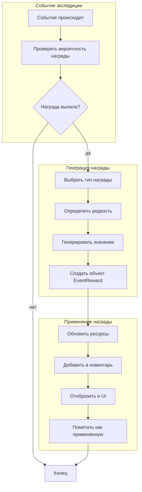

# Система наград событий экспедиций

## Обзор

Система наград событий экспедиций предназначена для добавления случайных наград во время выполнения экспедиций. Это добавляет глубины игрового процесса и мотивирует игроков следить за ходом экспедиций.

**Важное примечание**: Система сейчас находится в разработке. Основная логика реализована как заглушка - награды пока не генерируются и не выдаются.

## Архитектура

### Основные компоненты

```
┌─────────────────────────────────────────────────────────────┐
│                   Событие экспедиции                      │
│  (ExpeditionEvent)                                        │
│  ┌──────────────────────────────────────────────────────┐  │
│  │  • id, text, type, icon                         │  │
│  │  • triggeredAt (когда произойдёт)                 │  │
│  │  • rewards[] (массив наград)                     │  │
│  │  • rewardTriggered (применена ли награда)        │  │
│  └──────────────────────────────────────────────────────┘  │
└─────────────────────────────────────────────────────────────┘
                          ↓
┌─────────────────────────────────────────────────────────────┐
│            Генератор наград                            │
│  (expedition-reward-generator.ts)                        │
│  ┌──────────────────────────────────────────────────────┐  │
│  │  generateRandomRewards(event)                      │  │
│  │  • Определяет вероятность награды                │  │
│  │  • Выбирает тип награды                          │  │
│  │  • Определяет редкость                           │  │
│  │  • Генерирует значение                            │  │
│  └──────────────────────────────────────────────────────┘  │
└─────────────────────────────────────────────────────────────┘
                          ↓
┌─────────────────────────────────────────────────────────────┐
│                  Типы наград                            │
│  ┌──────────┬──────────────────┬──────────────────────┐ │
│  │ Тип      │ Пример          │ Редкость            │ │
│  ├──────────┼──────────────────┼──────────────────────┤ │
│  │ gold     │ 50 золота       │ common → legendary   │ │
│  │ warSoul  │ 5 душ войны    │ common → legendary   │ │
│  │ glory    │ 3 славы         │ common → legendary   │ │
│  │ essence  │ 2 эссенции      │ common → legendary   │ │
│  │ item     │ Меч огня       │ rare → legendary    │ │
│  │ material │ Железная руда   │ rare → epic        │ │
│  └──────────┴──────────────────┴──────────────────────┘ │
└─────────────────────────────────────────────────────────────┘
                          ↓
┌─────────────────────────────────────────────────────────────┐
│               Применение наград                          │
│  • Обновление ресурсов в store                          │
│  • Добавление предметов в инвентарь                     │
│  • Добавление материалов                                │
│  • Отображение в UI                                   │
└─────────────────────────────────────────────────────────────┘
```

### Поток данных



## Типы наград

### gold (Золото)

Базовый ресурс игры.

- **Common**: 5-20 золота
- **Rare**: 20-50 золота
- **Epic**: 50-100 золота
- **Legendary**: 100-250 золота

### warSoul (Души войны)

Ресурс для улучшения оружия.

- **Common**: 1-3 души
- **Rare**: 3-6 душ
- **Epic**: 6-12 душ
- **Legendary**: 12-25 душ

### glory (Слава)

Ресурс для повышения уровня гильдии.

- **Common**: 1-3 славы
- **Rare**: 3-6 славы
- **Epic**: 6-10 славы
- **Legendary**: 10-20 славы

### essence (Эссенция)

Редкий ресурс для создания.

- **Common**: 1-2 эссенции
- **Rare**: 2-4 эссенции
- **Epic**: 4-8 эссенции
- **Legendary**: 8-15 эссенции

### item (Предмет)

Оружие, броня, аксессуары.

- **Rare**: Обычное оружие/броня
- **Epic**: Улучшенное оружие/броня
- **Legendary**: Уникальное оружие/броня

ПРИМЕЧАНИЕ: Требует реализации системы инвентаря для предметов.

### material (Материал)

Материалы для создания оружия.

- **Rare**: Обычные материалы (железо, дерево)
- **Epic**: Редкие материалы (мифрил, обсидиан)

ПРИМЕЧАНИЕ: Требует реализации системы материалов.

## Вероятности наград

### По типу события

| Тип события | Вероятность награды |
|-------------|---------------------|
| combat      | 30%                 |
| discovery   | 50%                 |
| social      | 20%                 |
| travel      | 10%                 |
| danger      | 25%                 |
| rest        | 5%                  |
| mystery     | 40%                 |
| weather     | 15%                 |
| treasure    | 100%                |

### По редкости

| Редкость   | Вероятность |
|-----------|-------------|
| common    | 60%         |
| rare      | 25%         |
| epic      | 12%         |
| legendary | 3%          |

## Добавление новых наград

### 1. Добавление нового типа награды

В файле `src/types/expedition-events.ts`:

```typescript
export type EventRewardType =
  | 'gold'        // Золото
  | 'warSoul'     // Души войны
  | 'glory'       // Слава
  | 'item'        // Предмет
  | 'material'    // Материал
  | 'essence'     // Эссенция
  | 'buff'        // Временный бафф            // <-- НОВЫЙ
  | 'debuff'      // Временный дебафф          // <-- НОВЫЙ
```

### 2. Добавление диапазонов значений

В файле `src/lib/expedition-reward-generator.ts`:

```typescript
/**
 * Диапазоны значений для баффов
 */
const BUFF_RANGES: Record<EventRewardRarity, { min: number; max: number }> = {
  common: { min: 5, max: 15 },
  rare: { min: 15, max: 30 },
  epic: { min: 30, max: 50 },
  legendary: { min: 50, max: 100 },
}
```

### 3. Добавление логики генерации

```typescript
function generateBuffReward(rarity: EventRewardRarity): EventReward {
  const range = BUFF_RANGES[rarity]
  const amount = Math.floor(Math.random() * (range.max - range.min + 1)) + range.min
  const duration = 60 + Math.floor(Math.random() * 120) // 1-3 минуты

  return {
    type: 'buff',
    amount,
    duration,
    rarity,
    name: `Временный бафф`,
    description: `+${amount}% к атаке на ${duration} секунд`,
  }
}
```

### 4. Интеграция с системой применения

В файле `src/lib/expedition-reward-generator.ts`:

```typescript
export function applyRewards(rewards: EventReward[]): {...} {
  const result = {
    gold: 0,
    warSoul: 0,
    glory: 0,
    essence: 0,
    items: [] as string[],
    materials: [] as string[],
    buffs: [] as Buff[], // <-- НОВОЕ
  }

  for (const reward of rewards) {
    switch (reward.type) {
      case 'buff':
        // Применить бафф к искателю
        result.buffs.push({
          type: reward.itemData?.type,
          amount: reward.amount,
          duration: reward.duration,
        })
        break
      // ... остальные типы
    }
  }

  return result
}
```

## Интеграция с существующей системой

### Изменение типов событий

Тип `ExpeditionEvent` был расширен:

```typescript
export interface ExpeditionEvent extends ExpeditionEventTemplate {
  // ... существующие поля ...

  /** Награды от события (пока заглушка) */
  rewards?: EventReward[]

  /** Была ли награда уже применена */
  rewardTriggered?: boolean
}
```

### Изменение селектора событий

Функция `selectEventsForExpedition` теперь принимает параметр `includeRewards`:

```typescript
export function selectEventsForExpedition(
  expedition: ExpeditionTemplate,
  startedAt: number,
  options?: SelectEventsOptions,
  includeRewards: boolean = false,  // <-- НОВЫЙ
  config: EventGenerationConfig = DEFAULT_EVENT_CONFIG
): GeneratedEventsResult {
  // ...

  if (includeRewards) {
    event.rewards = generateEventRewards(event)
    event.rewardTriggered = false
  }
}
```

### Использование в store

При создании экспедиции (в `game-store-composed.ts`):

```typescript
const eventResult = selectEventsForExpedition(
  expedition,
  startedAt,
  undefined,
  false, // TODO: установить в true когда система будет готова
  DEFAULT_EVENT_CONFIG
)

const newExpedition: ActiveExpedition = {
  // ...
  events: eventResult.events,
}
```

## План реализации

### Этап 1: Заглушки (ТЕКУЩИЙ)

- [x] Добавить типы наград в `expedition-events.ts`
- [x] Создать `expedition-reward-generator.ts` с заглушками
- [x] Добавить документацию
- [ ] Не использовать награды (`includeRewards: false`)

### Этап 2: Ресурсы (БУДУЩЕЕ)

- [ ] Реализовать генерацию золотых наград
- [ ] Реализовать генерацию наград душами войны
- [ ] Реализовать генерацию наград славой
- [ ] Реализовать генерацию наград эссенцией
- [ ] Интегрировать с `game-store-composed.ts`
- [ ] Обновлять ресурсы при завершении экспедиции
- [ ] Отображать награды в UI событий

### Этап 3: Интегральные системы (БУДУЩЕЕ)

- [ ] Реализовать систему инвентаря для предметов
- [ ] Реализовать систему материалов
- [ ] Создать генерацию предметов
- [ ] Создать генерацию материалов
- [ ] Интегрировать с системой кузницы

### Этап 4: Расширенная функциональность (БУДУЩЕЕ)

- [ ] Добавить баффы и дебаффы
- [ ] Реализовать временные эффекты
- [ ] Добавить модификаторы от характеристик искателя
- [ ] Балансировать вероятности и значения
- [ ] Добавить визуальные эффекты получения наград

## Тестирование

### Тестовые сценарии

1. **Генерация награды при создании экспедиции**
   - Запустить экспедицию с `includeRewards: true`
   - Проверить что у событий есть поле `rewards`
   - Проверить что `rewardTriggered` = false

2. **Применение награды**
   - Дождаться завершения экспедиции
   - Проверить что ресурсы обновились
   - Проверить что предметы добавились в инвентарь

3. **Без наград**
   - Запустить экспедицию с `includeRewards: false`
   - Проверить что поле `rewards` отсутствует

4. **Разные типы наград**
   - Создать тестовые события разных типов
   - Проверить что генерируются разные типы наград
   - Проверить что редкости распределены корректно

## Балансировка

### Настройки для балансировки

В файле `src/lib/expedition-reward-generator.ts`:

```typescript
// Вероятности наград для разных типов событий
const REWARD_CHANCES = {
  combat: 30,      // Можно изменить
  discovery: 50,    // Можно изменить
  // ...
}

// Вероятности редкости
const RARITY_CHANCES = {
  common: 60,      // Можно изменить
  rare: 25,        // Можно изменить
  epic: 12,        // Можно изменить
  legendary: 3,    // Можно изменить
}

// Диапазоны значений для золота
const GOLD_RANGES = {
  common: { min: 5, max: 20 },    // Можно изменить
  rare: { min: 20, max: 50 },     // Можно изменить
  // ...
}
```

### Рекомендации по балансу

1. **Не делайте награды слишком частыми**
   - Игроки не должны получать награду при каждом событии
   - 30-50% вероятность на событие - хорошее значение

2. **Редкая редкость должна быть редкой**
   - Legendary не должна выпадать часто
   - 1-3% - нормальное значение

3. **Значения должны быть пропорциональны усилиям**
   - Длинные экспедиции должны давать больше наград
   - Сложные экспедиции должны давать лучше награды

4. **Учитывайте прогресс игрока**
   - Новичкам не должно выпадать легендарное оружие
   - Опытным игрокам не нужны 5 золота

## Известные ограничения

1. **Система инвентаря для предметов не реализована**
   - Предметы (item) и материалы (material) не работают
   - Требует реализации системы инвентаря

2. **Награды пока не применяются**
   - Функция `applyRewards` - заглушка
   - Ресурсы не обновляются

3. **Нет интеграции с UI**
   - Награды не отображаются в интерфейсе событий
   - Нет анимаций получения наград

4. **Нет модификаторов от искателя**
   - Характеристики искателя не влияют на награды
   - Будет реализовано в будущем

5. **Баффы и дебаффы не реализованы**
   - Временные эффекты не работают
   - Требует системы эффектов

## Дополнительные ресурсы

### Связанные файлы

- `src/types/expedition-events.ts` - Типы событий и наград
- `src/lib/expedition-event-selector.ts` - Селектор событий
- `src/lib/expedition-reward-generator.ts` - Генератор наград
- `src/components/guild/expeditions/ExpeditionEventLog.tsx` - UI событий
- `src/store/game-store-composed.ts` - Store игры

### Документация

- `EXPEDITION_SYSTEM.md` - Система экспедиций
- `EXPEDITION_EVENTS.md` - Система событий экспедиций (если есть)

## Заключение

Система наград событий экспедиций добавляет глубины и интереса к механике экспедиций. Заглушка реализована и готова к использованию. Полноценная функциональность будет реализована в будущих этапах разработки.

Для активации системы:
1. Изменить `includeRewards: true` в `selectEventsForExpedition`
2. Реализовать `applyRewards` для применения наград
3. Интегрировать с системой инвентаря для предметов
4. Добавить отображение наград в UI
