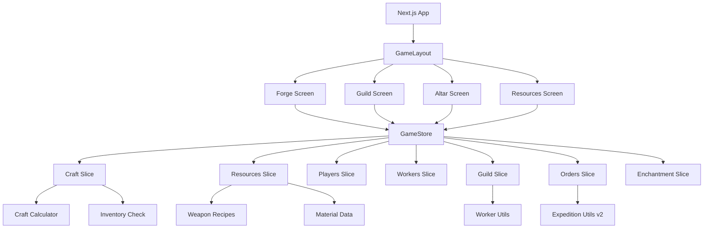
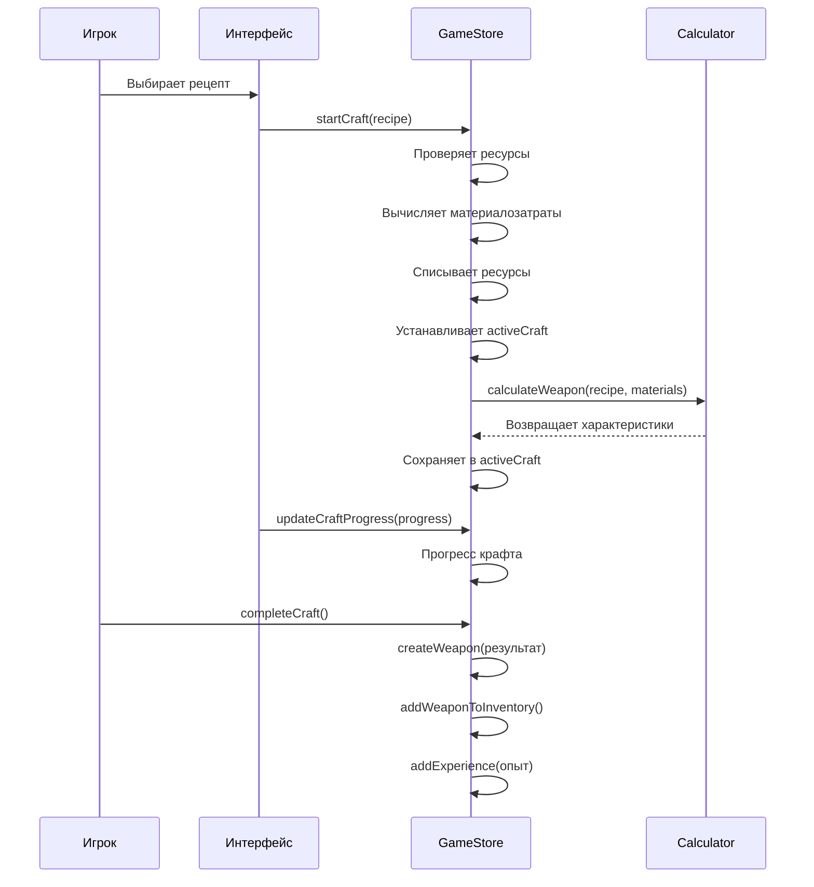
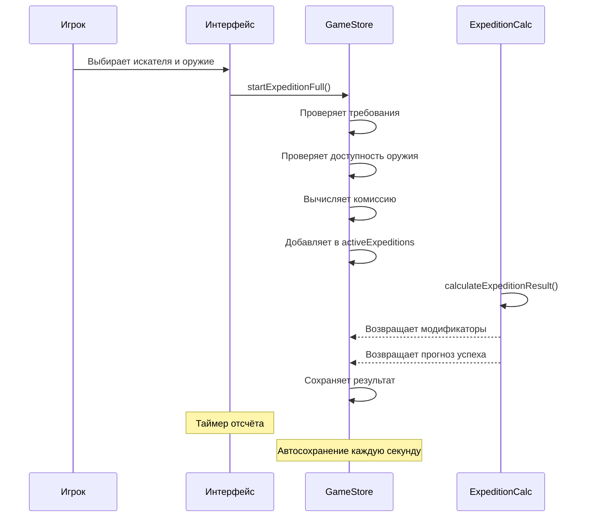

# Архитектура проекта SwordCraft

## Обзор технологий

### Frontend Framework
- **Next.js 15.1.0** — React-фреймворк с App Router
- **React 19.0.0** — UI библиотека
- **TypeScript 5** — Строгая типизация

### State Management
- **Zustand 5.0.6** — Лёгковесный state management
- **Composed Store Pattern** — Все слайсы объединены в одном файле
- **Persist Middleware** — Автосохранение в localStorage

### UI Components
- **shadcn/ui** — Библиотека UI компонентов (Radix UI + Tailwind CSS)
- **Framer Motion 12.23.2** — Анимации
- **Lucide React 0.525.0** — Иконки
- **Sonner 2.0.6** — Toast уведомления

### База данных
- **Prisma 6.6.0** — ORM
- **@prisma/adapter-libsql 6.6.0** — Адаптер для Turso/libSQL
- **@libsql/client 0.14.0** — Клиент для Turso (SQLite в облаке)

### Другие библиотеки
- **next-intl 4.3.4** — Международализация
- **React Hook Form 7.60.0** — Управление формами
- **Zod 4.0.2** — Валидация данных
- **Recharts 2.15.4** — Графики
- **TanStack React Query 5.82.0** — Кэширование данных
- **date-fns 4.1.0** — Работа с датами

---

## Архитектурные паттерны

### Composed Store Pattern

Центральный файл `src/store/game-store-composed.ts` объединяет все слайсы (slices) в один store:

```typescript
import { create, StateCreator } from 'zustand'
import { persist } from 'zustand/middleware'

// Композируем все слайсы
const useGameStore = create<GameStore>()(
  compose(
    persist(
      name: 'swordcraft-store-v2',
      version: 1,
      partialize: (state) => ({ ...state }) // Сохраняем только состояние, не функции
    )
  )
)(
  // Компонуем слайсы
  playerSlice,
  resourcesSlice,
  workersSlice,
  craftSlice,
  craftV2Slice,
  ordersSlice,
  guildSlice,
  enchantmentSlice,
  encyclopediaSlice,
  tutorialSlice
)
)
```

**Преимущества:**
- Единая точка входа для всего state
- Легко найти нужное состояние
- Cross-slice операции в одном месте
- Автоматическая персистентность

### Slice Pattern

Каждый домен (игрок, ресурсы, крафт и т.д.) отделён в свой slice:

```typescript
// Пример слайса
const createPlayerSlice: StateCreator<PlayerSlice & Setters> = (set) => ({
  // State
  name: 'Кузнец',
  level: 1,
  experience: 0,
  experienceToNextLevel: 100,
  fame: 0,
  title: 'Новичок',
  statistics: { ... },
  
  // Actions
  setPlayerName: (name) => set({ name }),
  addExperience: (amount) => set((state) => { ... }),
  updateStatistics: (updates) => set((state) => { ... }),
})
```

**Правила:**
- Один слайс = один домен
- State отделяется от actions
- Cross-slice операции в основном store

### Utility-First Pattern

Бизнес-логика вынесена в чистые функции в `src/lib/store-utils/`:

```typescript
// Примеры утилит
- calculateAttack() — расчёт атаки
- calculateSellPrice() — расчёт цены продажи
- calculateHireCost() — стоимость найма
- getMaterialDeductions() — вычет материалов
```

**Преимущества:**
- Легко тестировать
- Переиспользуемость кода
- Чистые функции без зависимостей от store

---

## Потоки данных между системами



### Поток создания оружия



### Поток экспедиции



---

## API маршруты (Next.js App Router)

### `/api` — Health Check
```typescript
GET /api → { message: "Hello, world!" }
```

### `/api/save` — Управление сохранениями

#### GET /api/save — Загрузка сохранения
```typescript
// Headers
x-player-id: string  // Идентификатор игрока

// Response
{
  player: Player,
  resources: Resources,
  workers: Worker[],
  guild: GuildState,
  ...
}
```

**Логика:**
- Если сохранение отсутствует — создаёт новое с начальными значениями
- Если сохранение существует — загружает из Turso/libSQL

#### POST /api/save — Сохранение игры
```typescript
// Body (полный state игры)
{
  player: Player,
  resources: Resources,
  guild: GuildState,
  ...
}

// Response
{ success: true, timestamp: number }
```

**Логика:**
- Валидирует данные перед сохранением
- Обновляет существующее или создаёт новое сохранение

#### DELETE /api/save — Удаление сохранения
```typescript
// Headers
x-player-id: string

// Response
{ success: true }
```

**Использование:**
- Сброс прогресса (хард ресет)

---

## Структура файлов для AI

### Файлы, которые AI читает автоматически:
1. `.cursorrules` — Правила проекта для AI
2. `AGENTS.md` — Главный навигационный файл
3. `.cursor/rules/docs-guide.mdc` — Правило чтения документации

### Документация:
- `docs/README.md` — Оглавление всей документации
- `docs/01_ARCHITECTURE.md` — Технологии, архитектура (этот файл)
- `docs/02_PROJECT_STRUCTURE.md` — Структура src/ с описанием файлов
- `docs/03_STATE_MANAGEMENT.md` — Zustand store, все слайсы
- `docs/04_TYPES_SYSTEM.md` — Все интерфейсы и типы
- `docs/systems/*.md` — Игровые системы (каждая в своём файле)
- `docs/utils/*.md` — Утилиты и формулы
- `docs/data/*.md` — Статические данные игры

---

## Константы игры

### Игровые константы
Расположены в `src/lib/store-utils/constants.ts`:
- Цены ресурсов (RESOURCE_SELL_PRICES)
- Уровни игрока (PLAYER_TITLES)
- Пороги опыта (LEVEL_THRESHOLDS)
- Множители тиров (TIER_MULTIPLIERS)
- Максимальные уровни зданий

### Константы для расчётов
- Формулы прогресса
- Коэффициенты качества
- Штрафы и бонусы

---

## Персистентность данных

### Local Storage (Zustand Persist)
- **Store name:** `swordcraft-store-v2`
- **Version:** 1
- **Storage:** `localStorage`
- **Метод:** `partialize` — сохраняет только состояние, не функции

### Cloud Storage (Turso/libSQL)
- **Автосохранение:** Каждую секунду через hook `use-cloud-save.ts`
- **Загрузка:** При запуске приложения через API `/api/save`
- **Идентификатор:** `x-player-id` header

---

## Ключевые архитектурные решения

### 1. Composed Store вместо Redux
**Причина:** Zustand проще и быстрее для данного проекта
**Результат:** Единый файл (~1540 строк) вместо 10+ файлов

### 2. Modifier System v2 для экспедиций
**Причина:** Гибкая система модификаторов
**Результат:** 8 провайдеров:
- Combat Stats Provider
- Level/Rarity Provider
- Personality Traits Provider
- Combat Style Provider
- Strengths/Weaknesses Provider
- Social Tags Provider
- Weapon Quality Provider

### 3. Craft System v2 с материалами
**Причина:** Детальный контроль над материалами
**Результат:**
- Уточённое управление материалами для каждой части
- Система бонусов от свойств материалов
- Прогноз качества до начала крафта

### 4. Шаблонизатор событий (Template Pattern)
**Причина:** Генерация случайных событий экспедиций
**Результат:** 
- Шаблоны событий по категориям (враги, локации, социальные, открытия)
- Селектор событий с весами (probabilities)
- Типизация: `ExpeditionEventType`, `ExpeditionEvent`, `ExpeditionTag`

---

## Пути оптимизации для AI

### Быстрый доступ к документации
1. Читайте `AGENTS.md` первым делом
2. Используйте быстрые указатели по категориям
3. Читайте только нужные файлы, не всю документацию целиком

### Типы всегда первыми
- ВСЕГДА проверяйте типы в `src/types/` перед изменением
- Типы централизованы в `src/types/index.ts`
- Не дублируйте типы

### Store централизован
- Единый store в `src/store/game-store-composed.ts`
- Используйте `useGameStore()` для получения store
- Не создавайте отдельные store instances

### Константы из одного источника
- Игровые константы в `src/lib/store-utils/constants.ts`
- Формулы в `src/lib/store-utils/craft-utils.ts`, `worker-utils.ts` и т.д.
- Не хардкодите значения

---

## Обзор систем игры

### Кузница (Forge)
- Крафт оружия v1 и v2
- Переработка материалов
- Магазин рецептов и материалов
- Система зачарований (Altar)
- Инвентарь оружия

### Гильдия (Guild)
- Система экспедиций с модификаторами v2
- Генерация искателей приключений
- Система контрактов
- Квесты восстановления
- История экспедиций

### Ресурсы (Resources)
- Добыча материалов и руды
- Рабочие и управление персоналом
- Здания и апгрейды
- Экономика игры

### Приключения (Dungeons)
- Система приключений
- События приключений
- Журнал оружия

### Энциклопедия (Encyclopedia)
- Знания о материалах
- Система экспертизы

### Заказы NPC (Orders)
- Генерация достижимых заказов
- Система требований заказов
- Награды и авансы

### Туториал (Tutorial)
- Обучение игроков
- Шаги по системам игры

---

## Дополнительные ресурсы

### Существующая документация
- `EXPEDITION_SYSTEM.md` — Детальная документация системы экспедиций (1297 строк)
- `docs/CRAFT_BONUS_*.md` — Документация системы бонусов к крафту
- `docs/MATERIAL_*.md` — Система материалов

### Ссылки
- [Next.js Documentation](https://nextjs.org/docs)
- [Zustand Documentation](https://docs.pmnd.rs/zustand)
- [Tailwind CSS Documentation](https://tailwindcss.com/docs)
- [shadcn/ui](https://ui.shadcn.com)
