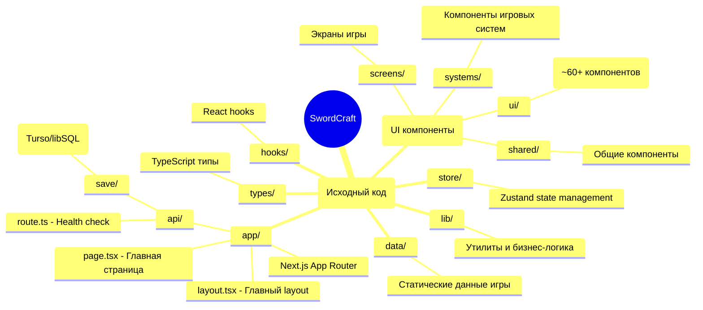
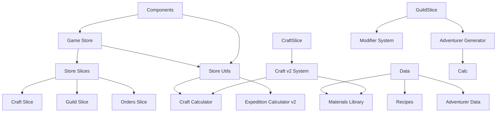

# Структура проекта SwordCraft

## Обзор

Проект организован по модульному принципу с чётким разделением ответственности между папками.



---

## Структура папок

### `src/app/` — Next.js App Router

| Файл | Назначение |
|-------|-----------|
| `layout.tsx` | Главный layout приложения. Шрифты Geist Sans/Mono, тёмная тема, Toaster для уведомлений. |
| `page.tsx` | Главная страница игры. Рендерит GameLayout. |
| `api/route.ts` | Health check endpoint (GET /api). |
| `api/save/route.ts` | API управления сохранениями. GET/POST/DELETE для работы с Turso/libSQL. |

**Импорты:**
```typescript
import { Geist, Geist_Mono } from "next/font/google"
import { Toaster } from "@/components/ui/toaster"
import { GameLayout } from "@/components/layout/game-layout"
```

---

### `src/components/` — React компоненты

#### `screens/` — Экраны игры

| Файл | Назначение |
|-------|-----------|
| `forge-screen.tsx` | Экран кузницы. |
| `guild-screen.tsx` | Экран гильдии. |
| `dungeons-screen.tsx` | Экран подземелий. |
| `altar-screen.tsx` | Экран алтаря зачарований. |
| `resources-screen.tsx` | Экран ресурсов. |
| `shop-screen.tsx` | Экран магазина. |
| `workers-screen.tsx` | Экран управления работниками. |
| `encyclopedia-screen.tsx` | Экран энциклопедии. |

#### `systems/` — Компоненты игровых систем

##### `forge/` — Кузница

| Файл | Назначение |
|-------|-----------|
| `index.ts` | Экспорт компонентов кузницы. |
| `forge-utils.tsx` | Утилиты для кузницы. |
| `shop-section.tsx` | Магазин рецептов и материалов. |
| `recipe-card.tsx` | Карточка рецепта. |
| `active-craft-card.tsx` | Карточка активного крафта. |
| `active-orders-section.tsx` | Секция активных заказов. |
| `inventory-section.tsx` | Секция инвентаря оружия. |
| `weapon-inventory-card.tsx` | Карточка оружия в инвентаре. |
| `repair-section.tsx` | Секция ремонта. |
| `repair-stub.tsx` | Заглушка ремонта. |

##### `craft-v2/` — Новая система крафта v2

| Файл | Назначение |
|-------|-----------|
| `index.ts` | Экспорт компонентов craft-v2. |
| `craft-container.tsx` | Контейнер крафта. |
| `craft-planner.tsx` | Планировщик крафта. |
| `craft-progress.tsx` | Прогресс крафта. |
| `craft-result.tsx` | Результат крафта. |

##### `planner/` — Планировщик крафта v2

| Файл | Назначение |
|-------|-----------|
| `index.ts` | Экспорт компонентов планировщика. |
| `MaterialPreviewTooltip.tsx` | Тултип материалов. |
| `MaterialsCheck.tsx` | Проверка материалов. |
| `PartMaterialSelector.tsx` | Выбор материалов для частей. |
| `RecipeCard.tsx` | Карточка рецепта. |
| `TechniqueSelector.tsx` | Выбор техники. |
| `WeaponForecastPanel.tsx` | Панель прогноза оружия. |

##### `forecast/` — Прогноз качества v2

| Файл | Назначение |
|-------|-----------|
| `index.ts` | Экспорт компонентов прогноза. |
| `QualityBadge.tsx` | Бейдж качества. |
| `StatRow.tsx` | Ряд статистики. |

##### `guild/` — Гильдия искателей

| Файл | Назначение |
|-------|-----------|
| `index.ts` | Экспорт компонентов гильдии. |
| `GuildScreen.tsx` | Главный экран гильдии. |
| `recruitment-interface.tsx` | Интерфейс найма искателей. |
| `expeditions-section.tsx` | Секция экспедиций. |
| `active-expedition-card.tsx` | Карточка активной экспедиции. |
| `expedition-history-entry.tsx` | Запись в истории экспедиций. |
| `contract-card.tsx` | Карточка контракта. |
| `contract-offer-modal.tsx` | Модал офферы контрактов. |
| `contracts-section.tsx` | Секция контрактов. |
| `order-card.tsx` | Карточка заказа NPC. |
| `recovery-quest-card.tsx` | Карточка квеста восстановления. |
| `search-log.tsx` | Журнал поиска. |
| `ReputationNotification.tsx` | Уведомление о репутации. |
| `SuccessFactorsBlock.tsx` | Блок факторов успеха. |

##### `adventurer-card/` — Карточка искателя

| Файл | Назначение |
|-------|-----------|
| `index.ts` | Экспорт компонентов карточки. |
| `ExpeditionForecast.tsx` | Прогноз экспедиции. |
| `ExpeditionEventLog.tsx` | Лог событий экспедиции. |
| `ModifierBadge.tsx` | Бейдж модификатора. |
| `StrengthsSection.tsx` | Секция сильных сторон. |
| `TraitsSection.tsx` | Секция черт характера. |
| `WeaknessesSection.tsx` | Секция слабых сторон. |
| `adventurer-card-v2.tsx` | Версия карточки v2 (дополнительные данные). |
| `adventurer-full-card.tsx` | Полная карточка искателя. |
| `adventurer-compact-card.tsx` | Компактная карточка. |
| `adventurer-quotes.tsx` | Цитаты искателей. |

##### `containers/` — Контейнеры для state

| Файл | Назначение |
|-------|-----------|
| `ExpeditionsSectionContainer.tsx` | Контейнер секции экспедиций. |
| `OrdersSectionContainer.tsx` | Контейнер секции заказов. |

##### `presentation/` — Презентационные компоненты

| Файл | Назначение |
|-------|-----------|
| `ExpeditionsSection.tsx` | Презентация секции экспедиций. |
| `GuildStatsSection.tsx` | Статистика гильдии. |
| `OrdersSection.tsx` | Презентация секции заказов. |

##### `altar/` — Алтарь зачарований

| Файл | Назначение |
|-------|-----------|
| `index.ts` | Экспорт компонентов алтаря. |
| `enchant-weapon-modal.tsx` | Модал зачарования оружия. |
| `enchanted-weapons-section.tsx` | Секция зачарованного оружия. |
| `enchantment-card.tsx` | Карточка зачарования. |
| `enchantment-shop-section.tsx` | Магазин зачарований. |
| `sacrifice-section.tsx` | Секция жертвоприношения. |
| `sacrifice-weapon-card.tsx` | Карточка оружия для жертвы. |
| `altar-utils.ts` | Утилиты алтаря. |

##### `dungeons/` — Подземелья

| Файл | Назначение |
|-------|-----------|
| `index.ts` | Экспорт компонентов подземелий. |
| `event-modal.tsx` | Модал событий приключений. |
| `active-adventure-card.tsx` | Карточка активного приключения. |
| `adventure-card.tsx` | Карточка приключения. |
| `dungeons-utils.tsx` | Утилиты подземелий. |
| `weapon-select-modal.tsx` | Модал выбора оружия. |
| `weapons-history-section.tsx` | Секция истории оружия. |

##### `encyclopedia/` — Энциклопедия знаний

| Файл | Назначение |
|-------|-----------|
| `index.ts` | Экспорт компонентов энциклопедии. |
| `category-tabs.tsx` | Вкладки категорий. |
| `search-bar.tsx` | Строка поиска. |
| `material-card.tsx` | Карточка материала. |

##### `workers/` — Рабочие и здания

| Файл | Назначение |
|-------|-----------|
| `index.ts` | Экспорт компонентов работников. |
| `assignment-modal.tsx` | Модал назначения работника. |
| `fire-confirm-modal.tsx` | Модал подтверждения увольнения. |
| `worker-card.tsx` | Карточка работника. |
| `building-card.tsx` | Карточка здания. |
| `workers-utils.tsx` | Утилиты работников. |

##### `shared/` — Общие компоненты

| Файл | Назначение |
|-------|-----------|
| `index.ts` | Экспорт общих компонентов. |
| `resource-card.tsx` | Карточка ресурса. |
| `stat-card.tsx` | Карточка статистики. |
| `tips-card.tsx` | Карточка советов. |
| `screen-header.tsx` | Заголовок экрана. |

##### `ui/` — shadcn/ui компоненты (~60+ файлов)

**Основные категории:**
- Формы (alert-dialog, dialog, dropdown-menu, popover, select, checkbox, switch, toggle)
- Отображение (accordion, button, card, badge, avatar, progress, slider, tooltip)
- Ввод (input, label, form, textarea)
- Макеты (layout, sidebar, sheet, drawer, resizable, tabs, table, calendar)
- Навигация (breadcrumb, navigation-menu, menubar, separator)
- Данные (chart, carousel)
- Игровое (adventurer-card, weapon-card, resource-icon, modifier-breakdown, repair-card, met-badge, hover-card)
- Уведомления (toast, sonner, toaster, alert)
- Другое (input-otp, pagination, toggle-group, command)

---

### `src/store/` — Zustand State Management

#### Основной файл

| Файл | Описание |
|-------|-----------|
| `game-store-composed.ts` | **Единый store** (~1400 строк). Композит всех слайсов и cross-slice операций. Использует `persist` middleware для localStorage. |

#### Слайсы (slices/)

| Файл | Домен | Ключевые переменные |
|-------|--------|--------|
| `player-slice.ts` | Игрок | name, level, experience, fame, title, statistics |
| `resources-slice.ts` | Ресурсы | gold, soulEssence, wood, stone, iron, coal... |
| `workers-slice.ts` | Рабочие | workers[], buildings[], hiredCount, maxWorkers |
| `craft-slice.ts` | Крафт / инвентарь (legacy v1 API + общий инвентарь) | activeCraft, activeRefining, weaponInventory, unlockedRecipes |
| *(в `game-store-composed.ts` + `use-craft-v2.ts`)* | Крафт v2 | `craftV2Persisted`, этапы и UI; отдельного `craft-v2-slice.ts` нет |
| `orders-slice.ts` | Заказы NPC | availableOrders[], activeOrderId, completedOrders[], expiredOrders[] |
| `guild-slice.ts` | Гильдия | level, glory, reputation, adventurers[], activeExpeditions[], history |
| ~~`enchantments-slice.ts`~~ (удалён, фаза 0) | — | Раньше дублировал логику; контракт зачарований — `craft-slice` + `game-store-composed` |
| `encyclopedia-slice.ts` | Энциклопедия | materialKnowledge, selectedCategory, searchQuery |
| `tutorial-slice.ts` | Туториал | isActive, currentStep, completedSteps, skipped |

#### Selectors

| Файл | Описание |
|-------|-----------|
| `selectors/index.ts` | Мемоизированные селекторы с использованием `reselect`. |

#### Cross-slice (`cross-slice/`)

| Файл | Описание |
|------|-----------|
| `repair-cross-slice.ts` | Сборка действий ремонта оружия для подмешивания в composed store. |

---

### `src/types/` — TypeScript типы

#### Доменные типы

| Файл | Основные типы |
|-------|----------------|
| `player.ts` | Player, PlayerState, GameStatistics, PlayerTitle |
| `resources.ts` | Resources, ResourceKey, CraftingCost |
| `worker.ts` | Worker, WorkerStats, WorkerClass, ProductionBuilding |
| `guild.ts` | GuildState, Adventurer, ActiveExpedition, ExpeditionResult, RecoveryQuest |
| `craft.ts` | CraftedWeapon, WeaponType, WeaponTier, WeaponMaterial, QualityGrade |
| `orders.ts` | NPCOrder, OrderStatus, OrderBonusItem, MaterialAdvance |
| `forecast.ts` | WeaponForecast, ForecastAccuracy, StatBreakdown |

#### Расширенные типы

| Файл | Описание |
|-------|-----------|
| `craft-v2.ts` | CraftedWeaponV2, CraftPlan, ActiveCraftV2 |
| `adventurer-extended.ts` | AdventurerExtended, AdventurerIdentity, CombatStats, Personality, Requirements |
| `contract.ts` | ContractTier, LoyaltyLevel, ContractedAdventurer |
| `known-adventurer.ts` | KnownAdventurer, KnownAdventurerData |

#### Общие типы

| Файл | Описание |
|-------|-----------|
| `game.ts` | GameScreen, OrderStatus |
| `index.ts` | Центральный экспорт всех типов |

#### Системные типы

| Файл | Описание |
|-------|-----------|
| `expedition-events.ts` | ExpeditionEventType, ExpeditionEvent, ExpeditionTag |
| `expedition-tags.ts` | LocationTag, EnemyTag, WeatherTag, SpecialTag, ThemeTag |

#### Общие типы

| Файл | Описание |
|-------|-----------|
| `shared/quality.ts` | QualityGrade, QUALITY_GRADES_V1, QUALITY_GRADES_V2, QualityRank |
| `shared/enchantment.ts` | EnchantmentSchool, EnchantmentEffect |

#### Типы материалов

| Файл | Описание |
|-------|-----------|
| `materials/material-core.ts` | MaterialNode, MaterialClass, MaterialOrigin, MaterialRarity |
| `materials/knowledge.ts` | MaterialKnowledge, KnowledgeThreshold |

---

### `src/lib/` — Утилиты и бизнес-логика

#### Крафт и расчёты

| Файл | Описание |
|-------|-----------|
| `craft/calculator.ts` | **Расчёт характеристик оружия**. Основная функция `calculateWeapon()`. |
| `craft/forecast-calculator.ts` | **Прогноз качества**. Вычисляет ожидаемые диапазоны. |
| `craft/inventory-check.ts` | Проверка инвентаря. |
| `craft/material-preview.ts` | Предпросмотр материалов. |
| `craft/material-sorting.ts` | Сортировка материалов. |
| `craft/name-generator.ts` | Генерация имён оружия. |
| `craft/process-generator.ts` | Генерация процессов крафта. |
| `craft/index.ts` | Экспорт функций крафта. |

#### Экспедиции и модификаторы

| Файл | Описание |
|-------|-----------|
| `expedition-calculator-v2.ts` | **Расчёт экспедиций v2**. Система модификаторов. |
| `expedition-calculator.ts` | Старая версия (legacy). |
| `expedition-reward-generator.ts` | Генерация наград. |
| `expedition-event-selector.ts` | Селектор событий экспедиций. |
| `expedition-draft.ts` | Автосохранение черновиков экспедиций. |
| `guild-utils.ts` | Утилиты гильдии. |
| `known-adventurers-manager.ts` | Менеджер известных искателей. |

#### Модификаторы

| Файл | Описание |
|-------|-----------|
| `modifier-system/` | Система модификаторов v2 (8 провайдеров). |
| `modifier-system/providers/combat-stats-provider.ts` | Модификатор боевых статов. |
| `modifier-system/providers/level-rarity-provider.ts` | Модификатор уровня и редкости. |
| `modifier-system/providers/personality-traits-provider.ts` | Модификатор черт характера. |
| `modifier-system/providers/combat-style-provider.ts` | Модификатор стиля боя. |
| `modifier-system/providers/motivations-provider.ts` | Модификатор мотиваций. |
| `modifier-system/providers/social-tags-provider.ts` | Модификатор социальных тегов. |
| `modifier-system/providers/strengths-weaknesses-provider.ts` | Модификатор сильных/слабых сторон. |
| `modifier-system/providers/weapon-quality-provider.ts` | Модификатор качества оружия. |
| `modifier-system/registry.ts` | Реестр модификаторов. |
| `modifier-system/types.ts` | Типы модификаторов. |

#### Утилиты Store

| Файл | Описание |
|-------|-----------|
| `store-utils/constants.ts` | **Константы игры**. Цены ресурсов, уровни игроков, пороги опыта. |
| `store-utils/generators.ts` | Генерация ID, утилиты для типов. |
| `store-utils/player-utils.ts` | Расчёт опыта игрока, титулы. |
| `store-utils/worker-utils.ts` | Расчёт стоимости найма, качество рабочих. |
| `store-utils/craft-utils.ts` | Расчёт качества, атаки, цены продажи оружия. |
| `store-utils/enchantment-utils.ts` | Расчёт эссенции, стоимость жертвоприношения. |
| `store-utils/repair-utils.ts` | Расчёт стоимости ремонта, лучшие кузнецы. |
| `store-utils/order-achievable-utils.ts` | Генерация достижимых заказов. |
| `store-utils/order-utils.ts` | Утилиты заказов. |
| `store-utils/expedition-utils.ts` | Расчёт результатов экспедиций, создание квестов. |
| `store-utils/types.ts` | Типы для store utils. |
| `store-utils/index.ts` | Центральный экспорт утилит. |

#### Искатели и гильдия

| Файл | Описание |
|-------|-----------|
| `adventurer-generator-extended.ts` | **Генератор искателей v2**. Создаёт AdventurerExtended. |
| `adventurer-generator.ts` | Старая генерация. |
| `adventurer-converter.ts` | Преобразование старых в новые форматы. |
| `adventurer-search.ts` | Поиск в базе известных искателей. |
| `adventurer-advice.ts` | Советы по выбору оружия. |
| `contract-manager.ts` | Управление контрактами. |

#### Данные игры

| Файл | Описание |
|-------|-----------|
| `sounds.ts` | Звуковые эффекты игры. |
| `utils.ts` | Общие утилиты (clsx, tailwind-merge). |
| `war-soul-utils.ts` | Утилиты системы War Soul. |
| `db.ts` | Подключение к Turso/libSQL. |

#### Сохранения и контракт API

| Файл | Описание |
|-------|-----------|
| `cloud-save-feature.ts` | Фича-флаг `NEXT_PUBLIC_CLOUD_SAVE_ENABLED`; JSDoc-чеклист при новых персистящихся полях (persist + облако). |
| `save-auth.ts` | Политика NextAuth / `x-player-id` для `/api/save`. |
| `save-payload-schema.ts` | Zod-схема и лимиты тела `POST /api/save`. |

#### Локализация

| Файл | Описание |
|-------|-----------|
| `localization/ru/index.ts` | Русская локализация. |
| `localization/ru/materials.ts` | Локализация материалов. |
| `localization/ru/quality.ts` | Локализация качества. |
| `localization/ru/weapons.ts` | Локализация названий оружия. |

---

### `src/data/` — Статические данные игры

#### Материалы (materials/)

| Файл | Описание |
|-------|-----------|
| `library/` | Библиотека материалов, организованная по типам. |
| `metals.ts` | Экспорт всех металлов. |
| `ores.ts` | Экспорт всех руд. |
| `stones.ts` | Экспорт всех камней. |
| `woods.ts` | Экспорт всех видов дерева. |
| `leathers.ts` | Экспорт всех видов кожи. |
| `collections/` | Коллекции по типам. |
| `material-shop.ts` | Магазин материалов. |
| `encyclopedia.ts` | Данные для энциклопедии. |
| `adapter.ts` | Адаптер для материалов v2. |

#### Рецепты (recipes/)

| Файл | Описание |
|-------|-----------|
| `index.ts` | Главный экспорт рецептов. |
| `weapon-recipes.ts` | Рецепты оружия (melee, swords). |
| `refining-recipes.ts` | Рецепты плавки руды. |
| `recipe-shop.ts` | Магазин рецептов. |

#### Техники (techniques/)

| Файл | Описание |
|-------|-----------|
| `index.ts` | Главный экспорт техник. |
| `basic.ts` | Базовые техники (6 шт). |
| `advanced.ts` | Продвинутые техники (8 шт). |

#### Этапы крафта (stages/)

| Файл | Описание |
|-------|-----------|
| `index.ts` | Главный экспорт этапов. |
| `preparation.ts` | Этапы подготовки (4). |
| `processing.ts` | Этапы обработки (8). |
| `forming.ts` | Этапы формовки (5). |
| `assembly.ts` | Этапы сборки (4). |
| `finishing.ts` | Этапы отделки (6). |

#### Искатели и приключения

| Файл | Описание |
|-------|-----------|
| `adventurer-names.ts` | Имена искателей для генерации. |
| `adventurer-rarity.ts` | Редкость искателей и бонусы. |
| `adventurer-traits.ts` | Черты характера (3 группы редкости). |
| `adventurer-phrases/` | Цитаты искателей (4 категории). |
| `adventurer-tags/` | Теги искателей (6 категорий). |
| `expedition-templates.ts` | Шаблоны экспедиций. |
| `expedition-events/` | События экспедиций (5 категорий). |
| `adventures.ts` | Приключения (dungeons). |
| `adventure-events.ts` | События приключений. |

#### Другие данные

| Файл | Описание |
|-------|-----------|
| `enchantments.ts` | Зачарования (6 школ, 3 уровня). |
| `repair-system.ts` | Система ремонта оружия. |
| `war-soul-tiers.ts` | Тиры War Soul (10 уровней). |
| `unique-bonuses.ts` | Уникальные бонусы (8 типов). |
| `game-tooltips.ts` | Тултипы для подсказок. |
| `market-data.ts` | Данные рынка. |
| `tutorial.ts` | Туториал игры. |

---

### `src/hooks/` — React Hooks

| Файл | Описание |
|-------|-----------|
| `use-cloud-save.ts` | Слой сохранений: локальный бэкап + при **`NEXT_PUBLIC_CLOUD_SAVE_ENABLED=true`** синхронизация с Turso через `/api/save` (интервал по умолчанию **60 с**; в `GameLayout` — 60 000 ms). |
| `use-craft-v2.ts` | Hooks для крафта v2. |
| `use-game-loop.ts` | Игровой цикл. |
| `use-mobile.ts` | Определение мобильного устройства. |
| `use-modifier-calculator.ts` | Вычисление модификаторов экспедиции. |
| `use-toast.ts` | Hook для отображения toast уведомлений. |

---

## Ключевые архитектурные паттерны

### 1. State Management
**Zustand Composed Store:** Все доменные слайсы объединены в одном файле `game-store-composed.ts`. Это обеспечивает единую точку входа и упрощает навигацию по состоянию.

**Cross-Slice Operations:** Сложные операции, затрагивающие несколько слайсов (например, запуск экспедиции с изменением ресурсов), находятся в основном store.

### 2. Modifier System v2
**Provider Pattern:** Система из 8 независимых провайдеров, каждый отвечает за свою область модификаторов. Это позволяет легко добавлять новые типы модификаторов без изменения основной логики.

**Registry:** Центральный реестр всех модификаторов для автоматического сбора модификаторов из разных провайдеров.

### 3. Craft System v2
**Material Management:** Детальный контроль над материалами для каждой части оружия (blade, guard, grip, pommel). Каждая часть имеет свои требования к типам и свойствам.

**Process Generation:** Автоматическая генерация процессов крафта на основе рецепта и выбранных техник.

---

## Пути оптимизации для AI

### Для быстрого поиска
1. Используйте быстрый доступ к store через `useGameStore()`
2. Селекторы в `src/store/selectors/` мемоизированы для быстрого получения данных

### Для понимания контекста
1. Изучите архитектуру в `docs/01_ARCHITECTURE.md`
2. Изучите потоки данных между системами
3. Читайте типы в `docs/04_TYPES_SYSTEM.md` перед изменениями

### Для добавления новой функциональности
1. Создайте новый слайс в `src/store/slices/`
2. Добавьте cross-slice операции в `game-store-composed.ts`
3. Обновите документацию соответствующей системы в `docs/systems/`

---

## Связи между частями проекта



---

## Примечания

- **Store naming:** Все слайсы имеют суффикс `-slice.ts`
- **TypeScript strict mode:** Весь проект использует строгую типизацию (`strict: true`)
- **Component patterns:** Для сложных компонентов используются контейнеры и селекторы
- **Utility functions:** Бизнес-логика вынесена в чистые функции для тестирования и переиспользования
