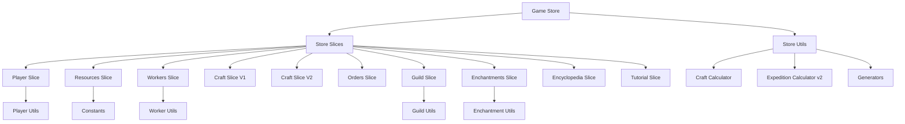

# State Management (Zustand)

## Обзор

Проект использует **Zustand 5.0.6** для state management с паттерном **Composed Store**. Все слайсы (slices) объединены в одном файле `src/store/game-store-composed.ts` (~1400 строк); cross-slice логика вынесена в `src/store/cross-slice/` (ремонт, экспедиции, **заказы**).

**Сборка в коде:** в `game-store-composed.ts` — `create<GameStore>()(persist((set, get) => ({ ... }), …))`: подмешиваются вызовы `create*Slice` из `slices/`, дополнительное состояние (`guild`, `craftV2Persisted`, туториал и т.д.) и блок cross-slice действий. Ремонт — `buildRepairCrossSlice` (мастерство от `player.level`, без стамины workers); экспедиции — `buildGuildExpeditionCrossSlice`; награды и проводки заказа (в т.ч. `completeOrder` с двумя аргументами) — `buildOrderCrossSlice`. Крафт v2 — §5 ниже.

#### P2-Store-02 (спайк): типизация `create` без `as any`

Цель исследования — собрать слайсы через общий тип `GameStore`, объявленный до тел слайсов, чтобы убрать `set as any` / `get as any` при `createPlayerSlice(set, get, ...)`. На практике Zustand ожидает `StateCreator<GameStore, ...>` для каждого слайса; потребуется либо **карусельная** ссылка (`GameStore` = пересечение интерфейсов слайсов + `satisfies`), либо **генерик-обёртка** над фабриками слайсов. Рекомендация: не блокировать фичи ради полной типизации; выносить cross-slice в модули (как заказы) снижает давление на один файл. Полная миграция — отдельная задача после стабилизации контрактов сейва и крафта.

---

## Архитектура Composed Store

### Преимущества
1. **Единая точка входа** — все слайсы в одном месте
2. **Лёгкая навигация** — быстро найти нужный state
3. **Cross-slice операции** — сложные операции затрагивающие несколько доменов в одном месте
4. **Автоматическая персистентность** — через `persist` middleware
5. **Чистые функции** — бизнес-логика вынесена в `src/lib/store-utils/`

### Структура слайса
Каждый слайс содержит:
- **State** — интерфейс состояния
- **Initial State** — начальные значения
- **Actions** — функции для изменения состояния
- **Selectors** — мемоизированные функции для чтения состояния

### Пример слайса
```typescript
import { StateCreator } from 'zustand'

// State интерфейс
export interface PlayerState {
  player: Player
  statistics: GameStatistics
}

// Actions интерфейс
export interface PlayerActions {
  setPlayerName: (name: string) => void
  addExperience: (amount: number) => void
  updateStatistics: (updates: Partial<GameStatistics>) => void
}

// Initial state
export const initialPlayer: Player = { name: '', level: 1, ... }
export const initialStatistics: GameStatistics = { totalCrafts: 0, ... }

// Функция создания слайса
export const createPlayerSlice: StateCreator<PlayerState & PlayerActions> = (set) => ({
  player: initialPlayer,
  statistics: initialStatistics,
  
  setPlayerName: (name) => set({ player: { ...state.player, name } }),
  addExperience: (amount) => set((state) => { ... }),
  updateStatistics: (updates) => set((state) => ({ ... })),
})
```

---

## Все слайсы (Slices)

### 1. Player Slice (`player-slice.ts`)

**Домен:** Игрок, уровень, опыт, слава, титулы, статистика

#### State (PlayerState)
```typescript
{
  player: Player {
    name: string              // Имя игрока
    level: number            // Уровень (1-50)
    experience: number        // Текущий опыт
    experienceToNextLevel: number  // Опыт до следующего уровня
    fame: number              // Слава (репутация)
    title: string            // Титул (Новичок, Ученик, ... Легендарный мастер)
  },
  statistics: GameStatistics {
    totalCrafts: number        // Всего крафтов
    totalRefines: number       // Всего переплавок
    totalGoldEarned: number    // Всего заработанного золота
    totalWorkersHired: number  // Всего нанятых рабочих
    playTime: number           // Время игры (секунды)
    weaponsSold: number        // Продано оружия
    recipesUnlocked: number    // Разблокировано рецептов
    ordersCompleted: number     // Выполнено заказов
    weaponsSacrificed: number // Жертвоприношено оружия
    enchantmentsApplied: number // Зачарований
  }
}
```

#### Actions (PlayerActions)
```typescript
// Основные действия
setPlayerName(name: string) => void              // Установить имя игрока
setLevel(level: number) => void                   // Установить уровень (для тестов)
addExperience(amount: number) => void               // Добавить опыт
setExperienceToNextLevel(amount: number) => void    // Установить опыт до следующего уровня
addFame(amount: number) => void                    // Добавить славу
setTitle(title: string) => void                      // Установить титул

// Статистика
updateStatistics(updates: Partial<GameStatistics>) => void  // Обновить статистику
incrementTotalCrafts() => void                      // Увеличить счётчик крафтов
incrementTotalRefines() => void                    // Увеличить счётчик переплавок

// Полный сброс (для debug)
resetPlayer() => void
resetStatistics() => void
```

#### Утилиты
- `getTitleByLevel()` — получить титул по уровню
- `getExperienceForLevel()` — получить опыт для уровня
- `addExperience()` — рассчитать уровень и титул
- `addFame()` — рассчитать титул по славе

---

### 2. Resources Slice (`resources-slice.ts`)

**Домен:** Все ресурсы игры (сырьё, переплавка, золото, эссенция)

#### State (ResourcesState)
```typescript
{
  resources: Resources {
    // Валюта
    gold: number              // Золото
    soulEssence: number        // Эссенция душ (для зачарований)
    
    // Сырьё
    wood: number              // Дерево
    stone: number             // Камень
    iron: number              // Железо
    coal: number              // Уголь
    copper: number            // Медь
    tin: number               // Олово
    silver: number             // Серебро
    goldOre: number           // Золотая руда
    mithril: number           // Мифрил
    
    // Переплавленные
    ironIngot: number         // Железный слиток
    copperIngot: number       // Медный слиток
    tinIngot: number          // Оловянный слиток
    bronzeIngot: number        // Бронзовый слиток
    steelIngot: number         // Стальной слиток
    silverIngot: number       // Серебряный слиток
    goldIngot: number         // Золотой слиток
    mithrilIngot: number       // Мифриловый слиток
    
    // Обработанные
    planks: number            // Доски
    stoneBlocks: number        // Каменные блоки
    leather: number           // Кожа (для рукоятей)
  }
}
```

#### Actions (ResourcesActions)
```typescript
// Управление ресурсами
setResources(partialResources: Partial<Resources>) => void  // Установить частично
addResource(key: ResourceKey, amount: number) => void       // Добавить ресурс
removeResource(key: ResourceKey, amount: number) => void    // Удалить ресурс
spendResources(cost: CraftingCost) => boolean           // Потратить ресурсы
addGold(amount: number) => void                           // Добавить золото
spendGold(amount: number) => boolean                    // Потратить золото
addSoulEssence(amount: number) => void                  // Добавить эссенцию
spendSoulEssence(amount: number) => boolean           // Потратить эссенцию

// Ресурсы из крафта (при завершении)
refineResources(output: Partial<Resources>, inputCost: CraftingCost) => void  // Переплавить
gainGoldFromCraft(sellPrice: number) => void           // Получить золото от продажи

// Добыча
gainFromMine(minedResources: Partial<Resources>) => void      // Получить ресурсы из шахты
gainFromWorker(producedResources: Partial<Resources>) => void // Получить от работника

// Продажа
sellResource(key: ResourceKey, amount: number) => boolean  // Продать ресурс
sellWeapon(price: number) => void                       // Продать оружие
sellAllResources() => void                             // Продать все ресурсы

// Сброс
resetResources() => void
```

#### Утилиты
- Используют `RESOURCE_SELL_PRICES` из `src/lib/store-utils/constants.ts`

---

### 3. Workers Slice (`workers-slice.ts`)

**Домен:** Рабочие, производственные здания

#### State (WorkersState)
```typescript
{
  workers: Worker[] {
    id: string
    name: string
    class: WorkerClass              // apprentice, blacksmith, miner, merchant, enchanter, loggers, mason, smelter
    level: number                  // 1-20
    stats: WorkerStats {
      speed: number            // Скорость работы (1-100)
      quality: number          // Качество работы (1-100)
      stamina_max: number       // Максимум стамины
      intelligence: number      // Интеллект (эффективность)
      loyalty: number          // Лояльность
    }
    assignedBuildingId: string | null  // Здание назначения
    currentStamina: number        // Текущая стамина
    tasksCompleted: number       // Выполнено задач
    earnings: number               // Заработано золота
  }[]
  
  buildings: ProductionBuilding[] {
    id: string
    type: BuildingType             // mine, forge, smelter, sawmill, quarry
    level: number                  // Уровень здания (1-10)
    maxWorkers: number             // Макс рабочих
    assignedWorkers: string[]     // ID назначенных рабочих
    productionMultiplier: number    // Множитель производства
  }[]
  
  hiredCount: number              // Всего нанятых
  maxWorkers: number              // Максимум рабочих (depends on guild level)
}
```

#### Actions (WorkersActions)
```typescript
// Наем
hireWorker(workerClass: WorkerClass) => boolean  // Нанять работника
fireWorker(workerId: string) => void           // Уволить работника

// Здания
upgradeBuilding(buildingId: string) => boolean  // Апгрейд здание
assignWorkerToBuilding(workerId: string, buildingId: string) => void
unassignWorkerFromBuilding(workerId: string) => void

// Стамина
decreaseStamina(workerId: string, amount: number) => void  // Уменьшить стамину
replenishStamina(workerId: string, amount: number) => void  // Восстановить стамину

// Задача
completeTask(workerId: string, earnings: number) => void  // Завершить задачу

// Статистика
incrementTasksCompleted(workerId: string) => void
addEarnings(workerId: string, earnings: number) => void

// Сброс
resetWorkers() => void
```

#### Утилиты
- `calculateHireCost()` — рассчитать стоимость найма
- `getFireRefund()` — получить возврат при увольнении
- `calculateAverageQuality()` — среднее качество
- `WORKER_CLASS_DATA` — данные классов рабочих
- `getWorkerExpToLevel()` — опыт до уровня

---

### 4. Craft Slice (`craft-slice.ts`) — Legacy (v1)

**Домен:** Крафт оружия v1, переплавка, инвентарь

#### State (CraftState)
```typescript
{
  // Активный крафт
  activeCraft: ActiveCraft | null {
    recipeId: string | null
    weaponName: string
    progress: number          // 0-100
    startTime: number | null
    endTime: number | null
    quality: number
  }
  
  // Активная переплавка
  activeRefining: ActiveRefining | null {
    recipeId: string | null
    progress: number
  }
  
  // Инвентарь оружия
  weaponInventory: WeaponInventory {
    id: string
    recipeId: string
    weaponName: string
    type: WeaponType            // sword, dagger, axe, ...
    tier: WeaponTier          // common, uncommon, rare, epic, legendary
    material: WeaponMaterial     // iron, bronze, steel, ...
    quality: number
    qualityGrade: QualityGrade  // poor, normal, good, excellent, masterwork, legendary
    attack: number
    durability: number
    maxDurability: number
    weight: number
    sellPrice: number
    enchantments: WeaponEnchantment[]
    createdAt: number
  }[]
  
  // Разблокированные рецепты
  unlockedRecipes: string[]
}
```

#### Actions (CraftActions)
```typescript
// Начало крафта
startCraftWithResources(recipeId: string) => boolean  // С проверкой ресурсов
startCraft(recipeId: string) => void                 // Без проверки
updateCraftProgress(progress: number) => void     // Обновить прогресс

// Завершение
completeCraft() => void                              // Создать оружие с учётом прогресса
completeRefining() => void                             // Завершить переплавку

// Инвентарь
addWeaponToInventory(weapon: CraftedWeapon) => void  // Добавить оружие
removeWeaponFromInventory(weaponId: string) => void   // Удалить оружие

// Разблокировка
unlockRecipe(recipeId: string) => void            // Разблокировать рецепт
unlockAllRecipes() => void                         // Разблокировать все

// Сброс
resetCraftState() => void
```

#### Утилиты
- `getQualityGrade()` — получить градацию качества
- `getQualityMultiplier()` — множитель качества
- `getQualityColor()` — цвет качества
- `calculateAttack()` — рассчитать атаку
- `calculateSellPrice()` — рассчитать цену продажи
- `calculateCraftExperience()` — рассчитать опыт
- `createWeapon()` — создать объект оружия

---

### 5. Крафт v2 (`craftV2Persisted` + `useCraftV2`)

**Домен:** многоступенчатый крафт, который видит игрок на экране кузницы. Отдельного slice-файла `craft-v2-slice.ts` **нет** — состояние для персиста лежит в composed store, а пошаговая логика — в хуке.

#### Персистентный блок в store (`CraftV2Persisted`)
Объявлен в `game-store-composed.ts`, синхронизируется из `src/hooks/use-craft-v2.ts`:

```typescript
{
  activeCraft: ActiveCraftV2 | null
  plan: CraftPlan | null
  completedWeapon: CraftedWeaponV2 | null
  stage: 'planning' | 'crafting' | 'completed'
  preview: unknown | null
  weaponName: unknown | null
}
```

Флаг **`shouldPurchaseMaterials`** хранится рядом в `AdditionalState` того же файла.

#### Хук `useCraftV2`
`src/hooks/use-craft-v2.ts` держит полный `CraftV2State` (план, активный крафт, превью, имя, стадия UI), пишет обратно в `craftV2Persisted` и использует `@/data/recipes`, калькулятор и генератор этапов.

#### Типы (`src/types/craft-v2.ts`)
- `CraftPlan`, `ActiveCraftV2`, `CraftStageInstance`, `CraftedWeaponV2`, `MaterialAssignment`, `WeaponStats` и др.

#### Store-действия, связанные с v2
См. `game-store-composed.ts`: добавление готового оружия в инвентарь (например `addWeaponV2`), сброс/обновление полей `craftV2Persisted` при сборке результата и сопутствующие cross-slice вызовы из UI контейнера крафта.

---

### 6. Orders Slice (`orders-slice.ts`)

**Домен:** Заказы NPC (рыночные)

#### State (OrdersState)
```typescript
{
  availableOrders: NPCOrder[] {
    id: string
    npcName: string
    weaponType: string
    material?: string          // Желаемый материал (новая система)
    minQuality: number        // Мин качество
    minAttack?: number
    reward: number           // Награда
    deadline: number          // Дедлайн (timestamp)
    bonusItems: OrderBonusItem[]
    requirements: OrderRequirements
    expiresAt: number        // Когда истекает
  }[]
  
  // Активный заказ
  activeOrderId: string | null
  
  // История
  completedOrders: CompletedOrder[] {
    orderId: string
    weapon: CraftedWeapon | CraftedWeaponV2
    completedAt: number
    rewardReceived: number
  }[]
  
  expiredOrders: ExpiredOrder[] {
    orderId: string
    expiredAt: number
    penalty: number           // Штраф репутации
  }[]
}
```

#### Actions (OrdersActions)
```typescript
// Генерация
generateAchievableOrders(count: number) => void        // Генерировать достижимые заказы

// Управление заказами
startOrder(orderId: string, weaponId: string, weapon: CraftedWeapon | CraftedWeaponV2) => void
completeOrder(orderId: string, weaponId: string, weapon: CraftedWeapon | CraftedWeaponV2) => void
skipOrder(orderId: string) => void
failOrder(orderId: string, penalty: number) => void

// Очистка
removeCompletedOrders() => void
removeExpiredOrders() => void
```

#### Утилиты
- `checkWeaponMatchesOrder()` — проверка соответствия оружия заказу
- `generateAchievableOrder()` — генерация достижимого заказа
- Типы: `NPCOrder`, `CompletedOrder`, `ExpiredOrder`, `OrderBonusItem`, `OrderRequirements`

---

### 7. Guild Slice (`guild-slice.ts`)

**Домен:** Гильдия, искатели, экспедиции, контракты

#### State (ExtendedGuildState)
```typescript
{
  // Уровень гильдии
  level: number                    // 1-10
  glory: number                    // Слава гильдии
  reputation: number               // Репутация
  
  // Искатели
  adventurers: Adventurer[] {
    id: string
    name: string
    level: number
    rarity: Rarity
    ... AdventurerExtended
  }[]
  
  // Контрактные искатели
  contractedAdventurers: ContractedAdventurer[] {
    id: string
    adventurerId: string
    adventurer: AdventurerExtended
    contract: ContractTerms
    contractStartAt: number
    missionsCompleted: number
    loyalty: LoyaltyLevel      // disgruntled, neutral, satisfied, loyal
  }[]
  
  // Активные экспедиции
  activeExpeditions: ActiveExpedition[] {
    id: string
    adventurerId: string
    expeditionId: string
    weaponId: string
    startedAt: number
    endsAt: number
  }[]
  
  // История экспедиций
  expeditionHistory: ExpeditionHistoryEntry[] {
    id: string
    timestamp: number
    adventurerId: string
    adventurerName: string
    expeditionName: string
    success: boolean
    rewards: ExpeditionReward
    events: string[]
    weaponLost: boolean
  }[]
  
  // Квесты восстановления
  recoveryQuests: RecoveryQuest[] {
    id: string
    adventurerId: string
    weaponId: string
    weaponName: string
    questExpiry: number
  }[]
  
  // Состояние поиска
  searchState: SearchState | null {
    query: string
    results: Adventurer[]
    loading: boolean
  }
}
```

#### Actions (GuildActions)
```typescript
// Генерация искателей
generateAdventurerPool(guildLevel: number) => void
addKnownAdventurer(adventurer: AdventurerExtended) => void

// Контракты
offerContract(adventurerId: string, tier: ContractTier) => string | null
acceptContract(contractId: string) => void
terminateContract(contractId: string, penalty: number) => void
updateContractedAdventurers() => void

// Экспедиции
startExpeditionFull(expedition: ExpeditionTemplate, adventurer: AdventurerExtended, weapon: CraftedWeapon | CraftedWeaponV2) => void
completeExpedition(expeditionId: string, result: ExpeditionResult) => void
cancelExpedition(expeditionId: string) => void

// Квесты
createRecoveryQuest(weaponId: string) => void
completeRecoveryQuest(questId: string, reward: number) => void
expireRecoveryQuest(questId: string) => void

// Поиск
setSearchQuery(query: string) => void
setSearchResults(results: Adventurer[]) => void
clearSearchState() => void

// Сброс
resetGuildState() => void
```

#### Утилиты
- `generateExtendedAdventurer()` — генерация искателей v2
- `calculateExpeditionResult()` — результат экспедиции
- `createRecoveryQuest()` — создание квеста восстановления
- `updateKnownAdventurersAfterMission()` — обновление после миссии
- `createHistoryEntry()` — запись в историю

---

### 8. Enchantments Integration (`craft-slice.ts` + `game-store-composed.ts`)

**Домен:** Зачарования, жертвоприношения, эссенция и altar-flow

Важно:

- `enchantments-slice.ts` удалён (фаза 0); рабочий контракт зачарований проходит через `craft-slice.ts` и `game-store-composed.ts`;
- список открытых чар хранится в `CraftSlice`;
- cross-slice действия реализованы в `game-store-composed.ts`.

#### State (фактический текущий контракт)
```typescript
{
  weaponInventory: {
    weapons: Array<{
      id: string
      quality: number
      tier: number | string
      warSoul: number
      epicMultiplier: number
      enchantments?: WeaponEnchantment[]
    }>
  }

  unlockedEnchantments: string[]
  resources: {
    gold: number
    soulEssence: number
  }

  player: {
    level: number
    fame: number
  }

  statistics: {
    weaponsSacrificed: number
    enchantmentsApplied: number
  }
}
```

#### Actions (фактические action boundaries)
```typescript
// CraftSlice
unlockEnchantment(enchantmentId: string) => boolean
isEnchantmentUnlocked(enchantmentId: string) => boolean

// Cross-slice actions in game-store-composed.ts
sacrificeWeaponForEssence(weaponId: string) => { soulEssence: number; bonusGold: number } | null
unlockEnchantmentWithCost(enchantmentId: string) => boolean
enchantWeapon(weaponId: string, enchantmentId: string) => boolean
removeEnchantment(weaponId: string, enchantmentId: string) => boolean
```

#### Связанные данные и поля

- `weaponInventory.weapons[].enchantments` — runtime-список чар на оружии
- `CraftedWeaponV2.stats.enchantSlots` — будущая точка интеграции лимита чар
- `CraftedWeaponV2.stats.enchantPower` — будущая точка интеграции силы чар
- `currentScreen: 'altar'` — экран системы

#### Ограничения текущей реализации

- UI и `game-store-composed.ts` фактически работают с лимитом `2` зачарования на оружии
- совместимость сейчас завязана на правило "не более одной школы"
- flow разблокировки в UI уже проверяет стоимость, но store-реализация оплаты требует синхронизации

#### Где смотреть подробную каноническую документацию

- `docs/Ecnchantment_System/01_CURRENT_IMPLEMENTATION_AUDIT.md`
- `docs/Ecnchantment_System/02_DOMAIN_CONTRACT.md`
- `docs/Ecnchantment_System/03_STATE_AND_VARIABLES.md`
- `docs/Ecnchantment_System/04_PERSISTENCE_CONTRACT.md`

---

### 9. Encyclopedia Slice (`encyclopedia-slice.ts`)

**Домен:** Энциклопедия знаний о материалах

**Persist (Zustand):** помимо `materialKnowledge` и сессий изучения — `lastEncyclopediaTab` (`materials` \| `techniques`) и **`lastEncyclopediaTechniqueKindTab`** (активное семейство техник на экране, ENC P2d, **STORE_VERSION 33**). Фокусы `encyclopediaFocusMaterialId` / `encyclopediaFocusTechniqueRef` не сохраняются. Облако: см. `cloud-save-feature.ts` (эти поля пока только локально, как `lastEncyclopediaTab`).

#### State (EncyclopediaState)
```typescript
{
  // Знания о материалах
  materialKnowledge: Record<string, MaterialKnowledge> {
    [materialId: string]: {
      expertise: number        // 0-100
      discoveredAt: number
      lastUsedAt: number
      totalUses: number
      totalResearchTime: number
    }
  }
  
  // UI состояние
  selectedCategory: string    // Выбранная категория
  searchQuery: string        // Поисковый запрос
}
```

#### Actions (EncyclopediaActions)
```typescript
// Управление знаниями
addMaterialExpertise(materialId: string, amount: number) => void  // Добавить экспертизу (из энциклопедии и др.; при завершении крафта v2 батч идёт через applyCraftExpertiseGainRows в queueMicrotask — см. craft-expertise-from-craft.ts / use-craft-v2)
updateMaterialKnowledge(materialId: string, updates: Partial<MaterialKnowledge>) => void
researchMaterial(materialId: string) => void                    // Исследовать материал

// UI
setSelectedCategory(category: string) => void
setSearchQuery(query: string) => void

// Сброс
resetEncyclopedia() => void
```

---

### 10. Tutorial Slice (`tutorial-slice.ts`)

**Домен:** Туториал игры

#### State (TutorialState)
```typescript
{
  isActive: boolean          // Активен ли туториал
  currentStep: number       // Текущий шаг
  completedSteps: number[] // Завершённые шаги
  skipped: boolean            // Пропущен ли туториал
}
```

#### Actions (TutorialActions)
```typescript
// Управление
startTutorial() => void
completeCurrentStep() => void
skipTutorial() => void
resetTutorial() => void
```

---

## Cross-Slice Operations

Сложные операции, затрагивающие несколько доменов, находятся в `game-store-composed.ts`:

### 1. Запуск экспедиции
```typescript
startExpeditionFull(
  expedition: ExpeditionTemplate,
  adventurer: AdventurerExtended,
  weapon: CraftedWeapon | CraftedWeaponV2
) => void
```
**Логика:**
- Проверяет требования экспедиции
- Вычисляет комиссию гильдии
- Проверяет доступность оружия
- Создаёт запись в `activeExpeditions`
- Выводит ресурсы (комиссия)

### 2. Завершение экспедиции
```typescript
completeExpedition(
  expeditionId: string,
  result: ExpeditionResult
) => void
```
**Логика:**
- Добавляет запись в `expeditionHistory`
- Начисляет награды (золото, слава, эссенция)
- Обновляет статистику искателя
- Создаёт квест восстановления (если оружие потеряно)

### 3. Завершение заказа
```typescript
completeOrder(
  orderId: string,
  weaponId: string,
  weapon: CraftedWeapon | CraftedWeaponV2
) => void
```
**Логика:**
- Удаляет из `availableOrders`
- Добавляет в `completedOrders`
- Начисляет награду
- Начисляет репутацию

### 4. Создание оружия (крафт)
```typescript
completeCraftV2() => void
```
**Логика:**
- Создаёт оружие с учётом прогресса
- Добавляет в `craftedWeapons`
- Начисляет опыт игроку
- Начисляет славу

---

## Персистентность

### Local Storage
```typescript
persist(
  name: 'swordcraft-store-v2',
  version: 1,
  partialize: (state) => ({ ...state })
)
```
**Сохраняет:** Всё состояние кроме функций
**Не сохраняет:** Actions, селекторы

### Cloud Storage (Turso/libSQL) — опционально
- **Флаг:** `NEXT_PUBLIC_CLOUD_SAVE_ENABLED=true` — см. [`src/lib/cloud-save-feature.ts`](../src/lib/cloud-save-feature.ts) и [`.env.example`](../.env.example). Без флага облако выключено: только **persist** + локальный бэкап в `use-cloud-save.ts`, без запросов к `/api/save`.
- **При включённом флаге — автосохранение:** периодически через `use-cloud-save.ts` (по умолчанию каждые **60 секунд**; в `GameLayout` — `autoSaveInterval: 60000`).
- **Загрузка:** при включённом облаке — при старте через `GET /api/save`; при выключенном — данные только из persist (`swordcraft-store-v2`).
- **Идентификатор:** заголовок `x-player-id` (режим без жёсткой сессии); иначе — см. `save-auth.ts`.

---

## Selectors

Селекторы определены в `src/store/selectors/index.ts` с использованием `reselect` для мемоизации:

### Основные селекторы
```typescript
// Игрок
selectPlayer
selectPlayerLevel
selectPlayerExperience
selectPlayerFame
selectPlayerTitle

// Ресурсы
selectResources
selectGold
selectSoulEssence

// Рабочие
selectWorkers
selectHiredWorkers
selectBuildings

// Крафт
selectWeaponInventory
selectActiveCraft
selectUnlockedRecipes

// Заказы
selectAvailableOrders
selectCompletedOrders
selectExpiredOrders

// Гильдия
selectGuildLevel
selectAdventurers
selectActiveExpeditions
selectExpeditionHistory
```

---

## Константы игры

**Расположены в `src/lib/store-utils/constants.ts`:**

### Титулы игрока (PLAYER_TITLES)
| Мин уровень | Титул | Ранг |
|------------|--------|------|
| 1 | Новичок | novice |
| 5 | Ученик | apprentice |
| 10 | Подмастерье | journeyman |
| 20 | Опытный кузнец | experienced |
| 30 | Мастер-кузнец | master |
| 40 | Великий мастер | grandmaster |
| 50 | Легендарный мастер | legend |

### Цены ресурсов (RESOURCE_SELL_PRICES)
- Сырьё (wood: 0.3, stone: 0.4, iron: 2, ...)
- Переплавленные (ironIngot: 4, steelIngot: 15, ...)
- Элитные (mithrilIngot: 100, goldIngot: 30, ...)

---

## Как использовать Store

### Получение store
```typescript
import { useGameStore } from '@/store'

function MyComponent() {
  const store = useGameStore()
  
  const { player, resources } = store()
  store.addExperience(100)
}
```

### Получение селекторов
```typescript
import { selectGold, selectPlayerLevel } from '@/store/selectors'

function MyComponent() {
  const store = useGameStore()
  
  // Мемоизированные селекторы
  const gold = useGameStore(selectGold)
  const level = useGameStore(selectPlayerLevel)
  
  // Динамические селекторы (не мемоизированы)
  const { player } = useGameStore((state) => state.player)
}
```

### Деструктуризация действий
```typescript
const { addExperience, addGold } = useGameStore.getState()

// Использование в async функциях
const someAction = async () => {
  addExperience(50)
  addGold(100)
}
```

---

## Файлы проекта

| Файл | Описание |
|-------|-----------|
| `src/store/game-store-composed.ts` | **Единый store** (~1400 строк) |
| `src/store/cross-slice/*.ts` | Вынесенная cross-slice логика (ремонт и др.) |
| `src/store/index.ts` | Экспорт `useGameStore` и типов |
| `src/store/selectors/index.ts` | Мемоизированные селекторы |
| `src/store/slices/*.ts` | Доменные слайсы (10+ файлов) |

---

## Пути оптимизации для AI

### Для быстрого доступа
1. **Используйте селекторы** — они мемоизированы через `reselect`
2. **Не деструктурируйте лишнее** — только нужные действия
3. **Пишите типы** — все действия типизированы

### Для добавления нового state
1. **Создайте новый слайс** в `src/store/slices/`
2. **Определите State интерфейс**
3. **Определите Actions интерфейс**
4. **Реализуйте initial state**
5. **Добавьте слайс в `game-store-composed.ts`**
6. **Добавьте селекторы** если нужно

### Для сложных операций
1. **Добавляйте в `game-store-composed.ts`** если затрагивает несколько доменов
2. **Выносите логику в утилиты** `src/lib/store-utils/`
3. **Тестируйте изменения** — проверяйте влияние на другие слайсы

---

## Связи с другими системами


