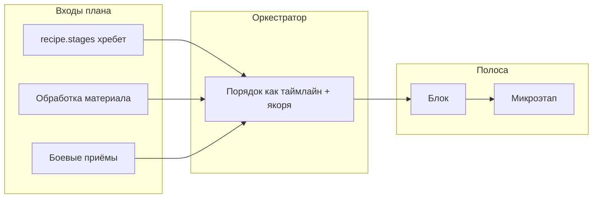

# Крафтовая линия и рецепт: центр проработки

**Этот файл — главная точка входа** по связке «рецепт → хребет → микрозадачи техник → Крафтовая линия» и по дорожной карте внедрения в код.  
**Путь в репозитории:** `docs/CRAFT_LINE_RECIPE_TECHNIQUE_COMPOSITION.md`

## Навигация по документам

| Документ | Назначение |
|----------|------------|
| **`docs/CRAFT_LINE_RECIPE_TECHNIQUE_COMPOSITION.md`** (здесь) | Архитектура полосы, хребет vs насадки, разрыв с `buildCraftLine`, **фазы внедрения (§9)**, риски, **worklog**. |
| **`docs/RECIPE_TEMPLATE_COMPOSITION.md`** | Модуль сборки рецептов: шаблоны, фрагменты, материализация в `WeaponRecipe`, приложение §14 (меч / кинжал / топор). |
| **`docs/TZ_SWORD_RECIPE_AND_CRAFT_LINE.md`** | ТЗ на контент пилота базового меча: микроэтапы, матрицы, приёмка. |
| **`docs/ENCYCLOPEDIA_MATERIALS_TECHNIQUES_ROADMAP.md`** | Энциклопедия, микрозадачи, раздел про Крафтовую линию. |

В **`docs/README.md`** эти файлы перечислены в таблице технической документации.

---

**Статус:** целевая архитектура. Сборка v2 с хребтом включена по умолчанию (`isCraftLineRecipeBackboneEnabled`: opt-out через `NEXT_PUBLIC_CRAFT_LINE_RECIPE_BACKBONE=false`); см. §7.

---

## 1. Основа: цель и ТЗ по мечу

В данных уже есть таймлайנ рецепта и техники с микрозадачами. **Крафтовая линия** должна показывать единый сценарий: макроэтапы рецепта **распадаются на микроэтапы**, выбор сырья и приёмов **насаживает** микрозадачи в согласованных местах.

Операционная проработка пилота **«базовый меч»** — **`docs/TZ_SWORD_RECIPE_AND_CRAFT_LINE.md`** (таблицы, приёмка). Ниже — архитектурные принципы и эталон хребта; детальные матрицы только в ТЗ.

### 1.1 Термины

| Термин | Значение |
|--------|----------|
| **Макроэтап** | Узел в `WeaponRecipe.stages` (`stageType`, опционально часть). |
| **Микроэтап** | Единица полосы: `id`, `label`, опционально `hint`, `durationWeight`. |
| **Хребет рецепта** | Упорядоченные макроэтапы — скелет процесса. |
| **Насадка техники** | Микрозадачи обработки или боевого приёма относительно хребта. |
| **Фаза линии** | `material_preparation` → `recipe_forming` → `craft_finishing`. |

---

## 2. Пилот «меч»: эталонный хребет (12 смысловых групп ТЗ)

Один пункт ТЗ может соответствовать **нескольким** подряд `stages`. Источник порядка исполнения — **полный** `stages`. Инвариант: каждая запись `stages[i]` отнесена к **ровно одной** смысловой группе (или новой группе с обновлением ТЗ).

1. Подготовка: разогрев горна, инструменты.  
2. Обработка лезвия: плавка, прокат.  
3. Обработка гарды: плавка, прокат.  
4. Обработка рукояти: распил.  
5. Обработка навершия: плавка.  
6. Формовка лезвия.  
7. Формовка гарды.  
8. Формовка рукояти.  
9. Формовка навершия.  
10. Сборка.  
11. Отделка лезвия.  
12. Общая отделка.

Микроэтапы хребта: стабильные `id`, префикс вроде `basic_sword_macro_…`; без дубля с насадкой без явного правила слияния.

---

## 3. Два слоя данных

**Хребет:** `WeaponRecipe.stages`; ключ макроэтапа — `stageType` + контекст части. Маппинг стадия → фаза линии — в данных; для `prep_heating` / `prep_tools` — **одно правило на пилот**.

**Насадки:** обработка материала — до первой стадии хребта, где заготовка части уже подразумевается. Боевые приёмы — **в точках якорей**, не обязательно одним хвостом после всего хребта; `processMods` меняют исполняемый порядок — полоса v2 опирается на тот же развёрнутый таймлайн, что и `generateCraftStages` (`collectExpandedStageConfigsForCraft`).

Внутреннее представление микроэтапа: `{ stableId, label, durationWeight, sourceRef }`.

---

## 4. Блоки и подсегменты

| Уровень | Смысл |
|--------|--------|
| **Блок** | Фаза линии и/или логическая группа макроэтапов. |
| **Цвет** | Токен темы по фазе (`craftLine.*`). |
| **Подсегмент** | Одна микрозадача (хребет или техника). |

Сумма нормализованных долей по всем подсегментам = 1. Цель: один упорядоченный список шагов порождает симуляцию и полосу.

---

## 5. Порядок склейки (целевой)

1. Блоки **обработки материала** из плана.  
2. **Хребет** с микроэтапами по `recipe.stages` (после модификаций техник, если модель едина с симуляцией).  
3. **Боевые приёмы** — у якорей; итог согласован с таймлайном.

На переходный период допустимо строить порядок полосы по выходу `generateCraftStages` для того же плана.

---

## 6. Контракт данных для микроэтапов хребта

- **A.** В типах: опционально **`RecipeStageConfig.craftLineMicroSteps`** (`RecipeCraftLineMicroStep`: `id`, `label`, `durationWeight?`) и **`craftLinePhase`**; пилот — `basic_sword` в [`src/data/recipes/basic-sword-stages.ts`](../src/data/recipes/basic-sword-stages.ts).  
- **B.** Шаблоны процесса — **полностью** в **`docs/RECIPE_TEMPLATE_COMPOSITION.md`** (фрагменты, материализация).  
- **C.** Дефолты из `StageTypeDefinition` + override в рецепте (при отсутствии `craftLinePhase` сборщик выводит фазу из префикса `stageType`: `prep_` → подготовка, `fin_` → отделка, иначе формовка).

Чеклист контента по мечу — в ТЗ §7 и §9.

---

## 7. Разрыв с текущим кодом

**Статус (2026-04-10+):** `CraftLineSegment` — дискриминированный союз техники и хребта (`source: 'technique' | 'recipe_backbone'`). Сборка **v2**: `buildCraftLineFromPlanV2` / `buildCraftLineFromPlanWithRecipe` идёт в порядке **`collectExpandedStageConfigsForCraft`** (те же правила, что **`generateCraftStages`**: закупка, моды материалов, **`processMods` техник**, `partMaterialSupply`, первичные метаданные). Для строк таймлайна, совпадающих со слотом базового `recipe.stages[recipePtr]`, микроэтапы берутся из **`craftLineMicroSteps`**; для вставленных техникой стадий без однозначного слота — синтетический сегмент с подписью из реестра этапов. Боевые приёмы вставляются по **`Technique.craftLineAnchorAfterStageIndex`** (индекс в **базовом** рецепте). **По умолчанию** хребет включён; **opt-out**: `NEXT_PUBLIC_CRAFT_LINE_RECIPE_BACKBONE=false` (`isCraftLineRecipeBackboneEnabled` в `src/lib/store-utils/constants.ts`). При пустом хребте или отключении — путь только по техникам (legacy).

Оставшийся долг (низкий приоритет): полировка UX для синтетических сегментов (доп. стадии из `processMods` без микроэтапов в данных рецепта) и расширение якорей там, где нужна не хвостовая вставка приёма.

Код: `src/types/craft-line.ts`, `src/lib/craft/build-craft-line.ts`, `src/lib/encyclopedia/expand-technique-display-steps.ts`, `src/lib/craft/process-generator.ts`.

---

## 8. Риски и митигация

| Риск | Митигация |
|------|-----------|
| 12 групп vs N стадий | Таблица стадия → группа до кодирования. |
| Рассинхрон полосы и симуляции | Тест + fallback на старый `buildCraftLine`. |
| Дубли руда + хребет | Матрица «часть × сырьё» в ТЗ. |
| `processMods` в середине | Якоря / порядок из сгенерированных стадий. |
| Коллизии id | Префиксы; тест уникальности. |
| Нет гейта на контент | Фаза 0: приёмка ТЗ до кода фазы 2. |

---

## 9. План внедрения по фазам

Сводная таблица **рисков и митигаций** — §8; ниже — **операционный план**: цели, приёмка, риски по фазам, правила документирования и **worklog**.

### 9.1 Принципы ведения

1. **Один источник порядка:** хребет — `WeaponRecipe.stages`; полоса и симуляция не расходятся без явного зафиксированного дефекта (см. §7).
2. **Флаг и откат:** v2 — путь по умолчанию; при регрессии **опт-аут** через `NEXT_PUBLIC_CRAFT_LINE_RECIPE_BACKBONE=false`; старый `buildCraftLineFromPlan` остаётся кодовым fallback при `useRecipeBackbone: false` (см. §8).
3. **Контент до кода:** фаза 0 закрывает матрицы в ТЗ; крупные PR по фазам 1–2 не начинаются с «пустой» таблицы стадия → группа.
4. **Маленькие пакеты:** один PR — одна фаза или один чёткий подпакет; в worklog строка на каждый значимый merge.
5. **Документ = часть DoD:** закрытие фазы без подходящих строк в §9.7 и обновлений из §9.4 — не приёмка.

### 9.2 Карта фаз (обзор)

| Фаза | Цель | Основной выход | Критерий приёмки (кратко) |
|------|------|----------------|---------------------------|
| **0** | Зафиксировать контент и маппинг | Таблицы в ТЗ; правило prep | ТЗ меча согласовано; нет «висячих» стадий без группы |
| **1** | Контракт микроэтапов хребта (A) | Данные + unit-тесты | Пилотный рецепт(ы) с микроэтапами; id уникальны |
| **2** | Сборщик полосы v2 | Типы сегмента, `buildCraftLine` v2, флаг | Сумма долей = 1; порядок совпадает с контрактом теста |
| **3** | Симуляция и UI | Сходимость с таймлайном; подписи | Сценарий меча: полоса и этапы крафта согласованы |
| **4** | Боевые приёмы | Якоря к стадиям / плану | Приёмы в правильных точках; нет дублей без правила |
| **5** | Масштабирование | Шаблоны, материализация, CI | Второй рецепт через `RecipeDefinition`; снимок в CI |

### 9.3 Детализация по фазам

**Фаза 0 — проектирование и ТЗ**

- **Работы:** таблица *стадия → смысловая группа ТЗ → фаза линии*; правило для `prep_heating` / `prep_tools`; при необходимости — уточнение §2 этого файла и **`docs/TZ_SWORD_RECIPE_AND_CRAFT_LINE.md`** (приёмка, §7–§9).
- **Риски:** расползание терминов; пропуск стадий. **Митигация:** ревью ТЗ как гейт; чеклист «каждая строка `stages` в таблице».
- **Документы:** ТЗ; при изменении инвариантов — абзац в §2 здесь.

**Фаза 1 — данные хребта**

- **Работы:** внедрение контракта **A** (§6); микроэтапы для пилота меча; тесты на уникальность `id` и на соответствие группам из фазы 0.
- **Риски:** префиксы пересекаются с микрозадачами техник. **Митигация:** **[technique-microtasks](../.cursor/skills/technique-microtasks/SKILL.md)**; grep / контрактный тест.
- **Документы:** **`docs/04_TYPES_SYSTEM.md`** при новых полях; §6 здесь — если контракт уточнён.

**Фаза 2 — сборщик v2**

- **Работы:** обобщение `CraftLineSegment` (§7); оркестратор порядка §5; feature flag; fallback на legacy-сборку; тесты нормализации долей и порядка сегментов.
- **Риски:** полоса «красивая», но не совпадает с `generateCraftStages`. **Митигация:** отдельный тест сравнения или общий генератор эталона; не снимать флаг без зелёного сценария.
- **Документы:** этот файл §7 → отметить «закрыто частично / закрыто»; при необходимости — **`docs/systems/CRAFT_SYSTEM_ROADMAP.md`** (если есть перекрёстная ссылка на UX).

**Фаза 3 — симуляция и прогресс**

- **Работы:** сходимость подписей прогресса и микроэтапов; устранение расхождений с таймлайном крафта на пилоте.
- **Риски:** edge cases (пропуск опциональных частей, частичные планы). **Митигация:** явные фикстуры в тестах; документирование исключений в ТЗ.
- **Документы:** **`ENCYCLOPEDIA_MATERIALS_TECHNIQUES_ROADMAP.md`** (раздел про Крафтовую линию), если меняется видимый UX.

**Фаза 4 — боевые приёмы**

- **Работы:** якоря приёмов к стадиям или к результату `generateCraftStages`; учёт `processMods` (§8).
- **Риски:** дубли сегментов; приёмы «в конце всегда». **Митигация:** матрица якорей в данных + тест порядка.
- **Документы:** **`docs/RECIPE_TEMPLATE_COMPOSITION.md`** (если шаблон фиксирует слоты приёмов); **technique-wiring** при новых техниках.

**Фаза 5 — шаблоны и масштаб**

- **Работы:** материализатор `RecipeDefinition` → `WeaponRecipe`; CI на снимок `stages` для эталонов (**§14**, **§9** RECIPE_TEMPLATE); второй вид оружия без копипасты длинного `stages`.
- **Риски:** дрейф шаблона и данных. **Митигация:** версия шаблона в данных; падение CI при расхождении.
- **Документы:** **`docs/RECIPE_TEMPLATE_COMPOSITION.md`**; обновление **[weapon-recipe-authoring](../.cursor/skills/weapon-recipe-authoring/SKILL.md)**.

### 9.4 Обязательные обновления документации (по типу изменения)

| Меняется | Обновить |
|----------|----------|
| Инварианты хребта / фазы | Этот файл (§2, §6, §9); при контенте меча — **TZ_SWORD** |
| Поля типов крафта / полосы | **`docs/04_TYPES_SYSTEM.md`** |
| Шаблоны рецептов / CI | **`docs/RECIPE_TEMPLATE_COMPOSITION.md`** |
| Видимая полоса / энциклопедия | **`ENCYCLOPEDIA_MATERIALS_TECHNIQUES_ROADMAP.md`** |
| Практика для агентов | **`weapon-recipe-authoring`**, при техниках — **technique-wiring** |
| Каждый завершённый пакет | **§9.7 worklog** (строка) |

### 9.5 Skill для авторов рецептов

- **Cursor skill:** [`.cursor/skills/weapon-recipe-authoring/SKILL.md`](../.cursor/skills/weapon-recipe-authoring/SKILL.md) — чеклист плоского `WeaponRecipe`, регистрация в `allRecipes`, ссылки на шаблоны и ТЗ.
- **Когда расширять:** после двух–трёх эталонных рецептов или первого полного цикла «шаблон → материализация → CI» — чтобы чеклист совпадал с кодом; иначе **v0 сразу** (только плоский путь + регистр), затем раздел про шаблоны и хребет.

### 9.6 Риски сквозняком (дополнение к §8)

| Риск | Как ловить | Митигация |
|------|------------|-----------|
| «Тихий» дрейф документации | PR без строки worklog / без пункта из §9.4 | Шаблон PR или чеклист ревью |
| Перегруз фазы | Один PR смешивает данные и большой рефактор типов | Делить: 1.x данные, 1.y типы |
| Облако / персист | Новые поля в прогрессе крафта | Сверка с **`cloud-save-feature.ts`** и миграциями store |
| Регресс legacy | Удаление fallback до готовности v2 | Явное решение в worklog + флаг |

### 9.7 Worklog

**Правило:** одна строка на **завершённый пакет** (или осознанный крупный шаг). Не дублировать мелкие коммиты; указывать фазу и суть.

| Дата | Фаза / пакет | Сделано | Примечание |
|------|----------------|---------|------------|
| 2026-04-10 | A–G | ТЗ §3.3; типы и данные хребта `basic_sword`; union `CraftLineSegment`; `buildCraftLineFromPlanV2` + флаг `NEXT_PUBLIC_CRAFT_LINE_RECIPE_BACKBONE`; якорь `basic_forging`; тесты сходимости с `generateCraftStages`; `RecipeDefinitionV0` + `createBasicSwordWeaponRecipe`; §7 обновлено | Один PR |
| 2026-04-10 | §9 follow-up | `collectExpandedStageConfigsForCraft` как общий порядок v2 и симуляции; тесты с `processMods` (`balanced_design`); `ceremonial_sword` в `RECIPE_DEFINITIONS_V0` + фабрика; CI-снимок контракта `stages` (`recipe-stages-contract`); **§7**: долг по `processMods` снят, v2 **default-on** (`NEXT_PUBLIC_*` **false** = legacy); `.env.example`; матрицы ТЗ §7 | Dogfood: v2 в dev без отключения флага |

---

## 10. Схема потока

---

## 11. Резюме

Проработка ведётся **от этого файла**: полоса крафта как отображение хребта и техник; связанные спецификации — **RECIPE_TEMPLATE** (как собирать рецепты в данных) и **TZ_SWORD** (контент меча). После фаз 0–3 пилот отражает скелет рецепта и насадки с контролируемым порядком. **План внедрения, риски по фазам и worklog** — §9 (в т.ч. §9.7). Практическое добавление рецептов — **skill `weapon-recipe-authoring`** (§9.5).
