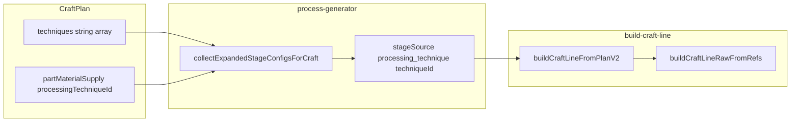

# Аудит: планирование крафта, энциклопедия и Крафтовая линия

Документ фиксирует, **какие идентификаторы техник** проходят от выбора в планировщике до симуляции этапов и полоски крафта, и где возможны **разночтения в UI**, а не в данных.

Связанные материалы:

- [ENCYCLOPEDIA_MATERIALS_TECHNIQUES_ROADMAP.md](ENCYCLOPEDIA_MATERIALS_TECHNIQUES_ROADMAP.md) — энциклопедия и полоса
- [CRAFT_LINE_RECIPE_TECHNIQUE_COMPOSITION.md](CRAFT_LINE_RECIPE_TECHNIQUE_COMPOSITION.md) — хребет рецепта и насадки техник
- [RECIPE_TEMPLATE_COMPOSITION.md](RECIPE_TEMPLATE_COMPOSITION.md) — материализация рецептов

---

## 1. Инвариант продукта

При выборе «техники» в планировании игрок должен иметь дело с **одной канонической сущностью** из энциклопедии (тот же `id` и тот же реестр), которая затем попадает в развёрнутый таймлайн крафта и в **Крафтовую линию** (микрошаги из тех же источников).

В коде это достигается разделением на **две семьи** с разными реестрами; путаница возникает, если смешивать их в разговоре или в подписях UI.

---

## 2. Две семьи «техник» (не смешивать)

| Семья | Назначение | Где хранятся данные | Поле в `CraftPlan` | `EncyclopediaTechniqueRef` |
|--------|------------|---------------------|--------------------|----------------------------|
| **Боевые / крафтовые приёмы** | Модификаторы боя, якорь на полосе после стадии рецепта | `src/data/techniques.ts`, `getTechniqueById` | `plan.techniques: string[]` | `{ kind: 'craft', id }` |
| **Техники обработки материала** | Плавка, пиление, камень, кожа и т.п. до заготовки | `src/data/material-processing-techniques.ts`, `getMaterialProcessingTechniqueById` | `plan.partMaterialSupply[partId].processingTechniqueId` (при `mode === 'ore_smelt'`) | `{ kind: 'material_processing', id }` |

Имя поля `plan.techniques` в типах относится **только** к боевым приёмам; обработка материалов живёт в `partMaterialSupply`.

---

## 3. Источник правды и энциклопедия

- Карточка обработки в энциклопедии строится от записи `MaterialProcessingTechnique`: ref `{ kind: 'material_processing', id: p.id }`, имя и описание с той же записи (`src/lib/encyclopedia/encyclopedia-technique-sections.ts`, функция вроде `processingCard`).
- Боевой приём — ref `{ kind: 'craft', id }` и данные из `getTechniqueById`.

Микрошаги для полоски и подсказок UI разворачиваются через **`expandTechniqueToDisplaySteps`** (`src/lib/encyclopedia/expand-technique-display-steps.ts`): для `material_processing` и `craft` используются те же `microTasks` / fallback по `processingOperations`, что и при наполнении энциклопедия-карточек.

---

## 4. Поток данных: план → симуляция → полоска

1. **Планировщик** записывает в план выбранные `processingTechniqueId` и `techniques`.
2. **`collectExpandedStageConfigsForCraft`** (тот же контур, что и генерация стадий крафта) вставляет конфиги с `stageSource: 'processing_technique'` и **`techniqueId` из реестра обработки** (`src/lib/craft/process-generator.ts`, в т.ч. `applyPartMaterialSupplyStageConfigs` / `collectProcessingTechniqueStageInsertions`).
3. **`buildCraftLineFromPlanV2`** при встрече такого шага вызывает `buildCraftLineRawFromRefs([{ kind: 'material_processing', id: cfg.techniqueId }])` (`src/lib/craft/build-craft-line.ts`).
4. Боевые приёмы вставляются в том же проходе по развёрнутому таймлайну по **`craftLineAnchorAfterStageIndex`** с ref `{ kind: 'craft', id }`.

**Legacy-ветка полоски:** `buildCraftLineFromPlanLegacy` / `buildCraftLineFromPlan` без хребта собирают refs как «уникальные обработки из плана, затем боевые в порядке выбора» (`collectCraftLineRefsFromPlan`). Порядок и чередование с этапами рецепта **не совпадают** с `buildCraftLineFromPlanV2`; это отдельный режим отображения, а не другой набор id.

**Включение V2-полоски с хребтом:** `buildCraftLineFromPlanWithRecipe` — при флаге/условиях и наличии `craftLineMicroSteps` у стадий рецепта используется `buildCraftLineFromPlanV2`, иначе legacy (`src/lib/craft/build-craft-line.ts`).

---

## 5. Сводка согласованности id

| Этап | Обработка материала | Боевой приём |
|------|---------------------|--------------|
| Тип / комментарий в `CraftPlan` | `PartMaterialSupplyEntry.processingTechniqueId` — комментарий указывает реестр `material-processing-techniques` | `techniques[]` — id из `data/techniques` |
| Энциклопедия | `ref.kind === 'material_processing'`, тот же `id` | `ref.kind === 'craft'`, тот же `id` |
| Развёрнутые стадии | `techniqueId` на конфиге со `stageSource: 'processing_technique'` | Стадии приёмов / вставки по якорю; ref в полоске `{ kind: 'craft', id }` |
| Крафтовая линия | Сегменты с `techniqueRef: { kind: 'material_processing', id }` | Сегменты с `techniqueRef: { kind: 'craft', id }` |
| Подписи микрошагов | `expandTechniqueToDisplaySteps` + реестр обработки | `expandTechniqueToDisplaySteps` + `getTechniqueById` |

**Вывод по данным:** один выбранный в планировщике id обработки или боевого приёма проходит в симуляцию и в полоску **без параллельного «теневого» справочника** — при условии, что UI не подменяет смысл пользователю другим текстом.

---

## 6. Разрешение техники обработки по части

`resolveProcessingTechniqueForPart` (`src/data/material-processing-techniques.ts`):

- Если в записи поставки указан `processingTechniqueId` и он подходит к якорю каталожного материала — используется **именно он**.
- Иначе берётся **первая доступная** техника из `getAvailableMaterialProcessingTechniques` (`list[0]`).

**Риск:** при отсутствии или неверном `processingTechniqueId` симуляция и полоска покажут **не тот** вариант, который пользователь думает, что выбрал (автовыбор). Это не рассинхрон реестров, а fallback поведения.

---

## 7. Выявленные разночтения (в основном UX)

### 7.1. Бейджи в панели обработки части

В `PartMaterialProcessingPanel` короткий бейдж («Плавка», «Дерево», …) строится от **`badgeForBuilding(refining?.requiredBuilding)`**, а не от `technique.name` (`src/components/forge/craft-v2/planner/PartMaterialProcessingPanel.tsx`).

- В энциклопедия и на полоске доминируют **имя техники** и микрошаги из реестра обработки.
- Игрок может воспринимать бейдж как «название техники», хотя это **категория постройки/цепочки** refining.

**Рекомендация:** в планировщике явно разделить **заголовок = `technique.name`**, **бейдж = домен/постройка** (или подпись «цепочка: …»), чтобы визуально совпадало с энциклопедией.

### 7.2. Legacy vs V2 полоска

При отключённом хребте или отсутствии `craftLineMicroSteps` используется упрощённая сборка refs; порядок блоков **не обязан** совпадать с порядком `generateCraftStages`. Идентификаторы техник те же, **топология полоски** другая.

### 7.3. Слова «техника» в разных экранах

Везде использовать уточнение: «приём» vs «обработка материала», либо единый термин из глоссария UI, чтобы не смешивать `plan.techniques` и `processingTechniqueId`.

---

## 8. Definition of Done для изменений

- Любой новый выбор в планировщике, который должен отразиться в энциклопедии и на полоске, **обязан** иметь стабильный `id` в соответствующем реестре (`techniques` или `material-processing-techniques`).
- Симуляция стадий и полоска для этого выбора должны опираться на **один и тот же** `id` в `collectExpandedStageConfigsForCraft` и в `buildCraftLineFromPlanV2` (или на согласованный legacy-порядок, если намеренно legacy-only).
- UI планировщика не должен показывать **другую** «главную» подпись сущности, чем энциклопедия (бейджи — только вторичная классификация).
- При добавлении сущности — обновить трассы в [technique-wiring skill](../.cursor/skills/technique-wiring/SKILL.md) (боевые / обработка по разделению выше).

---

## 9. Индекс ключевых файлов

| Область | Файл |
|---------|------|
| Тип плана | `src/types/craft-v2.ts` (`CraftPlan`, `PartMaterialSupplyEntry`) |
| Реестр обработки | `src/data/material-processing-techniques.ts` |
| Реестр приёмов | `src/data/techniques.ts` |
| Развёртка стадий и вставки обработки | `src/lib/craft/process-generator.ts` |
| Полоска V2 / legacy | `src/lib/craft/build-craft-line.ts` |
| Микрошаги для UI | `src/lib/encyclopedia/expand-technique-display-steps.ts` |
| Мета/фаза блоков полоски | `src/lib/craft/craft-line-meta.ts` |
| Панель выбора обработки | `src/components/forge/craft-v2/planner/PartMaterialProcessingPanel.tsx` |
| Тесты полоски V2 | `src/lib/craft/craft-line-v2.test.ts`, `src/lib/craft/build-craft-line.test.ts` |
| Согласование симуляции и линии | `src/lib/craft/craft-line-sim-alignment.test.ts` |
| Интеграция генератора | `src/lib/craft/process-generator.integration.test.ts` |

---

## 10. Итог

- **Идентификаторы** выбранной обработки и выбранных приёмов **согласованы** между планом, энциклопедией (`EncyclopediaTechniqueRef`), симуляцией (`processing_technique` / якоря приёмов) и Крафтовой линией V2.
- Основное место, где пользователь может «почувствовать бардак» без нарушения id — **подписи и бейджи планировщика** (бейдж от постройки vs имя техники везде остально) и **fallback** на первую доступную технику обработки.
- **Legacy-полоска** — тот же набор техник, но **другой порядок** относительно этапов рецепта; это нужно учитывать при тестировании «полоска = таймлайн».
