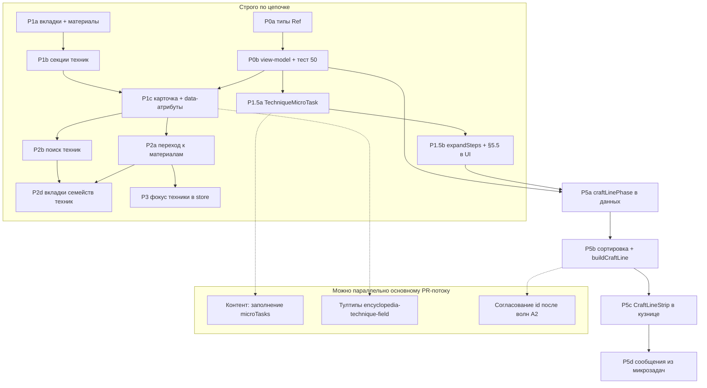

# Энциклопедия: «Материалы» и «Техники» — дорожная карта UI и данных

**Статус:** ТЗ на реализацию (согласовано с [MATERIALS_SINGLE_SOURCE_ROADMAP.md](MATERIALS_SINGLE_SOURCE_ROADMAP.md) **§3.4**, **§5.4**).  
**Цель:** один экран навигации «Энциклопедия» с двумя разделами верхнего уровня: весь текущий функционал каталога материалов остаётся под **Материалы**; новый раздел **Техники** даёт обзор всех техник проекта, сгруппированных по **типу данных / игровой роли**, с переходами к связанным материалам там, где это уже описано в данных. Параллельно закладывается **единая платформа микрозадач** (**§10**) и универсальный термин **Крафтовая линия** (**§12**): порядок техник при сборке процесса, полоска этапов и микроэтапов, доли времени, цвета блоков и сообщения из данных микрозадач.

**Skill добавления техник:** [`.cursor/skills/technique-wiring/SKILL.md`](../.cursor/skills/technique-wiring/SKILL.md) (**§11**). **План работ, риски и журнал:** **§4** (в т.ч. **§4.0–4.1**, подзадачи **P\***), **§13** worklog.

---

## 1. Зачем это нужно

- Игрок и разработчик видят **единую точку входа** в каталог материалов и в **все семейства техник** (ковка, обработка сырья, изучение, перековка, ремонт), без просмотра разрозненных экранов.
- Дорожная карта материалов ([MATERIALS_SINGLE_SOURCE_ROADMAP.md](MATERIALS_SINGLE_SOURCE_ROADMAP.md)) проводит границу между **обработкой материала** и **боевыми приёмами ковки**; в интерфейсе энциклопедии это должно быть **явно подписано**, чтобы не смешивать контуры.
- Карточки материалов уже содержат «Как получить» и сессии изучения; раздел **Техники** закрывает обратный взгляд: **что за техника и к чему относится**.

---

## 2. Целевой UX

### 2.1 Верхний уровень

| Раздел | Содержимое |
|--------|------------|
| **Материалы** | Весь текущий сценарий экрана: поиск, категории (`CategoryTabs`), «Только открытые», сетка `MaterialCard`, блок активных сессий изучения, dev-кнопка теста экспертизы, справка внизу. Заголовок экрана: например «Энциклопедия» → подзаголовок раздела «Материалы». |
| **Техники** | Новый контент: навигация по **типам техник** (см. §3), внутри типа — группы/подтипы и **карточки техник** (имя, краткое описание из данных, метаданные: источник разблокировки, применимость, ссылки на материалы/рецепты где уместно). Поиск по имени/id — см. **§4 P2b**. |

Переключатель верхнего уровня: **вкладки (Tabs)** или **сегментированный контрол** в шапке текущего `EncyclopediaScreen`, единый layout (`game-layout` пункт «Энциклопедия» без второго пункта в nav).

### 2.1.1 Раздел «Техники»: вкладки по семействам (как категории материалов)

**Сейчас в реализации:** пять блоков §3 идут **вертикально** на одной странице (удобно для обзора, но длинная прокрутка).

**Целевой UX (следующий инкремент, §4 P2d):** второй уровень навигации **внутри** вкладки «Техники» — горизонтальный переключатель по **пяти значениям `EncyclopediaTechniqueKind`** (`material_processing`, `craft`, `material_study`, `reforge`, `repair`), **по аналогии с `CategoryTabs`** у материалов: одна под-вкладка = одно семейство реестра, контент — заголовок/пояснение §3 для активного семейства + сетка `EncyclopediaTechniqueCard`. Порядок вкладок совпадает с порядком секций в `buildEncyclopediaTechniqueSections` (см. `SECTION_ORDER` в [`encyclopedia-technique-sections.ts`](../src/lib/encyclopedia/encyclopedia-technique-sections.ts)).

- **Поиск:** фильтровать карточки **внутри выбранного семейства** или по всем — зафиксировать в PR (по умолчанию разумно «текущая вкладка», опция «везде» — позже).
- **Доступность / мобильная укладка:** те же паттерны, что у материалов (`CategoryTabs`, перенос, `aria-label`).
- **Persist (опционально, низкий приоритет):** запоминать последнее семейство `lastEncyclopediaTechniqueKindTab` в Zustand (аналогично `lastEncyclopediaTab` для «Материалы | Техники»); облако — только после явного расширения `collectSaveData` / Zod.

### 2.2 Сохранение состояния (рекомендация)

- **Локальный React state** для раздела (`materials` | `techniques`) достаточно для MVP.
- Опционально: последний открытый раздел и **тип/якорь** в Zustand (persist не обязателен); приоритет ниже, чем фокус материала для навигации из ленты.

### 2.3 Навигация извне

- Сейчас: `encyclopediaFocusMaterialId` + `resolveEncyclopediaFocusMaterialId` — открытие **Материалов** с прокруткой к карточке ([`encyclopedia-screen.tsx`](../src/components/screens/encyclopedia-screen.tsx)).
- **Расширение:** см. **§4 фаза 3 (P3a–P3b)** — `encyclopediaFocusTechniqueRef` + переключение на вкладку «Техники» и прокрутка к элементу с `data-encyclopedia-technique` / `data-encyclopedia-technique-kind`. До внедрения P3 сообщения `gameMessages` ведут в материалы, как сейчас.

---

## 3. Таксономия типов техник (как группировать в UI)

Ниже — **пять корневых типов**, совпадающих с отдельными реестрами/моделями в коде. Внутри каждого типа — предлагаемые **подгруппы для списка**.

### 3.1 Ковка: боевые приёмы (`Technique`)

| | |
|--|--|
| **Источник данных** | [`src/data/techniques`](../src/data/techniques/index.ts) (`allTechniques`, `techniqueById`) |
| **Тип** | [`Technique`](../src/types/craft-v2.ts) |
| **Файлы** | [`basic.ts`](../src/data/techniques/basic.ts), [`advanced.ts`](../src/data/techniques/advanced.ts) |
| **Количество** | **15** (6 базовых + 9 продвинутых) |
| **Подгруппы в UI** | **По источнику:** `source.type` — стартовые (`start`), гильдия (`guild`), подземелья (`dungeon`). Альтернатива/дополнение: метка «Базовые» / «Продвинутые» по файлу происхождения. |
| **Что показывать на карточке** | `name`, `description`, `effects.appliesTo`, кратко штрафы/бонусы (`penalties`, `effects`), `requiredLevel`, `source`; при наличии — `processMods`, `compatibility`. |
| **Связь с материалами** | `requiredMaterials`, `compatibility.appliesToMaterials` — клик ведёт в **Материалы** с `setEncyclopediaFocusMaterialId` (после доработки навигации). |

**Перечень id (имена в данных):**

- Базовые: `basic_forging`, `folded_steel`, `double_hardening`, `balanced_design`, `masterful_polish`, `elven_forging`.
- Продвинутые: `celestial_hardening`, `spirit_blessing`, `cold_drawing`, `dragon_hardening`, `runic_engravement`, `master_balance`, `artistic_carving`, `leather_tanning`, `differential_hardening`.

### 3.2 Обработка материалов (`MaterialProcessingTechnique`)

| | |
|--|--|
| **Источник данных** | [`src/data/material-processing-techniques.ts`](../src/data/material-processing-techniques.ts) (`allMaterialProcessingTechniques`) |
| **Тип** | `MaterialProcessingTechnique` (тот же файл) |
| **Количество** | **12** |
| **Подгруппы в UI** | По **`targetSemanticProcessRoles`** (например `refining_smelting`, `refining_tanning`) и/или по **домену** из `targetCatalogMaterialIds` (металлы / дерево / камень / кожа). |
| **Что показывать** | `name`, `description`, целевые материалы, флаги `unlockedByDefault`, бонусы обработки, несовместимости с другими техниками обработки и с **боевыми** id из §3.1; кратко — связь с рецептом переработки (`refiningRecipeId` / операции). |
| **Связь с материалами** | Прямая: `targetCatalogMaterialIds` → фокус карточки материала. Согласовано с roadmap: обработка = контейнер операций ([MATERIALS_SINGLE_SOURCE_ROADMAP.md](MATERIALS_SINGLE_SOURCE_ROADMAP.md) **§3.2**, **§5**). |

**Перечень id:**  
`forge_basic_iron_smelt`, `forge_fine_iron_smelt`, `forge_basic_copper_smelt`, `forge_basic_tin_smelt`, `forge_basic_bronze_smelt`, `forge_basic_silver_smelt`, `forge_basic_steel_smelt`, `forge_basic_gold_smelt`, `forge_basic_mithril_smelt`, `forge_basic_wood_planks`, `forge_basic_stone_blocks`, `forge_basic_leather_tan`.

### 3.3 Изучение материалов в энциклопедии (`MaterialStudyTechnique`)

| | |
|--|--|
| **Источник данных** | [`src/data/material-study-techniques.ts`](../src/data/material-study-techniques.ts) |
| **Тип** | [`MaterialStudyTechnique`](../src/types/material-study.ts) |
| **Количество** | **4** |
| **Подгруппы в UI** | Одна группа «Сессии изучения» или по длительности / наличию `targetMaterialIds` (универсальные vs узкие под камень). |
| **Что показывать** | `name`, `description`, длительность, `materialCosts`, ограничение `targetMaterialIds`. |
| **Связь** | К материалам стоимости и к целевым id; основной UX остаётся в **Материалы** (`MaterialCard` уже запускает изучение). |

**Перечень id:** `study_quick_notes`, `study_surface_reading`, `study_sample_work`, `study_masonry_sketch`.

### 3.4 Перековка (`ReforgeTechniqueEntry`)

| | |
|--|--|
| **Источник данных** | [`src/data/reforge/reforge-techniques-registry.ts`](../src/data/reforge/reforge-techniques-registry.ts) |
| **Тип** | `ReforgeTechniqueEntry` |
| **Количество** | **5** |
| **Подгруппы в UI** | По **`reforgeType`:** `buffStat` / `awakenScar`; внутри — по **`reforgeTier`:** `basic` / `specialized`. |
| **Что показывать** | `name`, `description`, стоимость души, `minGuildLevel`, опционально `sourceCraftTechniqueId` (ссылка на технику из §3.2), `catalogMaterialSpendIds`. |
| **Связь** | Экран зачарований / перековки — не дублировать полный редактор; энциклопедия даёт **справочник**. |

**Перечень id:** `reforge_buff_attack_01`, `reforge_buff_max_durability_01`, `reforge_buff_attack_02`, `reforge_buff_max_durability_02`, `reforge_awaken_scar_01`.

### 3.5 Ремонт (`RepairTechniqueDefinition`)

| | |
|--|--|
| **Источник данных** | [`src/data/weapon-damage/repair-techniques-registry.ts`](../src/data/weapon-damage/repair-techniques-registry.ts) |
| **Тип** | [`RepairTechniqueDefinition`](../src/types/weapon-repair.ts) |
| **Количество** | **14** |
| **Подгруппы в UI** | По **`repairTier`:** `basic` / `specialized` (константы в реестре). |
| **Что показывать** | `name`, `description`, какие **теги повреждений** снимает (`clearsTagIds` — человекочитаемо или счётчик), стоимость (`materials` / `goldCost`), этапы — свернуто. |
| **Примечание** | В стоимости пока встречаются **legacy-ключи** (`ironIngot`, `wood`, …); в карточке можно подписать «как в ремонте» до полного слияния с `materialId` ([MATERIALS_SINGLE_SOURCE_ROADMAP.md](MATERIALS_SINGLE_SOURCE_ROADMAP.md) **A2**). |

**Перечень id:** `durability_maintenance`, `edge_truing`, `haft_tightening`, `basic_metal_stress_relief`, `basic_elemental_stabilization`, `notch_filing`, `guard_straightening`, `binding_relief`, `corrosion_cleanup`, `frost_crack_seal`, `axis_straightening`, `elemental_prima_treatment`, `elemental_veil_treatment`, `blade_soul_tending`.

---

## 4. План внедрения по фазам

Фазы спроектированы так, чтобы **ранние** давали видимый инкремент игроку, а **поздние** наращивали полноту и связность без переписывания каркаса. Ниже: **граф зависимостей**, **риски**, затем **фазы с подзадачами** (дробление крупных шагов).

### 4.0 Последовательность и параллелизм

| Режим | Что делаем |
|--------|------------|
| **Строго последовательно** | **P0a → P0b** (типы без сборщика — пустая модель). **P1a → P1b → P1c** (вкладки до полноценной карточки, иначе двойной рефактор экрана). **P1.5a → P1.5b** (тип `TechniqueMicroTask` до отображения «Ход работы»). **P5a → P5b → P5c → P5d** (поля фазы линии и длительностей до UI полосы и сообщений). **P3** желательно после **P2a** (нужен стабильный DOM для scroll). |
| **Параллельно** | Заполнение **microTasks** в данных после **P1.5a** (контент ≠ код). **Иконки и тултипы** после скелета карточки **P1c**. **P2b** (поиск) и **P2a** (чипы к материалам) — параллельно или по очереди; **P2d** (вкладки семейств) логично сразу после **P2b** + **P2a**, когда карточки и поиск уже есть. Ревью **MATERIALS_SINGLE_SOURCE_ROADMAP** / A2 — не блокирует P0–P1, но блокирует финальную валидацию расходов в **P5** если меняются `materialId`. |
| **Зависит от внешних дорожных карт** | Полное слияние линии с **persist** черновика крафта и **Turso** — согласовать с [MATERIALS_SINGLE_SOURCE_ROADMAP.md](MATERIALS_SINGLE_SOURCE_ROADMAP.md) **§3.6** и [cloud-save-feature.ts](../src/lib/cloud-save-feature.ts) перед релизом «одна линия в облаке». |

### 4.1 Риски и снижение

| Риск | Вероятность / ущерб | Снижение |
|------|---------------------|----------|
| **Монолитный PR фазы 1** | Высокая / долгий ревью, регрессии энциклопедии материалов | Разбить: **P1a** только Tabs + вынос тела материалов; **P1b** список без богатой карточки; **P1c** карточка. После каждого подшага — `npm run test` + ручной смоук вкладки «Материалы». |
| **Коллизия `id` между реестрами** | Средняя / неверный фокус и persist | Обязательный **`EncyclopediaTechniqueRef` `{ kind, id }`**; запрет использовать сырой `id` как глобальный ключ в store; тест уникальности пары. |
| **Рассинхрон микрозадач и `process-generator`** | Высокая после P5 | Одна точка **`expandTechniqueToDisplaySteps`** (**§10.3**) для ENC и CraftLine; снапшот-тест «план X → N сегментов, сумма долей = 1». |
| **Неверный порядок техник на линии** | Высокая / ломается повествование и баланс времени | Ввести **`craftLinePhase` / `craftLineOrder`** раньше первого UI полосы (**P5a**); юнит-тест «плавка перед приёмом ковки» (**§12.3**); при спорных рецептах — явный override в данных, не эвристика в коде. |
| **Деградация a11y (цветовые блоки)** | Средняя | Токены темы + проверка контраста; не только цвет: **порядковый номер этапа**, `aria-label` с названием микрозадачи; режим «упрощённая полоса» при `prefers-reduced-motion`. |
| **Дублирование копирайта сообщений** | Средняя | Шаблоны с параметрами `{microTaskLabel, partName}`; один модуль строк; **§10.6** инвентаризация хардкода. |
| **Волны A2 / смена `materialId`** | Средняя / битые чипы в ENC | После каждой волны — прогон **[technique-wiring](../.cursor/skills/technique-wiring/SKILL.md)** и сканер контракта материалов; чипы только из `materialById`. |
| **Захламление slice энциклопедии** | Низкая / сложный merge | **P3**: новые поля фокуса техники вынести в минимальный патч; не смешивать с логикой изучения материалов в одном коммите. |
| **Экспертиза техник (фаза 4)** без геймдиза | Низкая / переделка | Не внедрять persist экспертизы техник, пока нет отдельного ТЗ; **P0** уже оставляет опциональные пропсы (**§5.3**). |

### Фаза 0 — Контракт UI и задел под экспертизу (без данных в store)

**Цель:** зафиксировать **стабильный ключ для любой техники в энциклопедии** и единый слой отображения, чтобы позже подмешать экспертизу без смены разметки.

| Подзадача | Действие | Деталь |
|----------|----------|--------|
| **P0a** | Типы | Ввести **дискриминант** **`EncyclopediaTechniqueKind`** = `'craft' \| 'material_processing' \| 'material_study' \| 'reforge' \| 'repair'` и составной ключ **`EncyclopediaTechniqueRef`** `{ kind, id }`. Сериализация `` `${kind}:${id}` `` — только для индексов Record, не как единственный публичный API. |
| **P0b** | View-model + тест | Модуль `src/lib/encyclopedia/*` (например `encyclopedia-technique-card-model.ts`): **реестр → `EncyclopediaTechniqueCardModel`** (§5). Опционально `expertisePercent?`, `expertiseTierLabel?`. Тест: **49** записей, пары `(kind, id)` уникальны. |

**Выход:** типы и сборщик модели; компонент карточки может отсутствовать.

### Фаза 1 — Раздел «Техники» и навигация экрана

**Цель:** вкладки **Материалы | Техники** на [`encyclopedia-screen.tsx`](../src/components/screens/encyclopedia-screen.tsx), контент материалов без регрессий.

| Подзадача | Действие | Деталь |
|----------|----------|--------|
| **P1a** | Вкладки + изоляция | shadcn `Tabs`; заголовок «Энциклопедия»; вкладка «Материалы» = **текущий JSX без изменений поведения**; при `encyclopediaFocusMaterialId` — открыта «Материалы». |
| **P1b** | Секции | `techniques-section.tsx`: пять блоков §3, поясняющая строка «обработка vs приёмы ковки»; можно **простой список** (имя + тип) перед P1c. |
| **P1c** | Карточка | `EncyclopediaTechniqueCard` + `data-encyclopedia-technique-kind` / `data-encyclopedia-technique-id`; прокидывание модели из P0b. |

**Выход:** полный каталог в UI по спецификации §5.

### Фаза 2 — Связи с материалами и polish

**Цель:** связать справочник техник с каталогом материалов.

| Подзадача | Действие | Деталь |
|----------|----------|--------|
| **P2a** | Навигация | Chips `materialId` → `setEncyclopediaFocusMaterialId` + вкладка **Материалы**. |
| **P2b** | Поиск | Debounced фильтр по имени/id в шапке «Техники». |
| **P2c** | Иконки | Lucide по `kind`; единый маппинг в `src/lib/encyclopedia/` или рядом с секцией. |
| **P2d** | Вкладки семейств | Внутри «Техники»: горизонтальный переключатель по **пяти** `EncyclopediaTechniqueKind` (как `CategoryTabs` у материалов); одна под-вкладка = одна секция из `buildEncyclopediaTechniqueSections`; см. **§2.1.1**. Зависит от **P2b** (поведение поиска относительно активной вкладки). |

**Опционально:** обратные ссылки материал → техники (не обязательно для закрытия P2).

### Фаза 3 — Фокус из ленты и persist вкладки

| Подзадача | Действие | Деталь |
|----------|----------|--------|
| **P3a** | Store | `encyclopediaFocusTechniqueRef`, `setEncyclopediaFocusTechniqueRef`, сброс после scroll. |
| **P3b** | Сообщения | Расширение `navigationTarget` / типов в [`encyclopedia-slice`](../src/store/slices/encyclopedia-slice.ts) при появлении ссылок на техники. |
| **P3c** | Persist опц. | `lastEncyclopediaTab` — низкий приоритет. |

### Фаза 4 — Экспертиза техник (отдельный эпик)

Не входит в текущий скоуп; **P0–P1** уже оставляют пропсы и ключ. Требуется отдельное ТЗ: формулы, persist, Turso, влияние на прогноз.

### Фаза 1.5 — Микрозадачи в данных (без смены оркестратора)

**Цель:** список шагов в технике + отображение в ENC; оркестратор — **фаза 5**.

| Подзадача | Действие | Деталь |
|----------|----------|--------|
| **P1.5a** | Тип + поля | `TechniqueMicroTask`, поле **`microTasks`** (или согласованное имя §10.2) в типах реестров; валидация непустого `label`. |
| **P1.5b** | Нормализация + UI | `expandTechniqueToDisplaySteps`; секция **§5.5** в карточке; fallback из `processingOperations` где нет явных шагов. |
| **P1.5c** | Контент | Постепенное заполнение массивов в данных (**параллельно** разработке, отдельные маленькие PR). |

### Фаза 5 — Оркестратор и Крафтовая линия

Сборка исполняемого таймлайна (**§10.4**), упорядочивание (**§12.3**), доли времени (**§12.1**), UI (**§12**), сообщения (**§10.4 п.6**), вывод из хардкода (**§10.6**).

| Подзадача | Действие | Деталь |
|----------|----------|--------|
| **P5a** | Данные порядка | `craftLinePhase`, `craftLineOrder` (и при необходимости `durationWeight` на микрозадаче) в типах техник; дефолты для обработки vs ковки. |
| **P5b** | Логика | Расширение [`timeline-composition.ts`](../src/lib/craft/timeline-composition.ts) / [`process-generator.ts`](../src/lib/craft/process-generator.ts): сортировка блоков, **`buildCraftLine`** (**§12.4**), сумма `durationShare` = 1. |
| **P5c** | UI полосы | Общий компонент (**§6**) в кузнице; затем ремонт / перековка / алтарь по приоритету продукта. |
| **P5d** | Сообщения | Генерация текста прогресса из активной микрозадачи + шаблон; депрекейт параллельных списков строк. |

---

## 5. Дизайн карточки техники

Основа — паттерн [`MaterialCard`](../src/components/encyclopedia/material-card.tsx): `Card` → `CardHeader` (заголовок, бейджи, иконка) → `CardContent` (блоки информации, сетки, сворачиваемые секции при необходимости). Визуальная иерархия и отступы — как у материалов (те же utility-классы `space-y-3`, мелкая типографика `text-xs` / `text-stone-500`).

### 5.1 Общая структура (все типы)

| Зона | Содержимое |
|------|------------|
| **Контейнер** | `Card` с `hover:scale-[1.02]`, `hover:shadow-lg`, бордер. Цвет подложки: не «редкость», а **семейство техники** (лёгкий оттенок): ковка — янтарь/огонь; обработка — оранжево-коричневый (горн); изучение — сине-студеный; перековка — фиолетовый; ремонт — стальной серо-голубой. Без дублирования палитры редкости материалов. |
| **Шапка** | Слева: `CardTitle` — `name` из данных. Справа: квадратная иконка 48×48 в `bg-stone-800/50` (Lucide по `kind`). Под заголовком: ряд `Badge` — **тип** (человекочитаемо: «Приём ковки», «Обработка материала», …), **подтип** (источник / tier / роль обработки), при необходимости «По умолчанию открыто» для `unlockedByDefault`. |
| **Блок экспертизы (задел)** | Отдельная **секция с фиксированным порядком** в `CardContent` сразу под шапкой: если `expertisePercent == null` — **не показывать** прогресс-бар, но оставить возможность включить «скелет» через проп `showExpertisePlaceholder` в dev или когда появятся данные. Когда экспертиза будет введена: разметка как у материала — подпись «Экспертиза», `Progress`, подпись порога/стадии (аналог `KNOWLEDGE_LABELS`). См. §5.3. |
| **Описание** | Абзац `description` из данных (всегда виден в справочнике; без гейта по экспертизе в отличие от материалов). |
| **Сводка эффектов** | Унифицированная сетка 2 колонки (`grid grid-cols-2 gap-2 text-xs`) — строки строятся из **нормализованных пар** «метка → значение», см. §5.2. Иконки слева как у `CraftImpactTooltipRow` (опциональные `Tooltip` для длинных формулировок). |
| **Связанные материалы** | Секция «Материалы»: чипы с именами из `materialById`; клик → фокус в разделе **Материалы** (фаза 2). |
| **Детали / несовместимости** | Секция ниже с мелким списком или `Collapsible`: всё, что не поместилось в сводку (длинные списки id тегов ремонта, `incompatibleWith*`, этапы ремонта, операции обработки). |

### 5.2 Сводка по типам (что попадает в сетку и в «Детали»)

Один компонент карточки принимает **уже нормализованный** `EncyclopediaTechniqueCardModel`, чтобы не размазывать `switch (kind)` по JSX.

**Ковка (`Technique`)**

| Сводка (коротко) | Детали (collapsible / нижний блок) |
|------------------|-------------------------------------|
| Части: `effects.appliesTo` (человекочитаемо) | `processMods`, полный `compatibility`, `requiredMaterials` |
| Бонусы: краткие числа из `effects` (атака, качество, прочность, проводимость, эстетика) | Полные `penalties` (множитель времени, риск, штрафы, отходы) |
| Требования: уровень, источник (`source.type` + `condition`) | — |

**Обработка (`MaterialProcessingTechnique`)**

| Сводка | Детали |
|--------|--------|
| Целевые материалы (имена) | `processingOperations` (порядок, `refiningRecipeId`, I/O `materialId` если есть) |
| `processingQualityBonus`, `outcomeModifiers.forecastSpreadTightness` (в процентах / долях с подписью) | `craftStageInsertions`, полные списки `incompatibleWithMaterialProcessingTechniqueIds` / `incompatibleWithCraftTechniqueIds` с резолвом имён |
| `unlockedByDefault`, семантические роли (`targetSemanticProcessRoles`) | — |

**Изучение (`MaterialStudyTechnique`)**

| Сводка | Детали |
|--------|--------|
| Длительность (как у таймеров в материалах) | Полный список `targetMaterialIds` если узкая техника |
| Стоимость: чипы материалов + количество | — |

**Перековка (`ReforgeTechniqueEntry`)**

| Сводка | Детали |
|--------|--------|
| Тип: бафф стата / пробуждение шрама; tier basic/specialized | Диапазоны `buffPercent*`, `maxStacks`, `awakenBaseChance`, флаги души |
| Душа войны: фиксированная или «вся» (`awakenSpendsAllWarSoul`) | `sourceCraftTechniqueId` → ссылка на карточку обработки или имя соседней техники |
| Гильдия: `minGuildLevel` | `catalogMaterialSpendIds` |

**Ремонт (`RepairTechniqueDefinition`)**

| Сводка | Детали |
|--------|--------|
| Tier basic/specialized | Этапы: названия + длительности списком |
| Золото | Полный `clearsTagIds` (или «снимает N типов повреждений» + раскрытие) |
| Материалы ремонта (подпись «расход как в мастерской»; legacy ключи → читаемые имена где возможно) | `requiresPrepWarning`, прочие флаги из типа |

Тексты тултипов вынести в объект рядом с [`encyclopedia-craft-bonus-tooltips.ts`](../src/lib/encyclopedia/encyclopedia-craft-bonus-tooltips.ts) (например `encyclopedia-technique-field-tooltips.ts`), чтобы не плодить хаос в разметке.

### 5.3 Задел под экспертизу техник (без реализации сейчас)

| Слой | Решение |
|------|---------|
| **Ключ** | Вся логика будущего persist и формул опирается на **`EncyclopediaTechniqueRef`**, а не на голый `id` (разные реестры могут теоретически пересечься по строке). |
| **Модель карточки** | Опциональные поля: `expertisePercent?: number` (0–100), `expertiseStageLabel?: string`, позже — производные бонусы (аналог `calculateExpertiseImpact` для материалов). Пока поля не передаются из стора — блок с прогрессом **скрыт**. |
| **Разметка** | В коде карточки выделить функцию `renderTechniqueExpertiseSection(props)` или подкомпонент с **единым** порядком элементов; когда данных нет — `return null`, но интерфейс пропсов уже содержит опциональную экспертизу. |
| **Стор (будущее)** | Например `techniqueKnowledge: Record<string, { expertise: number; ... }>` с ключом `` `${kind}:${id}` `` **или** вложенные объекты по `kind`; методы `setTechniqueExpertise`, миграции — в эпике фазы 4. |
| **Гейты отображения** | По аналогии с материалом можно заложить **раскрытие «продвинутых» строк** сводки только после порога экспертизы; в ТЗ на будущее, сейчас вся нормативная информация справочника **без гейтов**. |
| **Отличие от материалов** | У материалов есть «не открыто» при `expertise < 1`. Для техник до введения экспертизы карточка **всегда полная справочная**; после введения — отдельное решение (скрывать ли детали до первого использования). |

### 5.4 Доступность и плотность

- У иконок в сводке — `aria-hidden` или осмысленные `aria-label` на кнопках перехода к материалу.
- Длинные списки (`clearsTagIds`, несовместимости) — свернуты по умолчанию, с кнопкой «Показать всё».
- На узких экранах сетка 2→1 колонка как в карточке материала.

### 5.5 Микрозадачи («Ход работы») в карточке техники

Показывать **после** описания и до (или рядом со) сводкой эффектов — отдельная секция с подзаголовком **«Ход работы»** / **«Этапы применения»**.

| Правило | Деталь |
|---------|--------|
| Источник | Массив шагов из данных техники (**§10.2**); для обработки материалов на переходный период допускается **генерация подписей** из `processingOperations` (порядок `order`), пока явные `microTasks` не заполнены. |
| Визуал | Вертикальный нумерованный список или ступени с лёгким разделителем; стиль как у плотного текста карточки материала (`text-sm` / `text-stone-300`). |
| Пусто | Нет данных — секция скрыта, без заглушки «нет шагов» (чтобы не шуметь). |
| Будущее | Тот же порядок id/лейблов — опора для **Крафтовой линии**: подсегменты блока техники (**§12**). |

**Пример (контент):** техника «Цементационный метод (переходный, сталь)» — микрозадачи: Обжиг руды → Сыродутная плавка → Проковка крицы → Цементация; на **Крафтовой линии** — четыре подсегмента одного цветного блока этой техники (**§12.1**).

---

## 6. Затрагиваемые файлы (ориентир для PR)

| Область | Файлы / действия |
|---------|------------------|
| Экран | [`src/components/screens/encyclopedia-screen.tsx`](../src/components/screens/encyclopedia-screen.tsx) — Tabs, условный рендер: блок «Материалы» ≈ текущее тело; новый блок «Техники». |
| UI техник | [`techniques-section.tsx`](../src/components/encyclopedia/techniques-section.tsx) + `EncyclopediaTechniqueCard`; после **P2d** — второй уровень `Tabs`/`TabsList` по `EncyclopediaTechniqueKind` (см. **§2.1.1**); экспорт из [`encyclopedia/index.ts`](../src/components/encyclopedia/index.ts). |
| Сборка данных | Чистая функция `buildEncyclopediaTechniqueSections()` в `src/lib/encyclopedia/` — импорты реестров §3, **без дублирования** массивов id вручную (итерировать существующие константы); нормализация микрозадач — **§10.2**. |
| Типы | `TechniqueMicroTask` + опциональные поля в реестрах техник (**фаза 1.5**). |
| Платформа процесса | `src/lib/craft/` — [`process-generator.ts`](../src/lib/craft/process-generator.ts), [`timeline-composition.ts`](../src/lib/craft/timeline-composition.ts); сборка **Крафтовой линии** `buildCraftLine` — **§12.4** (фаза 5). |
| UI полосы | Общий компонент (например `src/components/forge/craft-v2/CraftLineStrip.tsx` или `src/components/shared/process-line-view.tsx`) — потребители: кузница, ремонт, перековка, алтарь. |
| Тесты | Unit-тест: «каждая запись из пяти реестров попадает ровно в одну секцию»; снимок числа элементов по типам (**50** всего: 15+12+4+5+14). |
| Документация | При стабилизации UX — одна строка в [docs/data/TECHNIQUES_DATA.md](data/TECHNIQUES_DATA.md) со ссылкой на этот документ и уточнением, что **боевые** техники — только `data/techniques`. |

Слайс [`encyclopedia-slice.ts`](../src/store/slices/encyclopedia-slice.ts) менять **не обязательно** для MVP раздела «Техники» до **фазы 3** (нет новых действий с техниками, только отображение и навигация к материалам через существующие экшены фокуса).

---

## 7. Критерии готовности (Definition of Done)

1. На экране «Энциклопедия» пользователь переключается между **Материалы** и **Техники** без потери текущего поведения материалов (включая фокус по `encyclopediaFocusMaterialId`).
2. В **Техники** отображаются **все** сущности из пяти реестров §3, ни одна не выпадает из списков.
3. Группировка **по типам** соответствует таблице §3; подзаголовки внутри типа согласованы с полями данных (источник, tier, `reforgeType`, роли обработки и т.д.).
4. Игроку явно видно подпись, что **«обработка материала»** и **«приёмы ковки»** — разные семейства (как в [MATERIALS_SINGLE_SOURCE_ROADMAP.md](MATERIALS_SINGLE_SOURCE_ROADMAP.md) **§5.4**). После **P2d** то же разделение доступно **переключателем вкладок** по семействам (**§2.1.1**), а не только прокруткой длинной страницы.
5. Компонент карточки техники и view-model допускают подмешивание **экспертизы** через опциональные пропсы/поля (**§5.3**); при отсутствии данных блок прогресса не отображается.
6. После **фазы 1.5:** у техник с заполненными микрозадачами в карточке отображается **§5.5**; тип и валидация списка — **§10.2**.
7. CI: `npm run type-check`, `npm run lint`, `npm run test` без регрессий.

**Опционально для закрытия фазы 2:** **P2a**–**P2c**; **P2d** (вкладки семейств в «Техники») — см. **§4** и **§2.1.1**.

---

## 8. Вне скоупа (следующие фазы)

- Полная **сборка таймлайна** из микрозадач для всех систем сразу — **§4 фаза 5 (P5a–P5d)** + **§10**; до этого микрозадачи могут жить как **справочный** слой в энциклопедии.
- Начисление и влияние **экспертизы техник** на крафт/прогноз — отдельный эпик после задела **§4 фаза 4** и **§5.3** (не только UI, но и store, баланс, Turso при необходимости).
- Редактирование или разблокировка техник из энциклопедии (кроме уже существующего изучения материалов в карточке материала).
- Объединение типов в одну схему БД/UI — только после целевой модели «операции в технике» ([MATERIALS_SINGLE_SOURCE_ROADMAP.md](MATERIALS_SINGLE_SOURCE_ROADMAP.md) **§3.2**, **§7 фазы 3–4**).
- Локализация имён, не приходящая из текущих данных.

---

## 9. Связь с другими документами

- [MATERIALS_SINGLE_SOURCE_ROADMAP.md](MATERIALS_SINGLE_SOURCE_ROADMAP.md) — §3.4 энциклопедия, §5 техники обработки, §5.4 смежные техники.
- [docs/systems/CRAFT_SYSTEM_ROADMAP.md](systems/CRAFT_SYSTEM_ROADMAP.md) — B1 изучение, §6.13 UX карточки; таймлайн и **Крафтовая линия** (**§12** здесь).
- [docs/data/TECHNIQUES_DATA.md](data/TECHNIQUES_DATA.md) — краткий обзор **боевых** техник; микрозадачи и линия — **§10**, **§12**.
- [docs/utils/FORMULAS.md](utils/FORMULAS.md) — длительности этапов и вставки техник обработки (связь с долями **§12.1**).
- Журнал правок этого ТЗ — **§13 Worklog**.

---

## 10. Микрозадачи и платформа процесса

### 10.1 Назначение

**Микрозадачи** — упорядоченный список того, **что именно делает мастер** в рамках одной техники: не сухой id этапа в коде, а понятные игроку подписи (как в примере с цементацией). Требования:

- **Гибкость:** у любой техники **любое количество** шагов (включая 0 до заполнения контентом).
- **Единый смысл:** тот же список (или его машинное представление) в перспективе питает **прогресс** в Craft v2, ремонте, перековке, фазах алтаря и любых будущих процессах — вместо разрозненных **предзаписанных сообщений**.
- **Сборка крафта:** игрок выбирает **рецепт**, **материалы** и **набор техник работы**; **итоговый процесс** (полная последовательность шагов и длительностей/расходов) **выводится** из композиции выбранных техник и плана частей, а не из одного фиксированного скрипта сообщений.

Сверху согласовано с [MATERIALS_SINGLE_SOURCE_ROADMAP.md](MATERIALS_SINGLE_SOURCE_ROADMAP.md) **§3.2** (техника как контейнер операций) и **§5.3** (операции как данные): микрозадачи могут **совпадать по смыслу** с операциями или быть **плотнее/крупнее** для UX; цель — одна трассируемая цепочка «данные → UI → исполнение».

### 10.2 Модель данных (предложение)

| Элемент | Описание |
|---------|----------|
| **`TechniqueMicroTask`** | Минимум: `label: string`. Опционально: `id` (стабильный для телеметрии/сейва прогресса), `hint` / `description` для тултипа, `iconKey`, позже — `durationWeight`, `costSlice`, привязка к `materialId` / `stageType`. |
| **Поле на технике** | Рабочее имя: например **`microTasks: readonly TechniqueMicroTask[]`** на каждом типе техники, где это уместно; для **`MaterialProcessingTechnique`** допустимо деривировать подписи из `processingOperations` до полного паритета. |
| **Валидация** | `label.trim().length > 0`; порядок = порядок в массиве; дубликаты `id` внутри одной техники запрещены, если `id` заданы. |

Поле добавляется **по реестрам** (`Technique`, `MaterialProcessingTechnique`, при необходимости ремонт/перековка/изучение) единообразно, чтобы энциклопедии и будущий оркестратор читали один контракт.

### 10.3 Нормализация для UI и прогресса

Ввести чистую функцию уровня:

`expandTechniqueToDisplaySteps(ref: EncyclopediaTechniqueRef): TechniqueMicroTask[]`

Она возвращает либо явные `microTasks`, либо fallback из операций/этапов ремонта, либо пустой массив. Так **энциклопедия** и **полоса прогресса** используют один вход.

### 10.4 Композиция процесса крафта (целевое)

Высокоуровневый алгоритм (для фазы 5):

1. Взять **рецепт** → базовый скелет частей и обязательных стадий (если остаётся минимальный костяк из рецепта).
2. Для каждой части подставить **материал** и выбранные **техники обработки** → вставить/заменить шаги (сейчас частично через `craftStageInsertions` / `processingOperations`).
3. Добавить выбранные **боевые техники** → `processMods` / дополнительные шаги.
4. **Упорядочить техники** в линию процесса по правилам **§12.3** (обработка материала / плавка / заготовки **раньше**, чем сборка и боевые приёмы ковки, если не задано иное явными данными).
5. **Свернуть** в линейный или графовый **ProcessTimeline**: каждый пункт имеет ссылку на источник (`techniqueRef`, индекс микрозадачи, тип системы `craft` | `repair` | …) и **долю длительности** для отрисовки **Крафтовой линии** (**§12**).
6. **Сообщения игроку** брать из **текущей микрозадачи** (её `label` и шаблон с контекстом части/материала), а не из параллельного списка предзаписанных фраз.

Детальная реализация — в [`process-generator.ts`](../src/lib/craft/process-generator.ts), [`timeline-composition.ts`](../src/lib/craft/timeline-composition.ts), [`use-craft-v2.ts`](../src/hooks/use-craft-v2.ts) и согласованных типах `CraftStageSource` / контракта таймлайна; UI полосы — общий примитив **§12**.

### 10.5 Другие системы

| Система | Как использовать микрозадачи |
|---------|------------------------------|
| **Ремонт** | Уже есть `stages` в `RepairTechniqueDefinition`; цель — привести к тому же **визуальному** и **идентификаторному** контракту, что и `TechniqueMicroTask`, или маппить `stages → microTasks` в `expandTechnique…`. |
| **Перековка** | Микрозадачи описывают ход ритуала/правки; прогресс — по шагам выбранной записи `REFORGE_TECHNIQUES`. |
| **Алтарь** | Фазы стройки или ритуалы → список шагов из данных фазы + привязанных техник (`requiredMaterialProcessingTechniqueIds`). |
| **Новые фичи** | Любая новая «длинная» операция подключается через **реестр техник** + массив микрозадач + регистрацию в оркестраторе. |

### 10.6 Миграция от предзаписанных сообщений

- Инвентаризация мест, где прогресс/лог сейчас завязан на **жёсткие строки** или несвязанные шаблоны.
- Постепенная замена: сообщение строится из **текущего шага** нормализованного таймлайна (`label` микрозадачи + контекст материала/части).
- Критерий выхода: для Craft v2 **основной** поток крафта не требует отдельного параллельного списка «текстов этапов», кроме локализации и шаблонов формулировок.

---

## 11. Skill добавления техники

Чтобы агент и разработчик подключали техники **одинаково**, в репозитории заведён skill:

- **[`.cursor/skills/technique-wiring/SKILL.md`](../.cursor/skills/technique-wiring/SKILL.md)** — чеклист: куда внести запись, несовместимости, операции/рецепты, микрозадачи (**§10.2**), тесты, регистрация в оркестраторе/UI, ссылки на этот документ и [MATERIALS_SINGLE_SOURCE_ROADMAP.md](MATERIALS_SINGLE_SOURCE_ROADMAP.md).

При добавлении техники **всегда** указывать, к какому семейству (§3) она относится, нужен ли блок **микрозадач** для энциклопедии и **Крафтовой линии** (**§12**), и в какой **фазе линии** (§12.3) техника должна стоять относительно других.

---

## 12. Крафтовая линия (универсальный термин)

**Крафтовая линия** — единый для проекта принцип отображения **длительного процесса**, собранного из **техник** и их **микрозадач**. Это полоска в интерфейсе (адаптивный индикатор): визуально она показывает, *где* сейчас игрок в процессе и *что* делается на каждом шаге.

### 12.1 Иерархия: этапы и микроэтапы

| Уровень | Смысл | Визуал |
|---------|--------|--------|
| **Этап (блок)** | Одна **техника** в общей упорядоченной последовательности применения (один «вызов» техники в крафтовой линии: например выбранная плавка для части или выбранный боевой приём). Блок окрашен **в цвет, закреплённый за этой техникой** (или за семейством + вариация). | Непрерывный цветной сегмент полосы. |
| **Микроэтап (часть блока)** | Одна **микрозадача** из данных этой техники (**§10.2**). Внутри блока микроэтапы **того же базового оттенка** (или одного цвета с тонкими разделителями — решение UI). | Подсегменты внутри блока. |
| **Длина подсегмента** | Доля **времени**: ширина микроэтапа пропорциональна **`duration_i / Σ duration`** по всему процессу (проценты от **общего** времени крафта/операции после расчёта в [`process-generator`](../src/lib/craft/process-generator.ts) / композиторе линии). Если у микрозадачи нет отдельного времени — используется равный вес между микрозадачами техники или вес из операции / этапа. | Сумма подсегментов блока = доля времени **всех** микрозадач этой техники в процессе. |

Итог: полоска = сумма блоков; блок = сумма микроэтапов; **цвет блока = техника**, **текст сообщения прогресса = микрозадача** (см. §10.4 п.6).

### 12.2 Универсальность по системам

Один контракт данных и по возможности **один UI-компонент** (например `CraftLineStrip` / `ProcessLineView`) для:

- **Craft v2** (основной кейс);
- **ремонта** (блоки по стадиям техники ремонта ↔ микрозадачи);
- **перековки**, **фаз алтаря**, любых будущих длительных действий.

Различие только в **источнике** списка техник и в том, как считается Σduration.

### 12.3 Порядок техник при сборке линии (логика)

Требование: техники **получения слитка/заготовки** (обработка материала, плавка, доска, блок, кожа и т.д.) попадают в **Крафтовую линию раньше**, чем техники **сборки/формообразования оружия** и **боевые приёмы ковки**, если иное не задано явно в данных (краевые кейсы рецепта).

| Механизм | Описание |
|----------|----------|
| **Фазы линии** | Ввести в данных техник поле в духе **`craftLinePhase`** (или **`timelineLane`**) с упорядочиваемыми значениями, например: `material_preparation` → `recipe_forming` → `craft_finishing` (имена зафиксировать в `types/`). Сортировка блоков: сначала меньший ранг фазы, внутри фазы — **`craftLineOrder?: number`**, затем стабильный тай-брейк по `techniqueId`. |
| **Обработка материала** | `MaterialProcessingTechnique` по умолчанию фаза **`material_preparation`** (или эквивалент); несколько частей — блоки обработки упорядочивать по зависимостям частей рецепта или по явному `craftLineOrder` в технике. |
| **Боевые приёмы** | `Technique` из `data/techniques` — по умолчанию фазы **`craft_finishing`** и/или вставка согласно `processMods` **после** подготовки материала затронутых частей. |
| **Валидация** | Юнит-тест: для типового плана «руда + плавка + клинок» блок плавки имеет меньший индекс в уплощённой линии, чем блок приёмов ковки на этой же сборке. |

Топологические зависимости «часть B требует подготовленный материал части A» уже задаются планом; **фаза линии** — явный слой, чтобы не выводить порядок только эвристикой из текста.

### 12.4 Модель для UI (предложение)

Нормализованная структура для полосы:

`CraftLineSegment[]` — дискриминированный союз:

- **`source: 'technique'`** — `techniqueRef`, `microTaskIndex`, `durationShare`, `colorToken`, `label`;
- **`source: 'recipe_backbone'`** — `recipeId`, `stageIndex`, `stableId` (id микроэтапа хребта), те же `durationShare` / `colorToken` / `label`.

Сумма **`durationShare`** по всем сегментам = 1. Сборщики: **`buildCraftLine`** (только техники), **`buildCraftLineFromPlanWithRecipe`** (обработка + хребет + приёмы с якорями при включённом флаге, см. [CRAFT_LINE_RECIPE_TECHNIQUE_COMPOSITION.md](CRAFT_LINE_RECIPE_TECHNIQUE_COMPOSITION.md) §7).

### 12.5 Связь с документацией и кодом

- Крафт, таймлайн, контракт плана: [docs/systems/CRAFT_SYSTEM_ROADMAP.md](systems/CRAFT_SYSTEM_ROADMAP.md) (в т.ч. `timeline-composition`, фаза 4.1).
- Материалы и техники как контейнеры операций: [MATERIALS_SINGLE_SOURCE_ROADMAP.md](MATERIALS_SINGLE_SOURCE_ROADMAP.md) **§3.2**, **§5**.
- Формулы длительности этапов: [docs/utils/FORMULAS.md](utils/FORMULAS.md) (крафт, §6.13, вставки из техник обработки).
- Целевая склейка **макроэтапов рецепта** и **микрозадач техник** на одной полосе: [CRAFT_LINE_RECIPE_TECHNIQUE_COMPOSITION.md](CRAFT_LINE_RECIPE_TECHNIQUE_COMPOSITION.md) (v2 с хребтом по умолчанию; opt-out: `NEXT_PUBLIC_CRAFT_LINE_RECIPE_BACKBONE=false` — только техники, legacy).  
- Массовый авторинг рецептов: [RECIPE_TEMPLATE_COMPOSITION.md](RECIPE_TEMPLATE_COMPOSITION.md) — шаблоны и фрагменты процесса, материализация в `WeaponRecipe`, микроэтапы хребта на уровне шаблона и дельты рецепта.

---

## 13. Worklog

Журнал решений по этому документу. Новые строки — вверху таблицы (последняя запись первая).

| Дата | Изменение |
|------|-----------|
| 2026-04-10 | **§12.4:** модель сегмента — union техника / хребет рецепта; сборщики и env-флаг хребта; **§12.5** — уточнение статуса в коде. |
| 2026-04-10 | Спецификация **RECIPE_TEMPLATE_COMPOSITION.md** (шаблоны/фрагменты рецептов, материализация в `WeaponRecipe`); ссылка в **§12.5**, [README](README.md), §10 ТЗ меча. |
| 2026-04-10 | Концепция **CRAFT_LINE_RECIPE_TECHNIQUE_COMPOSITION.md:** полоса целиком из микроэтапов — хребет рецепта + насадки техник; ссылка в **§12.5** и [docs/README.md](README.md). |
| 2026-04-10 | ТЗ: **§2.1.1** и **P2d** — второй уровень вкладок в «Техники» по пяти семействам (`EncyclopediaTechniqueKind`), по аналогии с категориями материалов; обновлены граф **§4.0**, фаза 2, **§6** (число **50**), **§7**; **P2d** в коде — следующий инкремент. |
| 2026-04-10 | **P2a–P2c:** чипы «Связанные материалы» → `setEncyclopediaFocusMaterialId`, ремонт только каталожные id в `relatedMaterialIds`; поиск по техникам в `TechniquesSection`; `encyclopedia-technique-kind-ui.ts`. **P3a–P3b:** `encyclopediaFocusTechniqueRef`, скролл по `data-encyclopedia-technique-*`; `GameMessageNavigationTarget.techniqueRef` и ветка в `game-messages-dock`. **P3c:** `lastEncyclopediaTab` в persist (**STORE_VERSION 32**). |
| 2026-04-10 | Закрыты **P0a–P0b** (типы, `buildEncyclopediaTechniqueSections`, Vitest на **50** записей и уникальность пар `(kind, id)`), **P1a–P1c** (вкладки «Материалы \| Техники», пять секций, `EncyclopediaTechniqueCard`, `data-encyclopedia-technique-*`), **P1.5a–P1.5b** (`TechniqueMicroTask`, опциональное `microTasks` на обработке, `expandTechniqueToDisplaySteps`, блок «Ход работы» для обработки и ремонта). Исправлена цифра в §3.1: приёмов ковки **15**, не 14. Код: текущая ветка / PR. |
| 2026-04-10 | Добавлены **§4.0** (граф mermaid, параллельно/последовательно), **§4.1** (риски и митигация), дробление фаз на **P0a–P0b, P1a–P1c, P2a–P2d, P3a–P3c, P1.5a–P1.5c, P5a–P5d**; исправлена опечатка «дисриминант» → **дискриминант**; заведён **worklog §13**. |
| *ранее* | Введены разделы проектирования: энциклопедия материалы/техники, микрозадачи (**§10**), skill **§11**, **Крафтовая линия §12**; перекрёстные ссылки в README, AGENTS, CRAFT_SYSTEM_ROADMAP, FORMULAS, TECHNIQUES_DATA, MATERIALS_SINGLE_SOURCE_ROADMAP. |

**Как вести:** при закрытии P-подзадачи из §4 — одна строка: дата, какой PR/подзадача, ссылка на issue по желанию. При изменении §12/§10 — обновить связанные документы из §12.5 и §9.
