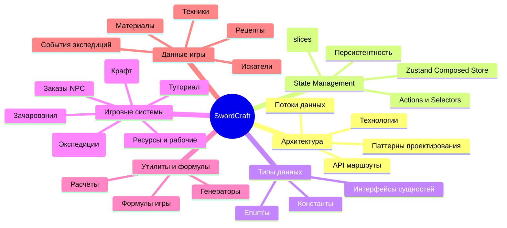

# Документация SwordCraft

## Навигация по документации

Этот файл является точкой входа во всю документацию проекта SwordCraft.

## Карта систем проекта

## Как пользоваться документацией

### Для AI агентов
1. Начните с чтения [AGENTS.md](../AGENTS.md) - главный навигационный файл
2. При работе с конкретной системой - читайте соответствующий файл ниже
3. Всегда проверяйте типы в [docs/04_TYPES_SYSTEM.md](04_TYPES_SYSTEM.md) перед изменениями
4. При необходимости - читайте архитектуру и потоки данных в [docs/01_ARCHITECTURE.md](01_ARCHITECTURE.md)

### Для разработчиков
1. Начните с [docs/01_ARCHITECTURE.md](01_ARCHITECTURE.md) - обзор технологий и архитектуры
2. Изучите структуру проекта в [docs/02_PROJECT_STRUCTURE.md](02_PROJECT_STRUCTURE.md)
3. Для работы с state - читайте [docs/03_STATE_MANAGEMENT.md](03_STATE_MANAGEMENT.md)
4. Для работы с типами - смотрите [docs/04_TYPES_SYSTEM.md](04_TYPES_SYSTEM.md)
5. Тесты и команды проверки — раздел **«Тесты и проверка качества»** в [AGENTS.md](../AGENTS.md); скрипты также перечислены в корневом [README.md](../README.md)

## Файлы документации

### Навигация и архитектура
| Файл | Описание |
|---------|---------|
| [AGENTS.md](../AGENTS.md) | Главный файл для AI агентов |
| [docs/01_ARCHITECTURE.md](01_ARCHITECTURE.md) | Технологии, паттерны, потоки данных |
| [docs/02_PROJECT_STRUCTURE.md](02_PROJECT_STRUCTURE.md) | Структура файлов и папок проекта |

### Техническая документация
| Файл | Описание |
|---------|---------|
| [docs/ENCYCLOPEDIA_MATERIALS_TECHNIQUES_ROADMAP.md](ENCYCLOPEDIA_MATERIALS_TECHNIQUES_ROADMAP.md) | Энциклопедия: разделы материалы/техники, **микрозадачи**, **Крафтовая линия** (этапы и микроэтапы, порядок техник, UI полосы), платформа процесса |
| [docs/CRAFT_LINE_RECIPE_TECHNIQUE_COMPOSITION.md](CRAFT_LINE_RECIPE_TECHNIQUE_COMPOSITION.md) | **Центр проработки:** рецепт + Крафтовая линия + техники — хребет, насадки, фазы внедрения, риски; связь с `TZ_SWORD_…` и `RECIPE_TEMPLATE_…` |
| [docs/RECIPE_TEMPLATE_COMPOSITION.md](RECIPE_TEMPLATE_COMPOSITION.md) | **Модуль рецептов:** шаблоны, фрагменты, `RecipeDefinition`, материализация в `WeaponRecipe`, приложение §14 (меч / кинжал / топор) |
| [docs/03_STATE_MANAGEMENT.md](03_STATE_MANAGEMENT.md) | Zustand store, слайсы, actions, selectors |
| [docs/04_TYPES_SYSTEM.md](04_TYPES_SYSTEM.md) | Все интерфейсы, enum'ы, константы |
| [docs/PROJECT_AUDIT.md](PROJECT_AUDIT.md) | Актуальные риски и техдолг (живой аудит); журнал закрытых пунктов и **P1** |
| [docs/P2_ARCHITECTURE_INVENTORY.md](P2_ARCHITECTURE_INVENTORY.md) | **P2:** инвентаризация (крафт v1/v2, store, корень репо, examples) и бэклог задач |
| [docs/LEGACY_UI.md](LEGACY_UI.md) | **Legacy:** верхняя панель `ResourceBar` — не канон материалов; канон — энциклопедия; план удаления |

### Игровые системы
| Файл | Описание |
|---------|---------|
| [docs/systems/FORGE_SYSTEM.md](systems/FORGE_SYSTEM.md) | Крафт оружия, качество, War Soul, ремонт, **перековка** (фаза 1) |
| [docs/systems/SIMPLE_REPAIR_TECHNIQUES_PROPOSAL.md](systems/SIMPLE_REPAIR_TECHNIQUES_PROPOSAL.md) | **Ремонт:** 5 базовых техник (расширение edge/haft + 2 новых), лейт только узкими, отказ от авто-ремонта за золото, FAQ «уголь / авто» |
| [docs/systems/WAR_SOUL_CONCEPT_AND_FORECAST.md](systems/WAR_SOUL_CONCEPT_AND_FORECAST.md) | **Душа войны:** тиры, пул `maxWarSoul`, масштаб ×4000, прогноз крафта и идеи переработки UI |
| [docs/systems/CRAFT_SYSTEM_ROADMAP.md](systems/CRAFT_SYSTEM_ROADMAP.md) | **Дорожная карта крафта:** стадии материалов, экспертиза, техники и цепочки обработки (фазы A–E) |
| [docs/systems/GUILD_SYSTEM.md](systems/GUILD_SYSTEM.md) | Гильдия, искатели, экспедиции, модификаторы |
| [docs/systems/ELEMENTAL_PLATFORM_SPEC.md](systems/ELEMENTAL_PLATFORM_SPEC.md) | **Канон v1.0:** оси урона, стихии, шрамы, чеклист событий §3.5, словарь UI §3.6 |
| [docs/systems/ELEMENTAL_PLATFORM_IMPLEMENTATION.md](systems/ELEMENTAL_PLATFORM_IMPLEMENTATION.md) | План внедрения платформы осей/стихий и **worklog** по фазам |
| [docs/systems/RESOURCE_SYSTEM.md](systems/RESOURCE_SYSTEM.md) | Добыча, шахты, рабочие, здания |
| [docs/systems/ORDER_SYSTEM.md](systems/ORDER_SYSTEM.md) | Заказы NPC, требования, скрытые теги |
| [docs/systems/ENCHANTMENT_SYSTEM.md](systems/ENCHANTMENT_SYSTEM.md) | Школы магии, уровни, жертвоприношение (legacy-описание) |
| [docs/systems/ENCHANTMENT_AWAKENING_CONCEPT.md](systems/ENCHANTMENT_AWAKENING_CONCEPT.md) | **Канон** модуля зачарований: пробуждения, древо, слияние, план фаз 0–5 |
| [docs/systems/ENCHANTMENT_MODULE_PHASE0.md](systems/ENCHANTMENT_MODULE_PHASE0.md) | **Фаза 0:** детальный план, worklog, правила разработки модуля |
| [docs/systems/ENCHANTMENT_MODULE_PHASE1.md](systems/ENCHANTMENT_MODULE_PHASE1.md) | **Фаза 1:** гейт экрана «Зачарования», перековка, to-do 1.3, сверка с концепцией |
| [docs/systems/ENCHANTMENT_ALTAR_CONSTRUCTION_PHASE_STANDARD.md](systems/ENCHANTMENT_ALTAR_CONSTRUCTION_PHASE_STANDARD.md) | **Стройка алтаря (стандарт макрофазы I–V):** store, UI, квест FF, интендант, аудит баланса/горна, чеклисты и типичные дефекты |
| [docs/systems/ENCHANTMENT_MODULE_PHASE2_ALTAR_CONSTRUCTION.md](systems/ENCHANTMENT_MODULE_PHASE2_ALTAR_CONSTRUCTION.md) | **Фаза 2 (проект):** постройка алтаря, связь с квестом, материалы, техники, крафт v2 |
| [docs/systems/ENCHANTMENT_MODULE_PHASE2_IMPLEMENTATION_ROADMAP.md](systems/ENCHANTMENT_MODULE_PHASE2_IMPLEMENTATION_ROADMAP.md) | **Фаза 2:** пошаговый план внедрения по фазам (данные → крафт v2 → UI → техники → QA) |
| [docs/Ecnchantment_System/README.md](Ecnchantment_System/README.md) | Автономный пакет документации для отдельной разработки и обратной интеграции |

### Утилиты и расчёты
| Файл | Описание |
|---------|---------|
| [docs/utils/CRAFT_CALCULATOR.md](utils/CRAFT_CALCULATOR.md) | Расчёт оружия, формулы |
| [docs/utils/EXPEDITION_CALCULATOR.md](utils/EXPEDITION_CALCULATOR.md) | Расчёт экспедиций, модификаторы |
| [docs/utils/GENERATORS.md](utils/GENERATORS.md) | Генерация искателей, заказов |
| [docs/utils/FORMULAS.md](utils/FORMULAS.md) | Все формулы игры |

### Данные игры
| Файл | Описание |
|---------|---------|
| [docs/data/MATERIALS_DATA.md](data/MATERIALS_DATA.md) | Система материалов, бонусы |
| [docs/MATERIAL_SEMANTIC_PROCESS_ROLES.md](MATERIAL_SEMANTIC_PROCESS_ROLES.md) | Смысловые роли материалов в процессах (принципы и фазы A–E) |
| [docs/RESOURCE_TRANSFORMATION_MAP.md](RESOURCE_TRANSFORMATION_MAP.md) | **Карта преобразований:** `materialId` ↔ `ResourceKey`, горн/пилорама, начисления и расход (Mermaid + таблицы) |
| [docs/MATERIALS_SINGLE_SOURCE_ROADMAP.md](MATERIALS_SINGLE_SOURCE_ROADMAP.md) | **Единая система материалов и обработки:** один каталог, склад A2, **техники как контейнеры операций** (целевой динамический таймлайн крафта), без `line_key` на материале; финал без legacy; фазы 0–5, CI, worklog |
| [docs/data/RECIPES_DATA.md](data/RECIPES_DATA.md) | Рецепты оружия и плавки |
| [docs/data/TECHNIQUES_DATA.md](data/TECHNIQUES_DATA.md) | Техники крафта |
| [docs/data/ADVENTURERS_DATA.md](data/ADVENTURERS_DATA.md) | Теги, редкость, генерация |
| [docs/data/EXPEDITIONS_DATA.md](data/EXPEDITIONS_DATA.md) | События экспедиций |

## Ключевые файлы проекта

### State Management
- [src/store/game-store-composed.ts](../src/store/game-store-composed.ts) — единый Zustand store (~1400 строк; cross-slice, напр. ремонт, в [src/store/cross-slice/](../src/store/cross-slice/))
- Все основные домены сходятся в `game-store-composed.ts`; для зачарований рабочий контракт сейчас проходит через `craft-slice` и cross-slice actions, см. `docs/Ecnchantment_System/`

### Типы данных
- [src/types/index.ts](../src/types/index.ts) - Центральный экспорт типов
- Все доменные типы определены в src/types/

### Утилиты бизнес-логики
- [src/lib/craft/calculator.ts](../src/lib/craft/calculator.ts) - Расчёт характеристик оружия
- [src/lib/expedition-calculator-v2.ts](../src/lib/expedition-calculator-v2.ts) - Расчёт экспедиций
- [src/lib/modifier-system/](../src/lib/modifier-system/) - Система модификаторов v2
- [src/lib/adventurer-generator-extended.ts](../src/lib/adventurer-generator-extended.ts) - Генерация искателей

### Сохранения (локально и облако)
- [src/lib/cloud-save-feature.ts](../src/lib/cloud-save-feature.ts) — фича-флаг `NEXT_PUBLIC_CLOUD_SAVE_ENABLED` и чеклист расширения схемы
- [src/hooks/use-cloud-save.ts](../src/hooks/use-cloud-save.ts) — бэкап + опциональная синхронизация с `/api/save`

### Статические данные
- [src/data/](../src/data/) - Все игровые данные (материалы, рецепты, искатели...)
