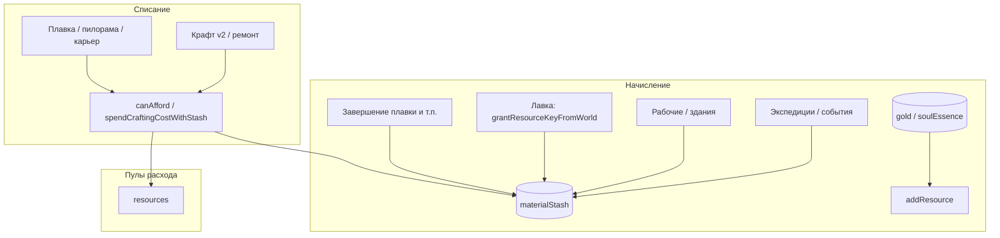
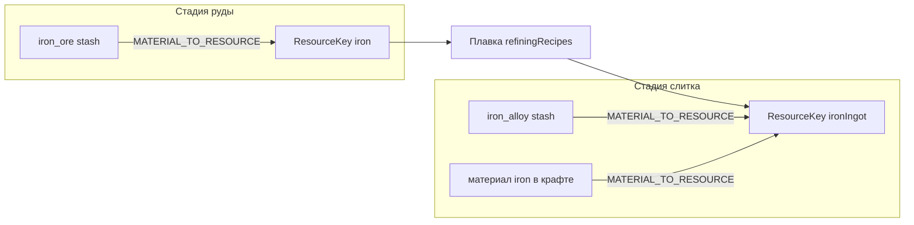
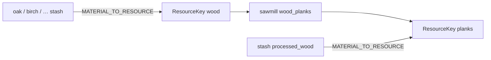

# Карта преобразований ресурсов (inventory → крафт → переработка)

**Назначение:** один экран для человека-разработчика: какие **стадии** (`materialId` каталога), какие **ключи склада** (`ResourceKey` в `resources` + `materialStash`), как **начисляется** лут и как **тратится** крафтом/горном/пилорамой.

**Источник правды — код.** Этот файл — согласованное резюме; при расхождении правьте код, затем обновите карту (см. § «Сопровождение»).

**Связанные документы:** [`MATERIALS_UNIFICATION_AUDIT.md`](MATERIALS_UNIFICATION_AUDIT.md) (дорожная карта фаз), [`MATERIAL_SEMANTIC_PROCESS_ROLES.md`](MATERIAL_SEMANTIC_PROCESS_ROLES.md) (смысловые роли в процессах), [`data/MATERIALS_ADDING.md`](data/MATERIALS_ADDING.md) (как добавлять узел в библиотеку).

---

## 0. Архитектура завершения фазы 3 (A1)

**Принято:** вариант **A1** — сохраняем [`MATERIAL_TO_RESOURCE`](../src/lib/craft/inventory-check.ts) и агрегирующие `ResourceKey`; мост `resources` + `materialStash` не меняется в этом шаге.

- **Пулы руды:** несколько `materialId` дают один ключ **`iron`** или **`mithril`**; доступное количество — сумма по всем id пула ([`getAvailableAmountForResourceKey`](../src/lib/craft/inventory-check.ts)). Тесты: [`inventory-check.test.ts`](../src/lib/craft/inventory-check.ts) (блок про пулы).
- **ENC-only:** [`gatherable-enc-only.ts`](../src/lib/materials/gatherable-enc-only.ts) — реестр **пуст** после TD-INV-2; новые немапящиеся добываемые id временно заносят сюда по **TD-DOC-1**, затем мост и удаление из списка.
- **A2** (только `materialId` в инвентаре) — вне текущего скоупа; см. аудит §5 фаза 3, подпункт **3.0**.

---

## 1. Два слоя учёта (кратко)

| Слой | Где в коде | Что хранит |
|------|------------|------------|
| **`resources`** | [`resources-slice.ts`](../src/store/slices/resources-slice.ts) | `gold`, `soulEssence`, и скаляры вроде `iron` (руда), `ironIngot`, `wood`, `planks`, … |
| **`materialStash`** | тот же slice | `Record<materialId, quantity>` — экспедиции, часть покупок, миграции |

**Мост:** [`getAvailableAmountForResourceKey`](../src/lib/craft/inventory-check.ts) / [`applyCraftingCostSpend`](../src/lib/craft/inventory-check.ts) суммируют **`resources[key]`** и все **`materialId`**, для которых [`MATERIAL_TO_RESOURCE`](../src/lib/craft/inventory-check.ts)[`materialId`] **===** `key`.

**Начисление в stash по `ResourceKey`:** [`getGrantTargetMaterialId`](../src/lib/craft/inventory-check.ts) (руды → `*_ore` через [`REFINING_INPUT_STAGE_MATERIAL_ID`](../src/data/refining-recipes.ts); слитки → узлы `*_alloy` через `RESOURCE_GRANT_STASH_FALLBACK` в том же файле).

---

## 2. Общая блок-схема потоков

---

## 3. Металлы: руда → слиток → кузница

**Правило фазы 3:** ключи **`iron`**, **`copper`**, … в `resources` — это **руда** (как вход горна). Узел **`iron`** (металл клинка в каталоге) мапится на **`ironIngot`**, а не на руду.

| Каталожная руда (`materialId`) | `ResourceKey` (пул руды) | Переработка → | `ResourceKey` слитка | Кузня: узел металла / сплав |
|-------------------------------|--------------------------|----------------|---------------------|------------------------------|
| `iron_ore` | `iron` | `iron_ingot` | `ironIngot` | узел `iron`, `cold_iron` → `ironIngot`; `iron_alloy` → `ironIngot` |
| `copper_ore` | `copper` | `copper_ingot` | `copperIngot` | нет отдельного узла «медь-как-металл» в том же смысле, что iron; сплавы → `copperIngot` и т.д. |
| `tin_ore` | `tin` | `tin_ingot` | `tinIngot` | аналогично |
| `silver_ore` | `silver` | `silver_ingot` | `silverIngot` | узел `silver` → `silverIngot` |
| `gold_ore` | `goldOre` | `gold_ingot` | `goldIngot` | узел `gold` → `goldIngot` |
| `mithril_ore` | `mithril` | `mithril_ingot` | `mithrilIngot` | узел `mithril` → `mithrilIngot` |

Сплавы в крафте (сталь, серебряный сплав, …): раскрытие через **`ALLOY_RECIPES`** в [`inventory-check.ts`](../src/lib/craft/inventory-check.ts) — входы в **слитках** + уголь.

**Выход слитка от качества шихты (семантика C):** при завершении плавки количество продукта умножается на средневзвешенный `oreChargeEfficiency` по фактически списанным `materialId` руды (`computeRefiningSmeltingOutputMultiplier` в том же `inventory-check.ts`; оверрайды — [`material-process-overrides.ts`](../src/data/materials/material-process-overrides.ts)).

**Реестр входов горна:** типы и рецепты — [`refining-recipes.ts`](../src/data/refining-recipes.ts) (`RawResource` / `RefinedResource`).

---

## 4. Дерево и доски

| Каталожные породы (`oak`, `birch`, …) | `ResourceKey` | Примечание |
|--------------------------------------|---------------|--------------|
| все перечисленные в `MATERIAL_TO_RESOURCE` | **`wood`** | один пул «брёвен» для крафта/отображения запаса |
| `processed_wood` | **`planks`** | доски после пилорамы |

**Начисление `ResourceKey` `wood`:** в stash кладётся канон **`oak`** (представитель брёвен) — см. `REFINING_INPUT_STAGE_MATERIAL_ID.wood` в [`refining-recipes.ts`](../src/data/refining-recipes.ts).

**Продуктовое решение A1 (аудит §2.7.1, 2026-04-03):** пул `wood` и отдельный `materialId` для досок сохраняются; отдельные `ResourceKey` по породам — только при смене модели с миграцией сейвов.

**Пул `wood` (A1, как TD-INV-1 для руды):** все варианты брёвен в [`MATERIAL_TO_RESOURCE`](../src/lib/craft/inventory-check.ts) + мост [`world-resource-inventory-bridge.ts`](../src/lib/materials/world-resource-inventory-bridge.ts) дают один ключ **`wood`**; доступное количество — сумма по stash/`resources`. Тесты: [`inventory-check.test.ts`](../src/lib/craft/inventory-check.ts) (блок «wood, leather, and stone pools»).

---

## 5. Камень и блоки

| `materialId` (фрагменты каталога) | `ResourceKey` |
|-----------------------------------|---------------|
| `basic_stone`, `granite`, `obsidian`, `marble` | **`stone`** |
| `processed_stone` | **`stoneBlocks`** |

Начисление **`stone`:** stash **`basic_stone`** (`REFINING_INPUT_STAGE_MATERIAL_ID.stone`). Каменный пул (`red_stone`, `clay`, … из моста) суммируется в **`stone`** — см. тесты пула в [`inventory-check.test.ts`](../src/lib/craft/inventory-check.ts).

---

## 6. Кожа

Все перечисленные в [`MATERIAL_TO_RESOURCE`](../src/lib/craft/inventory-check.ts) варианты кожи сходятся в **`ResourceKey` `leather`** (стадии пока не разведены по отдельным ключам — см. аудит на будущее). Контроль суммы пула — тот же блок тестов в [`inventory-check.test.ts`](../src/lib/craft/inventory-check.ts).

---

## 7. Уголь

| `materialId` | `ResourceKey` |
|--------------|---------------|
| `coal`, `ancient_coal` | **`coal`** |
| `peat` (мост с добываемых узлов) | **`coal`** |

---

## 8. Добываемые узлы library → склад (мост)

Экспедиционные материалы из подпапок [`library/`](../src/data/materials/library/) (`ores/`, `fuels/`, `organics/` …), перечисленные в [`world-resource-nodes.ts`](../src/data/materials/library/world-resource-nodes.ts), с тем же `identity.id` начисляются в `materialStash`. Чтобы они участвовали в плавке/крафте/лавке вместе с ядром библиотеки, их `materialId` добавлены в [`WORLD_RESOURCE_TO_RESOURCE_KEY`](../src/lib/materials/world-resource-inventory-bridge.ts) и **сливаются первыми** в `MATERIAL_TO_RESOURCE` в [`inventory-check.ts`](../src/lib/craft/inventory-check.ts) (ядро **перекрывает** коллизии — например `silver_ore` остаётся как в `CORE`).

| `materialId` (добываемые) | `ResourceKey` | Примечание |
|-------------------------------|---------------|------------|
| `bog_iron`, `depth_iron`, `cold_iron_ore`, `living_ore` | **`iron`** | варианты руды |
| `star_metal` | **`mithril`** | редкое сырьё → пул мифриловой руды |
| `ancient_metal` | **`ironIngot`** | находка «как слиток» |
| `rotten_wood`, `spirit_wood`, `silvered_pine` | **`wood`** | |
| `acorns`, `dream_resin`, `echo_bark`, `forest_moss`, `oak_bark`, `pine_resin`, `silver_bark`, `swamp_moss`, `toxic_moss`, `whisper_moss`, `cryo_fungi`, `memory_leaf`, `mist_herbs`, `wild_herbs`, `ancient_sap` | **`wood`** | TD-INV-2 (кора, смола, мох, травы) |
| `red_stone`, `clay`, `deep_clay`, `depth_stone`, `sulfur` | **`stone`** | |
| `dragon_glass`, `echo_stone`, `fire_stone`, `frozen_crystals`, `moonstone_shards`, `primordial_amber`, `void_crystal`, `volcanic_glass`, `eternal_ice`, `heart_of_the_mountain`, `primordial_ice` | **`stone`** | TD-INV-2 gems/special |
| `shadow_leather`, `dragon_scale` | **`leather`** | |
| `bones`, `decayed_bones`, `poison_gland`, `dragon_bone` | **`leather`** | TD-INV-2 (кости/органика → пул кожи A1) |
| `peat`, `ash_dust`, `black_dust`, `heart_of_flame`, `soulforge_ember` | **`coal`** | топливо / пыль (TD-INV-2) |

Явный реестр **ENC-only** сейчас **пуст** ([`gatherable-enc-only.ts`](../src/lib/materials/gatherable-enc-only.ts)); per-id решения — [`data/ENC_TD_INV2_WAVE_TABLE.md`](data/ENC_TD_INV2_WAVE_TABLE.md).

---

## 9. Лавка (покупка недостающего)

Витрина: [`material-shop.ts`](../src/data/material-shop.ts). Покупка идёт через **`grantResourceKeyFromWorld`** → тот же stash, что и у наград (с учётом `getGrantTargetMaterialId`). **Отображение:** имя и emoji строки витрины для известных позиций подтягиваются из канонического `MaterialNode` (представитель stash — тот же id, что при начислении), чтобы не расходиться с энциклопедией.

---

## 10. Сопровождение карты

При изменении любого из пунктов **обновите этот файл** (или откройте PR с пометкой):

1. [`MATERIAL_TO_RESOURCE`](../src/lib/craft/inventory-check.ts) и `ALLOY_RECIPES` / `RESOURCE_GRANT_STASH_FALLBACK`
2. [`WORLD_RESOURCE_TO_RESOURCE_KEY`](../src/lib/materials/world-resource-inventory-bridge.ts) — новые добываемые id и строка в [`gather-material-config.mjs`](../scripts/gather-material-config.mjs) при добавлении файла
3. [`REFINING_INPUT_STAGE_MATERIAL_ID`](../src/data/refining-recipes.ts) или сами [`refining-recipes.ts`](../src/data/refining-recipes.ts) (входы/выходы)
4. [`material-shop.ts`](../src/data/material-shop.ts) — новые продаваемые `ResourceKey`
5. Миграции persist / облако — [`game-store-composed.ts`](../src/store/game-store-composed.ts), [`use-cloud-save.ts`](../src/hooks/use-cloud-save.ts), чеклист [`cloud-save-feature.ts`](../src/lib/cloud-save-feature.ts)

**Идея на будущее:** скрипт `npm run materials:resource-map`, который генерирует таблицу из `MATERIAL_TO_RESOURCE` + `REFINING_INPUT_STAGE_MATERIAL_ID` (как `materials:phase0`), чтобы строки не расходились с кодом. Пока достаточно ручной синхронизации после осознанных правок.

---

*Версия карты: фаза 3 + мост добываемых узлов library → `ResourceKey`.*
