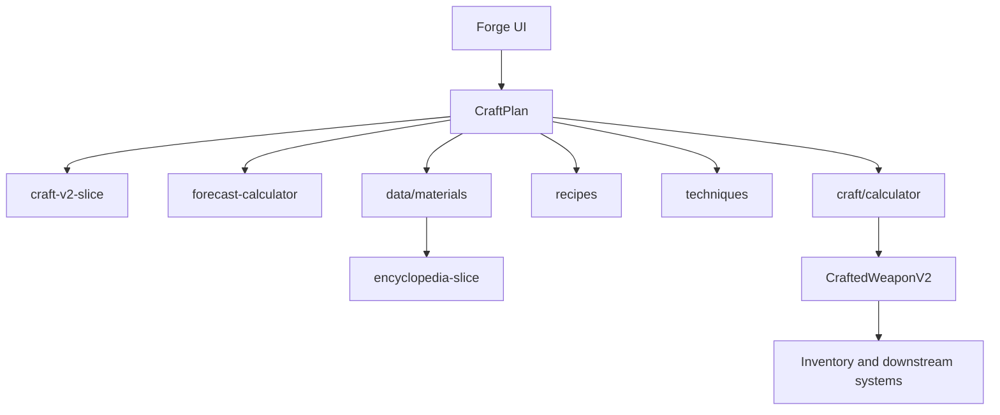

# Справка по новому крафту и материалам в SwordCraft

## Назначение

Этот файл описывает только **актуальные механики**, которые реально используются в проекте сейчас:

- новый крафт `craft v2`;
- новую библиотеку материалов;
- прогноз результата;
- экспертизу по материалам;
- рецепты, части оружия, техники и этапы;
- итоговое оружие `CraftedWeaponV2`.

**Актуализация (март 2026):** в репозитории крафт v2 персистится через `craftV2Persisted` в `game-store-composed.ts` и логику `src/hooks/use-craft-v2.ts`; отдельного `craft-v2-slice.ts` **нет**. Ниже по тексту имя `craft-v2-slice` встречается как **устаревший ярлык** — имеются в виду эти модули.

---

## 1. Картина системы

Новая кузница в проекте строится вокруг идеи **плана крафта**, а не вокруг мгновенного создания предмета по одной кнопке.

Игрок работает с системой так:

1. выбирает рецепт оружия;
2. подбирает материалы по частям оружия;
3. выбирает техники;
4. получает прогноз результата;
5. запускает процесс крафта;
6. проходит этапы;
7. получает `CraftedWeaponV2`.

### Главные файлы системы

- `src/store/slices/craft-v2-slice.ts`
- `src/types/craft-v2.ts`
- `src/lib/craft/calculator.ts`
- `src/lib/craft/forecast-calculator.ts`
- `src/data/recipes/`
- `src/data/stages/`
- `src/data/techniques/`
- `src/data/materials/`
- `src/store/slices/encyclopedia-slice.ts`
- `src/types/materials/knowledge.ts`

### Схема зависимостей



---

## 2. Состояние новой кузницы

Новая кузница хранится в `src/store/slices/craft-v2-slice.ts`.

### Что лежит в state

- `activeCraft` — текущий процесс крафта;
- `completedWeapon` — только что созданное оружие, ожидающее получения;
- `craftedWeapons` — история созданного оружия;
- `unlockedRecipes` — разблокированные рецепты;
- `unlockedTechniques` — разблокированные техники;
- `availableMaterials` — список доступных материалов по ID;
- `stats` — статистика крафта;
- `shouldPurchaseMaterials` — флаг, нужен ли автодокуп материалов.

### Что умеет slice

- запускать крафт;
- отменять крафт;
- обновлять прогресс;
- завершать этапы;
- завершать весь процесс;
- отдавать готовое оружие;
- открывать рецепты, техники и материалы;
- хранить историю.

### Начальное состояние

По умолчанию новая система уже знает:

- стартовые рецепты: `basic_sword`, `basic_dagger`, `basic_axe`;
- стартовую технику: `basic_forging`;
- стартовые материалы: `basic_metal`, `basic_wood`, `basic_leather`, `basic_stone`.

Практический смысл: новая кузница сразу работает как самостоятельный игровой контур, а прогресс выражается в расширении набора доступных решений.

---

## 3. Базовые сущности нового крафта

Главные типы находятся в `src/types/craft-v2.ts`.

## 3.1. `MaterialAssignment`

Это карта назначения материалов по частям:

```ts
{
  [partId]: {
    materialId: string
    quantity: number
  }
}
```

То есть система хранит не "меч из стали", а, например:

- `blade` -> `steel`
- `guard` -> `iron`
- `grip` -> `oak`
- `pommel` -> `iron`

## 3.2. `CraftPlan`

`CraftPlan` — центральная сущность планирования.

Он содержит:

- `recipeId`
- `materials`
- `techniques`
- `shouldPurchaseMaterials`
- `estimatedTime`
- `estimatedStats`
- `estimatedQuality`

Смысл `CraftPlan`: это зафиксированное проектное решение игрока до старта процесса.

## 3.3. `ActiveCraftV2`

Активный крафт хранит:

- сам `plan`;
- список стадий `stages`;
- `currentStageIndex`;
- время начала;
- суммарную длительность;
- прошедшее время;
- `status`;
- лог процесса;
- `result`, если процесс уже завершился.

Это уже не "таймер крафта", а полноценная runtime-модель процесса.

## 3.4. `CraftedWeaponV2`

Итоговое оружие содержит:

- `id`
- `recipeId`
- имя в разложенном виде: `prefix`, `baseName`, `suffix`, `fullName`
- `type`
- `tier`
- список использованных материалов
- `stats`
- `quality`
- `qualityGrade`
- `qualityRank`
- `warSoul`
- `maxWarSoul`
- `sellPrice`
- `hiddenTags`
- `combatMaterialId`
- `currentDurability`
- `epicMultiplier`
- `techniquesUsed`

Важно: это не просто результат калькуляции, а объект, который дальше живёт в других системах.

---

## 4. Как устроен рецепт оружия

Рецепты лежат в `src/data/recipes/` и задают каркас будущего оружия.

### Что задаёт рецепт

- `id`
- `name`
- `type`
- `description`
- `parts`
- `combatPart`
- `baseStats`
- `stages`
- `source`
- `requiredLevel`

## 4.1. Части оружия

Каждый рецепт определяет набор частей через `parts`.

Для части задаются:

- `id`
- `name`
- `materialTypes`
- `minQuantity`
- `maxQuantity`
- `optional`
- `dominantProperty`
- `secondaryProperty`

### Пример логики частей

Для меча:

- `blade` — главный боевой элемент;
- `guard` — защита и устойчивость;
- `grip` — удобство и контроль;
- `pommel` — баланс и вес.

Для топора и кинжала набор частей может быть проще.

### Почему `parts` так важны

Новая система крафта не работает по схеме "выбрать один материал на всё оружие".  
Рецепт заставляет думать по частям, а значит:

- комбинировать свойства;
- подбирать баланс между уроном, весом, прочностью и удобством;
- использовать разные материалы в разных ролях.

## 4.2. `combatPart`

`combatPart` указывает, какая часть считается основной боевой.

Обычно это:

- `blade` для мечей, топоров, кинжалов.

Этот выбор важен для боевых характеристик и для downstream-систем, например для тегов оружия и материала боевой части.

## 4.3. `baseStats`

Базовые статы рецепта:

- `attackBase`
- `durabilityBase`
- `weightBase`
- `soulCapacityBase`

Это стартовая база до влияния материалов, техник и качества.

## 4.4. `stages`

Рецепт хранит не только результат, но и последовательность стадий.

Стадии бывают разных типов:

- подготовка;
- обработка сырья;
- формовка;
- сборка;
- отделка.

Внутри стадии могут быть ссылки на:

- `material`
- `target`
- `stageType`

То есть процесс крафта в системе описывается как структура, а не как одна формула.

---

## 5. Новая библиотека материалов

Материалы в проекте задаются через `MaterialNode` и живут в `src/data/materials/`.

Это центральный слой вариативности нового крафта.

### Главная идея

Материал — это не просто бонус на атаку или прочность.  
Материал описывается как многомерная сущность с физическими, химическими, магическими, технологическими и экономическими свойствами.

## 5.1. Где брать материалы

Главная точка входа — `src/data/materials/index.ts`.

Она даёт:

- `allMaterials`
- `materialById`
- `getMaterialById(id)`
- `getMaterialsByClass(className)`
- `getMaterialsByTag(tag)`
- `getMaterialsByTier(tier)`
- `getAvailableMaterials(playerLevel, unlockedMaterials)`
- `searchMaterials(query)`
- `searchMaterialsByCategory(category, query)`
- `getMaterialsForPart(partId, allowedCategories)`

## 5.2. Классы материалов

В библиотеке материалы делятся по классам:

- `metal`
- `mineral`
- `wood`
- `leather`

Дальше они маппятся в UI-категории:

- `ores`
- `ingots`
- `stones`
- `wood`
- `leather`
- `other`

## 5.3. Что содержит `MaterialNode`

На уровне системы материал включает:

- идентичность;
- физические свойства;
- химические свойства;
- магические свойства;
- параметры обработки;
- экономику;
- summary для UI;
- рецепт создания, если материал перерабатываемый;
- пути открытия.

### Практически важные блоки

#### `identity`

Содержит:

- `id`
- `name`
- `class`
- `origin`
- `tags`

#### `physical`

Содержит, среди прочего:

- `density`
- `hardness`
- `toughness`
- `elasticity`
- `meltingPoint`
- `thermalConductivity`
- `porosity`
- `compressiveStrength`
- `tensileStrength`

#### `chemical`

Содержит:

- `reactivity`
- `stability`
- `corrosionResistance`
- `oxidationResistance`
- `acidity`
- `solubility`

#### `arcane`

Содержит:

- `conductivity`
- `affinity`
- `stability`
- `resonance`

#### `processing`

Содержит:

- `workability`
- `refineDifficulty`
- `purityPotential`
- `defectRisk`
- `repairability`

#### `economy`

Содержит:

- `rarity`
- `tier`
- `baseValue`
- `availability`
- `discoverability`

#### `discovery`

Содержит пути открытия материала:

- harvest;
- craft;
- research;
- mastery;
- special.

---

## 6. Как материалы попадают в крафт

Новая библиотека материалов богаче, чем формат, который использует текущий расчёт оружия. Поэтому в проекте есть адаптер совместимости:

- `src/data/materials/adapter.ts`

### Роль адаптера

Адаптер преобразует `MaterialNode` в рабочую модель материала, понятную калькулятору нового крафта.

Функция:

- `adaptMaterialNodeToMaterial(node)`

Плюс хелперы:

- `getMaterialAsLegacy(id)`
- `getAllMaterialsAsLegacy()`

### Что адаптер извлекает из `MaterialNode`

Из новых данных он вычисляет:

- категорию материала;
- набор базовых свойств для расчёта;
- крафтовые параметры;
- эффекты оружия;
- доминантное свойство;
- редкость;
- условие разблокировки;
- опционально рецепт создания материала.

### Почему это важно

На практике поток сейчас такой:

`MaterialNode -> адаптер -> материал для калькулятора -> WeaponCalculationResult`

То есть новая система материалов уже внедрена, а расчёт работает через мост совместимости.

---

## 7. Как считается оружие

Главный расчёт находится в `src/lib/craft/calculator.ts`.

### Точка входа

`calculateWeapon(recipe, materials, techniques, blacksmithLevel)`

### Что возвращается

`WeaponCalculationResult` содержит:

- `stats`
- `quality`
- `qualityGrade`
- `qualityMultiplier`
- `qualityColor`
- `qualityNameRu`
- `sellPrice`
- `materials`

## 7.1. Порядок расчёта

### Шаг 1. База рецепта

Берутся:

- `attackBase`
- `durabilityBase`
- `weightBase`
- `soulCapacityBase`

### Шаг 2. Загрузка материалов

Для каждого `partId` из `MaterialAssignment` система:

1. берёт `materialId`;
2. получает материал через `getMaterialAsLegacy(materialId)`;
3. кладёт его во временный набор `materialData`.

### Шаг 3. Применение материалов

Материалы влияют на:

- `attack`
- `durability`
- `soulCapacity`
- `weight`
- `repairPotential`
- `enchantSlots`
- `enchantPower`
- `balance`

Это делается через:

- `weaponEffects`
- `properties`

### Шаг 4. Применение техник

Техники накладывают дополнительные модификаторы:

- на качество;
- на прочность;
- на магическую проводимость.

### Шаг 5. Расчёт качества

Качество вычисляется отдельно через:

- уровень кузнеца;
- среднее качество материалов;
- бонусы техник.

### Шаг 6. Применение quality multiplier

После получения итогового значения качества оно масштабирует:

- атаку;
- прочность;
- вместимость души.

### Шаг 7. Расчёт цены

Цена продажи зависит от:

- характеристик;
- качества;
- редкости материалов;
- количества слотов зачарования.

---

## 8. Качество оружия

Качество — одна из центральных механик новой кузницы.

Используются функции:

- `getQualityGrade()`
- `getQualityMultiplier()`
- `getQualityColor()`
- `getQualityNameRu()`

### Откуда берётся качество

На практике качество строится из:

- уровня кузнеца;
- среднего качества материалов;
- бонусов от техник.

### На что влияет качество

- итоговые характеристики;
- визуальная grade-подача;
- стоимость предмета;
- общая ценность оружия для других игровых систем.

### Дополнительный уровень: `QualityRank`

Кроме `qualityGrade`, у оружия есть `qualityRank`:

- `F`
- `D`
- `C`
- `B`
- `A`
- `S`

Он используется для дополнительной градации результата и нейминга оружия.

---

## 9. Прогноз результата

До старта крафта система рассчитывает прогноз через `src/lib/craft/forecast-calculator.ts`.

### Зачем нужен прогноз

Он нужен для:

- предпросмотра ожидаемого результата;
- оценки риска;
- сравнения наборов материалов;
- оценки точности прогноза.

### Что показывает прогноз

- ожидаемое качество;
- диапазон качества;
- диапазоны характеристик;
- `confidence`;
- `accuracy`.

### Как прогноз связан с реальным крафтом

Прогноз использует те же основные формулы, что и итоговый расчёт, но добавляет контролируемую неопределённость.

Главный источник этой неопределённости — **экспертиза по материалам**.

---

## 10. Экспертиза по материалам

Экспертиза хранится в:

- `src/store/slices/encyclopedia-slice.ts`
- `src/types/materials/knowledge.ts`

Это важнейший слой новой системы материалов.

## 10.1. Что хранится по материалу

Для каждого материала есть `MaterialKnowledge`:

- `materialId`
- `expertise`
- `discoveredAt`
- `lastUsedAt`
- `totalUses`
- `totalResearchTime`

### Пороги знаний

Используются уровни:

- `undiscovered`
- `curious`
- `familiar`
- `experienced`
- `mastered`
- `legendary`
- `max`

## 10.2. Как меняется экспертиза

В энциклопедии есть действия:

- `addMaterialExpertise(materialId, amount)`
- `setMaterialExpertise(materialId, expertise)`
- `useMaterial(materialId)`
- `discoverMaterial(materialId)`

Плюс функция `calculateKnowledgeGain()` задаёт закон убывающей отдачи:

- чем выше текущая экспертиза,
- тем медленнее она растёт дальше.

## 10.3. На что влияет экспертиза

Функция `calculateExpertiseImpact(material, expertise)` считает:

- `timeMultiplier`
- `defectRiskMultiplier`
- `materialWasteMultiplier`
- `qualityBonus`
- `varianceMultiplier`
- `predictionAccuracy`

То есть знание материала влияет не только на UI, а прямо на:

- скорость;
- риск дефектов;
- расход;
- качество;
- разброс результата;
- точность прогноза.

Это одна из самых важных новых механик проекта.

---

## 11. Этапы крафта

Новый крафт моделирует процесс через стадии.

Они хранятся:

- в рецептах;
- в библиотеке стадий `src/data/stages/`;
- внутри `ActiveCraftV2`.

### Категории стадий

На уровне системы используются группы:

- подготовка;
- обработка;
- формовка;
- сборка;
- отделка.

### Как стадии работают в runtime

`craft-v2-slice`:

- создаёт `ActiveCraftV2` из плана и набора `CraftStageInstance`;
- считает `totalDuration`;
- отслеживает `currentStageIndex`;
- обновляет прогресс стадий;
- переводит стадии в `completed`;
- пишет лог сообщений.

### Почему это важно

Новая кузница в проекте реализована как **процесс**, а не только как формула.

Это позволяет:

- гибко менять flow рецептов;
- в будущем точнее завязывать техники на этапы;
- делать UI прогресса содержательным.

---

## 12. Техники

Техники лежат в `src/data/techniques/`.

Они являются отдельным слоем модификации поверх рецепта и материалов.

### Что техники могут менять

По актуальной логике и документации техники влияют на:

- качество;
- прочность;
- магическую проводимость;
- длительность процесса;
- расход материалов;
- риск неудачи;
- состав этапов.

На уровне калькулятора уже точно применяются:

- `qualityBonus`
- `durabilityBonus`
- `conductivityBonus`

Техники входят в `CraftPlan` как список ID и являются частью проектного решения игрока.

---

## 13. Доступность материалов

Список материалов в новой кузнице не равен всей библиотеке автоматически.

Система использует несколько слоёв доступности:

1. библиотека материалов содержит вообще все материалы;
2. `availableMaterials` в `craft-v2-slice` хранит то, что доступно игроку;
3. энциклопедия хранит знание об открытых материалах;
4. `getAvailableMaterials(playerLevel, unlockedMaterials)` фильтрует библиотеку по условиям открытия.

То есть доступность определяется не только данными материала, но и игровым прогрессом.

---

## 14. Что реально важно при подборе материалов

С практической точки зрения для новой системы особенно важны:

- `hardness` — влияет на режущие/боевые характеристики;
- `toughness` — влияет на прочность;
- `elasticity` — влияет на удобство и контроль;
- `density` / вес — влияет на массу и баланс;
- `arcane.conductivity` — влияет на магический потенциал;
- `processing.workability` — влияет на удобство обработки;
- `processing.defectRisk` — влияет на риск;
- `economy.rarity` и `economy.tier` — влияют на ценность и доступность.

### Инженерный смысл

Если упрощать:

- боевая часть любит твёрдость;
- защитные/силовые элементы любят прочность;
- рукоять любит упругость и разумный вес;
- магические билды любят проводимость и резонанс;
- сложные редкие материалы могут дать лучший результат, но обычно труднее открываются и обрабатываются.

---

## 15. Как рождается итоговое оружие

После завершения крафта система получает `CraftedWeaponV2`.

### Что в нём особенно важно

- `materials[]` — фиксирует, что именно было использовано;
- `stats` — итог после всех вычислений;
- `quality`, `qualityGrade`, `qualityRank` — метрики результата;
- `combatMaterialId` — материал боевой части;
- `hiddenTags` — служебные теги для заказов и поиска;
- `currentDurability` — runtime-поле для игры;
- `epicMultiplier` — накапливаемая ценность оружия;
- `techniquesUsed` — история применённых техник.

### Почему это важно

Оружие — это конечный продукт кузницы, который потом используют:

- экспедиции;
- заказы NPC;
- зачарование;
- экономика;
- другие downstream-системы.

Значит, изменения в крафте почти всегда имеют системный эффект.

---

## 16. Практический маршрут чтения

Если нужно быстро понять **новый крафт**, читать так:

1. `src/types/craft-v2.ts`
2. `src/store/slices/craft-v2-slice.ts`
3. `src/data/recipes/`
4. `src/lib/craft/calculator.ts`
5. `src/lib/craft/forecast-calculator.ts`

Если нужно быстро понять **новые материалы**, читать так:

1. `docs/MATERIAL_LIBRARY_GUIDE.md`
2. `src/data/materials/index.ts`
3. `src/types/materials/material-core.ts`
4. `src/data/materials/adapter.ts`
5. `src/types/materials/knowledge.ts`
6. `src/store/slices/encyclopedia-slice.ts`

---

## 17. Практический маршрут изменений

### Если вы добавляете новый материал

Смотрите:

- `src/data/materials/library/...`
- `src/types/materials/material-core.ts`
- `src/data/materials/index.ts`
- `src/data/materials/adapter.ts`

Проверьте:

- открытие материала;
- отображение в категориях;
- влияние на калькулятор;
- прогноз и экспертизу.

### Если вы меняете формулу оружия

Смотрите:

- `src/lib/craft/calculator.ts`
- `src/lib/craft/forecast-calculator.ts`
- `src/types/craft-v2.ts`
- `src/data/recipes/`
- `src/data/techniques/`

### Если вы меняете систему знаний о материалах

Смотрите:

- `src/types/materials/knowledge.ts`
- `src/store/slices/encyclopedia-slice.ts`
- `src/lib/craft/forecast-calculator.ts`

### Если вы меняете flow кузницы

Смотрите:

- `src/store/slices/craft-v2-slice.ts`
- `src/hooks/use-craft-v2.ts`
- `src/components/forge/craft-v2/`
- `src/data/stages/`

---

## 18. Ключевые выводы

1. В проекте реально используется новая система `craft v2`.
2. Новый крафт строится через `CraftPlan`, а не через прямой "создай предмет".
3. Материалы — центральный источник вариативности результата.
4. Рецепт задаёт каркас оружия, материалы наполняют его свойствами, техники модифицируют процесс и результат.
5. Прогноз напрямую завязан на экспертизу по материалам.
6. Энциклопедия материалов — это не справочник ради UI, а часть реальной механики качества и точности.
7. Итоговое оружие `CraftedWeaponV2` уже встроено в общую игровую экосистему.

---

## 19. Короткая формула системы

Если свести новую кузницу к одной строке, она работает так:

**Рецепт + материалы по частям + техники + уровень кузнеца + знание материалов = прогноз -> процесс -> итоговое оружие**

Это и есть основа нового крафта и новой системы материалов в текущем проекте.
