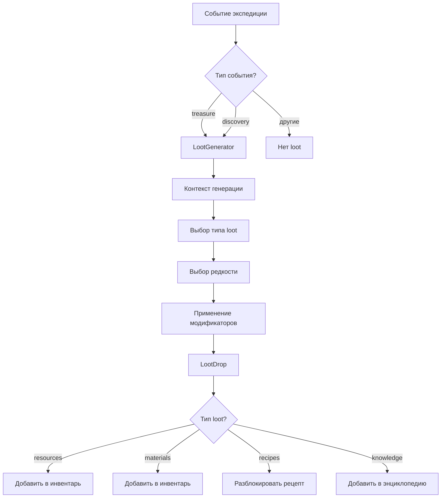

# Спецификация системы случайных находок (Loot System) для экспедиций

## Обзор системы

Система случайных находок (Loot System) отвечает за генерацию и распределение наград, которые искатели получают во время экспедиций при возникновении определённых типов событий.

### Цели системы

1. **Разнообразие loot**: Предоставить игрокам разнообразные находки (ресурсы, материалы, знания, рецепты)
2. **Привязка к контексту**: Типы находок зависят от локации, типа события и характеристик искателя
3. **Баланс редкости**: Использовать комбинированный подход для определения качества находок
4. **Масштабируемость**: Легко добавлять новые типы loot без изменения основной логики

### Типы находок

Система поддерживает четыре основных типа находок:

- **Resources**: Базовые ресурсы (gold, wood, iron, coal и т.д.)
- **Materials**: Специальные материалы (rare essences, magic stones, dragon scales)
- **Recipes**: Рецепты крафта оружия
- **Knowledge**: Знания (информация о врагах, локациях, секретах)

### Триггеры генерации

Loot генерируется только при событиях определённых типов:

1. **Treasure**: Сундук, тайник, добыча врагов
2. **Discovery**: Открытие, исследование, находка

Другие типы событий не генерируют loot напрямую.

---

## Архитектура

### Компоненты системы



### Поток данных

1. **Входные данные**:
   - Событие экспедиции (ExpeditionEvent)
   - Контекст (LootGenerationContext):
     - Характеристики искателя (уровень, удача, traits)
     - Сложность экспедиции
     - Локация экспедиции
     - Текущее время/погода

2. **Генерация**:
   - Выбор типа loot на основе весов
   - Выбор редкости с учётом модификаторов
   - Выбор конкретного предмета из таблицы дропа локации

3. **Результат**:
   - Массив объектов LootDrop
   - Каждый содержит: тип, редкость, конкретный предмет, количество

---

## Логика генерации

### Выбор типа loot

Тип loot выбирается на основе взвешенного случайного выбора с учётом:

1. **Базовые веса по типам**:
   - Resources: 40%
   - Materials: 30%
   - Knowledge: 20%
   - Recipes: 10%

2. **Модификаторы от типа события**:
   - `treasure` события: +10% Materials, +5% Recipes
   - `discovery` события: +15% Knowledge

3. **Модификаторы от характеристик искателя**:
   - `knowledge_seeker` trait: +10% Knowledge
   - `resourceful` trait: +10% Resources

### Выбор редкости (комбинированный подход)

Редкость loot определяется по формуле:

```
BaseRarity + LuckModifier + EventModifier + TraitModifier
```

#### 1. Базовая редкость (BaseRarity)

Определяется сложностью экспедиции:

| Сложность | Базовая редкость | Диапазон |
|-----------|------------------|----------|
| Easy | Common | 60% common, 30% uncommon, 10% rare |
| Normal | Common | 40% common, 40% uncommon, 20% rare |
| Hard | Uncommon | 30% common, 40% uncommon, 25% rare, 5% epic |
| Extreme | Rare | 20% common, 30% uncommon, 35% rare, 15% epic |
| Legendary | Epic | 10% common, 20% uncommon, 40% rare, 25% epic, 5% legendary |

#### 2. Модификатор от удачи искателя (LuckModifier)

Искатель имеет параметр `luck` (1-50), который влияет на распределение редкости:

```
LuckBonus = (luck - 25) * 0.4% // от -9.6% до +10%
```

- `luck < 25`: Увеличивает шанс common loot, уменьшает редкий
- `luck > 25`: Увеличивает шанс rare/epic loot, уменьшает common

Примеры:
- luck = 10: -6% к rare, +6% к common
- luck = 25: 0% модификатор
- luck = 50: +10% к rare, -10% к common

#### 3. Модификатор от типа события (EventModifier)

- `treasure` события: +5% к редким находкам (rare, epic, legendary)
- `discovery` события: +3% к редким находкам

#### 4. Модификатор от traits (TraitModifier)

Особые характеристики искателя:

- `lucky_star` trait: +5% ко всем редким находкам
- `keen_eye` trait: +10% к knowledge, +3% к rare
- `explorer` trait: +5% к materials

### Распределение по редкости (пример для сложности Normal)

Без модификаторов:
- Common: 40%
- Uncommon: 40%
- Rare: 20%
- Epic: 0%
- Legendary: 0%

С искателем luck=40 (+6%) и trait `lucky_star` (+5%):
- Common: 29% (40% - 6% - 5%)
- Uncommon: 40%
- Rare: 27% (20% + 6% + 1%)
- Epic: 4% (0% + 4%)
- Legendary: 0%

---

## Привязка loot к локациям

### Таблицы дропа (Loot Tables)

Каждая локация имеет свою таблицу дропа, которая определяет:

1. **Какие материалы доступны** в этой локации
2. **Вероятности дропа** для каждого материала
3. **Диапазон редкости** (min/max rarity)
4. **Условия появления** (например, только ночью)

### Пример таблицы дропа

```typescript
const FOREST_LOOT_TABLE: LootTable = {
  location: 'forest',
  materials: [
    {
      materialId: 'oak',
      chance: 40,
      minRarity: 'common',
      maxRarity: 'uncommon',
      conditions: {},
    },
    {
      materialId: 'birch',
      chance: 30,
      minRarity: 'common',
      maxRarity: 'common',
      conditions: {},
    },
    {
      materialId: 'ironwood',
      chance: 15,
      minRarity: 'rare',
      maxRarity: 'epic',
      conditions: {
        timeOfDay: 'night',
      },
    },
    {
      materialId: 'ebony',
      chance: 5,
      minRarity: 'epic',
      maxRarity: 'legendary',
      conditions: {
        adventurerLevel: { min: 30 },
      },
    },
  ],
  resources: [
    {
      resourceId: 'wood',
      baseAmount: 10,
      variance: 5,
      chance: 60,
    },
    {
      resourceId: 'herbs',
      baseAmount: 3,
      variance: 2,
      chance: 30,
    },
  ],
}
```

### Условия появления

Условия позволяют настроить, когда определённый материал может выпасть:

```typescript
interface LootCondition {
  // Время суток (опционально)
  timeOfDay?: 'day' | 'night' | 'any'
  
  // Уровень искателя
  adventurerLevel?: { min: number; max?: number }
  
  // Погода
  weather?: string[]
  
  // Тип события
  eventType?: string[]
  
  // Специальные условия
  special?: string[]
}
```

---

## Типы находок подробно

### 1. Resources

Базовые ресурсы, необходимые для крафта.

**Примеры**:
- Gold (золото)
- Wood (древесина)
- Iron (железо)
- Coal (уголь)
- Herbs (травы)

**Генерация**:
- Определяется по таблице дропа локации
- Количество = baseAmount ± variance

### 2. Materials

Специальные материалы с уникальными свойствами для крафта v2.

**Примеры**:
- Ironwood (железное дерево)
- Dragon Scales (чешуя дракона)
- Mithril Ore (митриловая руда)
- Bloodstone (кровавый камень)
- Essence of Fire (эссенция огня)

**Категории**:
- **Ores**: Руды для переплавки
- **Woods**: Древесные материалы
- **Stones**: Камни и минералы
- **Leathers**: Кожи животных
- **Essences**: Магические эссенции

**Генерация**:
- Выбирается из таблицы дропа локации
- Учитывается редкость и условия

### 3. Recipes

Рецепты крафта оружия, которые могут быть разблокированы.

**Типы рецептов**:
- Базовые рецепты (например, Steel Sword)
- Улучшенные рецепты (например, Mithril Blade)
- Специальные рецепты (например, Dragon Slayer)

**Генерация**:
- Рецепты привязаны к типу материалов в локации
- Редкость рецепта соответствует редкости материалов
- Если рецепт уже разблокирован — выдается эквивалент в gold

### 4. Knowledge

Информация, которая улучшает gameplay:

**Типы знаний**:

1. **Enemy Knowledge**:
   - Слабости врагов
   - Методы борьбы
   - Опасности

2. **Location Knowledge**:
   - Секретные пути
   - Скрытые локации
   - Ресурсы в локации

3. **Craft Knowledge**:
   - Новые рецепты
   - Техники крафта
   - Секреты материалов

**Генерация**:
- Выбирается из пула доступных знаний
- Знания привязаны к типу события и локации

---

## Константы и конфигурация

### Базовые вероятности

```typescript
export const LOOT_CHANCES = {
  // Шанс выпадения loot при событии
  baseLootChance: {
    treasure: 80,   // 80% при treasure событиях
    discovery: 60,   // 60% при discovery событиях
  },
  
  // Максимальное количество loot за событие
  maxLootPerEvent: 3,
  
  // Шанс множественного loot
  multipleLootChance: 20, // 20% шанс 2+ loot
}
```

### Веса типов loot

```typescript
export const LOOT_TYPE_WEIGHTS = {
  resources: 40,
  materials: 30,
  knowledge: 20,
  recipes: 10,
}
```

### Модификаторы редкости

```typescript
export const RARITY_MODIFIERS = {
  // От удачи искателя
  luckPerPoint: 0.4, // 0.4% за единицу удачи
  
  // От типа события
  treasureBonus: 5,  // +5% к rare при treasure
  discoveryBonus: 3, // +3% к rare при discovery
  
  // От traits
  luckyStarBonus: 5,  // +5% ко всем редким
  keenEyeBonus: 3,    // +3% к rare
}
```

---

## Интеграция с существующей системой

### Точка входа

Генератор loot интегрируется в существующую систему событий через функцию:

```typescript
// В expedition-reward-generator.ts
import { generateLootFromEvent } from './loot-generator'

export function generateRandomRewards(event: ExpeditionEvent): EventReward[] {
  // Проверяем, нужно ли генерировать loot
  if (event.type !== 'treasure' && event.type !== 'discovery') {
    return []
  }
  
  // Получаем контекст генерации
  const context = buildLootGenerationContext(event)
  
  // Генерируем loot
  const lootDrops = generateLootFromEvent(event, context)
  
  // Преобразуем в EventReward
  return convertLootDropsToRewards(lootDrops)
}
```

### Zustand Store

После генерации loot добавляется в store:

```typescript
// В guildSlice
applyLootDrops(drops: LootDrop[]) {
  drops.forEach(drop => {
    switch (drop.type) {
      case 'resources':
        this.addResources(drop.item, drop.amount)
        break
      case 'materials':
        this.addMaterial(drop.item.id, drop.amount)
        break
      case 'recipes':
        this.unlockRecipe(drop.item.id)
        break
      case 'knowledge':
        this.addKnowledge(drop.item.id)
        break
    }
  })
}
```

---

## Примеры использования

### Базовый пример

```typescript
import { generateLootFromEvent } from './loot-generator'
import type { ExpeditionEvent } from './types'

// Событие экспедиции
const event: ExpeditionEvent = {
  id: 'treasure_chest',
  type: 'treasure',
  text: 'Найден сундук с золотом!',
  // ...
}

// Контекст генерации
const context = {
  adventurer: {
    level: 15,
    luck: 35,
    traits: ['lucky_star', 'explorer'],
  },
  expedition: {
    difficulty: 'normal',
    location: 'forest',
    duration: 600,
  },
  timeOfDay: 'day',
  weather: 'clear',
}

// Генерируем loot
const loot = generateLootFromEvent(event, context)

// Результат:
// [
//   { type: 'resources', item: 'gold', amount: 25, rarity: 'common' },
//   { type: 'materials', item: {...}, rarity: 'rare' },
// ]
```

### Пример с условиями

```typescript
// Ночная экспедиция в пещере
const nightCaveEvent = {
  type: 'discovery',
  text: 'Светящиеся грибы освещают тёмный коридор...',
}

const context = {
  adventurer: { level: 25, luck: 40 },
  expedition: { difficulty: 'hard', location: 'cave' },
  timeOfDay: 'night',
  weather: 'clear',
}

// Может выпасть:
// - Phosphorescent Mushroom (редкий материал, только ночью)
// - Ancient Essence (эпическая эссенция, только в пещерах)
// - Cave Secrets (знание о пещерах)
```

---

## Тестирование

### Unit тесты

```typescript
describe('LootGenerator', () => {
  test('генерирует loot для treasure событий', () => {
    const event = createMockEvent('treasure')
    const context = createMockContext()
    const loot = generateLootFromEvent(event, context)
    
    expect(loot.length).toBeGreaterThan(0)
  })
  
  test('не генерирует loot для travel событий', () => {
    const event = createMockEvent('travel')
    const context = createMockContext()
    const loot = generateLootFromEvent(event, context)
    
    expect(loot.length).toBe(0)
  })
  
  test('учитывает удачу искателя', () => {
    const contextHighLuck = createMockContext({ luck: 50 })
    const contextLowLuck = createMockContext({ luck: 10 })
    
    const lootHighLuck = generateMany(contextHighLuck)
    const lootLowLuck = generateMany(contextLowLuck)
    
    const rareCountHigh = lootHighLuck.filter(l => l.rarity === 'rare').length
    const rareCountLow = lootLowLuck.filter(l => l.rarity === 'rare').length
    
    expect(rareCountHigh).toBeGreaterThan(rareCountLow)
  })
})
```

### Интеграционные тесты

```typescript
describe('Loot Integration', () => {
  test('добавляет ресурсы в store', () => {
    const drops = [{ type: 'resources', item: 'gold', amount: 100 }]
    
    store.applyLootDrops(drops)
    
    expect(store.resources.gold).toBe(100)
  })
  
  test('разблокирует рецепт', () => {
    const drops = [{ type: 'recipes', item: { id: 'mithril_sword' } }]
    
    store.applyLootDrops(drops)
    
    expect(store.isRecipeUnlocked('mithril_sword')).toBe(true)
  })
})
```

---

## Будущие улучшения

### Планируемые функции

1. **Босс-специфичный loot**: Уникальные предметы от боссов
2. **Комплекты сетов**: Возможность собрать полный сет из одной локации
3. **Сезонные события**: Специальный loot в определённые периоды
4. **Кастомизация таблиц**: Позволить игрокам влиять на таблицы дропа
5. **Торговля loot**: Возможность продавать/обменивать найденное

### Масштабируемость

Система спроектирована для легкого расширения:

- **Новые типы loot**: Добавить в `LootType` и реализовать провайдер
- **Новые локации**: Создать новую `LootTable`
- **Новые материалы**: Добавить в существующие таблицы дропа
- **Новые знания**: Добавить в пул знаний

---

## Дополнительные файлы

Для полной работы системы необходимы следующие файлы:

1. `types/expedition-loot.types.ts` — TypeScript типы
2. `data/loot-tables.ts` — Таблицы дропа по локациям
3. `data/knowledge-discoveries.ts` — Пул знаний
4. `lib/loot-generator.ts` — Основной генератор
5. `lib/loot-integration.ts` — Интеграционный слой
6. `examples/loot-usage.ts` — Примеры использования

См. соответствующие файлы для деталей реализации.
