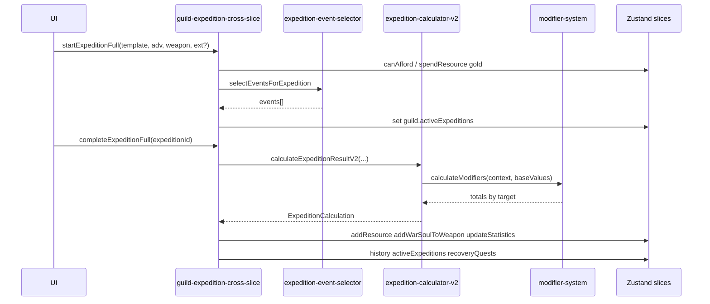

# 04. Слой логики и потоки

## Обзор

## Старт экспедиции

**Файл:** `src/store/cross-slice/guild-expedition-cross-slice.ts` — `startExpeditionFull`.

1. Лимит: `activeExpeditions.length < getMaxActiveExpeditions(guild.level)` (`GUILD_LEVELS` в `src/types/guild.ts`).  
2. Стоимость: `expedition.cost.supplies + expedition.cost.deposit` золотом; `canAfford` / `spendResource('gold', …)`.  
3. Оружие: `currentDurability > 10`, `stats.attack >= expedition.minWeaponAttack`.  
4. События: `selectEventsForExpedition(expedition, startedAt)` — попадание в `ActiveExpedition.events`.  
5. Пуш в `guild.activeExpeditions` с копией `weaponData`, опционально `adventurerExtended`.

## Завершение экспедиции

**Файл:** тот же cross-slice — `completeExpeditionFull`.

1. Найти `ActiveExpedition`, шаблон по `expeditionId`, актуальное оружие в `weaponInventory`.  
2. Построить fallback `AdventurerExtended`, если в сохранённой экспедиции нет `adventurerExtended` (жёстко заданные дефолты в коде — миграция данных может заменить это в vNext).  
3. Вызов **`calculateExpeditionResult`** (`src/lib/expedition-calculator-v2.ts`) с параметрами оружия v2 (см. приложение по входам).  
4. Бросок успеха: `Math.random() * 100 < calculation.successChance`.  
5. Крит при успехе: `Math.random() * 100 < calculation.critChance`.  
6. Масштаб наград: комиссия и war soul ×1.5 при крите (см. `APPENDIX_FORMULAS_EXPEDITION.md`).  
7. Слава, износ, потеря оружия, `RecoveryQuest`, начисление золота, War Soul на оружие, опыт игрока, история — детализированы в приложении формул.

**Важно:** сгенерированные **`events`** на исход в текущем коде **не влияют**. `generateRandomRewards` в `expedition-reward-generator.ts` не используется из стора и возвращает пустой массив.

## Калькулятор v2 и модификаторы

- **Файл:** `src/lib/expedition-calculator-v2.ts`.  
- Собирает `ModifierContext` (искатель, срез экспедиции, оружие, уровень гильдии) и вызывает `calculateModifiers` из `src/lib/modifier-system/registry.ts`.  
- Провайдеры регистрируются side-effect импортами в `src/lib/modifier-system/index.ts`:  
  `combat-stats`, `level-rarity`, `personality-traits`, `motivations`, `social-tags`, `strengths-weaknesses`, `combat-style`.

Цели модификаторов (`ModifierTarget`): `successChance`, `gold`, `warSoul`, `glory`, `weaponWear`, `weaponLossChance`, `critChance`, `commission`. База до модификаторов задаётся в калькуляторе из `difficultyInfo` и `expedition.reward`.

## Вспомогательные модули

| Файл | Роль |
|------|------|
| `src/lib/store-utils/expedition-utils.ts` | Утилиты гильдии/экспедиций (по месту импорта в проекте). |
| `src/lib/expedition-draft.ts` | Черновики/превью, если используются UI. |
| `src/lib/guild-utils.ts` | Общие хелперы гильдии. |

См. также `APPENDIX_REPO_MAP.md` для полного списка путей.
