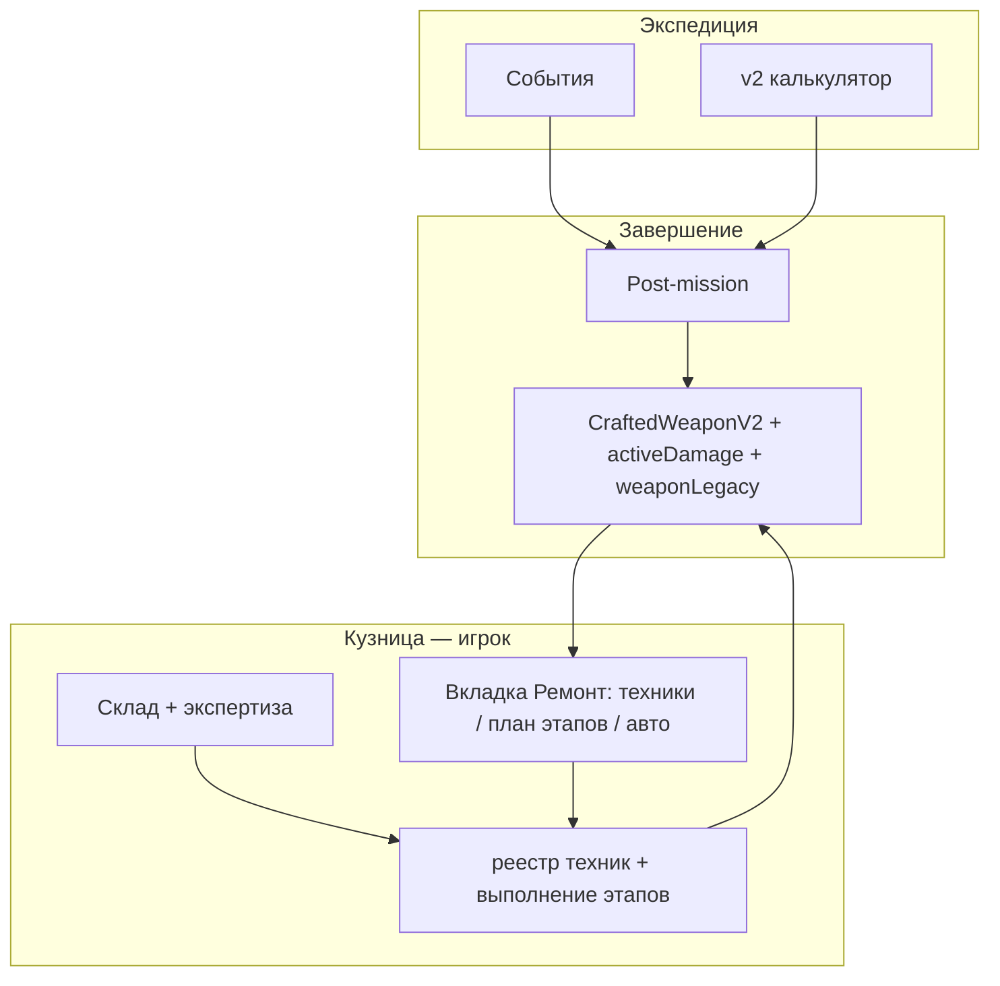

# Расследование повреждений и система ремонта (фаза 6)

**Статус:** единая концепция (v3) — синтез опросника, аудита и сквозных доработок; **кузнец в игре = игрок**, без замены роли наймом.  
**Связь:** [EXPEDITION_AND_ADVENTURER_AUDIT.md](EXPEDITION_AND_ADVENTURER_AUDIT.md) (фаза **6**), [DAMAGE_INVESTIGATION_QUESTIONNAIRE.md](DAMAGE_INVESTIGATION_QUESTIONNAIRE.md). **План внедрения по фазам:** [DAMAGE_INVESTIGATION_IMPLEMENTATION_PLAN.md](DAMAGE_INVESTIGATION_IMPLEMENTATION_PLAN.md).  
**Канон экономики экспедиций** — в аудите («Экономика экспедиций»): риск кузнеца через оружие и ресурсы кузницы, без золота за вход.

**Версия документа:** 3.6 · **2026-04-05** · синхронизация с кодом: техники и этапы, верстак `repairBenchWeaponId`, G1 на `allowedRepairTechniqueIds`, облако Turso для слота верстака; **ось броска в данных** — [`RepairDiceProfile`](../../src/lib/weapon-damage/repair-dice-profile.ts) (маппинг техник → профиль в [`repair-dice-from-techniques.ts`](../../src/lib/weapon-damage/repair-dice-from-techniques.ts)); переход к таблицам риска/стоимости в [`repair-system.ts`](../../src/data/repair-system.ts) — **один адаптер** `repairDiceProfileToRepairType` в [`repair-utils.ts`](../../src/lib/store-utils/repair-utils.ts) (литералы совпадают с `RepairType` до возможного расщепления таблиц — см. [план внедрения](DAMAGE_INVESTIGATION_IMPLEMENTATION_PLAN.md), фаза 3b пост-MVP). **Баланс §7** ([REPAIR_TECH_DEBT_AND_BALANCE_PLAN.md](REPAIR_TECH_DEBT_AND_BALANCE_PLAN.md)): авто-ремонт за **золото** (`getWeaponAutoRepairGoldCost` в [`repair-balance.ts`](../../src/lib/store-utils/repair-balance.ts)), наценка автоподбора от **мощности v1 (атака)** — `getRepairAutoPickMaterialMarkup`.

**Модель ремонта v2 (осмотр / риск / мета §9.1.1):** в коде — опции выполнения [`RepairTechniqueExecutionOptions`](../../src/types/repair-execution.ts), счётчики диагностики по тегу в `weaponLegacy` (`repairDiagnosisPreciseCountByTagId` / `Risky` / `Skipped`), штраф к броску при ошибочной гипотезе и **динамическая** наценка на материалы при автоподборе (см. FORMULAS); канон UX — [REPAIR_UI_UX_REDESIGN_SPEC.md](REPAIR_UI_UX_REDESIGN_SPEC.md) (в т.ч. §9.1.1).

**Статус реализации:** MVP по повреждениям/ремонту в коде закрыт; публичный стор — только `executeWeaponRepairByTechniques` (legacy `executeWeaponRepair` удалён). **v2-MVP** (диагностика, модификаторы броска/стоимости, UI карточки ремонта, отладочная свёртка §9.1 на верстаке) — в коде. **Что ещё не сделано / бэклог** — §19 и [план внедрения](DAMAGE_INVESTIGATION_IMPLEMENTATION_PLAN.md) («Что осталось сделать»).

---

## 1. Роль системы и кузнец-игрок

После экспедиции цикл опирается на **глобальный износ** калькулятора v2 (`weaponWear`) и прочность `CraftedWeaponV2`. Семантика событий `damage_weapon` и шаблонов экспедиций **переносится** в типизированные **видимые теги** на экземпляре (`activeDamageTags`) через post-mission слой, **без** второго числового списания прочности (§5). Ремонт — **осмысленное продолжение крафта**, а не только обслуживание полоски.

**Кузнец — только игрок.** Наёмные работники (если остаются в экономике кузницы) **не исполняют роль кузнеца**: не подменяют ремонт, не задают мастерство починки и не тратят «стамину кузнеца». Все решения и броски ремонта исходят от **персонажа игрока** (уровень, мастерство, экспертиза — из прогрессии игрока и энциклопедии материалов, не из пула workers).

Фаза 6 — **столп кузницы**, с балансом таким, чтобы **не требовать** полного ремонта после каждой миссии: доступны авто-режим и мягкие состояния (см. §6).

---

## 2. Игровые столпы

| Столп | Содержание |
|--------|------------|
| **Риск** | Оружие и ресурсы в кузнице; миссия не списывает золото за вход (канон аудита). |
| **Долгосрочность** | История экземпляра (`adventureCount` и др.) влияет на вариативность риска; **видимые** повреждения снимаются починкой; **скрытое наследие** копится для зачарований. |
| **Читаемость** | В UI — термин **«повреждение»**; одна игрокочитаемая модель «прочность миссии ↔ метки повреждений» (§5). |
| **Мост к зачарованиям** | Особые теги от событий + **криты ремонта** записывают **скрытые** маркеры в `weaponLegacy` — без отображения как активных повреждений после починки. |

---

## 3. Ограничения фазы 6 (ядро Души Войны)

- **Не менять** механику начисления и экономики **Души Войны** (тиры, бои, модификаторы души в текущем коде) — зона модуля зачарований.  
- **Публичные** бонусы ремонта в MVP — только поля, уже поддерживаемые ремонтом: `maxDurability`, атака, `epicMultiplier`.  
- Скрытые поля под будущие бонусы души/чар — только в данных, **без обещаний в UI**, пока нет контракта с [ENCHANTMENT_SYSTEM.md](ENCHANTMENT_SYSTEM.md).

---

## 4. Актуальное состояние кода (2026-04)

| Область | Файлы | Сейчас |
|---------|--------|--------|
| Износ | `guild-expedition-cross-slice.ts`, калькулятор v2 | `weaponWear` → прочность (единый числовой слой) |
| Post-mission теги | `expedition-post-mission-damage.ts`, вызов из `completeExpeditionFull` | Видимые теги и условия наследия по событиям/шаблонам |
| Оружие | `CraftedWeaponV2` | `activeDamageTags`, `weaponLegacy` (в т.ч. `hiddenMarks`, `deepInspectReadyAt`), `repairCondition` |
| Ремонт игрока | `repair-techniques-registry.ts`, `build-repair-plan.ts`, `repair-cross-slice.ts`, `repair-card.tsx`, [`repair-execution.ts`](../../src/types/repair-execution.ts), [`repair-balance.ts`](../../src/lib/store-utils/repair-balance.ts) | **Техники и этапы**; слот верстака `repairBenchWeaponId`; списание материалов по плану; золото за **ручной** ремонт по техникам не используется; **авто-ремонт** — списание **золота** в `claimWeaponAutoRepair`; **v2:** контекст диагностики в `executeWeaponRepairByTechniques`, `claimWeaponAutoRepair` пишет tier `skipped` для меты §9.1.1 |
| Бросок ремонта | `repair-dice-profile.ts`, `repair-dice-from-techniques.ts`, `repair-utils.ts`, `repair-system.ts` | Техники → **`RepairDiceProfile`** → адаптер → **`RepairType`** только для чтения таблиц в `repair-system` (§8.1) |
| Облако | `use-cloud-save.ts`, `api/save`, Turso `game_saves` | `weaponInventory` JSON + колонка **`repairBenchWeaponId`**; см. `cloud-save-feature.ts` |

Полная матрица смежных систем — §18 и [EXPEDITION_AND_ADVENTURER_AUDIT.md](EXPEDITION_AND_ADVENTURER_AUDIT.md).

---

## 5. Прочность и теги: одна модель

1. **Число после миссии:** `currentDurability` считается **одним проходом** из результата калькулятора v2 (и глобальных правил), **без** второго вычитания от `damage_weapon` (избежать двойного учёта). Детали — в [FORMULAS.md](../utils/FORMULAS.md) при внедрении.  
2. **Видимые теги повреждений** выводятся из сработавших событий: класс, тяжесть (текст/UI), применимые **техники починки** (не фиксированный «тип ремонта» из пяти кнопок — см. §8); таблица «тег → влияние на потолок после ремонта» для `maxDurability` и т.д.  
3. Строка-пояснение в UI: прочность — итог вылазки; метки — **что** повредилось; на вкладке **Ремонт** — **какие техники** уместны и какой **план этапов** соберёт игрок.

---

## 6. Данные: видимые повреждения, скрытое наследие, UI после починки

### 6.1. Активные повреждения (видимые)

- Список записей на экземпляре (например `activeDamageTags` внутри состояния оружия): id тега, тяжесть, привязка к событию/миссии, id строк текста.  
- Пока есть **хотя бы одно** неснятое повреждение или «временная заплатка» требует полноценной починки — в интерфейсе показываются **теги и краткие описания**.

### 6.2. После успешной починки

- Когда **активных повреждений не осталось** (полноценный ремонт или снятие всех игровых тегов согласно правилам), **видимые теги повреждений из UI пропадают** — повреждений больше нет, интерфейс не вводит игрока в заблуждение «висящими» метками.

### 6.3. Скрытые теги и криты (мост к зачарованиям)

- Часть тегов в справочнике помечается как **особая** (связь с типами случайных событий экспедиции).  
- При **крите** на этапе ремонта или при особом сочетании «событие → тег → успешная операция» в данные записываются **скрытые идентификаторы** (например в `weaponLegacy.hiddenMarks[]` или аналог в рамках одного блока `weaponLegacy`): они **не показываются** как «повреждения» и **не удаляются** вместе с видимыми тегами — это не «поломка», а **наследие клинка** для модуля зачарований.  
- **§9.1 — скрытый учёт снятых видимых тегов (реализовано):** при успешном ремонте, снимающем теги, в `weaponLegacy` накапливаются **`archivedDamageTagIds`**, **`repairResolveCountByTagId`** (сколько раз тег был устранён ремонтом), а в **§9.1.1** — счётчики качества диагностики по тегу (**`precise` / `risky` / `skipped`**) в отдельных мапах; ручной путь с осмотром может дать `precise`/`risky`, автоподбор техник и авто-ремонт — `skipped` (см. [REPAIR_UI_UX_REDESIGN_SPEC.md](REPAIR_UI_UX_REDESIGN_SPEC.md), [FORMULAS.md](../utils/FORMULAS.md)). На карточке оружия на **верстаке** (вкладка «Ремонт») для отладки доступна **сворачиваемая** панель «под капотом» с этими данными.  
- Связь с событиями: отдельная карта **шаблон события → видимый тег(и)** и опционально **скрытый маркер** при крите; утилита/чеклист синхронизации данных.  
- Контракт расширения — в [ENCHANTMENT_SYSTEM.md](ENCHANTMENT_SYSTEM.md) при появлении ТЗ; каркас **один** (`weaponLegacy`), без дублирования «истории клинка» в двух местах.

### 6.4. Сохранение и облако

- **Локально:** Zustand persist, миграции полей оружия (`migrate-crafted-weapon-damage` и др.), слот верстака `repairBenchWeaponId` в store.
- **Облако (Turso):** при `NEXT_PUBLIC_CLOUD_SAVE_ENABLED=true` — payload в [`use-cloud-save.ts`](../../src/hooks/use-cloud-save.ts), колонка `repairBenchWeaponId` в `game_saves`, чеклист в [`cloud-save-feature.ts`](../../src/lib/cloud-save-feature.ts). Новые поля оружия при расширении схемы — по тому же чеклисту.

### 6.5. Ложные следы (не MVP)

- Несколько текстовых «наблюдений» с одной причиной — отложено.

---

## 7. Справочник тегов (первая волна)

- **8–10** базовых тегов по проходу случайных событий экспедиций; единый реестр.  
- Одно событие может давать **до двух** видимых тегов, если нарративно уместно.  
- Принципы текстов — по аудиту (от первого лица мастера, без спойлера в одной строке).

**Реализация в коде (фаза 1 данных):** реестр [`src/data/weapon-damage/damage-tag-registry.ts`](../src/data/weapon-damage/damage-tag-registry.ts), карта шаблонов событий → теги [`src/data/weapon-damage/event-template-to-damage-tags.ts`](../src/data/weapon-damage/event-template-to-damage-tags.ts), типы экземпляра [`src/types/weapon-damage.ts`](../src/types/weapon-damage.ts), миграция persist [`src/lib/weapon-damage/migrate-crafted-weapon-damage.ts`](../src/lib/weapon-damage/migrate-crafted-weapon-damage.ts).

**Примечание:** в реестре тегов задаётся ограничение на **ось броска ремонта** через список **id техник** (`allowedRepairTechniqueIds`): пустой список — без дополнительного ограничения по этому тегу (как раньше «все типы ремонта» для кубика); для особых тегов — узкий набор (например только техника «связи с клинком»). См. `filter-repair-by-damage-tags.ts` и `repair-utils.ts`.

### 7.1. Техники починки и привязка к тегам (концепт)

Повреждения остаются в реестре **id тегов**; починка строится не из пяти фиксированных «уровней ремонта», а из **техник работы** — сущностей уровня крафтовых техник: у каждой техники заданы **какие теги** она может закрывать (или ослаблять), **какие этапы** она добавляет в план, **какие ресурсы** ожидаются.

- **Одна техника** может покрывать **один или несколько** тегов, если это ремесленно логично (например одна «рихтовка оси» — и лёгкий перегиб, и погнутый крестовин, если оба в активном наборе).  
- **Несколько техник** могут частично пересекаться по одному тегу — игрок выбирает **набор техник**, из которого **собирается общий план этапов** (порядок и состав этапов определяются правилами сборки, а не одной кнопкой «быстрый ремонт»).  
- **Базовый набор** техник доступен кузнецу-игроку по умолчанию; **расширение** — отдельные разблокировки (прогрессия, квесты, энциклопедия, редкие материалы) — заложить в данные **флагами/источником разблокировки**, без требования реализовать все пути в первом релизе новой системы.

**Ориентировочная матрица «тег → подходящие классы техник»** (имена техник — примеры для дизайна и контента; реальные id — в реестре техник при внедрении):

| id тега (реестр) | Логика работ | Примеры классов техник (не исчерпывающе) |
|------------------|--------------|------------------------------------------|
| `edge_chipping` | кромка, снятие сколов | правка режущей кромки, локальная переточка |
| `haft_loose` | крепление рукояти/гарды | перетяжка крепления, подбор клинка в гнезде |
| `notch_deep` | глубокая зарубина | зачистка и снятие металла по шаблону, углублённая правка |
| `guard_bent` | деформация защиты | рихтовка, выпрямление на плоскости |
| `point_blunted` | острие | переточка острия, восстановление геометрии наконечника |
| `binding_stress` | усталость металла на изгибе | локальный отжиг / снятие напряжения, контрольная правка (часто требует **подготовительного** этапа) |
| `corrosion_spot` | коррозия | зачистка, пассивация, масло/уход по поверхности |
| `crack_frost` | микротрещина | заплавка / аккуратная правка зоны, без разгона трещины |
| `warp_slight` | перегиб оси | выпрямление на стенде, проверка баланса |
| `soul_leak_minor` | особый тег | техники **«связи с клинком»** / работа с наследием экземпляра; **особый** путь, отдельный от «быстрой» механики |

Пересечения: например **выпрямление/рихтовка** может закрывать и `guard_bent`, и `warp_slight` при одном проходе, если в плане выбрана соответствующая техника и теги активны.

---

## 8. Ремонт: техники, многоэтапный план, вкладка кузницы, авто и осмотр

### 8.1. Отказ от «пяти кнопок» как основы

Модель **«Быстрый / Стандартный / Качественный / Реставрация / Усиление»** (`RepairType` в [`repair-system.ts`](../../src/data/repair-system.ts)) **не является игровой метафорой** в основном потоке: игрок выбирает **техники** и **этапы**, а не пять кнопок. **Целевой опыт** — план ремонта по аналогии с **крафтом v2** (§8.2).

В коде **`RepairType` остаётся внутри слоя таблиц** (исходы кубика, базовые опции стоимости); снаружи реестра тегов и техник ось данных — **`RepairDiceProfile`** и id техник; авто-ремонт и утилиты используют те же таблицы через адаптер. Полный перенос таблиц риска из `repair-system` в отдельный модуль — опциональный рефакторинг (не блокер).

### 8.2. План ремонта и этапы

- Игрок выбирает **одну или несколько техник** из доступных (с учётом активных тегов на оружии).  
- Система **собирает упорядоченный список этапов** из шаблонов выбранных техник (правила merge: без дублирования однотипных шагов где уместно, явный порядок где критично — например подготовка до термообработки).  
- Выполнение: **поэтапно**, с участием игрока (как в крафте), с бросками/результатами на этапе и итогом по оружию (прочность, снятие тегов, `weaponLegacy`, скрытые маркеры — по §6).  
- **Адаптивность:** набор активных тегов и материал оружия **меняют** доступные техники и иногда — число или тип этапов (конкретика — в реестре техник и формулах).

### 8.3. Вкладка «Ремонт» и отсутствие дублирования с инвентарём

- В кузнице **вся содержательная работа по починке** сосредоточена на отдельной вкладке **«Ремонт»**, которая в порядке навигации идёт **сразу после вкладки «Инвентарь»** (остальной порядок вкладок кузницы сохраняет смысл «сначала заготовки/крафт, затем обзор оружия, затем ремонт»).  
- **Инвентарь** остаётся обзорным: краткая индикация повреждений; полный список тегов и кнопка **«Отправить на ремонт»** — **внизу** карточки, под блоком **«Состав оружия»** (та же логика порядка блоков на верстаке, `context="repairBench"`: качество/тир души справа под названием, повреждения внизу).  
- На вкладке **Ремонт** `RepairCard` даёт техники, этапы, осмотр, авто-режимы; дубли атаки/полосы прочности с инвентарём при необходимости отключены (`compactWeaponChrome`).

### 8.4. Авто-ремонт и «осмотреть глубже»

- **Авто-ремонт:** упрощённый результат без полного выбора техник; **основная цена — золото** при `claimWeaponAutoRepair` (формула — [`repair-balance.ts`](../../src/lib/store-utils/repair-balance.ts), константы в `constants.ts`); мягкий штраф к `epicMultiplier` и мета диагностики `skipped` — как в [FORMULAS.md](../utils/FORMULAS.md). Очередь **«при следующем заходе в кузницу»** (`scheduleWeaponAutoRepair` + `settleAutoRepairForgeVisitReady`) без минутного таймера как главной механики; константа `WEAPON_AUTO_REPAIR_DELAY_MS` в коде помечена legacy.  
- **Осмотр:** **материалы и время** (без золота и без стамины workers); даёт подсказки по тегам и фиксирует снимок в `weaponLegacy` (поля `deepInspectReadyAt` и др. — в коде).

### 8.4.1. Верстак на вкладке «Ремонт»

- В кузнице оружие для починки выбирается через **один слот верстака** (`repairBenchWeaponId`): из инвентаря — кнопка **«Отправить на ремонт»** в **нижней** части карточки (под «Состав оружия»); на вкладке «Ремонт» отображается только выбранный экземпляр. После успешного ремонта слот сбрасывается.

### 8.5. Мастерство, связь с клинком, стамина

**Мастерство починки** — от **игрока** (уровень, прогрессия кузницы, экспертиза по материалам). **Метрика «связь с клинком»:** агрегат экспертизы combat-материала и истории экземпляра — влияет на шансы на этапах и на скрытые маркеры; не заменяет энциклопедию.

**§16** без изменений: ремонт не использует стамину workers и не ищет «лучшего кузнеца» среди NPC.

**Мотивация износа без токсичности:** жёсткий **пол** прочности для старта экспедиции не отменяется тегами; копирайт в духе «износ открывает возможности мастера».

### 8.6. Согласованная модель v2 (осмотр, риск, автоподбор)

Цель — **не подменять** выбор техник «угадайкой», а дать **данные осмотра** и **риск** (штраф к успеху броска при ошибочной гипотезе), плюс осознанный **автоподбор техник с наценкой на материалы** (tier диагностики `skipped`). Детали сценариев, копирайт и связь с §9.1.1 — в [REPAIR_UI_UX_REDESIGN_SPEC.md](REPAIR_UI_UX_REDESIGN_SPEC.md). В коде: [`repair-card.tsx`](../../src/components/ui/repair-card.tsx), [`repair-cross-slice.ts`](../../src/store/cross-slice/repair-cross-slice.ts), [`repair-utils.ts`](../../src/lib/store-utils/repair-utils.ts) (модификатор броска), [`weapon-legacy.ts`](../../src/lib/weapon-damage/weapon-legacy.ts).

**Бэклог UX (продукт):** если осмотр всё ещё ощущается как обязательный квиз перед уже очевидным набором техник — следующая итерация: упростить ввод данных осмотра, усилить «риск без угадайки» или перенести плату автоподбора на другой путь (например авто-ремонт) — см. обсуждения в спеке и §19.

---

## 9. Позитивные исходы (MVP)

- Публично: бонусы к `maxDurability`, атаке, `epicMultiplier` согласно таблицам ремонта и критам.  
- Скрыто: запись **скрытых маркеров** для зачарований при критах/особых тегах — без UI-тизера про душу до согласования с модулем зачарований.  
- Мета §9.1 / §9.1.1: накопление архива тегов, счётчиков устранений и **качества диагностики** по тегу — в `weaponLegacy` (потребление в зачаровании — отдельное ТЗ).

---

## 10. Экономика, заморозка, заказы

- В среднем ремонт **дешевле нового крафта** с риском потери max/статов; история оружия повышает **вариативность**, не линейный «утиль через N вылазок».  
- Допустима **заморозка** без ресурса; **мягкий fallback** — временный ремонт/дебафф без бесплатного снятия видимых тегов «как новенькое».  
- Флаг состояния **`repairCondition`**: например `ok` | `needsProperRepair` | `temporaryPatch` — правила **сдачи заказа NPC** и **старта экспедиции** (редкие заказы могут требовать полноценной починки). Зафиксировать при внедрении в [ORDER_SYSTEM.md](ORDER_SYSTEM.md).

---

## 11. Поток данных

Критические точки: `guild-expedition-cross-slice.ts`, `expedition-post-mission-damage.ts`, `repair-cross-slice.ts`, типы оружия, UI вкладки «Ремонт».

---

## 12. UX и экраны

- После миссии: **2–3 строки** о повреждениях; клик/подсказка к событию журнала; строка в журнале о фиксации повреждений.  
- **Порядок вкладок кузницы:** вкладка **«Ремонт»** размещается **после «Инвентаря»**; полный сценарий починки (выбор техник, план этапов, броски, ресурсы) — **только** на «Ремонт», без дублирования длинной карточки инвентаря.  
- **Инвентарь:** краткая индикация (иконка; опционально 1–2 тега); без полного блока «как чинить» — игрок переходит на **Ремонт**.  
- **Ремонт:** прочность, теги, доступные **техники**, собранный **план этапов**, авто-ремонт, «осмотреть глубже» — см. §8.3.  
- Туториал: первая экспедиция с событием повреждения **или** запасной триггер после **N** завершённых миссий (N ≈ 3–5); без блокировки кузницы.

---

## 13. Риски

| Риск | Митигация |
|------|-----------|
| Рутина ремонта | Авто-режим, баланс износа |
| Двойной учёт прочности | §5 + тесты + FORMULAS.md |
| Перегруз UI | Лимит строк; скрытые маркеры не в списке повреждений |
| Путаница видимых/скрытых | В UI только активные повреждения; наследие — для зачарований |
| Заказы / временный ремонт | repairCondition + ORDER_SYSTEM |
| Онбординг | Запасной триггер по N миссиям |

---

## 14. Порядок реализации (исторический)

Планировался на старте фазы 6; **по коду шаги 1–5 и верстак закрыты** (см. [план внедрения](DAMAGE_INVESTIGATION_IMPLEMENTATION_PLAN.md)). **Модель ремонта v2** (§9.1 / §9.1.1, осмотр и модификаторы) — **есть** в коде; итерация UX осмотра — §19. Остаётся наращивать контент (теги, техники, события) и доводить сквозные правила заказов/`repairCondition` (§10, фаза 5 плана).

1. Справочник тегов и карта событие→тег — **есть**.  
2. Модель на оружии + persist — **есть**.  
3. Post-mission — **есть**.  
4. UI вкладки «Ремонт», верстак, без дубля инвентаря — **есть**.  
5. Реестр техник, план этапов; UX не от пяти кнопок — **есть**; ось броска **`RepairDiceProfile`** в данных + адаптер к `RepairType` — **есть**; **v2:** мета диагностики и риск в [`repair-cross-slice`](../../src/store/cross-slice/repair-cross-slice.ts) — **есть**; вынос таблиц риска из `repair-system` в отдельный слой — **бэклог** (опционально).  
6. Заказы и экспедиция — **согласованы** с `getWeaponGuildServiceBlockReason`; исключения для заказов (см. §10) — **только по отдельному ТЗ** (§19).

---

## 15. Критерии готовности (6a–6f, адаптировано)

| Подфаза | Критерий |
|---------|----------|
| 6a | Реестр тегов, тексты, карта событий, утилита синхронизации |
| 6b | Post-mission согласован с §5; видимые теги; условия скрытых маркеров |
| 6c | Persist, миграция, round-trip; облако с полями оружия и `repairBenchWeaponId` |
| 6d | Техники + этапы + авто + осмотр; мастерство от игрока; **без стамины кузнеца** (§16); в UX нет «пяти кнопок»; **`RepairDiceProfile`** в слое данных, `RepairType` только у таблиц в `repair-system` (§8.1) |
| 6e | UX и экраны (§12) |
| 6f | Туториал + запасной триггер |

---

## 16. Старая модель: стамина кузнеца и workers в ремонте

**Статус:** **снято** в текущем контуре: мастерство починки от **уровня игрока** (`player.level`), ремонт не использует `findBestBlacksmith` / стамину наёмников. Историческая цель §16 достигнута; при появлении **новых экранов** проверять копирайт (нет «найми кузнеца для починки»).

Оставшиеся упоминания legacy в данных ремонта (например имена полей в `repair-system.ts`) не меняют игровой контракт «кузнец = игрок».

---

## 17. Ключевые пути в коде (напоминание)

- Завершение миссии: `guild-expedition-cross-slice.ts`, [`expedition-post-mission-damage.ts`](../../src/lib/expedition-post-mission-damage.ts)  
- События и шаблоны: `src/modules/expeditions/data/events/**`, [`event-template-to-damage-tags.ts`](../../src/data/weapon-damage/event-template-to-damage-tags.ts)  
- Оружие: [`src/types/craft-v2.ts`](../../src/types/craft-v2.ts) — `activeDamageTags`, `weaponLegacy`, `repairCondition`  
- Ремонт: [`repair-techniques-registry.ts`](../../src/data/weapon-damage/repair-techniques-registry.ts), [`build-repair-plan.ts`](../../src/lib/weapon-damage/build-repair-plan.ts), [`repair-cross-slice.ts`](../../src/store/cross-slice/repair-cross-slice.ts), [`repair-utils.ts`](../../src/lib/store-utils/repair-utils.ts), [`repair-system.ts`](../../src/data/repair-system.ts), [`repair-dice-profile.ts`](../../src/lib/weapon-damage/repair-dice-profile.ts)  
- UI: вкладка **«Ремонт»** (после инвентаря), [`repair-section.tsx`](../../src/components/forge/repair-section.tsx), [`repair-card.tsx`](../../src/components/ui/repair-card.tsx), карточка оружия на верстаке [`weapon-inventory-card.tsx`](../../src/components/forge/weapon-inventory-card.tsx) (`context="repairBench"`) — свёртка отладки §9.1  
- Формулы: [`FORMULAS.md`](../utils/FORMULAS.md)  
- Туториал: опциональное усиление шага «первое повреждение» (§12, §15 6f)

---

## 18. Связанные системы проекта

Модули, с которыми фаза 6 **согласована** в текущем коде. Колонка «Дальше» — не закрытый MVP, а типичный бэклог/регрессия.

| Система | Что затрагивается | Статус / дальше |
|---------|-------------------|-----------------|
| **Экспедиции: завершение** | `guild-expedition-cross-slice`, post-mission слой | **Сделано:** теги после миссии без двойного списания прочности (§5). **Дальше:** расширение карты событие→тег, события с уроном только в `choices[]` (пока без тегов — нет снимка выбора). |
| **Экспедиции: события** | `event-generator`, шаблоны в `data/events/**` | **Сделано:** карта шаблонов, построение тегов. **Дальше:** контент и согласованность тестов данных. |
| **Экспедиции: старт** | `validateExpeditionStart`, брифинг | **Сделано:** `getWeaponGuildServiceBlockReason` (прочность, теги, `repairCondition`). **Дальше:** полировка текстов UI. |
| **Экспедиции: UI** | Модалка награды, журнал | **Дальше:** §12 (краткие строки о повреждениях, связь с журналом) — по полировке. |
| **Калькулятор v2** | `expedition-calculator-v2` | **Сделано:** `weaponWear` как источник числа для §5. **Дальше:** правки формул → [FORMULAS.md](../utils/FORMULAS.md). |
| **Крафт v2 и оружие** | `CraftedWeaponV2`, persist | **Сделано:** поля повреждений, миграции, облако для инвентаря и верстака. **Дальше:** новые поля — bump store + чеклист облака. |
| **Ремонт** | техники, `RepairDiceProfile`, `repair-system`, v2 диагностика | **Сделано:** §8 по смыслу; адаптер профиль→`RepairType`; **v2** — опции выполнения, §9.1.1 счётчики, модификаторы броска; **автоподбор** — наценка от мощности (`repair-balance.ts`); **авто-ремонт** — золото + `skipped`; layout карточки инвентаря/верстака и repair-card (автоподбор, отключение автоподбора). **Дальше:** UX-итерация осмотра (§8.6); опционально вынести таблицы риска из `repair-system`. |
| **Игрок** | `player.level` в формулах ремонта | **Сделано:** мастерство от уровня игрока. |
| **Workers** | — | **Сделано:** ремонт без workers (§16). |
| **Заказы NPC** | `order-cross-slice`, [ORDER_SYSTEM.md](ORDER_SYSTEM.md) | **Сделано:** те же блокировки, что и для экспедиции. **Дальше:** опциональные исключения по типу заказа — отдельное ТЗ. |
| **Зачарования** | [ENCHANTMENT_SYSTEM.md](ENCHANTMENT_SYSTEM.md) | **Сделано:** контракт `weaponLegacy.hiddenMarks` в доках по зачарованиям. **Дальше:** чтение маркеров в логике чар — по ТЗ модуля. |
| **Сохранение / облако** | persist, Turso | **Сделано:** чеклист в `cloud-save-feature.ts`. **Дальше:** новые поля по мере фич. |
| **Туториал** | шаги гильдии / кузницы | **Дальше:** усиленный триггер «первое повреждение» (§12) — опционально. |
| **Тесты** | `repair-utils.test`, фильтр G1 и др. | **Сделано:** базовое покрытие. **Дальше:** интеграция облака для верстака, сценарии post-mission — по мере нужды CI. |

**Второстепенно (проверить при регрессии):**

- **Подземелья / прочие экраны** с текстом про ремонт (например подсказки «отремонтируйте в кузнице») — согласовать копирайт с термином «повреждения» и отсутствием найма кузнеца.  
- **Лавка материалов** — если ремонт потребует новых товаров или цепочек.  
- **Материалы: семантика** — [MATERIAL_SEMANTIC_PROCESS_ROLES.md](../MATERIAL_SEMANTIC_PROCESS_ROLES.md): при появлении явного процесса `weapon_repair` в реестре — отдельный проход, не блокер MVP по смыслу текущего концепта.

---

## 19. Реализация MVP и остаток работ

**Сделано в коде (MVP + v2):** реестр тегов и техник; post-mission теги; `activeDamageTags` / `weaponLegacy`; миграции persist; вкладка «Ремонт» с верстаком `repairBenchWeaponId`; ремонт за материалы и время этапов (без золота за починку); глубокий осмотр за материалы + таймер; G1 на `allowedRepairTechniqueIds` → пересечение профилей броска **`RepairDiceProfile`**; адаптер к таблицам в `repair-system`; облако Turso с `repairBenchWeaponId`; единые блокировки экспедиции и заказов (`getWeaponGuildServiceBlockReason`); документация FORMULAS / типов / ENCHANTMENT по контрактам где применимо.

**Дополнительно закрыто (модель ремонта v2 + §7 баланс):** §9.1 — `archivedDamageTagIds`, `repairResolveCountByTagId`; §9.1.1 — счётчики `precise` / `risky` / `skipped` по тегам; передача контекста диагностики в `executeWeaponRepairByTechniques` ([`repair-execution.ts`](../../src/types/repair-execution.ts)); штраф к успеху броска при ошибочной гипотезе; **наценка автоподбора** от мощности (v1 — атака, [`repair-balance.ts`](../../src/lib/store-utils/repair-balance.ts)); **авто-ремонт за золото** в `claimWeaponAutoRepair`; `claimWeaponAutoRepair` пишет `skipped` для меты диагностики; UI [`repair-card.tsx`](../../src/components/ui/repair-card.tsx) (в т.ч. отключение автоподбора, вёрстка блока «Видимые повреждения»); [`weapon-inventory-card.tsx`](../../src/components/forge/weapon-inventory-card.tsx) — порядок блоков и отладочная свёртка «под капотом».

**Осталось (не блокирует концепт, приоритет по продукту):**

| Направление | Суть |
|-------------|------|
| **UX ремонта (v2+)** | Осмотр не должен ощущаться как **лишний квиз** при уже предложенных техниках: упростить ввод «данных осмотра», усилить ощущение **риска** без угадывания — см. §8.6 и [REPAIR_UI_UX_REDESIGN_SPEC.md](REPAIR_UI_UX_REDESIGN_SPEC.md). **Цена удобства** (автоподбор vs авто-ремонт) — зафиксирована в коде и [REPAIR_TECH_DEBT_AND_BALANCE_PLAN.md](REPAIR_TECH_DEBT_AND_BALANCE_PLAN.md) §7; дальнейшая полировка — по метрикам. |
| **Мета → зачарование** | Счётчики §9.1 / §9.1.1 в данных есть; **игровое потребление** этих полей в модуле зачарований — по [ENCHANTMENT_SYSTEM.md](ENCHANTMENT_SYSTEM.md) и отдельному ТЗ. |
| **Заказы** | Сейчас сдача оружия с `temporaryPatch` / без полной починки **заблокирована** так же, как старт экспедиции. Исключения «этот заказ принимает заплатку» — только после **отдельного ТЗ** (флаги заказа + ветка в `completeOrder`). |
| **UX / копирайт (экспедиция)** | §12: строки после миссии, журнал, подземелья и второстепенные подсказки — единый термин «повреждения», отсылка к вкладке «Ремонт»; без опоры на quick/standard как главную метафору в текстах. |
| **Баланс** | Числа `WEAPON_AUTO_REPAIR_GOLD_*`, `REPAIR_AUTO_PICK_MARKUP_*`, штрафы v2 — подстройка в `constants.ts` / `repair-balance.ts` при метриках или плейтесте (канон формул — FORMULAS). |
| **Техдолг** | Ось данных — **`RepairDiceProfile`**. Опционально: **вынести таблицы риска** из `repair-system.ts` или развести литералы профиля и ключи таблиц, если дизайн разойдётся. |
| **Контент** | Новые техники, разблокировки, строки в `event-template-to-damage-tags`, редкие теги; при новых persist-полях — `STORE_VERSION` и [cloud-save-feature.ts](../../src/lib/cloud-save-feature.ts). |
| **Расширения концепта** | **Ложные следы** (§6.5); теги из `damage_weapon` только в ветках `choices[]` события (нужен снимок выбора); **туториал** 6f — усиленный сценарий первого повреждения. |

Детали и чеклисты — в конце [DAMAGE_INVESTIGATION_IMPLEMENTATION_PLAN.md](DAMAGE_INVESTIGATION_IMPLEMENTATION_PLAN.md) («Что осталось сделать»). **Техдолг и баланс** (вопросы, опорные константы, критерии «хорошо/плохо») — [REPAIR_TECH_DEBT_AND_BALANCE_PLAN.md](REPAIR_TECH_DEBT_AND_BALANCE_PLAN.md).

---

*При смене канона экономики экспедиций или формул — обновлять этот документ и при необходимости [EXPEDITION_AND_ADVENTURER_AUDIT.md](EXPEDITION_AND_ADVENTURER_AUDIT.md).*
