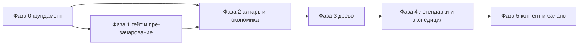

# Концепция модуля зачарований: Пробуждение Души войны

Документ описывает **единственный канон** системы усиления оружия после крафта: пре-зачарование (**перековка**, вкладка кузницы после «Ремонт») через душу войны, **алтарь зачарований** (после строительства и разблокировки), три пробуждения, древо перков (включая **легендарные перки** как узлы дерева и **слияние ветвей**), эссенцию, осколки, распыление и каталог параметров экспедиции (в терминах **кузнеца** — без участия в боях миссий). Старый экран «алтарь» и связанная с ним логика **не используются** и при внедрении в проект подлежат полному удалению из кода и данных.

Числовой баланс и финальный UI вынесены в отдельные итерации. Таблицы в части III и примеры перков в части IV — **иллюстрации**, не жёсткий список контента.

**Структура документа**

| Часть | Содержание |
|-------|------------|
| **I** | Терминология, прогрессия, пробуждение, связь с шрамами и душой войны |
| **II** | Древо силы: генерация перков, прокачка, распыление, легендарные перки (обзор) |
| **III** | Каталог параметров экспедиции (пространство влияния перков), билды, мета-параметры, правила по шрамам |
| **IV** | Перки для кузнеца: философия, типология, примеры, теги, тип `Perk`, примеры легендарных тегов |
| **V** | Архитектура динамического древа: модель уровней и «ветвей», данные, генерация, UI, интеграция с хостом |
| **VI** | Легендарные перки и слияние ветвей: правила, узлы древа, проверка, экспедиции |
| **VII** | Игровой цикл, что остаётся за рамками |
| **VIII** | План разработки модуля по фазам |

---

# Часть I. База системы

## Терминология

| Термин | Смысл |
|--------|--------|
| **Душа войны (War Soul)** | Пассивный опыт оружия в миссиях. Определяет **тир** (0–10). Сама по себе не даёт активных умений. |
| **Пробуждение** | Ритуал (специальная миссия) на экземпляр оружия. Всего **три** пробуждения по очереди; каждое привязано к **тиру локаций** экспедиций (1-е — при доступе к локациям **2-го тира**, 2-е — **3-го тира**, 3-е — **4-го тира**). |
| **Древо силы** | Появляется на оружии **только после первого пробуждения**. До этого на экземпляре **нет** дерева перков. Внутри каждого этапа пробуждения — **10 шагов** прокачки (выбор из трёх вариантов на шаг); см. часть V про ветвления после 2-го и 3-го пробуждений. |
| **Перк** | Пассивный эффект на **экспедиции и экономику модуля** (время, ресурсы, износ, теги оружия). Не «невидимый бой». Имеет **теги** (связь со шрамами), **уровень**, может входить в **комбинации**. Детали — в части IV. |
| **Пре-зачарование (перековка)** | До постройки **алтаря** эссенции **нет**. В кузнице (вкладка **«Перековка»** после «Ремонт»): **душа войны** + **техника перековки** (отдельный реестр, гибрид разблокировок с крафтом/гильдией). Два типа: **пробуждение одного шрама** (риск неудачи, одно успешное на оружие в ранней фазе) и **усиление атаки/прочности** (фикс. цена в душе, разброс эффекта, лимиты). **Не зависит** от гейта экрана «Зачарования» — только от оружия, души и разблокировок. |
| **Пробуждение шрама (перековка)** | Не путать с **миссией пробуждения** древа: это операция в кузнице, активирующая шрам в памяти клинка за трату души. |
| **Алтарь зачарований** | Строительство на базе + особая миссия разблокируют **модуль зачарований** (эссенция, осколки, древо после пробуждений). До этого **модуль зачарований** в игре виден, но **закрыт** (замок). До доступа к локациям **2-го тира** модуль не разблокируется. Механика **как часть крафта/базы** — связывается с постройками и рецептами. |
| **Эссенция души** | Появляется **после** ввода алтаря и экономики распыления; тратится на шаги древа в алтаре. Дополнительные источники эссенции можно добавить позже (заказы, награды), чтобы не зависеть только от распыления. |
| **Осколок перка** | Ресурс с распыления прокачанного оружия; обобщённые типы. Усиление перков в алтаре или крафт. |

## Разблокировка модуля и алтаря

- Пока **нет доступа к локациям 2-го тира** — экран меню **«Зачарования»** **закрыт** (замок); на оружии **нет** древа миссий пробуждения. **Дополнительно** (если в продукте включена сюжетная цепочка) пункт меню может оставаться закрытым до завершения квеста открытия — см. [ENCHANTMENT_MODULE_PHASE1.md](ENCHANTMENT_MODULE_PHASE1.md) §1.1.
- **Перековка** в кузнице (вкладка после «Ремонт») доступна **независимо** от гейта пункта меню «Зачарования» — при выполнении условий по оружию, душе и техникам (см. [ENCHANTMENT_MODULE_PHASE1.md](ENCHANTMENT_MODULE_PHASE1.md)).
- Разблокировка **алтаря зачарований** — **особая миссия** + **постройка** на базе; механика **согласуется с крафтом** (материалы, рецепты, этапы строительства — по данным хоста).
- После выполнения условий открывается полноценная экономика: **эссенция**, распыление, древо (после первого **миссионного** пробуждения на оружии).

## Цепочка прогрессии

1. Крафт оружия → экспедиции → **Душа войны** и **шрамы** (через повреждения и ремонт).
2. До алтаря: ранняя **перековка** в кузнице — душа войны + техники перековки; пробуждение шрама и/или усиление статов (без эссенции).
3. **Тир локаций 2** → доступ к первой миссии **пробуждения** на оружии → после успеха на экземпляре появляется **древо** (первый блок из **10** шагов).
4. **Тир локаций 3** → второе пробуждение → **+10** шагов, появляется **вторая ветвь** или **продолжение первой** (см. часть V).
5. **Тир локаций 4** → третье пробуждение → **+10** шагов, **развилка**: продолжить одну из двух существующих ветвей или открыть **третью** (см. часть V).
6. В каждом блоке из 10 шагов игроку предлагается **три** варианта: **новый** перк или **усиление уже взятых** (если дизайн перка допускает) — выбор из **ролла** с весами по **шрамам**; **дополнительно** веса учитывают **уже выбранные** перки (моментум — см. часть V).
7. Прокачка в алтаре за **эссенцию** (и осколки для усиления перка) — после строительства алтаря.
8. **Легендарные перки** — **не отдельные слоты**, а **обычные узлы древа** (часто в **конце** блоков или на **узле слияния** между ветвями); разблокируются при выполнении правил комбинации (часть VI), прокачиваются как остальные перки.

## Пробуждение Души войны (три этапа)

**Пробуждение** — миссия гильдии на экземпляр (одноразово на каждый из трёх этапов). Условия привязаны к **тиру локаций** экспедиций, не к таблице тиров души войны:

| Этап | Тир локаций (экспедиции) | Эффект |
|------|--------------------------|--------|
| 1-е пробуждение | Доступен контент **2-го тира** локаций | На оружии **появляется древо**; открывается **1-я ветвь**, **10** шагов прокачки |
| 2-е пробуждение | **3-й тир** локаций | **+10** шагов; **вторая ветвь** или продолжение первой |
| 3-е пробуждение | **4-й тир** локаций | **+10** шагов; **развилка** — третья ветвь или углубление одной из двух |

**Важно:** до **первого** успешного пробуждения на оружии **нет** древа перков (только пре-зачарование — **перековка** на вкладке кузницы **«Перековка»**, см. [ENCHANTMENT_MODULE_PHASE1.md](ENCHANTMENT_MODULE_PHASE1.md)). Пробуждение **не** сбрасывает шрамы.

## Шрамы, душа войны и потенциал

**Перековка (пробуждение шрама в кузнице):** полная таблица «шрам → постоянный модификатор» в данных и учёт в бою/UI логично вводить **после** того, как на экземпляре стабильна **платформа шрамов** и правила повреждений/ремонта (см. [ELEMENTAL_PLATFORM_SPEC.md](ELEMENTAL_PLATFORM_SPEC.md), [ENCHANTMENT_MODULE_PHASE1.md](ENCHANTMENT_MODULE_PHASE1.md) §10 п.3). Связь шрамов с **роллом перков древа** и моментумом развивается в этой концепции (части II, IV, V, VI) — это не отдельный «мини-канон» только в файле фазы 1.

```
Миссии → warSoul → тир души (для условий и пре-зачарования)
              ↓
       Тир локаций → миссии пробуждения (1…3)
              ↓
       Древо силы (после 1-го пробуждения)
              ↓
  Генерация перков: шрамы + моментум от уже взятых перков
              ↓
  Алтарь: эссенция, осколки, распыление
              ↓
  Легендарные перки (узлы древа / слияние ветвей)
```

- **Шрамы** — основной вес в ролле предложений; **моментум** — выбранные ранее перки/теги добавляют вес «соседним» перкам в следующих роллах (баланс и коэффициенты — отдельная задача).
- **warSoul** — пре-зачарование на вкладке **«Перековка»** (не ремонт), условия части контента, легендарные пороги.
- **soulPotential** — множители и условия в данных хоста.

---

# Часть II. Древо силы и экономика

## Генерация перков (рогалик)

**Минимальная запись перка:** `id`, `name`, `description` (для кузнеца), `tags`, доменные поля эффекта (только экспедиции и мета-модуль), `upgradable`, `maxLevel`, поля для комбинаций и теговых перков. Полная схема — в части IV.

**Выбор при повышении шага древа** (в каждом блоке по 10 шагов после соответствующего пробуждения):

1. Считываются **шрамы** (топ-3 физ. + топ-3 стих.) и **веса**.
2. Учитывается **моментум**: уже взятые перки и их теги **увеличивают вес** «соседних» кандидатов (общая теговая линия, смежные стихии, продолжение той же ветви) — коэффициенты балансируются отдельно.
3. Из пула отбираются кандидаты с пересечением `tags` с ключами шрамов и моментума.
4. Случайно выбираются **три** перка для предложения (взвешенный сэмплинг по релевантности).
5. Без шрамов — пул **нейтральных** перков (скорость миссии, успех, износ — в терминах экспедиции).

В трёх предложениях могут быть **новый** перк или **усиление уже взятого** (если у перка `upgradable` и не достигнут `maxLevel`) — по тем же весам и правилам исключения дубликатов `perkId` на разных слотах, если дизайн не вводит исключений.

После **второго** и **третьего** пробуждения меняется **структура ветвей** (см. часть V), но генерация остаётся одной функцией от экземпляра и шага.

**Ветви в UI:** после 2-го пробуждения — **две** линии развития (или одна продолженная); после 3-го — **развилка** (углубление одной из двух или **третья** ветвь). Технически это поля `branch` / индекс ветви в данных шага, а не три независимых полноценных дерева с разными счётчиками опыта — детали в части V.

## Пре-зачарование (до алтаря)

Пока **алтарь не построен**, **эссенции нет**. **Древо** на оружии появляется только после **первой миссии пробуждения** этого экземпляра. До этого — **перековка** на вкладке кузницы «Перековка»: отдельный реестр техник, **два** направления (пробуждение шрама с шансом неудачи и лимитом успехов; усиление атаки/прочности с лестницей цены и потолком). Не путать техники перековки с техниками **починки**. Это **не** древо и **не** эссенция; после алтаря слой **может** сохраняться и дополняться (баланс при внедрении).

## Прокачка древа и интерфейс модуля (после алтаря и пробуждений)

- **Эссенция** — оплата **шага** древа в алтаре (после разблокировки экономики).
- **Осколки** — повышение уровня выбранного перка в алтаре.
- Стоимость шага растёт по дизайну; улучшение перка — осколки ± эссенция по правилам перка.

**Интерфейс:** схема древа с **тремя** блоками по 10 шагов (после 1–3 пробуждений); «открыть следующий шаг» → три варианта; улучшение существующего перка; раздел «Распылить оружие». Модуль на навбаре до разблокировки — **виден, но заблокирован** (замок).

## Распыление оружия

Доступно после введения экономики алтаря. Любой экземпляр можно распылить — оружие исчезает из инвентаря.

**Базовое:** эссенция в зависимости от warSoul, тира души, качества.

**С прокачанными перками:** эссенция + **осколки** обобщённых типов по преобладающим тегам перков и сумме их уровней.

Осколки — в модуле зачарования и опционально в крафте.

## Уровни перков и баланс

Перк может иметь несколько уровней; улучшение усиливает число или добавляет эффект. Требования: осколки, иногда тир души или номер пробуждения.

**Пример (иллюстрация, не фиксированные числа):** «Светоч пути» — уровни усиливают скорость в тёмных локациях в отчёте экспедиции.

Улучшение перка не должно обходить по выгоде покупку нового шага древа без намерения дизайна.

## Легендарные комбинации (общие правила)

При выполнении условий правил **открывается узел древа** с **легендарным перком** (или становится доступна покупка шага с этим перком в одном из трёх вариантов на шаге — по дизайну конкретного правила). Эффект хранится как **выбранный перк** на экземпляре, без отдельной панели «слотов». Ограничение силы задаётся **позицией в дереве**, **стоимостью** и **строгостью условий**, а не счётчиком слотов. Детали — части V–VI.

---

# Часть III. Параметры экспедиции (пространство влияния перков)

Ниже — **черновой словарь параметров экспедиции**, на которые в будущем маппятся перки. Строки таблиц — **примеры**, не обязательный контент; фактический набор полей берётся из **текущего** движка экспедиций SwordCraft (скорость, успех, износ, добыча, события и т.д. — см. код и `docs` по экспедициям).

**Связь с частью IV:** усилители перков должны маппиться на один или несколько параметров из этого каталога; поле `boost.stat` в типе `Perk` расширяется под хост.

## 1. Скорость и эффективность прохождения

| Параметр | Что даёт игроку | Пример перка | Возможные теги |
|----------|-----------------|--------------|----------------|
| **Сокращение времени миссии** | Больше миссий за единицу времени | *«Лёгкое лезвие»*: +10% скорости | `air`, `lightning` |
| **Пропуск этапов / сокращение числа комнат** | Меньше износа, быстрее финиш | *«Телепорт»*: мгновенно в конец, без ресурсов с пропущенных этапов | `space`, `arcane`, `air` |
| **Ускорение в определённых условиях** (ночь, дождь, горы) | Ситуативное преимущество | *«Светоч пути»*: +15% скорости в тёмных локациях | `fire`, `light` |
| **Снижение штрафа от погоды** (туман, снегопад) | Меньше замедления | *«Рассеивающий ветер»*: игнор штрафа скорости от тумана | `air`, `lightning` |

## 2. Добыча ресурсов (базовые и редкие)

| Параметр | Что даёт | Пример перка | Теги |
|----------|----------|--------------|------|
| **+X% к базовой руде/металлам** | Больше материалов для крафта | *«Каменный нюх»*: +15% руды в горных локациях | `earth` |
| **+X% к древесине** | | *«Древесный зов»*: +10% дерева в лесах | `nature` |
| **+X% к редким ресурсам** (самоцветы, эссенции) | Ценные компоненты | *«Жила глубин»*: шанс 20% найти самоцвет | `earth`, `darkness` |
| **Шанс найти чертёж / рецепт** | Новые рецепты крафта | *«Кузнечное чутьё»*: шанс найти чертёж оружия | `arcane`, `fire` |
| **Замена ресурса** (руда → эссенция) | Конверсия для прокачки | *«Пожиратель металла»*: вместо руды — эссенция души (меньше крафта, больше зачарований) | `corrosion`, `blood` |

## 3. Износ оружия и повреждения

| Параметр | Что даёт | Пример перка | Теги |
|----------|----------|--------------|------|
| **Снижение общего износа** (меньше видимых тэгов) | Дольше без ремонта | *«Крепкая пята»*: −10% к получению повреждений | `earth` |
| **Снижение шанса конкретного типа повреждений** | Контроль над шрамами | *«Закалённая кромка»*: −30% шанс `physical_slash_chip` | `scar_slash_ragged`, `fire` |
| **Шанс полностью избежать повреждений в миссии** | Экономия на ремонте | *«Нетронутый клинок»*: 5% шанс не получить ни одного тэга | `light`, `space` |
| **Автоматический мелкий ремонт в поле** | Меньше визитов в кузницу | *«Горн в походе»*: один раз за миссию снять случайный видимый тэг | `fire`, `scar_impact_brutal` |
| **Замедление накопления конкретной оси шрамов** | Направленное формирование памяти клинка | *«Ледяная изоляция»*: огненные повреждения не увеличивают вес огненного шрама | `frost`, `water` |

## 4. Успех, риск и критические события

| Параметр | Что даёт | Пример перка | Теги |
|----------|----------|--------------|------|
| **Повышение базового шанса успеха миссии** | Меньше провалов | *«Удача кузнеца»*: +5% успеха | `light`, `arcane` |
| **Снижение штрафа при провале** | Провал мягче | *«Закалённый неудачами»*: при провале теряется только 50% ресурсов | `darkness`, `scar_crack_nerved` |
| **Шанс критического успеха** (удвоение награды, нулевой износ) | Внезапный буст | *«Звёздный час»*: 3% критуспех | `lightning`, `blood` |
| **Снижение риска травмы искателя** | Искатель доступнее | *«Верный щит»*: искатель не получает травм в этой миссии | `earth`, `water` |

## 5. Прогрессия души войны и опыта

| Параметр | Что даёт | Пример перка | Теги |
|----------|----------|--------------|------|
| **+X% к приросту warSoul** | Быстрее тир | *«Жажда битвы»*: +20% прироста души | `blood`, `fire` |
| **+X% к опыту искателя** (если есть в хосте) | Уровень наёмника | *«Наставник»*: +10% опыта искателя | `light`, `air` |
| **Шанс дополнительного warSoul сверх лимита** | Ускоренная прокачка | *«Прорыв»*: 5% удвоение warSoul за миссию | `lightning`, `arcane` |

## 6. Экономия и модификаторы миссии (в рамках текущего хоста)

В SwordCraft **нет** отдельной системы провизии / алхимии / расходников на миссию. Вместо этого перки могут опираться на то, что **уже есть** в расчёте экспедиции: базовая стоимость/время отправки, штрафы локаций, модификаторы искателя и оружия, множители награды.

| Параметр (концепт) | Что даёт | Пример перка | Теги |
|----------|----------|--------------|------|
| **Снижение штрафа к успеху / времени** от конкретных условий хоста | Мягче негативные модификаторы | *«Ровный ход»*: меньше потерь времени в «тяжёлых» сценариях | `earth`, `water` |
| **Смещение исхода при автоматическом разрешении событий** | Теги оружия влияют на **вероятности** без выбора игрока | *«Теневой резонанс»*: чуть выше шанс «тихого» исхода в событиях, где это поддержано движком | `darkness` |

## 7. Особые события (без выбора кузнеца)

**Кузнец не управляет** ходом экспедиции и не делает развилок в бою: в миссии действуют **авантюристы**, решения — в логике симуляции / событийного движка. Перки и **теги оружия** меняют **вероятности и параметры автоматических исходов** (успех события, тип награды, дополнительный этап), а не открывают меню выбора игроку.

| Параметр | Что даёт | Пример перка | Теги |
|----------|----------|--------------|------|
| **Шанс дополнительного события** (секрет, усиленная награда) | Доп. контент в отчёте | *«Искатель приключений»*: +шанс особого события в пуле хоста | `light`, `air` |
| **Модификатор исхода по тегу оружия** | Иной вес «удачного» сценария | *«Теневой покров»*: снижает вероятность тяжёлого исхода в подходящих событиях | `darkness` |
| **Гарантированный тип награды** (если поддержано движком) | Предсказуемость | *«Чутьё сокровищ»*: при срабатывании события сундука — бонус к редкости | `earth`, `light` |

## Стратегии билдов (примеры, не обязательные пресеты)

| Стратегия | Ключевые параметры | Примеры перков (из каталога выше) |
|-----------|--------------------|-----------------------------------|
| **Фермер ресурсов** | +руда, +редкие | «Каменный нюх», «Жила глубин», «Чутьё сокровищ» |
| **Скоростной фарм души** | скорость, warSoul, критуспех | «Лёгкое лезвие», «Жажда битвы», «Звёздный час» |
| **Долгое использование без ремонта** | −износ, снятие тэгов | «Крепкая пята», «Горн в походе», «Нетронутый клинок» |
| **Контроль шрамов** | замедление нежелательных шрамов | «Ледяная изоляция», перки под конкретные `scar_*` |
| **Рискованные миссии** | +успех, −штраф при провале | «Удача кузнеца», «Закалённый неудачами» |
| **Событийный упор** | шанс особых событий, теги на оружии | «Искатель приключений», теговые с маршрутизацией в движке |

## Мета-параметры (влияют на модуль зачарования)

Имеет смысл выносить в отдельный слой данных:

- стоимость миссии пробуждения (скидка на следующее);
- стоимость уровней древа (меньше эссенции);
- шанс бесплатного уровня древа;
- увеличение осколков при распылении;
- возможность **перековать** перк (заменить выбранный) — **заглушка** на более поздние этапы; контракт и UX описать при реализации.

См. также мета-перки в части IV.

## Правила увязки со шрамами (для генерации)

- Много `earth`-шрамов → чаще ресурсы (руда) и снижение износа.
- Много `fire` → скорость в темноте, авторемонт, агрессивный прирост души.
- Физический шрам `scar_bend_spring` → перки уклонения / гибкости / пропуска этапов.
- `water` + `frost` → сохранность оружия в холодных локациях.
- `space` + `air` → телепорт, невесомость.

Игрок, целящийся в билд «фермер», намеренно ведёт оружие в миссии с нужными стихиями, копит шрамы, затем пробуждает душу и получает подходящие перки.

---

# Часть IV. Перки с точки зрения кузнеца

## Философия

Перки не должны описываться как «+5% урона по врагу» — кузнец этого не видит. Все эффекты — в **отчётах экспедиций**, ресурсах, износе, событиях и экономике модуля. Отчёт формулирует эффект понятно: *«Пламя с клинка отпугнуло волков — миссия без лишней траты времени»*. Таблицы примеров ниже — **иллюстрации**, не финальный список контента.

**Роль кузнеца:** авантюристы участвуют в экспедициях; кузнец не выбирает ветки событий в миссии. Теговые перки влияют на **автоматические** исходы и тексты отчёта, а не на интерактивные развилки для игрока-кузнеца.

## Типология (три слоя)

| Слой | Что делает | Пример | Как видит кузнец |
|------|------------|--------|------------------|
| **Усилители** | Числовые параметры миссии (см. часть III) | скорость, добыча, износ | Строки отчёта |
| **Теговые** | Постоянный тег оружия | `fire-touched`, `teleport` | Иконка; новые ветки в событиях |
| **Трансформационные** | Шрамы, ремонт, распыление | больше осколков при распылении | Текст в модуле зачарования |

## Примеры перков по стихиям (15 штук)

### Огонь (`fire`)

| # | Название | Теги | Эффект в экспедиции |
|---|----------|------|---------------------|
| 1 | **Светоч пути** | `fire` | В тёмных локациях скорость +15%; не тратится время на факелы. |
| 2 | **Опаляющий клинок** | `fire`, `scar_slash_ragged` | Против уязвимых к огню — миссия на этап короче, меньше износ. |
| 3 | **Горн в походе** | `fire`, `scar_impact_brutal` | Раз за миссию снять случайный видимый тэг без кузницы. |

### Вода (`water`)

| # | Название | Теги | Эффект |
|---|----------|------|--------|
| 4 | **Родниковая сталь** | `water` | В локациях с водой износ −20%. |
| 5 | **Туманный след** | `water`, `scar_crack_nerved` | Ниже риск повреждений; в отчёте «прошёл незамеченным». |

### Земля (`earth`)

| # | Название | Теги | Эффект |
|---|----------|------|--------|
| 6 | **Крепкая пята** | `earth` | Шанс физического повреждения −10%. |
| 7 | **Каменный нюх** | `earth`, `scar_gouge_chunk` | +15% руды и камня в горных/подземных миссиях. |

### Воздух (`air`)

| # | Название | Теги | Эффект |
|---|----------|------|--------|
| 8 | **Лёгкое лезвие** | `air` | Скорость миссии +10%. |
| 9 | **Свистящий удар** | `air`, `scar_bend_spring` | 20% шанс «Эссенция ветра» при успехе. |

### Молния (`lightning`)

| # | Название | Теги | Эффект |
|---|----------|------|--------|
| 10 | **Искровой разряд** | `lightning` | При критуспехе — мгновенное завершение; отчёт про молнию. |
| 11 | **Заземлённая гарда** | `lightning`, `scar_grip_rigid` | Нет урона от электрических ловушек. |

### Мороз (`frost`)

| # | Название | Теги | Эффект |
|---|----------|------|--------|
| 12 | **Ледяная консервация** | `frost` | Нет износа в холодных локациях. |
| 13 | **Морозный след** | `frost`, `scar_crack_fissure` | +10% ресурсов после миссии. |

### Яд / Коррозия (`poison`, `corrosion`)

| # | Название | Теги | Эффект |
|---|----------|------|--------|
| 14 | **Ржавый покров** | `corrosion`, `scar_blunt_dull` | Шанс добычи ценностей «из тел» в отчёте. |
| 15 | **Противоядие в стали** | `poison`, `scar_puncture_gouge` | Ниже риск провала от яда в миссии. |

## Теговые перки (добавляют тег оружию)

| # | Название | Теги появления | Тег оружия | Эффект |
|---|----------|----------------|------------|--------|
| 16 | **Огненное дыхание** | `fire` + `scar_impact_brutal` | `fire-touched` | Выжечь препятствие → сундук, цена — время. |
| 17 | **Невесомость** | `air` + `space` | `weightless` | Перепрыгнуть пропасть; риск уронить клинок. |
| 18 | **Телепорт** | `space` + `air` + `arcane` | `teleport` | В конец миссии без промежуточных наград; без износа. |
| 19 | **Чутьё сокровищ** | `earth` + `light` | `treasure-sense` | Гарантированный ценный ресурс за миссию. |
| 20 | **Теневой покров** | `darkness` + `scar_anatomical_grip` | `shadow-cloak` | Избежать тяжёлого боя; меньше души. |

**Событие:** при генерации проверяется тег оружия; если есть — движок миссий может применить **другой вес исхода** или **альтернативный текст отчёта** для того же автоматического события (без выбора кузнеца), например ущелье с `weightless` даёт иной шанс успеха или иной тип награды согласно данным хоста.

## Легендарные теги от комбинаций перков

Полная **система правил** (условия, типы эффектов, пересчёт, интеграция с экспедицией) — в **части VI**.

| Комбинация тегов перков | Легендарный тег | Эффект |
|-------------------------|-----------------|--------|
| `fire` + `air` + `lightning` | `storm-bringer` | В плохую погоду скорость +50%, износ −30%. |
| `water` + `frost` + `nature` | `life-bloom` | После миссии +10% прочности (мелкий ремонт). |
| `space` + `arcane` + `darkness` | `void-walker` | Раз за миссию возврат в пройденную комнату за ресурсом, трата времени. |
| `earth` + `corrosion` + `poison` | `decay-touch` | «Гнилая эссенция» для тёмного крафта. |

## Мета-перки (модуль зачарования)

| # | Название | Теги / условие | Эффект |
|---|----------|----------------|--------|
| 21 | **Память стали** | `scar_*` физ. | +30% осколков при распылении этого оружия. |
| 22 | **Эхо битвы** | тир > 3 | −20% стоимости следующей миссии пробуждения. |
| 23 | **Проводник душ** | `arcane`, `soulPotential > 2.0` | 15% шанс бесплатного уровня древа. |

## Структура данных `Perk`

```typescript
type Perk = {
  id: string;
  name: string;
  description: string;
  tags: string[];
  effectType: 'boost' | 'tag' | 'transform';
  boost?: {
    stat: 'expeditionSpeed' | 'wearReduction' | 'resourceBonus' | 'critSuccessChance' | 'riskReduction';
    // хост расширяет под каталог части III
    value: number;
  };
  addsTag?: string;
  transform?: {
    onSalvage?: 'moreShards' | 'moreEssence';
    onAwaken?: 'cheaperNext';
    onLevelUp?: 'freeLevelChance';
  };
  upgradable: boolean;
  maxLevel: number;
};
```

Без полей «урон по NPC»; только экспедиция и экономика модуля.

---

# Часть V. Архитектура динамического древа перков (реализация)

Ниже — модель **реализации** древа на базе типичного веб-стека (данные в JSON, состояние в store, адаптивный UI). Фреймворки и пути к файлам не фиксируются; важны **механики** и **разделение ответственности**.

## Канон прогрессии: три пробуждения × 10 шагов

| Пробуждение | Тир локаций (экспедиции) | Шагов древа | Структура ветвей |
|-------------|--------------------------|-------------|------------------|
| 1-е | 2-й тир локаций | 10 | Одна **первая ветвь** (линейная последовательность шагов 1–10 внутри блока) |
| 2-е | 3-й тир | +10 | Либо **вторая ветвь** (параллельная линия шагов 11–20), либо **продолжение первой** — режим фиксируется при получении 2-го пробуждения (один раз на экземпляр; **экран кузнеца**, не развилка в экспедиции) |
| 3-е | 4-й тир | +10 | **Развилка:** продолжить одну из **двух** существующих ветвей (шаги 21–30 в выбранной линии) **или** открыть **третью** ветвь (новая линия с шага 21) — фиксируется один раз при 3-м пробуждении (**экран кузнеца**) |

**Итого** до **30** шагов выбора перка на экземпляр (3×10), если игрок прошёл все три пробуждения. Уровень пробуждения на оружии: **0…3** (ноль — древа ещё нет).

Технически это **не** три полностью независимых RPG-дерева с разными «очками навыка»: это **одна модель состояния** — список шагов с полями `branchId`, `stepInBranch`, `chosenPerkId`, `perkRank`, привязка к номеру пробуждения, открывшего блок.

## Оси ветви: «физика» и «нефизика» (стихийная память)

Шрамы на клинке уже делятся на **физические** (`scar_*` и т.п.) и **стихийные / нефизические** оси (топ стихий в данных платформы). Чтобы ветви имели **смысл**, каждая **ветвь** в данных имеет **архетип** — какую **пару акцентов** она культивирует:

| Архетип ветви | Смысл (упрощённо) | Кому выгодно |
|----------------|-------------------|--------------|
| **Смешанная** | **Физика + нефизика** (одна линия тянет оба типа тегов) | Универсальный билд под реальную смесь шрамов на оружии; перки, требующие и физ., и стих. ассоциаций |
| **Глубокая физика** | **Физика + физика** (две физические линии или углубление одной физ. темы) | Максимум контроля износа, стабильности, «железа» в отчётах |
| **Глубокая стихия** | **Нефизика + нефизика** (две стихийные линии или углубление одной стихии) | Максимум элементальных эффектов, тегов оружия, редких исходов |

Конкретные имена осей и теги в каталоге перков задаются контентом; важно правило: **ветвь не «про всё сразу»**, а про **одну из трёх пар акцентов**, чтобы разведение веток было читаемым и предсказуемым для легендарок.

## Зачем игроку одна, две или три ветви

| Режим | Зачем держать |
|--------|----------------|
| **Одна ветвь** (второе пробуждение: «продолжить первую»; третье: углубление той же) | Проще **дойти до конца** одной линии; меньше распыления эссенции по параллельным линиям; легендарные перки, рассчитанные на **глубину одной** оси или на **финал одной** ветви, без требования кросса |
| **Две ветви** | Игрок **намеренно** качает **два разных архетипа** (например смешанную + глубокую стихию), чтобы выполнить условия **легендарного перка–слияния**, который требует прогресса **в обеих** линиях; либо чтобы закрыть два разных типа контента экспедиций |
| **Третья ветвь** | Либо **третий архетип** (например добавить глубокую физику к уже идущим смешанной и стихийной), либо **запасная линия** под другой билд; условия легендарок могут требовать **вклад из трёх** направлений или давать **альтернативный** финальный узел |

Итог: **ветвление — не декорация**, а способ выразить **сколько разных «пар акцентов»** игрок развивает на одном клинке; легендарный контент привязывается к **сочетанию** этих линий.

## Узлы слияния и легендарные перки в дереве

- **Легендарный перк** — это **запись в каталоге** с флагом уровня силы (`legendary` / `merge` и т.д.) и обычными полями стоимости и апгрейда; он **занимает шаг древа**, как и любой другой перк. **Отдельных UI-слотов** под легендарки нет.
- **Узел слияния** — особый **шаг** (или фиксированная позиция после него), который **появляется в дереве**, когда выполнены **условия правила** (например: «в ветви A взято ≥ N перков с тегами X, в ветви B ≥ M с тегами Y»). В этом узле игрок выбирает (или получает в пуле из трёх) **легендарный перк**, который **связывает** ветви смыслово и визуально (линии сходятся к одной точке на схеме).
- **Когда появляется слияние:** по дизайну правила — чаще **к финальным шагам** блока (например к 9–10 шагу пробуждения), но может **сработать раньше**, если игрок быстро выполнил условия; тогда узел **открывается досрочно**.
- **После слияния ветви не обрезаются:** параллельные ветви **продолжают** получать шаги в своих блоках пробуждений; слияние — **точка пересечения** и сильный перк, а не «конец игры» для остальных линий, если баланс и контент это допускают.
- Несколько разных правил могут давать **несколько** легендарных узлов на одном оружии (на разных шагах); баланс — **редкость условий** и **цена** эссенции/осколков, а не лимит слотов.

## Связь с шрамами и моментумом

- **Шрамы** задают базовые веса кандидатов (как раньше).
- **Моментум:** теги и id уже выбранных перков увеличивают вес «продолжающих» и смежных перков на следующих шагах (настраиваемые коэффициенты; цель — **закрепление билда** без жёсткого выбора ветки игроком в экспедиции).
- При **новой ветви** после 2-го или 3-го пробуждения первый шаг новой линии может использовать **пониженный** моментум от другой ветви или отдельный подмешанный пул — по балансу.

## Данные: каталог перков

- Централизованные определения: id, имя, описание, **теги**, тип эффекта, параметры, `upgradable`, `maxLevel`, опционально **`branchAffinity`** и **`branchArchetype`** (`mixed_phys_elem` | `deep_phys` | `deep_elem` — имена условные), для **легендарных** — флаг **`kind: 'legendary'`** / привязка к **правилу слияния**.
- Поле **категория / branch** для UI-фильтров (`fire`, `earth`, `physical`, `meta` и т.д.).
- Пул расширяется данными; алгоритм шага не меняется.

## Данные: экземпляр оружия и древо

На экземпляре минимум:

- Поля хоста: warSoul, потенциал, повреждения и т.д.
- **Шрамы** (топ-3 физ. + топ-3 стих. или эквивалент платформы осей).
- **`awakeningLevel`**: 0…3; флаги **ветвления** после 2-го и 3-го пробуждений (`secondBranchMode`: `continue_first` | `new_branch_B`; `thirdBranchMode`: `continue_branch_id` | `new_branch_C`).
- **Массив шагов древа:** для каждого пройденного шага — `globalStepIndex` 1…30, `branchId`, `perkId`, уровень прокачки перка.

Инвариант: на одном **глобальном шаге** — один выбранный перк (или апгрейд существующего в трёх вариантах); **дубликат `perkId` на разных слотах** — по правилам дизайна (обычно запрещён, кроме явных исключений «стакающихся» перков).

## Генерация трёх предложений на следующий шаг

Чистая функция от экземпляра, `globalStepIndex`, каталога и конфига баланса:

1. Определить **активную ветвь** и номер шага внутри блока (1…10 для текущего пробуждения).
2. Собрать веса шрамов; вычислить **моментум** от уже выбранных перков в этой и смежных ветвях.
3. Собрать кандидатов с ненулевой релевантностью; подмешать нейтральный пул при необходимости.
4. В три слота отобрать без повторов с взвешенной случайностью; допустить варианты «апгрейд существующего перка», если правила перка позволяют.
5. Исключить уже занятые `perkId` (если нет исключения).
6. Деградация при нехватке кандидатов — ослабить фильтр или расширить пул.

## Обновление состояния (концепция store)

- Оплатить следующий шаг эссенцией (если алтарь и экономика активны).
- Зафиксировать выбор одного из трёх вариантов на текущем шаге.
- При получении 2-го/3-го пробуждения — записать режим ветвления и сбросить только **UI-фокус**, не историю уже взятых перков.
- Улучшение уровня перка осколками; пересчёт легендарных комбинаций.

## Легендарные комбинации и узлы слияния

Как в часть VI: чистая функция от `chosenPerks` + правила **разблокирует** узел слияния или добавляет легендарный перк в **допустимый пул** на шаге. Эффект хранится как **выбранный перк** на шаге древа, без отдельного массива «экипированных легендарок».

## Интерфейс: мобильная и десктопная схемы

**Мобильная:** три **блока** (после пробуждений 1–3) или один скролл с маркерами «Пробуждение I / II / III»; внутри блока — 10 слотов; активный слот — три карточки на выбор.

**Десктоп:** горизонтальная схема **ветвей** (линии), если включены параллельные ветви; **узел слияния** — визуально как **сход линий** к одной карточке (легендарный перк); при досрочном слиянии ветви **продолжаются** дальше по схеме.

**Замок:** до разблокировки модуля — экран-заглушка с условиями (тир локаций 2, миссия, алтарь).

## Загрузка каталога и граница клиент / сервер

- Каталог статический или с сервера; генерация трёх вариантов — клиентская чистая функция, если нет требований античита.
- Сохранение — в общей персистентности хоста.

## UX-детали (рекомендации)

- Индикатор: «шаг M из 10» в текущем блоке; «пробуждений: K из 3».
- Подсветка доступности эссенции; уведомления при улучшении перка и при активации легендарки.

## Итог по части V

- Три пробуждения привязаны к **тирам локаций** 2 / 3 / 4.
- До 30 шагов, ветвления после 2-го и 3-го пробуждений **в данных экземпляра**, без четырёх независимых деревьев опыта.
- Генерация опирается на **шрамы + моментум**; баланс весов — отдельная задача.

**Следующий шаг** — часть VI (правила разблокировки легендарных узлов и слияния); граничные случаи — мало кандидатов, смена шрамов между шагами.

---

# Часть VI. Легендарные перки, слияние ветвей и правила

**Легендарный эффект** в бою и отчёте — это не отдельная сущность в сейве, а **эффект перка**, который игрок **взял в дереве** на конкретном шаге. Правила комбинаций отвечают за то, **когда** узел с таким перком **доступен** (разблокирован **узел слияния**, перк добавлен в пул на шаге, или шаг целиком открыт только при выполнении условий).

Конфигурация правил — **декларативная**; ядро проверки — **чистая функция** от экземпляра, выбранных шагов древа и каталога перков.

Связь с частью V: архетип ветви (**физика+стихия**, **физика+физика**, **стихия+стихия**) задаёт, **какие** правила слияния вообще достижимы при выбранном режиме ветвления.

## Почему не отдельные слоты

- Легендарные перки **конкурируют за шаги и эссенцию** с обычными перками того же блока; их сила ограничивается **местом в дереве** (часто **конец** блока или **узел между ветвями**) и **ценой** апгрейда.
- Несколько легендарных перков на одном оружии возможны, если контент и баланс вводят **несколько** правил с разными `perkId` и непересекающимися шагами; конфликты **одного и того же** шага решаются приоритетом правила в данных или запретом дублировать узел.

Таблицы примеров в части IV и ниже — **иллюстрации**, не фиксированный набор правил.

## Типы легендарных эффектов

| Тип | Назначение | Пример проявления |
|-----|------------|-------------------|
| **Добавление тега оружию** | Постоянный тег экземпляра (в дополнение к тегам от перков) | `deep-digger`, `wind-runner` — влияют на события и условия других правил |
| **Усиление параметра миссии** | Модифицирует числовые параметры экспедиции (часть III) | +% к скорости, к добыче, к восстановлению после провала |
| **Правило-трансформация** | Ссылка на идентификатор правила в движке экспедиций | «После ремонта три миссии без повреждений», «критуспех удваивает душу» — обрабатываются там, где считается миссия |

У каждого эффекта есть **текст для UI** (название комбинации, краткое описание для кузнеца).

## Структура правила комбинации

Каждое правило имеет **идентификатор**, **имя**, **описание для игрока** и блок **условий** — для активации должны выполняться **все** перечисленные требования (логическое И).

Возможные виды условий (набор гибкий, расширяется контентом):

- **Точный набор перков:** перечисленные `perkId` должны **все** присутствовать среди выбранных в древе (порядок не важен).
- **Минимум перков с тегом:** например не меньше трёх перков, у которых в определении есть тег `fire`.
- **Минимум суммы уровней по тегу:** сумма `currentLevel` по всем выбранным перкам, чьи определения содержат тег (например суммарно ≥5 уровней по огненным перкам).
- **Минимум различных категорий (ветвей):** число уникальных значений поля «ветка / branch» среди выбранных перков — для комбинаций «три разные линии».
- **Минимальный уровень пробуждения** оружия.
- **Минимальный тир души войны** (или эквивалентный порог).
- **Обязательные теги на оружии:** уже наложенные теги экземпляра (от теговых перков или от предыдущих легендарок) — чтобы строить цепочки.

**Эффект** правила обычно сводится к: **разблокировать шаг** `stepId` с предопределённым `perkId` (легендарный перк), **или** добавить `perkId` в пул из трёх на указанном шаге, **или** пометить узел слияния как «доступен для оплаты». Параметры эффекта перка (числа, теги, `transformRule`) — в **каталоге перков**, как у любого другого перка.

## Примеры комбинаций (иллюстрация дизайна)

Ниже — смысловые скетчи; реальные `perkId` подставляются из каталога хоста.

| Условный id | Название | Идея условий | Эффект |
|-------------|----------|--------------|--------|
| `wind_runner` | Ветрогон | Три конкретных перка на скорость / воздух | Усиление скорости миссии и сокращение «простоя» после провала |
| `deep_digger` | Глубокий копатель | Три перка на добычу / «каменный нюх» | Тег `deep-digger` + гарантированный редкий ресурс в данных миссии |
| `indestructible` | Несокрушимый | Три перка на прочность / полевой ремонт | Правило: N миссий подряд без новых повреждений после ремонта в кузнице |
| `soul_devourer` | Душеед | Три перка на warSoul / переполнение | При критуспехе — множители к душе и эссенции (трансформация правил награды) |
| `ghost_walker` | Призрачный странник | Перки «телепорт», тень, пространственные теги | Усиление параметров миссии в сценариях хоста, где это поддержано (без отдельной механики «кузнец выбирает») |
| `pyromancer_wrath` | Гнев пироманта | ≥3 перка с тегом `fire`, сумма уровней по огню ≥5, пробуждение ≥2 | Масштабируемый бонус скорости в тёмных локациях от числа огненных перков |

Такие строки живут в **таблице правил**; баланс чисел — отдельная задача.

## Алгоритм проверки (логика без кода)

1. По экземпляру собрать список **выбранных perkId** и уровней каждого вложенного перка.
2. По каталогу определений перков построить вспомогательные структуры: сколько **перков** несёт каждый тег; сумма **уровней** по каждому тегу; множество **веток (branch)**.
3. Для каждого правила из конфигурации проверить условия по порядку; при первом несовпадении правило отбрасывается.
4. Собрать все правила, прошедшие проверку; по ним обновляется **доступность узлов** (слияние, заблокированные шаги) и/или **пулы** на шагах; уже **купленные** легендарные перки остаются в `chosenPerks`.
5. Два правила, назначающие **один и тот же шаг** одному и тому же `perkId`, не должны конфликтовать — приоритет или запрет в данных.

Идемпотентность: повторный пересчёт с тем же состоянием даёт тот же набор эффектов.

## Производное состояние на экземпляре

- **Активные эффекты легендарных перков** — это те же эффекты, что и у обычных перков: они включаются в расчёт, когда соответствующий `perkId` присутствует в **выбранных шагах древа**. Дополнительно можно кэшировать «разблокировано правилом, но ещё не куплено» для UI узла слияния.
- **Теги оружия** от легендарных перков (если тип перка добавляет тег) сливаются с тегами от остальных перков в **множество тегов экземпляра**.
- **Правила-трансформации** с легендарного перка идут так же, как с обычного — через список идентификаторов в движке экспедиций.
- **Усиления параметров** — из полей перка в каталоге.

**Источник правды:** `chosenPerks` (все шаги, включая легендарные узлы) + каталог; правила комбинаций — только про **доступность** шагов и узлов слияния.

## Интеграция с состоянием игры

После любого действия: выбор перка на шаге, улучшение уровня перка, изменение пробуждения — выполняется **пересчёт** правил (разблокировка узлов слияния, пулов) и пересчёт производных от **всех** выбранных перков (теги, `transformRule`).

Стек (Zustand и т.д.) не обязателен; важен **контракт**: одна точка входа «пересчитать правила слияния и доступность шагов» + общий пересчёт эффектов экземпляра.

## Отображение в UI

- Легендарные перки видны **на древе** как отдельные узлы (часто **узел слияния** между ветвями); акцентная рамка / иконка редкости.
- Опционально блок **«Легендарные перки»** в боковой панели — **агрегат** по уже взятым перкам с флагом `legendary` из `chosenPerks`, без дублирования отдельной системы слотов.

## Применение в логике экспедиций

При расчёте миссии хост учитывает:

- объединённые **теги оружия** (все перки, включая легендарные узлы древа);
- **числовые бонусы** из полей перков;
- **transformRule** из всех выбранных перков — в том числе с легендарных узлов.

Карта параметров из части III служит **словарём**, к каким полям миссии что кладётся.

## Расширяемость

Новая комбинация: добавить строку в конфигурацию правил и при необходимости один обработчик `transformRule` или ветку в формуле параметра. Ядро перебора правил **не меняется**.

## Примеры срабатывания

- Собраны три конкретных перка «ветра» из условия **Ветрогона** — активируется усиление скорости и времени восстановления; новый тег на оружии может **не** добавляться, если эффект только числовой.
- Собраны три перка копателя — активируется **Глубокий копатель**: на экземпляр вешается тег `deep-digger`, который дальше читает генератор миссий.

Снятие перка при будущем «перекове» (если появится в мета-параметрах) должно снова прогнать проверку — комбинации могут отключиться.

## Связь с частью IV

Таблица **легендарных тегов** в части IV (`storm-bringer`, `life-bloom`, …) — примеры **имен и эффектов**; модуль из части VI задаёт **как** они (и аналоги) активируются из данных правил и как сочетаются с перками по тегам и id.

---

# Часть VII. Игровой цикл и закрытие

## Игровой цикл с новой системой

1. Крафт оружия.
2. Экспедиции → warSoul и шрамы (через ремонт и логику повреждений).
3. До **тира локаций 2** — пункт меню **«Зачарования»** и полноценный модуль **закрыты**; **древа на оружии нет**; при желании — **перековка** на вкладке **«Перековка»** (душа войны + техники перековки) как пре-зачарование — см. [ENCHANTMENT_MODULE_PHASE1.md](ENCHANTMENT_MODULE_PHASE1.md). **В репозитории** после появления tier-2 дополнительно действует сюжетная разблокировка пункта меню (квест «Эхо забытой кузни»); детали — в фазе 1 и [FORGOTTEN_FORGE.md](../Quests/FORGOTTEN_FORGE.md).
4. Разблокировка **экономики алтаря**: **постройка** и **особая миссия** (фаза 2) → появляется **эссенция** и полноценный экран модуля.
5. **Тир локаций 2** + первое пробуждение → **древо**: первый блок из **10** шагов.
6. **Тир 3** + второе пробуждение → **+10** шагов, ветвление (вторая ветвь или продолжение первой).
7. **Тир 4** + третье пробуждение → **+10** шагов, развилка третьей ветви или углубление одной из двух.
8. Распыление оружия → эссенция и осколки (после введения экономики).
9. Прокачка древа и перков; легендарные перки на **узлах древа** и **слиянии ветвей** (часть VI).
10. **Перековка перка** (замена выбранного) — **заглушка** на поздний этап; дополнительные источники эссенции — по мере развития контента.

## Legacy-код старого алтаря

При внедрении в кодовую базу: **удалить** прежний экран/маршруты/данные «алтаря» старого типа; новый модуль — **единственный канон** по этому документу.

**Миграция сохранений не планируется:** проект в разработке; схема персистентности может меняться, допустим **сброс** локального сейва или пересоздание данных при смене полей. Отдельная стратегия миграции для игроков — **только при приближении к релизу**, если потребуется.

## Что остаётся за рамками

- Конкретные числа: стоимости, дроп эссенции, шансы, коэффициенты **моментума**, приоритеты правил при конфликте узлов слияния, точная вёрстка ветвей.
- Детальная вёрстка и анимации экрана древа (общая схема — в части V); панель легендарок (общая идея — в части VI).
- События интеграции хоста (после миссии, ремонта, крафта).
- Финальная JSON-схема экземпляра оружия в коде хоста.
- Связка тегов оружия с ветками текстовых событий; баланс осколков и эссенции.
- Единый реестр тегов перков, легендарных комбинаций и легендарных тегов с хостом.
- Расширенный **каталог 30–40 перков** с именами и типами эффектов (опциональный следующий шаг).
- Полная **реализация** правил `transformRule` в движке экспедиций (в документе — только контракт).
- **Автотесты** на генерацию перков и на проверку легендарных правил.

Система описана логически полно и пригодна к реализации в web-игре с текстовым интерфейсом.

---

# Часть VIII. План разработки модуля по фазам

Ниже — **сквозной** порядок работ: от зачистки legacy до полировки. Фазы частично **перекрываются** по времени (например тесты и сохранения ведутся параллельно с фичами), но **зависимости** между блоками соблюдены: следующая фаза опирается на результаты предыдущей.

## Фаза 0. Фундамент и зачистка legacy

Цель: единый канон в коде и данных, без старого «алтаря».

| Этап | Содержание |
|------|------------|
| **0.1** | Инвентаризация: экраны, маршруты, store, типы, сохранения, тексты, связанные со **старым** алтарем/зачарованием. |
| **0.2** | Удаление или изоляция legacy-кода; обновление навигации и флагов фич (см. `cloud-save-feature.ts`, схему сохранения). |
| **0.3** | Черновая **схема данных** экземпляра оружия под новый модуль: `awakeningLevel` (0…3), шаги древа, ветвления, эссенция/осколки на складе игрока — в типах и нормализации сейва. |
| **0.4** | **Миграция сейвов не делается** на этапе разработки: при смене схемы — допустим сброс/пересоздание; к релизу при необходимости отдельная задача. |

Детализация фазы 0 (чеклисты, критерии, **worklog**, правила ведения работ): [ENCHANTMENT_MODULE_PHASE0.md](ENCHANTMENT_MODULE_PHASE0.md).

## Фаза 1. Гейт экрана «Зачарования» и перековка

Детализация: [ENCHANTMENT_MODULE_PHASE1.md](ENCHANTMENT_MODULE_PHASE1.md).

Цель: экран меню **«Зачарования»** **закрыт** до доступа к локациям **2-го тира** и (при выбранной сюжетной цепочке в продукте) до завершения **квеста открытия**; параллельно в кузнице — вкладка **«Перековка»** (после «Ремонт»): без эссенции и без древа, **независимо** от гейта пункта меню «Зачарования».

| Этап | Содержание |
|------|------------|
| **1.1** | **Замок** по tier-2; при необходимости **второй замок** по квесту; затем состояние «гейт открыт, алтарь/древо — позже» (CTA в кузницу). Детали в [ENCHANTMENT_MODULE_PHASE1.md](ENCHANTMENT_MODULE_PHASE1.md) §1.1, §5.1. |
| **1.2** | Реестр техник перековки; **пробуждение шрама** (вся душа, шанс, один успех на оружие в ф.1) и **усиление статов** (фикс. душа, лимиты); UI на вкладке «Перековка»; персистентность. |
| **1.3** | Разблокировки: гильдия, техники обработки материалов / плавки (`sourceCraftTechniqueId` + уровень кузнеца в том же смысле, что планировщик крафта); расширение реестра. Опционально позже: отдельные условия по рецептам экспедиций в данных перековки. |

**Статус реализации в репозитории (2026-04):** подробности, worklog и критерии — [ENCHANTMENT_MODULE_PHASE1.md](ENCHANTMENT_MODULE_PHASE1.md) §8–11.

| Этап | Что сделано в коде |
|------|-------------------|
| **1.1** | Гейт экрана «Зачарования»: `canAccessEnchantmentAltarScreen` (tier-2); при необходимости `canUseEnchantmentAltarContent` и флаг квеста; экран с замками и плейсхолдером (см. [ENCHANTMENT_MODULE_PHASE1.md](ENCHANTMENT_MODULE_PHASE1.md)). |
| **1.2** | Реестр `reforge-techniques-registry.ts`, чистая логика `src/lib/reforge/apply.ts`, поля `WeaponReforgeState` на экземпляре, вкладка «Перековка» в кузнице, действие store `applyReforgeTechnique`. |
| **1.3** | `ReforgeApplyContext` с `guildLevel`, `playerLevel`, `unlockedMaterialProcessingTechniqueIds`; `isReforgeTechniqueUnlocked` / `isMaterialProcessingUnlockedForReforge` (связка с `getPlannerUnlockedTechniqueIds`); UI подсказки блокировки в `reforge-card.tsx`; дополнительные строки реестра (баффы 02, условия для пробуждения). **Не сделано:** гейты перековки по «рецепту экспедиции» — только гильдия + техники обработки по данным. |

## Фаза 2. Алтарь, экономика и распыление

Цель: появляется **эссенция** и **осколки**; модуль **открывается** после постройки и миссии.

**Проектная проработка постройки алтаря** (квест «Эхо забытой кузни», материалы tier 1–2, техники без «мёртвого груза», крафт v2): [ENCHANTMENT_MODULE_PHASE2_ALTAR_CONSTRUCTION.md](ENCHANTMENT_MODULE_PHASE2_ALTAR_CONSTRUCTION.md).

**Статус реализации (2026-04):**
- **2.1 (постройка алтаря): done** — реализован P1-рецепт, UX макрофаз, `craft_technique` у интенданта, persist/cloud и тесты.
- **2.2–2.4: todo** — экономика эссенции/осколков, UI распыления и полный контур персистентности модуля зачарований остаются следующей фазой.

| Этап | Содержание |
|------|------------|
| **2.1** | **Постройка алтаря** на базе + **особая миссия** (гильдия / квестовый крючок), привязка к крафту и материалам. |
| **2.2** | Валюты: эссенция, типы осколков; начисление с **распыления** оружия по правилам из части II; списание при шагах древа и улучшении перков. |
| **2.3** | UI модуля: список оружия, загрузка состояния, **ещё без** полного древа (если древо не начато — пустое состояние / подсказка про пробуждение). |
| **2.4** | Персистентность и тесты на **распыление** и траты (без полной генерации перков можно мокать каталог). |

## Фаза 3. Древо перков: три пробуждения и ветвления

Цель: полный цикл **30 шагов** (3×10), шрамы, три варианта на шаг, ветви после 2-го и 3-го пробуждения.

| Этап | Содержание |
|------|------------|
| **3.1** | **Каталог перков** (минимальный набор) + тип `Perk`; генерация **трёх** кандидатов из весов **шрамов** (чистая функция, unit-тесты). |
| **3.2** | **Первое пробуждение** (миссия при доступе к локациям 2-го тира): первый блок **10** шагов, одна ветвь; оплата шага эссенцией; отображение древа. |
| **3.3** | **Моментум**: веса следующих предложений от уже взятых перков/тегов; коэффициенты — заглушки с возможностью крутить балансом позже. |
| **3.4** | **Второе пробуждение** (тир локаций 3): +10 шагов; UI и данные режима **«вторая ветвь» / «продолжить первую»** (один раз на экземпляр). |
| **3.5** | **Третье пробуждение** (тир локаций 4): +10 шагов; развилка **третья ветвь** vs **углубление одной из двух**. |
| **3.6** | Улучшение уровня перка **осколками**; граничные случаи (мало кандидатов, смена шрамов между шагами). |

## Фаза 4. Легендарные комбинации и интеграция с экспедицией

Цель: движок правил **разблокировки узлов слияния** и легендарных шагов, влияние на расчёт миссии **без** выборов кузнеца в экспедиции.

| Этап | Содержание |
|------|------------|
| **4.1** | Декларативные **правила** комбинаций (условия по ветвям, архетипам, тегам/id, уровням, пробуждению); чистая функция пересчёта доступности; приоритеты при конфликте двух правил на одном шаге (см. часть VI). |
| **4.2** | Отображение активных легендарных эффектов в UI оружия / модуля. |
| **4.3** | Подключение к **движку экспедиции**: числовые бусты (`boost`), теги оружия, `transformRule` — только там, где в хосте уже есть точки расширения; иначе — заглушки + контракт в коде. |
| **4.4** | Автотесты на правила и на отсутствие дублей при конфликтующих правилах. |

## Фаза 5. Контент, баланс, полировка и расширения

Цель: наполнение, мета-экономика, качество жизни.

| Этап | Содержание |
|------|------------|
| **5.1** | Расширение **каталога перков** и правил легендарок; проход по таблицам части III (маппинг на реальные поля экспедиции). |
| **5.2** | Баланс: стоимости эссенции, осколков, моментум, шансы; **дополнительные источники эссенции** (заказы, награды) — по необходимости. |
| **5.3** | **Перековка перка** (замена выбранного) — реализация вместо заглушки, если приоритет созрел. |
| **5.4** | Полировка UI (ветви, мобильная вёрстка), анимации, туториальные подсказки, локализация. |
| **5.5** | Регрессионные тесты **персистентности** (без обязательной миграции), документация для `ENCHANTMENT_MODULE_DEVELOPER_BRIEF.md` при изменении контрактов. |

## Зависимости между фазами (кратко)



**Фаза 1** может начинаться параллельно с **0.3–0.4**, но **релиз** пре-зачарования удобнее после стабилизации типов. **Фаза 4** требует хотя бы **одного** полного блока древа из фазы 3 (для тестов легендарок на реальных наборах перков).
