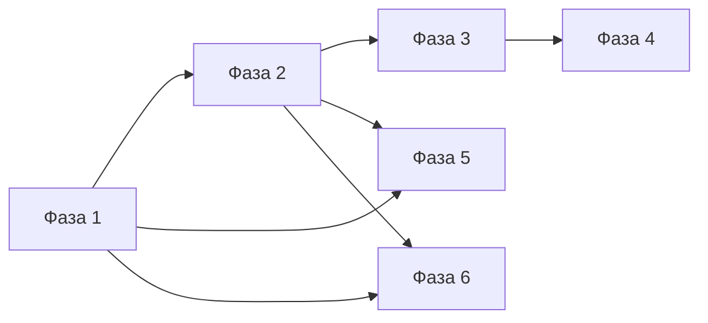

# Аудит: экспедиции и искатели

**Статус:** рабочий документ — дополняется при доработке логики, баланса и UX/UI.  
**Последнее обновление:** 2026-04-05 — **фаза 3 (пул ↔ v2):** снимок **`adventurerExtended`** при старте с доски, **`convertToExtended`**: маппинг **`uniqueBonuses`**, портрет с пула, детерминированный слой **`generateExtendedAdventurer`** по seed от **`adventurer.id`**, тесты **`adventurer-converter.test.ts`**. Ранее: **фазы 1–5** по основным критериям; **фаза 6** — **MVP+** (следы на оружии после миссии, ремонт по техникам, единые блокировки гильдии/заказов), не «пустой раздел». Концепт и пост-MVP: [`DAMAGE_INVESTIGATION_AND_REPAIR_SYSTEM.md`](DAMAGE_INVESTIGATION_AND_REPAIR_SYSTEM.md), [`DAMAGE_INVESTIGATION_IMPLEMENTATION_PLAN.md`](DAMAGE_INVESTIGATION_IMPLEMENTATION_PLAN.md).

Предыдущая крупная синхронизация: фазы 1–2 и часть 3–4 (валидация старта, завершение без фиктивного искателя, договор в `calculateExpedition`, слава из калькулятора, контракты в `GuildState` и UI).

## Назначение

Единая точка правды для:

- текущего состояния системы (код + поведение);
- списка **параметров экспедиций**, на которые можно влиять из данных, модуля, договора и отладки;
- списка **полей искателя и оружия**, которые **уже** участвуют в расчётах и **как**;
- **канона экономики** экспедиций (риск кузнеца — оружие, не золото за вход);
- **концепта расследования повреждений** и ремонта по подсказкам;
- **проблем, нарушений логики** и **фаз доработки**.

Связанные документы: `docs/systems/GUILD_SYSTEM.md`, `docs/data/EXPEDITIONS_DATA.md`, `docs/data/ADVENTURERS_DATA.md`, `docs/utils/FORMULAS.md`. **Фаза 6 (повреждения и ремонт):** концепт [`DAMAGE_INVESTIGATION_AND_REPAIR_SYSTEM.md`](DAMAGE_INVESTIGATION_AND_REPAIR_SYSTEM.md) (v3.1+, §18 — затрагиваемые системы); **план внедрения:** [`DAMAGE_INVESTIGATION_IMPLEMENTATION_PLAN.md`](DAMAGE_INVESTIGATION_IMPLEMENTATION_PLAN.md); опросник [`DAMAGE_INVESTIGATION_QUESTIONNAIRE.md`](DAMAGE_INVESTIGATION_QUESTIONNAIRE.md).

### Сводка: что уже сделано в коде (не дублировать как «проблему»)

| Область | Реализация | Где смотреть |
|--------|------------|--------------|
| Единая валидация старта | `validateExpeditionStart`; вызывается из `startExpeditionFull` и из UI брифинга; **без золота кузнеца за вход** | `src/lib/expedition-start-validation.ts`, `guild-expedition-cross-slice.ts`, `expeditions-section.tsx`, `ExpeditionMissionBrief.tsx` |
| `canStartExpedition` | Делегирует в `validateExpeditionStart` (золото по `cost` не проверяется) | `src/store/slices/guild-slice.ts` |
| Пояснение экономики в брифинге | Текст про заказчика, комиссию, долю по договору, отсутствие списания золота кузнеца при старте | `ExpeditionMissionBrief.tsx` |
| Завершение без фиктивного искателя | Нет подстановки случайных статов: `adventurerExtended ?? convertToExtended(adventurerData)`; иначе **`null`** (в dev — предупреждение в консоли) | `guild-expedition-cross-slice.ts` |
| Договор в прогнозе store | `calculateExpedition(..., contractType?)`, по умолчанию `exploration` | `game-store-composed.ts` → `expedition-calculator-v2.ts` |
| Слава гильдии vs модификаторы `glory` | В калькуляторе v2: `guildGloryOnSuccess`, `gloryModifiers`; при завершении начисление славы от **`calculation.guildGloryOnSuccess`** (с критом ×1.5 в cross-slice) | `expedition-calculator-v2.ts`, `guild-expedition-cross-slice.ts`, разбивка в `modifier-breakdown.tsx` |
| Legacy-исход в `guild-slice` | Помечен **`@deprecated`**; активный путь — v2 + `completeExpeditionFull` | `src/store/slices/guild-slice.ts` |
| Контракты найма | `contractedAdventurers` в `GuildState`, persist и merge (актуальный номер версии сейва — **`STORE_VERSION`** в `game-store-composed.ts`); **`offerGuildContract`**, **`terminateGuildContract`**; вкладка «Искатели» — **`ContractsSection`** (расторжение из UI); предложение из истории передаёт `AdventurerExtended` | `types/guild.ts`, `game-store-composed.ts`, `GuildScreen.tsx`, `contracts-section.tsx`, `expeditions-section.tsx`, `expedition-history-entry.tsx` |
| Черты данных + уникальные бонусы в v2 | Провайдер **`dataTraitsUniqueBonuses`**: `adventurer.traits` + `uniqueBonuses` → модификаторы в `expedition-calculator-v2` | `data-traits-unique-bonuses-provider.ts`, регистрация в `modifier-system/index.ts` |
| Повреждения после экспедиции (фаза 6, MVP+) | После успешного завершения без потери оружия: **`buildActiveDamageTagsFromMissionSnapshots`** (`expedition-post-mission-damage.ts`) по снимкам событий + маппинг шаблон → теги (`event-template-to-damage-tags`); запись в **`CraftedWeaponV2.activeDamageTags`** через **`addWarSoulToWeapon`**; тяжесть тега от итогового **`weaponWear`** (`weaponWearToSeverity`). Прочность задаёт только калькулятор v2, не отдельное списание из `damage_weapon` в событии | `guild-expedition-cross-slice.ts`, `expedition-post-mission-damage.ts` |
| Блокировки и ремонт (фаза 6, MVP+) | Старт экспедиции и заказы: **`getWeaponGuildServiceBlockReason`** (`guild-weapon-service-eligibility.ts`) — согласованные причины (прочность, теги, `repairCondition`, верстак). Ремонт: **`executeWeaponRepairByTechniques`** в `repair-cross-slice`, фильтр опций по тегам — `filter-repair-by-damage-tags.ts` / `repair-utils.ts` | `expedition-start-validation.ts`, `order-cross-slice.ts`, `repair-section.tsx`, `repair-card.tsx` |
| Пул ↔ v2 (фаза 3) | При старте с доски: **`startExpeditionFull(..., selectedExtendedAdventurer ?? convertToExtended(selectedAdventurer))`** — в **`ActiveExpedition.adventurerExtended`** сохраняется тот же extended, что и в прогнозе. **`convertToExtended`**: **`mapCatalogUniqueBonusesToExtended`**, **`portraitId`** с пула, **`createdAt`/`expiresAt`** с пула; слой личности/strength/weakness из **`generateExtendedAdventurer(guildLevel)`** с **`withSeededRandom(hash(adventurer.id))`** (стабильно по id). **`convertToLegacy`** восстанавливает **`uniqueBonuses`** из каталога по id | `expeditions-section.tsx`, `adventurer-converter.ts`, `adventurer-generator-extended.ts` (`mapCatalogUniqueBonusesToExtended`) |

Сводка «что ещё открыто» по фазам — в таблице **«Статус по фазам»** в разделе **«Фазы доработки»** (ниже по документу). Кратко: **6** — основной контур в коде, остаётся контент/полировка/туториал; **5** — полировка UX; **3** — опционально редкость/личность с карточки пула в данных; **1** — новые экраны с `cost`. База шансов в **`docs/utils/FORMULAS.md`**; **п.3** по документации снято.

### Структура документа (одна версия текста)

| Раздел | Содержание |
|--------|------------|
| **Экономика (канон)** | Кто платит, чем рискует кузнец; поля `cost` в данных |
| **Проблемы и нарушения** | Симптомы кода/UX и явные расхождения ожидание ↔ реализация |
| **Фазы доработки** | Приоритеты 1–6; кратко фаза 6, детали только в разделе «Расследование» |
| **Расследование повреждений** | Фаза 6: концепт, §18 связанных систем, [план внедрения](DAMAGE_INVESTIGATION_IMPLEMENTATION_PLAN.md); в аудите — 6a–6f, зазоры кода, матрица модулей, принципы текстов |
| **Справочник** | После расследования: §1–5 (архитектура, параметры, искатели, завершение, файлы) |

---

## Экономика экспедиций (канон дизайна)

**Канон:** миссии для кузнеца **не оплачиваются золотом при отправке** — это согласованная модель, а не недоделанное списание.

| Роль | Откуда деньги | Риск |
|------|----------------|------|
| **Заказчики миссий** | Платят за задачу (лор: контракты в гильдии). | — |
| **Гильдия** | Удерживает **комиссию** с выплаты заказчика (`GUILD_COMMISSION`, `splitMissionClientPayment`). | — |
| **Кузнец** | Сдаёт оружие **в аренду** искателю; **не платит золотом за саму миссию**. Получает долю от пула после комиссии согласно **договору** (`exploration` / `speed` — доля кузнеца vs искателя). | **Оружие**: износ прочности, шанс **потери** оружия, последующий **ремонт** (ресурсы/золото уже в кузнице). |
| **Искатель** | Другая доля того же пула по договору. | Риски в лоре/UI искателя (не предмет этого документа). |

**Вывод для кода и UX:** отсутствие списания `resources.gold` при `startExpeditionFull` **согласуется** с каноном. На карточке выбора миссии сумма `cost` сопровождается нейтральной подписью и подсказкой; **иные** экраны с отображением `cost` — по тому же принципу (см. **нарушение п.1**). Варианта «нужно списать золото кузнецу при старте» в каноне нет.

---

## Проблемы текущей системы (обзор)

Ниже — **что ещё актуально** после внедрения (см. раздел **«Сводка: что уже сделано в коде»** выше). Снятые пункты убраны из таблицы, чтобы не было «две правды».

| Категория | Суть проблемы |
|-----------|----------------|
| **Пояснение экономики (UX)** | Брифинг + карточка миссии (`ExpeditionSelectionCard`); новые места с `cost` — проверять по **нарушению п.1**. |
| **Две модели искателя** | Пул и найм оба попадают в v2 как **`AdventurerExtended`**; при старте с доски extended **снимается** и кладётся в `ActiveExpedition` (прогноз = факт по одной миссии). Остаётся **продуктовое** отличие: у пула нет редкости в данных — **`rarity`** в extended **`common`**; личность/strength/weakness **синтетические** (сид от id), не задаются дизайнером карточки пула. |
| **Неполное использование модели** | **`traits`** и **`uniqueBonuses`** пула в v2 через **`dataTraitsUniqueBonuses`** после **`convertToExtended`** (бонусы маппятся из каталога). Если нужна **полная** карточка пула как в контенте — потребуются новые поля в **`Adventurer`** или отказ от пула в пользу только extended. |
| **UX гильдии** | Журнал событий и таймлайн — в карточке активной миссии; связь журнала с итоговой выплатой — усилена в UI; туториал гильдии включает вкладку экспедиций — см. фазу 5 (остаётся полировка). |
| **Повреждения и «расследование» (фаза 6)** | **Сделано (MVP+):** типизированные записи **`activeDamageTags`**, маппинг событий модуля → теги, ремонт с фильтром по тегам. **Открыто:** туториал «первое расследование» (6f); события с `damage_weapon` **только** внутри **`choices[]`** не дают тегов (в снимке нет выбора — см. `eventTemplateQualifiesForWeaponDamageTags`); углублённый контент наблюдений, «ложные следы», история источника — по концепту. |

**Снято (было в предыдущей редакции таблицы):** единая валидация старта и золото в `canStartExpedition`; вкладка «Искатели» + persist контрактов + `console.warn`; фиктивный fallback искателя при завершении; расхождение `calculateExpedition` с договором; расхождение славы с модификаторами `glory` (теперь согласовано с калькулятором); путаница с legacy-`calculateExpeditionResult` (помечен deprecated).

---

## Нарушения логики (явные)

Расхождения **ожидание ↔ реализация** для приёмки фаз. Пункты **не дублируют** таблицу проблем дословно: там симптомы, здесь — формулировка для фиксации.

**Статус в коде:** после правок закрыты п.2, п.4, п.5, п.6, п.7 (в части славы — см. сводку). **п.3** снят для документации: см. **`docs/utils/FORMULAS.md`**, раздел «Экспедиции (v2)**. **п.1** — закрыто на карточке миссии; при появлении новых экранов с `cost` — повторять канон. п.7 считать закрытым, если приёмка — «слава гильдии следует `guildGloryOnSuccess` из калькулятора v2».

1. **Поля `ExpeditionCost` и UI** *(частично закрыто — проверять новые экраны)*  
   По канону старт **не** списывает золото кузнецу. На карточке выбора миссии (`ExpeditionSelectionCard`) — нейтральная подпись и `title` для суммы снабжения/залога. Иные места, где появится отображение `cost`, должны следовать тому же канону (или переименование полей в данных).

2. ~~**Две реализации проверок старта + золото в helper**~~ *(снято)*  
   Единая функция `validateExpeditionStart`; `startExpeditionFull` и UI используют те же правила; `canStartExpedition` без проверки золота по `cost`.

3. **Два источника базовых шансов** *(снято в документации — предупреждение для данных остаётся актуальным)*  
   У `ExpeditionTemplate` есть поля `failureChance` / `weaponLossChance`, но калькулятор v2 берёт базу из **`difficulty` → `difficultyInfo`** (числа из **`EXPEDITION_DIFFICULTY_BALANCE`**). Правка только полей шаблона **не меняет** исход v2 — **нарушение ожидания автора данных**, если не задокументировано иначе. Однозначная формулировка: **`docs/utils/FORMULAS.md`**, раздел «Экспедиции (v2)».

4. ~~**Искатель в экспедиции ≠ искатель в расчёте**~~ *(снято)*  
   Фиктивный fallback удалён: используется `adventurerExtended` или `convertToExtended(adventurerData)`; при полном отсутствии данных завершение возвращает **`null`**.

5. ~~**Контракт игрока (exploration/speed) и store-хелпер**~~ *(снято)*  
   `calculateExpedition(adventurer, expedition, weapon, contractType?)` пробрасывает договор в калькулятор v2 (по умолчанию `exploration`).

6. ~~**Контракты найма (bronze/silver/…)**~~ *(снято на уровне состояния и UI)*  
   `contractedAdventurers` в `GuildState`, persist, `offerGuildContract`, вкладка с `ContractsSection`. Дальнейшая полировка (расторжение из UI, связь с балансом комиссий) — по ТЗ.

7. ~~**Модификатор «слава»**~~ *(снято в текущей модели)*  
   Итоговая слава гильдии при успехе согласована с модификаторами цели `glory` через **`guildGloryOnSuccess`** в расчёте v2 и применение в `completeExpeditionFull`.

---

## Фазы доработки

Порядок: **инварианты старта/завершения и объяснение экономики игроку** → **согласованность расчётов и данных** → **модель искателя** → **найм/контракты** → **UX гильдии** → **расследование повреждений**. Параллельно можно вести тексты UI, не блокируя фазу 1.

### Статус по фазам (что уже сделано vs что открыто)

| Фаза | Уже сделано в коде / доках | Открыто или частично |
|------|----------------------------|----------------------|
| **1** Старт и завершение | `validateExpeditionStart` + UI; `startExpeditionFull` без золота за вход; завершение без фиктивного искателя (`null` при отсутствии данных); брифинг + карточка миссии с каноном **`cost`** | Новые экраны с отображением `cost` — проверять канон; опционально глоссарий гильдии |
| **2** Расчёт и данные | `calculateExpedition(..., contractType?)`; слава `guildGloryOnSuccess` + модификаторы; **п.3** зафиксирован в **`FORMULAS.md`** («Экспедиции (v2)») | Поля `failureChance` / `weaponLossChance` на шаблоне остаются legacy в данных — не путать с базой v2 |
| **3** Модель искателя | Провайдер **`dataTraitsUniqueBonuses`**; снимок **`adventurerExtended`** при старте с доски; **`convertToExtended`** + **`mapCatalogUniqueBonusesToExtended`**, сидированный слой генератора, тесты | Опционально: **`rarity`** в данных пула; личность/strength с карточки вместо синтетики (расширение контента/типов) |
| **4** Контракты и «Искатели» | `contractedAdventurers`, persist, `offerGuildContract`, **`terminateGuildContract`**, **`ContractsSection`** с расторжением и текстом ошибки | Назначение миссий из секции контрактов и пр. — по ТЗ |
| **5** UX гильдии | Журнал/таймлайн на карточке, туториал (вкладка экспедиций), модалка награды с связью журнал ↔ итог; разбивка модификаторов в брифинге (итог виден даже без дельт) | Доп. полировка таймлайна — по ТЗ |
| **6** Повреждения и ремонт | MVP+ в коде: **`activeDamageTags`**, пост-миссия **`buildActiveDamageTagsFromMissionSnapshots`**, **`repairCondition`**, ремонт по техникам, **`getWeaponGuildServiceBlockReason`**, UI ремонта | Пост-MVP: туториал 6f, контент тегов/текстов, ветки с `damage_weapon` в choices, полировка копирайта и баланса |

**Связь проблем с фазами (кратко):**

| Проблема / нарушение (см. таблицы выше) | Основная фаза | Статус кода |
|----------------------------------------|---------------|-------------|
| Пояснение экономики, семантика `cost` на всех экранах | **1** / **5** | Брифинг и карточка миссии: сделано; новые экраны — по канону |
| Единая валидация старта, fallback искателя | **1** | Сделано |
| Расхождение шаблона и `difficultyInfo`; документация формул | **2** | Договор в `calculateExpedition` и слава — сделано; п.3 — зафиксировано в `FORMULAS.md` («Экспедиции (v2)») |
| `traits` / `uniqueBonuses` в v2; пул vs extended | **3** | Снимок при старте + маппинг бонусов и сид — см. **§3.5**; открытый хвост — редкость/личность с карточки пула |
| Контракты найма, `ContractsSection`, расторжение, вкладка «Искатели» | **4** | Сделано (найм + расторжение из UI) |
| Таймлайн событий, туториал, полировка UX | **5** | Частично: журнал на карточке, туториал экспедиций, пояснение итога; полная полировка — по ТЗ |
| Повреждения, теги, ремонт (MVP+ vs пост-MVP) | **6** | Основной контур в коде; см. таблицу проблем и подфазы 6a–6f |

### Фаза 1 — Целостность старта и завершения (критично)

**Цель:** один набор правил на старт; предсказуемое завершение без «левого» искателя; **экономика кузнеца не требует золота за вход** (см. канон выше).

**Статус:** **выполнено по основным критериям** — единая валидация, UI согласован с ней, завершение без фиктивного искателя, канон экономики в брифинге и на карточке миссии. **Частично:** подписи **`cost`** на любых **новых** экранах — по мере появления (см. п.1 и таблицу статуса по фазам выше).

| Задача | Критерий готовности |
|--------|----------------------|
| Пояснение экономики в UI | ~~В брифинге~~ **сделано**; карточка миссии — **сделано**; глоссарий гильдии — опционально; новые места с `cost` — по канону |
| Единая валидация | **Сделано:** `validateExpeditionStart`, вызов из `startExpeditionFull` и UI; без золота кузнеца за старт |
| Убрать или заменить fallback | **Сделано:** безопасный отказ (`null`) при невозможности восстановить искателя; нормальный путь — persist `adventurerExtended` |

**Затрагивает:** `guild-expedition-cross-slice.ts`, `expeditions-section.tsx`, `ExpeditionMissionBrief.tsx`, при необходимости типы persist.

---

### Фаза 2 — Согласованность расчёта и данных

**Цель:** прогноз = факт; данные шаблона не вводят в заблуждение.

**Статус:** **выполнено** по прогнозу store и документации базы шансов. **Частично по данным:** поля шаблона `failureChance` / `weaponLossChance` могут оставаться в контенте как legacy — база v2 задаётся **`difficulty` + `EXPEDITION_DIFFICULTY_BALANCE`** (см. **п.3**, **`FORMULAS.md`**).

| Задача | Критерий готовности |
|--------|----------------------|
| `calculateExpedition` и договор | **Сделано:** `contractType` в store-хелпере и калькуляторе v2 |
| Документация шаблона | **Сделано в доках:** `FORMULAS.md` + этот аудит; **опционально:** чистка/синхронизация полей в данных шаблонов |
| Формулы славы/модификаторов | **Сделано:** `guildGloryOnSuccess`, модификаторы `glory`, крит в cross-slice |

**Затрагивает:** `expedition-calculator-v2.ts`, `game-store-composed.ts`, `motivations-provider` / cross-slice, `docs/utils/FORMULAS.md`.

---

### Фаза 3 — Модель искателя: одна правда

**Цель:** нет «мёртвых» полей в основном потоке; legacy либо удалён, либо изолирован.

**Статус:** legacy-`calculateExpeditionResult` помечен `@deprecated`. **Сделано:** провайдер **`dataTraitsUniqueBonuses`**; **`startExpeditionFull`** с доски получает **`convertToExtended(selectedAdventurer)`**; **`convertToExtended`** маппит **`uniqueBonuses`**, портрет и таймстемпы с пула, детерминированный слой **`generateExtendedAdventurer(Math.max(1, floor(skill/10)))`** через **`withSeededRandom(hashStringToSeed(id))`**; **`convertToLegacy`** восстанавливает каталожные **`uniqueBonuses`** по id. Тесты: **`src/lib/adventurer-converter.test.ts`**.

| Задача | Критерий готовности |
|--------|----------------------|
| `traits` / `uniqueBonuses` | **Сделано** для полноценного **`AdventurerExtended`** и для пула после **`convertToExtended`** (каталог **`unique-bonuses`**) |
| Legacy `calculateExpeditionResult` в `guild-slice` | **Частично:** помечен **@deprecated**; полное удаление / вынос в тесты — по желанию |
| Пул гильдии | **Частично:** синтетика личности/strength/weakness и **`rarity: common`** — см. **§3.5**; расширение контента — по ТЗ |

**Затрагивает:** `modifier-system`, `adventurer-converter.ts`, `adventurer-generator-extended.ts`, `expeditions-section.tsx`, `guild-slice.ts`, аудит.

---

### Фаза 4 — Контракты с искателями и вкладка «Искатели»

**Цель:** заявленная механика найма в store и на экране.

**Статус:** **найм и расторжение в UI** — `contractedAdventurers`, persist, `offerGuildContract`, **`terminateGuildContract`** (штраф золото/слава, блокировка при активной экспедиции), `ContractsSection` с диалогом и отображением ошибки, предложение из истории с `AdventurerExtended`. **Открыто по ТЗ:** назначение миссий из секции контрактов и т.п.

| Задача | Критерий готовности |
|--------|----------------------|
| Состояние | **Сделано:** `contractedAdventurers` в `GuildState`, persist (номер версии сейва — **`STORE_VERSION`** в `game-store-composed.ts`), `terminateGuildContract` |
| UI | **Сделано:** `ContractsSection` в `GuildScreen`, вызовы store, расторжение с обратной связью |
| Вкладка «Искатели» | **Сделано:** контракты, найм и расторжение в потоке гильдии; расширения — по ТЗ |

**Затрагивает:** `types/guild.ts`, persist в `game-store-composed.ts`, `GuildScreen`, `contracts-section.tsx`, `expeditions-section.tsx`.

---

### Фаза 5 — UX/UI гильдии (после стабилизации логики)

**Цель:** читаемость **выплат и риска оружия**, обратная связь по событиям.

**Статус:** **MVP + точечная полировка** — туториал (вкладка «Экспедиции», канон экономики), модалка награды со связью журнал ↔ итог, журнал на карточке активной миссии; в брифинге уточнены подпись к `
` и отображение **разбивки модификаторов** (`modifier-breakdown`: итоговые шансы/награды без обязательного списка дельт). **Открыто:** доп. полировка таймлайна — по ТЗ.

| Задача | Критерий готовности |
|--------|----------------------|
| Выплаты и договор | **Сделано** в брифинге; **`cost`** на карточке миссии с пояснением |
| Таймлайн событий | **Частично:** журнал/`ExpeditionEventLog` на карточке; явная связь с итогом в модалке — **сделано** (MVP); глубокая полировка — по ТЗ |
| Обучение | **Сделано:** шаги гильдии + экспедиции; согласовано с прогнозом (фаза 2) |
| Модификаторы в брифинге | **Сделано:** блоки с итогом не скрываются, если список дельт пуст |

**Затрагивает:** компоненты `expeditions/`, `modifier-breakdown.tsx`, при необходимости `tutorial`.

---

### Фаза 6 — Расследование повреждений и ремонт «как крафт»

**Цель:** после экспедиции — блок **наблюдений** на оружии (не прямой ответ); в кузнице — **план ремонта** по тегам, по духу как крафт v2, но вход = следы повреждений.

**Статус (MVP+):** **основной контур в коде** — `CraftedWeaponV2` с `activeDamageTags`, `repairCondition`, запись тегов после миссии (`buildActiveDamageTagsFromMissionSnapshots` / `guild-expedition-cross-slice`), единые блокировки гильдии и заказов **`getWeaponGuildServiceBlockReason`** (`src/lib/guild-weapon-service-eligibility.ts`), старт экспедиции — **`validateExpeditionStart`** (те же строки причин, что и для заказов по сути). Ремонт по техникам и этапам — **`executeWeaponRepairByTechniques`**, G1 фильтр опций по тегам — `filter-repair-by-damage-tags` / ось броска **`RepairDiceProfile`** → таблицы в `repair-system` через адаптер в `repair-utils`. Концепт и пост-MVP бэклог: **[`DAMAGE_INVESTIGATION_AND_REPAIR_SYSTEM.md`](DAMAGE_INVESTIGATION_AND_REPAIR_SYSTEM.md)**, **[`DAMAGE_INVESTIGATION_IMPLEMENTATION_PLAN.md`](DAMAGE_INVESTIGATION_IMPLEMENTATION_PLAN.md)**.

**Критерии и подфазы (6a–6f), матрица модулей** — в разделе [«Расследование повреждений — затронутые модули»](#расследование-повреждений--затронутые-модули); таблица «текущее состояние» ниже обновлена под фактический код.

**Зависимости:** фазы **1** (стабильное завершение), **2** (если теги влияют на формулы), пересечение с **5** (видимость событий).

---

### Зависимости между фазами

- **Фаза 5** и **6** могут частично начинаться после **фазы 1**; полнота **6** зависит от согласованности событий и сохранения (**фазы 1–2**).  
- **Фаза 4** логично после **фазы 3**, чтобы не подключать контракты к противоречивой модели искателя.

Далее — **расследование повреждений** (фаза 6 целиком), затем **справочник** (§1–5).

---

## Расследование повреждений — затронутые модули

Фаза **6** целиком: подфазы 6a–6f, зазоры кода, матрица модулей, принципы текстов.

Как **текущий** код соотносится с целевым опытом («осмотр → подсказки → ремонт как мини-крафт») и что менять.

### Подфазы реализации (критерии приёмки)

| Подфаза | Содержание | Критерий готовности |
|---------|------------|---------------------|
| **6a** | Справочник типов повреждений / текстов наблюдений, теги причин | Частично: каталоги тегов и маппинг шаблон → теги (`weapon-damage/`, `event-template-to-damage-tags`); расширение текстов — по контенту |
| **6b** | После миссии: снимки событий + калькулятор → наблюдения и износ на оружии | **Сделано по разделению ответственности:** износ прочности — **`weaponWear`** из калькулятора v2 → `addWarSoulToWeapon`; **видимые теги** — отдельно **`buildActiveDamageTagsFromMissionSnapshots`** (не через `aggregateModuleEventEffectsForCompletion`, который агрегирует только Δ успеха, золото и материалы). `damage_weapon` в шаблоне задаёт **допуск** к тегам по маппингу, не второе списание прочности |
| **6c** | Расширение `CraftedWeaponV2` (или вложенный объект) | **Сделано для MVP+:** `activeDamageTags`, `repairCondition` и др.; persist — смотреть **`STORE_VERSION`** и `cloud-save-feature.ts` при новых полях |
| **6d** | Ремонт: подсказки фильтруют опции / материалы / этапы | `repair-system.ts`, `repair-cross-slice.ts`; опционально план рядом с `CraftPlan` |
| **6e** | UI: блок «Повреждения», вовлечённый ремонт | `repair-section.tsx`, карточки инвентаря |
| **6f** | Туториал первого расследования | `tutorial` |

### Текущее состояние кода (релевантные факты)

| Область | Сейчас | Зазор до цели / пост-MVP |
|---------|--------|----------------|
| **Износ после экспедиции** | Помимо глобального износа, в `completeExpeditionFull` мержатся **видимые теги** по снимкам событий и маппингу шаблонов (`event-template-to-damage-tags`, `buildActiveDamageTagsFromMissionSnapshots`). | Расширение контента событий → тегов; баланс частоты. |
| **События модуля** | Эффект `damage_weapon` и маппинг шаблон → теги — в данных; при завершении успешной миссии теги дописываются в **`activeDamageTags`** (см. **`buildActiveDamageTagsFromMissionSnapshots`**). | События с уроном только в `choices[]`; расширение контента и частоты. |
| **Модель оружия** | `CraftedWeaponV2`: `activeDamageTags`, `repairCondition`, прочность, `weaponLegacy` и т.д.; persist/миграции — см. `STORE_VERSION`, `cloud-save-feature`. | История источника тега, «ложные следы» — по концепту §6, если понадобятся. |
| **Ремонт** | `repair-system.ts` — таблицы исходов по уровню броска; игрок выбирает **техники** (`repair-techniques-registry`), G1 сужает допустимые опции по тегам; ось броска `RepairDiceProfile` → `RepairType` только в `repair-utils`. UI: `repair-card`, вкладка «Ремонт». | Полировка копирайта, контент техник, опционально баланс авто-ремонта (`constants` / `repair-cross-slice`). |
| **Крафт v2** | `CraftPlan` — эталон сложного плана. | Ремонт уже использует похожий UX (этапы по техникам). |
| **Материалы и экспертиза** | Склад, `materialStash`; ремонт списывает материалы по плану техник. | Новые материалы под редкие теги — по дизайну. |
| **Сохранение** | Zustand persist, облако через `cloud-save-feature.ts`. | Новые поля на оружии — **миграция** и чеклист облака. |
| **Энциклопедия / туториал** | Открытие материалов, шаги туториала. | Углублённый шаг «первое расследование» — по ТЗ. |

### Матрица модулей (что затрагивается при внедрении фазы 6)

| Модуль / область | Примеры путей | Роль |
|------------------|---------------|------|
| **Экспедиция: завершение** | `guild-expedition-cross-slice.ts`, `src/lib/expedition-post-mission-damage.ts` | Снимки событий + калькулятор v2 → износ; отдельно — теги на оружие (**`buildActiveDamageTagsFromMissionSnapshots`**) |
| **Модуль событий** | `src/modules/expeditions/data/events/**`, `event-generator.ts`, `expedition-module-events-host.ts` | Теги категорий/шаблонов событий как вход для текстов наблюдений |
| **Типы** | `src/types/craft-v2.ts`, `src/types/weapon-damage.ts` | Поля повреждений на оружии заданы; новые поля — миграции + `cloud-save-feature` |
| **Ремонт** | `repair-system.ts`, `repair-utils.ts`, `repair-cross-slice.ts` | Ограничение опций по тегам; возможно новые `RepairType` или подтипы |
| **UI кузницы** | `repair-section.tsx`, карточки оружия в инвентаре/крафте | Блок «Повреждения», сценарий выбора плана |
| **Крафт v2 (паттерн)** | `craft-slice`, компоненты плана | Копирование паттерна «план → валидация → применить», не обязательно общий код |
| **Store / persist** | `game-store-composed.ts`, миграции | Версия сейва, merge |
| **Документация** | `FORMULAS.md`, `FORGE_SYSTEM.md` | Формулы износа и ремонта |

### Принципы контента наблюдений (для авторов)

- Формулировки **от первого лица кузнеца**, только **наблюдение** («вижу матовые пятна по лезвию»), без спойлера названия механики в одной строке; связь «значит, стоит проверить…» — вторая строка или открывается после экспертизы.
- Несколько наблюдений могут указывать на **одну** причину (ложный след) или требовать **комбинацию** ремонтных шагов — баланс на стороне дизайна таблиц.

---

## Справочник

### 1. Краткая архитектура

| Уровень                      | Файлы / модули                                                                                                             |
| ---------------------------- | -------------------------------------------------------------------------------------------------------------------------- |
| Данные миссий                | `src/modules/expeditions/` (локации, миссии, события)                                                                      |
| Шаблон для калькулятора      | `src/lib/expedition-mission-bridge.ts`, `src/data/expedition-templates.ts`                                                 |
| Расчёт исхода (v2)           | `src/lib/expedition-calculator-v2.ts` → `src/lib/modifier-system/`                                                         |
| События на старте            | `src/lib/expedition-module-events-host.ts`                                                                                 |
| Завершение и награды         | `src/store/cross-slice/guild-expedition-cross-slice.ts` (`completeExpeditionFull`); теги повреждений — `src/lib/expedition-post-mission-damage.ts` |
| Экономика золота по договору | `src/lib/expedition-contract-economy.ts`, `CONTRACT_CONFIG` в `src/modules/expeditions/data/missions/_mission-template.ts` |
| Искатель в найме             | `src/lib/adventurer-generator-extended.ts`, UI: `src/components/guild/recruitment-interface.tsx`                           |

Поток: выбор миссии → брифинг (калькулятор v2) → `startExpeditionFull` → таймер → `completeExpeditionFull` (кубики + модульные события + репутация/статистика).

---

### 2. Параметры экспедиции: на что можно влиять

Ниже — **рычаги**, разбитые по источнику. «Влияние» = изменение длительности, шансов, наград, событий или пост-обработки при завершении.

#### 2.1. Поля шаблона `ExpeditionTemplate` (`src/data/expedition-templates.ts`)

| Параметр                                                    | Смысл                                  | Где используется                                                                                                             |
| ----------------------------------------------------------- | -------------------------------------- | ---------------------------------------------------------------------------------------------------------------------------- |
| `id`, `name`, `description`, `icon`                         | Идентификация и UI                     | Карточки, история                                                                                                            |
| `moduleObjective`, `moduleLocationName`, `moduleClientName` | Текст для UI модуля                    | Брифинг / карточки                                                                                                           |
| `moduleLocationId`                                          | Локация модуля                         | События, лут, `getLocationById` при завершении                                                                               |
| `moduleMissionId`                                           | Явная миссия в реестре                 | Мост к данным модуля                                                                                                         |
| `moduleContractType`                                        | Дефолт договора для генератора событий | `exploration` / `speed`                                                                                                      |
| `type`                                                      | Тип миссии (`ExpeditionMissionType`)   | Модификаторы стиля боя, условия мотиваций/черт                                                                               |
| `difficulty`                                                | Сложность                              | `EXPEDITION_DIFFICULTY_BALANCE`: базовый провал, потеря оружия, tier, `levelRange`, множитель наград в модуле                |
| `duration`                                                  | Длительность, **секунды**              | Таймер миссии (через `getRouteDurationSeconds` и множитель договора)                                                         |
| `cost.supplies`, `cost.deposit`                             | Поля в данных                          | По канону **не** личный взнос кузнеца при отправке; семантика в UI/данных или рефактор имён (см. **Экономика** и нарушение **п.1**) |
| `reward.baseGold`, `reward.baseWarSoul`                     | База наград                            | Калькулятор v2 → золото/души; **слава гильдии** при успехе — через `guildGloryOnSuccess` (база от `baseWarSoul` + модификаторы `glory`), затем крит в `completeExpeditionFull` |
| `minGuildLevel`                                             | Порог гильдии                          | Доступ миссий на доске (модуль + уровень)                                                                                    |
| `failureChance`, `weaponLossChance` на шаблоне              | Дублирующие/legacy поля                | Калькулятор v2 опирается на `difficultyInfo` + `EXPEDITION_DIFFICULTY_BALANCE`, не на произвольные поля шаблона для базы (см. «Нарушения логики» п.3) |
| `recommendedWeaponTypes`                                    | Рекомендации                           | В основном контент/UI                                                                                                        |
| `minWeaponAttack`                                           | Мин. атака оружия                      | Старт экспедиции + модификатор «запас атаки» в `combat-style-provider`                                                       |
| `tags`                                                      | Теги экспедиции                        | Подбор событий / категории (если заданы)                                                                                     |
| `enemyTypes`                                                | Типы врагов                            | Условие для мотивации `revenge` и контекст модификаторов                                                                     |

#### 2.2. Глобальный баланс сложности

Файл: `src/lib/expedition-difficulty-balance.ts` (`EXPEDITION_DIFFICULTY_BALANCE`).

Поля на сложность: `failureChance`, `weaponLossChance`, `levelRange`, `rewardMultiplier`, `tier`. Слиты с презентацией в `difficultyInfo` (`src/data/expedition-templates.ts`).

#### 2.3. Договор миссии (`exploration` vs `speed`)

Конфиг: `CONTRACT_CONFIG` в `_mission-template.ts`.

| Параметр                                          | Влияние                                                          |
| ------------------------------------------------- | ---------------------------------------------------------------- |
| `blacksmithGoldPercent` / `adventurerGoldPercent` | Доля пула после комиссии гильдии (`splitMissionClientPayment`)   |
| `materialFindMultiplier`                          | Множитель количества материалов из событий при завершении        |
| `durationMultiplier`                              | Длительность маршрута (`getRouteDurationSeconds`)                |
| `eventChanceBonus`                                | Задуман под события (проверять актуальность в генераторе модуля) |

Игрок переключает договор в UI брифинга; в старт уходит `contractOverride` / сохранённый `contractType` на активной экспедиции.

#### 2.4. Старт экспедиции: `StartExpeditionFullOptions` (`src/types/guild.ts`)

| Параметр                                    | Влияние                                                                                                         |
| ------------------------------------------- | --------------------------------------------------------------------------------------------------------------- |
| `contractOverride`                          | Тип договора вместо дефолта шаблона                                                                             |
| `devBalance` (`ExpeditionDevBalanceTweaks`) | Только при включённом dev UI: множители золота событий, материалов, «quality shift» к успеху, ускорение таймера |

#### 2.5. Модульные события (рантайм и завершение)

- При старте: `buildExpeditionStartEvents` — график событий, снимки для агрегации.
- При завершении: `aggregateModuleEventEffectsForCompletion` — **Δ успеха**, **бонус золота**, **гранты материалов** (затем множители договора и dev в `completeExpeditionFull`). Эта функция **намеренно не трогает** оружие.
- Эффект **`damage_weapon`** в данных события: участвует в **лор/семантике** и в **маппинге** шаблон → теги повреждений; **не** добавляет второе списание прочности (прочность — только итог **`weaponWear`** из калькулятора v2).
- **Запись следов на оружии (фаза 6, MVP+):** при успехе без потери оружия вызывается **`buildActiveDamageTagsFromMissionSnapshots`** (`expedition-post-mission-damage.ts`) по `moduleEventSnapshots`; новые записи **`ActiveDamageTagEntry`** передаются в **`addWarSoulToWeapon`** вместе с износом. Тяжесть тегов (`light` / `moderate` / `heavy`) выводится из **`weaponWear`** (`weaponWearToSeverity`). Условие: у шаблона события есть **`damage_weapon` в основных `effects`**; варианты с уроном **только** в **`choices[]`** пока **не** порождают теги (ограничение зафиксировано в коде).

Содержимое событий: `src/modules/expeditions/data/events/` и привязки к миссиям.

#### 2.6. Комиссия гильдии и уровень гильдии

`GUILD_COMMISSION` в `_mission-template.ts` + `splitMissionClientPayment`: от **уровня гильдии** зависит доля гильдии с «грязного» золота заказчика до дележа кузнец/искатель.

#### 2.7. Цели модификаторов (`ModifierTarget`)

Реестр: `src/lib/modifier-system/types.ts`.

Используются в калькуляторе v2: `successChance`, `gold`, `warSoul`, `weaponWear`, `weaponLossChance`, `critChance`, **`glory`** (агрегируется в `guildGloryOnSuccess` для начисления славы гильдии в `completeExpeditionFull`). Цель `commission` в типах модификаторов — по необходимости для расширений; выплата кузнецу в расчёте идёт через экономику `splitMissionClientPayment` → поле `commission` результата.

#### 2.8. Оружие (не «экспедиция», но вход в расчёт)

Параметры `CraftedWeaponV2`, участвующие в v2: атака, прочность, `type`, `qualityRank`, `epicMultiplier`, `combatMaterialId`, `quality`; после боя — `warSoul` / `maxWarSoul` для бонуса тира души к начислению душ.

---

### 3. Искатели: что уже влияет и как

Источник моделей: `AdventurerExtended` (`src/types/adventurer-extended.ts`). Расчёт идёт через **провайдеры** модификаторов (имена см. `src/lib/modifier-system/index.ts`).

Условные обозначения: **✓** = участвует в модификаторах v2; **○** = влияет на отбор/UX, но не на формулы калькулятора; **✗** = в данных есть, в модификаторах **не** используется.

#### 3.1. Блок `combat`

| Поле                                        | Влияние                                                                                                                               |
| ------------------------------------------- | ------------------------------------------------------------------------------------------------------------------------------------- |
| **level** ✓                                 | Соответствие диапазону сложности (`level-rarity-provider`): штраф/«скука»/бонус «оптимум»; бонус к `warSoul` и `critChance` от уровня |
| **rarity** ✓                                | Множители к `gold` и `warSoul` (common → legendary)                                                                                   |
| **power** ✓                                 | `warSoul` (нормализация вокруг 25)                                                                                                    |
| **precision** ✓                             | `successChance`                                                                                                                       |
| **endurance** ✓                             | `weaponWear` (снижение/увеличение износа)                                                                                             |
| **luck** ✓                                  | `critChance`                                                                                                                          |
| **combatStyle** ✓                           | Бонус к `successChance` от типа миссии + таблица стилей (`combat-style-provider`)                                                     |
| **preferredWeapons** / **avoidedWeapons** ✓ | ±5% `successChance` к типу экипированного оружия                                                                                      |

#### 3.2. Блок `personality`

| Поле                                    | Влияние                                                                                                                                                                                |
| --------------------------------------- | -------------------------------------------------------------------------------------------------------------------------------------------------------------------------------------- |
| **primaryTrait** / **secondaryTrait** ✓ | Карта эффектов в `personality-traits-provider` (успех, золото, души, потеря оружия, износ; условия по сложности/типу миссии; случайность для `hot_headed`)                             |
| **motivations[]** ✓                     | `motivations-provider`: золото, успех, души, слава (таргет в модификаторах), потеря оружия, износ; условия по сложности/типу; `revenge` — при наличии подходящих `enemyTypes` в миссии |
| **socialTags[]** ✓                      | `social-tags-provider`: успех, золото (в т.ч. из данных тега), случайный разброс для `mysterious`                                                                                      |
| **riskTolerance** ✗                     | В модификаторах v2 не используется (используется локально в UI найма — см. `recruitment-interface`)                                                                                    |

#### 3.3. Сильные и слабые стороны

| Поле               | Влияние                                                                                                                                         |
| ------------------ | ----------------------------------------------------------------------------------------------------------------------------------------------- |
| **strengths[]** ✓  | `strengths-weaknesses-provider`: по данным из `src/data/adventurer-tags/strengths.ts`, с проверкой `doesStrengthApply(difficulty, missionType)` |
| **weaknesses[]** ✓ | Аналогично, `doesWeaknessApply`                                                                                                                 |

#### 3.4. Прочие поля `AdventurerExtended`

| Поле                                                 | Влияние                                                                                                                                                                 |
| ---------------------------------------------------- | ----------------------------------------------------------------------------------------------------------------------------------------------------------------------- |
| **traits** (`AdventurerTrait[]`) ✓                   | Провайдер **`dataTraitsUniqueBonuses`**: каталог `adventurer-traits` и inline-эффекты в данных черты → модификаторы v2 (отдельно от `personality.primaryTrait` / `secondaryTrait`) |
| **uniqueBonuses** ✓                                  | Тот же провайдер: разрешение по каталогу **`unique-bonuses`** → модификаторы v2                                                                                                                                        |
| **requirements** (minAttack, тип оружия, качество) ○ | Гейт в `validateExpeditionStart` / `canStartExpedition` для **legacy** `Adventurer` из пула; для расширенного найма — логика отбора в интерфейсе, **не** дублируется как модификатор в калькуляторе |
| **identity** (имя, портрет) ○                        | UI / история                                                                                                                                                            |
| **createdAt** / **expiresAt** ○                      | Жизнь записи искателя в найме                                                                                                                                           |

#### 3.5. Legacy-искатель `Adventurer` (пул гильдии) и `convertToExtended`

В прогнозе UI: **`selectedExtendedAdventurer ?? convertToExtended(selectedAdventurer)`**. При старте миссии с доски: **`startExpeditionFull(..., selectedExtendedAdventurer ?? convertToExtended(selectedAdventurer))`** — в **`ActiveExpedition.adventurerExtended`** сохраняется **тот же** extended, что участвовал в прогнозе (в т.ч. после перезагрузки страницы до завершения миссии — данные в persist). В **`completeExpeditionFull`** используется **`expedition.adventurerExtended ?? convertToExtended(adventurerData)`**; при отсутствии обоих данных завершение не выполняется — см. фазу 1.

**Как устроена конверсия (факт кода, `src/lib/adventurer-converter.ts`):**

| Источник | Что попадает в extended для v2 |
|----------|-------------------------------|
| **Слой генератора** | Вызов **`generateExtendedAdventurer(guildLevel)`** с **`guildLevel = max(1, floor(skill/10))`** внутри **`withSeededRandom(hashStringToSeed(adventurer.id))`** — временная подмена **`Math.random`** (детерминированно по одному и тому же **`id`**). Оттуда берутся **`combatStyle`**, **`personality`**, **`strengths`**, **`weaknesses`** (и внутренние черты генератора перезаписываются данными пула — см. ниже). |
| **`identity`** | Имя из пула (разбор на имя/фамилию), эвристика пола по первому имени. **`portraitId`** — с **`Adventurer.portrait`**, кламп 0–99. |
| **`combat`** | **`level`**, **`power`**, **`precision`**, **`endurance`**, **`luck`** — эвристики от **`skill`**. **`rarity`** — **`common`** (в пуле нет редкости). **`combatStyle`** — из сидированного генератора; **`preferredWeapons`** / **`avoidedWeapons`** — пустые массивы. |
| **`personality`** | Из сидированного **`generateExtendedAdventurer`** — **не** из отдельных полей карточки пула (в типе **`Adventurer`** их нет). |
| **`traits`** | Элементы пула маппятся в extended с **`effects`**; далее v2 через **`dataTraitsUniqueBonuses`**. |
| **`uniqueBonuses`** | **`mapCatalogUniqueBonusesToExtended(adventurer.uniqueBonuses)`** — те же id, что в **`src/data/unique-bonuses.ts`**. |
| **`strengths`** / **`weaknesses`** | Из сидированного генератора; стабильны для одного **`id`**. |
| **`requirements.minAttack`** | С пула. |
| **`createdAt` / `expiresAt`** | С пула. |

**`convertToLegacy`:** в legacy **`uniqueBonuses`** восстанавливаются из каталога по id из extended (если id есть в каталоге).

Утилита **`calculateAdventurerBonuses`** (legacy) на этот путь **не** вызывается.

**Вывод для баланса и UX:** искатель с доски и искатель из найма по-прежнему могут различаться по личности и strength/weakness; для пула это **синтетика по id**, а не ручной контент; **уникальные бонусы** и **прогноз vs факт** по одной миссии согласованы после снимка при старте; изменение баланса возможно из‑за учёта **`uniqueBonuses`** пула в v2.

---

### 4. Параметры, затрагивающие только завершение (`completeExpeditionFull`)

Помимо результата калькулятора v2:

- Случайный успех/крит/потеря оружия по итоговым шансам.
- **Репутация гильдии**: формула `calculateReputationGain` + делитель `EXPEDITION_GUILD_REPUTATION_DIVISOR` в cross-slice.
- **Материалы**: агрегация событий модуля × множители договора и dev; открытие материала, склад, экспертиза.
- **War Soul на оружие**: с учётом тира души (`getWarSoulTierBonus`) и крита.
- **Эпик-множитель** оружия: малый прирост в `addWarSoulToWeapon`.

---

### 5. Ключевые файлы для правок

| Назначение | Путь |
|------------|------|
| Старт/финиш экспедиции | `src/store/cross-slice/guild-expedition-cross-slice.ts` |
| Калькулятор | `src/lib/expedition-calculator-v2.ts` |
| Модификаторы | `src/lib/modifier-system/providers/*.ts` |
| Шаблоны и сложность | `src/data/expedition-templates.ts`, `src/lib/expedition-difficulty-balance.ts` |
| Модуль миссий | `src/modules/expeditions/` |
| Типы искателя | `src/types/adventurer-extended.ts`, `src/types/guild.ts` |
| Пул ↔ extended | `src/lib/adventurer-converter.ts`, `src/lib/adventurer-generator-extended.ts` (`mapCatalogUniqueBonusesToExtended`) |
| UI экспедиции | `src/components/guild/expeditions-section.tsx`, `expeditions/ExpeditionMissionBrief.tsx` |
| Ремонт (текущий; расширение под фазу 6) | `src/data/repair-system.ts`, `src/store/cross-slice/repair-cross-slice.ts`, `src/components/forge/repair-section.tsx` |
| Оружие v2 (в т.ч. `activeDamageTags`, `repairCondition`) | `src/types/craft-v2.ts`, `src/types/weapon-damage.ts` |

---

При изменении формул, канона экономики или целей модификаторов — обновлять этот файл и при необходимости `docs/utils/FORMULAS.md`. Дублировать канон экономики в других документах нежелательно: отсылка сюда или краткая вставка + ссылка на этот раздел.