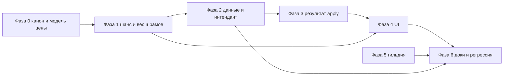

# Аудит перековки (Reforge) — баланс, логика, UX и идеи переработки

Документ фиксирует состояние системы по коду на момент подготовки аудита. Канон по продукту: [ENCHANTMENT_MODULE_PHASE1.md](ENCHANTMENT_MODULE_PHASE1.md).

## Краткое резюме

**Исходное состояние на момент первичного аудита** (до пофазового внедрения):

- **Экономика:** фиксированные траты ДВ на базовые баффы (4 500–5 000 за стак) плохо стыкуются с ранними тирами души и с калибровкой в [war-soul-tiers.ts](../../src/data/war-soul-tiers.ts). Игрок долго не мог пользоваться «базовой» перековкой; одно применение обнуляло ощутимую долю пула.
- **Интерфейс:** плоский список техник; слабая обратная связь после усиления; в UI проскакивали служебные формулировки.
- **Логика:** шанс пробуждения при uncapped-пуле ДВ фактически не получал вклада «заполнения пула»; выбор шрама был равномерным; общий лимит стаков по оси не был явно объяснён.

**Актуальный статус после внедрения** — в [§11](#11-статус-после-пофазового-внедрения) (что закрыто, что осталось, новые пробелы).

Ниже — разбор и идеи улучшения (исторический контекст + каталог идей).

---

## 1. Карта кода и данных

| Область | Файлы |
|--------|--------|
| Реестр техник | `src/data/reforge/reforge-techniques-registry.ts` |
| Чистая логика | `src/lib/reforge/apply.ts`, `src/lib/reforge/index.ts` |
| Store | `applyReforgeTechnique` в `src/store/game-store-composed.ts` (проверка `repairBenchWeaponIds`) |
| UI | `src/components/forge/reforge-section.tsx`, `reforge-card.tsx` |
| Интендант | `src/data/guild/intendant-catalog.ts` (офферы `reforge_technique`) |
| Типы | `WeaponReforgeState` в `src/types/craft-v2.ts` |
| Тесты | `src/lib/reforge/apply.test.ts` |

---

## 2. Баланс и экономика (углублённо)

### 2.1. Несоответствие цен и шкалы ДВ

В реестре базовые `buffStat` стоят **5 000** и **4 500** ДВ за применение. В комментариях к тирам души заложена ориентировочная награда порядка **десятков–сотен** очков за миссию на ранней игре и узкие окна между тирами (например, тир 0 «Искра»: **0…500** душ на клинке).

Следствия:

- До порога ~4 500+ душ **бафф-перековка недоступна по ресурсу**, хотя техники помечены как базовые и текстами заявляют доступ «с начала».
- После накопления одно применение резко обнуляет прогресс по «мелким» торам — ощущение несоразмерности: малый доверительный интервал % к стату vs огромный пласт накопленной ДВ.

Формула цены у интенданта для спец-техник зависела от `warSoulCost` (исторически завышенный делитель в `intendant-catalog.ts`), из‑за чего репутация расходилась с ощущением «стоимости в душах».

### 2.2. Пробуждение шрама: азарт и повторный гринд

При `awakenSpendsAllWarSoul` списывается вся текущая ДВ; при неудаче слот успеха не тратится, но **клинок снова почти без души**. При низком базовом шансе это вынуждает заново набирать ДВ целыми циклами экспедиций без прогрессии «частичного успеха». С плохим UX (нет предупреждения перед сжиганием всей души) это усиливает ощущение несправедливости.

### 2.3. Расхождение с каноном фазы 1

В [ENCHANTMENT_MODULE_PHASE1.md](ENCHANTMENT_MODULE_PHASE1.md) для баффов упоминается **лестница по номеру применения** как вариант баланса. В данных сейчас — **фикс** на каждый стак независимо от номера; лестница не реализована, хотя канон её допускает.

---

## 3. Логика: просадки и неочевидности

### 3.1. Шанс пробуждения и «бесконечный» пул ДВ

В `computeAwakenScarChance` (`apply.ts`) доля заполнения пула считается как `warSoul / maxWarSoul` с потолком 1. У оружия v2 часто `maxWarSoul === Number.MAX_SAFE_INTEGER` (`WAR_SOUL_POOL_UNCAPPED` из `war-soul-balance.ts`). Тогда для любых реалистичных значений `warSoul` отношение к максимуму **практически ноль**, и вклад `poolRatio * 0.25` в шанс **не работает как задумано**. Бонус от тира души частично остаётся, но «награда за наполнение пула» для uncapped-оружия формально заложена в формуле и фактически отключена.

**Риск:** дизайнер и игрок по описанию могут ожидать, что больше ДВ на клинке повышает шанс пробуждения; на типичном сохранении v2 это почти не так (в отличие от гипотетического капнутого пула ~250k).

### 3.2. Выбор шрама: веса в наследии не участвуют в ролле

`listScarCandidates` сортирует кандидатов по убыванию веса. Но `pickRandomUnawakenedScarKey` выбирает индекс **равномерно** по списку. То есть «тяжёлый» шрам и «лёгкий» имеют **одинаковую** вероятность попасть в попытку пробуждения. Если продуктово вес должен отражать «приоритет духа клинка», текущая реализация это игнорирует.

### 3.3. Один счётчик стаков на несколько техник

`attackBonusStacks` / `maxDurabilityBonusStacks` общие для всех техник соответствующего типа. Игрок может чередовать «дешёвую» и «дорогую» технику с разным диапазоном %, но **потолок 5** общий. В UI это не названо: смотрится как независимые карточки, а лимит — глобальный на ось.

### 3.4. Снимок базы для процентов баффа

Первый стак фиксирует `attackRefBase` / `maxDurabilityRefBase`. Дальнейшие проценты считаются от этой базы — это корректно против дрейфа. Но если на клинке уже менялись статы иначе (будущие системы), игроку полезно видеть **от какого числа** считается «+1…4%» (сейчас только общие слова в описании).

### 3.5. Состояния верстака и guard в store

`applyReforgeTechnique` отклоняет действие с `not_on_bench`, если id нет в `repairBenchWeaponIds`. UI перековки использует `repairBenchSelectedWeaponId` для отображения клинка; при рассинхроне (редко, но возможно при багах или миграциях) игрок увидит карточку, но приложение вернёт ошибку — имеет смысл явно проверять оба условия или унифицировать источник истины в одном месте.

---

## 4. UX и user-friendly

### 4.1. Поток «сначала Ремонт, потом Перековка»

Один слот верстака на ремонт и перековку — задокументировано и технически едино. Для игрока это два таба без общего экрана «верстак»: высокая когнитивная цена. Внизу перековки показывается сетка всего инвентаря, но **нет действия «поставить на верстак»** из этой вкладки.

### 4.2. Технический текст в интерфейсе

В `reforge-section.tsx` в подсказке выводится имя поля `repairBenchWeaponId`. Это ориентир для разработчика, а не для игрока.

### 4.3. Плоский список техник

Все записи реестра в одном `map`: базовые, специализированные, баффы и пробуждение перемешаны по порядку объявления. Нет визуальной иерархии «с чего начать / что рискованно».

### 4.4. Обратная связь

- Успех баффа: тост без **числа** (новая атака, прирост %, остаток ДВ).
- Неудача пробуждения: корректно тратит душу, но нет **краткого напоминания шанса** и факторов (база, тир, пул) в момент удара.
- Нет **подтверждения** перед сжиганием всей ДВ на одной кнопке.

### 4.5. Связь с интендантом

Разблокировка спец-перековки возможна альтернативно покупкой или техникой обработки в кузне (`isReforgeTechniqueUnlocked`). В карточке перековки текст обрывочный («купите у интенданта»); нет deep-link в гильдию на конкретный оффер (для ремонта уже есть паттерн `navigateToGuildIntendantRepairTechnique`).

### 4.6. Доступность и читаемость

Причина блокировки внизу карточки и в `title` кнопки; для длинных текстов на мобильном это ок, но нет группировки «доступно сейчас» вверху экрана — приходится сканировать весь список.

---

## 5. Проверка идей на согласованность со спецификой проекта

Ниже — как предложения из аудита стыкуются с архитектурой SwordCraft, каноном фазы 1 и контурами, которые нельзя ломать «вслепую».

### 5.1. Канон и документация

- **Независимость от гейта «Зачарования»:** перековка остаётся доступной по правилам кузницы и верстака; правки не должны тянуть `canAccessEnchantmentAltarScreen` или квест алтаря.
- **Два реестра техник:** перековка (`reforge-techniques-registry`) и починка (`repair-techniques-registry`) не смешиваются; UI и копирайт должны сохранять это разделение (см. [FORGE_SYSTEM.md](FORGE_SYSTEM.md), [ENCHANTMENT_MODULE_PHASE1.md](ENCHANTMENT_MODULE_PHASE1.md)).
- **«Вся душа на попытку пробуждения»:** в каноне фазы 1 зафиксировано сжигание **всей** текущей ДВ при `awakenSpendsAllWarSoul`. Идея о **частичном расходе** или отдельном «страховочном пуле» **противоречит** текущему канону и потребует явного решения продукта + правок [ENCHANTMENT_MODULE_PHASE1.md](ENCHANTMENT_MODULE_PHASE1.md) / [ENCHANTMENT_AWAKENING_CONCEPT.md](ENCHANTMENT_AWAKENING_CONCEPT.md). До этого безопасный путь: **подтверждение, прозрачный шанс и ожидаемый остаток при неудаче**, без смены правила списания.
- **Лестница цены vs фикс в FORGE_SYSTEM:** в [FORGE_SYSTEM.md](FORGE_SYSTEM.md) сейчас описана фиксированная цена в ДВ для `buffStat`. Введение лестницы или доли от ДВ нужно **синхронно** отразить в FORGE + при необходимости в [ENCHANTMENT_MODULE_DEVELOPER_BRIEF.md](ENCHANTMENT_MODULE_DEVELOPER_BRIEF.md) (публичный контракт модуля).
- **Падение тира ДВ при трате:** при снижении `warSoul` тир на клинке может упасть; это ожидаемая связь с экспедициями (бонусы тира к награде ДВ). Баланс стоимости перековки должен это учитывать (не только «хватает ли порога», но и последствия для следующих миссий).

### 5.2. Данные, стор и сохранения

- **`weaponReforge` на экземпляре:** уже живёт в JSON оружия; расширение структуры `WeaponReforgeState` требует обновления типов в `src/types/craft-v2.ts`, при необходимости merge в `game-store-composed.ts`, описания в `docs/04_TYPES_SYSTEM.md` и брифа — только если появятся **новые поля** на экземпляре.
- **`unlockedReforgeTechniqueIds`:** уже в persist / облако (`use-cloud-save.ts`, `save-payload-schema.ts`, `app/api/save/route.ts`, `lib/db.ts`). Новые id техник в реестре не ломают схему; новые **поля стора** под перековку — только по чеклисту [cloud-save-feature.ts](../../src/lib/cloud-save-feature.ts).
- **Верстак:** источник истины для применения — `repairBenchWeaponIds` в `applyReforgeTechnique`; UI должен совпадать с этим, иначе ложное чувство «всё готово». Связанная цепочка: `sendWeaponToRepairBench` / `returnWeaponFromRepairBench`, опционально нормализация сейвов ремонта.
- **Интендант:** цена оффера `reforge_technique` в `intendant-catalog.ts` **завязана** на `warSoulCost` (и тип техники). Любая смена модели стоимости в реестре должна сопровождаться пересчётом или пересмотром формулы `reforgeTechniqueOfferFromEntry`, иначе репутация разойдётся с экономикой ДВ. Покупка уже разблокированной техники отсекается через `isReforgeTechniqueUnlocked` в `purchaseIntendantOffer` — поведение сохранять.

### 5.3. Соседние системы (регрессии)

- **Заказы NPC:** проверка `checkWeaponMatchesOrder` опирается на `weapon.stats.attack` (и качество); бафф атаки перековкой **увеличивает** шанс сдать заказ, ломать не должен. Изменение **прочности** не участвует в типичной проверке заказа — убедиться при ручном прогоне.
- **Экспедиции:** нагрузка на оружие и награда ДВ зависят от текущих статов и `warSoul`; после правок баланса перековки стоит прогнать сценарий «несколько миссий → перековка → снова миссия».
- **Жертвоприношение / стоимость клинка:** `sacrificeWeaponForEssence` учитывает `warSoul`; смена траты ДВ на перековке косвенно влияет на «ценность держать душу», это нормально, но резкое удешевление баффов может сдвинуть мету «копить vs тратить».
- **Прогноз души при крафте (`soulPotential`):** в ТЗ фигурирует опциональная связь потенциала с силой перековки; сейчас в коде перековки это **не используется**. Не смешивать с правками фазы 1 без отдельного решения — иначе разъедутся прогноз экрана крафта и факт перековки.

### 5.4. Внутренняя согласованность набора идей

- **Сначала математика событий, потом цифры в данных:** исправление `computeAwakenScarChance` и взвешенного выбора шрама меняет **ожидаемое число попыток** пробуждения; фиксированные `warSoulCost` и тексты имеет смысл крутить **после** или совместно с тестами на новую математику, чтобы не ловить двойную калибровку.
- **«Доля от текущей души» за стак:** если вводить, обязательны **пол** и **потолок** в очках ДВ, иначе при низкой ДВ возможны вырожденные случаи или обход тира «Искра». Явный min/max согласуется с духом таблицы тиров.
- **Дублирующие техники одной оси (атака 01 / 02):** общий `attackBonusStacks` остаётся; в балансе и UI нужно однообразно трактовать «общий потолок 5 на ось», иначе игрок воспринимает карточки как независимые ветки.

### 5.5. Качество и CI

- Изменения в `src/lib/reforge/**` должны сопровождаться обновлением `apply.test.ts` и при необходимости новыми тестами (шанс, веса шрамов).
- Контракт экспорта из `src/lib/reforge/index.ts`: если расширяется `ApplyReforgeResult` ради UI, проверить единственного потребителя в `game-store-composed.ts` и отсутствие других импортов.

---

## 6. Каталог идей по улучшению (после проверки)

Идеи совместимы по отдельности; конфликт с каноном отмечен только у варианта «частичный расход души при пробуждении» (см. §5.1).

### 6.1. Баланс (высокий приоритет)

1. **Пересчитать `warSoulCost`** в одной системе координат с тирами ДВ и целевой наградой за миссию (таблица тиров, типичный `baseWarSoul` по контенту); опционально **лестница по номеру стака** в духе канона фазы 1.
2. При введении **доли от текущей души** — жёсткие **min/max** в очках, чтобы не ломать нижние тиры и не давать нулевую стоимость.
3. Пробуждение: **в рамках канона** — подтверждение действия, отображение шанса и остатка ДВ при неудаче; опционально «ожидаемые попытки» как чисто информативная величина. **Частичный расход души** — только после смены канона (отдельное решение).
4. Пересобрать **формулу шанса** для uncapped-пула от шкалы `WAR_SOUL_TIERS` / прогресса к следующему тиру, а не от `warSoul / maxWarSoul` при `maxWarSoul ≈ MAX_SAFE_INTEGER`.
5. Синхронизировать **описания** техник в реестре с реальными порогами ДВ и разблокировок.

### 6.2. Логика (средний приоритет)

1. **Взвешенный выбор шрама** по полю `weight` (с тестом распределения).
2. В UI явно: **общий лимит стаков** на атаку и на прочность для всех техник этой оси.
3. Единое условие отображения карточки перековки: клинок есть и в `repairBenchWeaponIds`, и согласован с выбранным id.

### 6.3. UX / интерфейс (высокий приоритет для глобальной переработки)

1. Панель выбранного клинка: ДВ, тир, кратко стаки / шрамы; превью «ДВ после» для выбранной техники.
2. Вкладки или аккордеон: **Усиление статов** | **Пробуждение шрама**; внутри **Базовые** / **Углублённые**.
3. Блоки **«Доступно сейчас»** и **«Недоступно»** (сворачиваемый второй блок).
4. Убрать dev-тексты; кнопка перехода на вкладку «Ремонт» с тем же клинком (через существующий `setForgeMainTab` / выбор слота, без новых концептов).
5. Модальное подтверждение для пробуждения (сжигание всей ДВ).
6. После баффа: явный результат (**прирост %**, новые числа статов, остаток ДВ) — потребуется расширить результат чистой функции или дифф в сторе до/после.
7. Подсказка шанса пробуждения с **разбором вкладов** (база техники, тир, поправка по прогрессу ДВ).
8. CTA на интенданта: паттерн как у `navigateToGuildIntendantRepairTechnique` (фокус оффера `intendant_reforge_*`), без обязательного persist нового поля (достаточно эфемерного фокуса в сторе по аналогии с ремонтом).

### 6.4. Контент и прогрессия (позже)

1. Новые строки реестра с внятными гейтами (гильдия, материал, квест).
2. В пользовательском тексте избегать жаргона «бафф» в пользу «усиление» / лор-формулировок.

### 6.5. Технический долг

1. Юнит-тесты на `computeAwakenScarChance` (uncapped vs капнутый пул).
2. Тест на взвешенный выбор шрама после доработки `pickRandomUnawakenedScarKey`.

---

## 7. План внедрения по фазам (одна цепочка, минимум поломок)

Принцип: **сначала контракты и наблюдаемость**, затем **логика и тесты**, затем **баланс цифр**, затем **UI и навигация**, в конце **документация и регрессия**. Между фазами фиксировать рабочее состояние; CI (`lint`, `test`, `build` по [AGENTS.md](../../AGENTS.md)) должен оставаться зелёным после каждой крупной фазы.

### Фаза 0 — Продукт и канон (без или почти без кода)

| Шаг | Действие | Связи / риски |
|-----|-----------|----------------|
| 0.1 | Зафиксировать: остаёмся при **полном** списании ДВ при пробуждении или готовим пакет правок канона (частичный расход). | Блокирует тексты подтверждения и баланс «мягких» механик. |
| 0.2 | Выбрать модель цены баффа: **фикс + лестница**, **фикс пересчитанный**, или **доля от ДВ** с min/max. | Влияет на `reforge-techniques-registry`, `intendant-catalog`, FORGE_SYSTEM. |
| 0.3 | Записать целевые ориентиры: «первая перековка доступна при ~N миссиях в раннем контенте», желаемый тир ДВ. | Связь с `war-soul-tiers.ts` и `baseWarSoul` миссий. |

**Критерий готовности:** согласованные формулировки в этом документе или в ENCHANTMENT_MODULE_PHASE1 / брифе для спорных пунктов.

---

### Фаза 1 — Логика вероятностей и выбора шрама

| Шаг | Действие | Файлы | Зависимости |
|-----|-----------|-------|-------------|
| 1.1 | Пересчитать вклад «пула» и/или тира в `computeAwakenScarChance` для **uncapped** `maxWarSoul` (например, нормализация по `WAR_SOUL_TIERS` или `resolveWarSoulProgressBarMax`). | `src/lib/reforge/apply.ts` | Фаза 0 не блокирует; сохранения не меняются. |
| 1.2 | Заменить равномерный выбор шрама на **взвешенный** по кандидатам из `listScarCandidates`. | `apply.ts` | Меняется только распределение исходов при тех же сейвах. |
| 1.3 | Обновить и дополнить `apply.test.ts` (граничные случаи maxWarSoul, несколько шрамов с разными весами). | `src/lib/reforge/apply.test.ts` | После 1.1–1.2. |

**Критерий готовности:** `npm run test` зелёный; шанс осмысленен на типичном v2-оружии с uncapped пулом.

**Зачем до баланса цифр:** иначе подбор `awakenBaseChance` и репутации делается в отрыве от реальной математики.

---

### Фаза 2 — Баланс данных и интендант

| Шаг | Действие | Файлы | Зависимости |
|-----|-----------|-------|-------------|
| 2.1 | Выставить новые `warSoulCost` и при необходимости поля лестницы (если расширяется тип записи реестра). | `reforge-techniques-registry.ts`, при новых полях в данных — согласовать с `src/types` | Желательно завершённая Фаза 1. |
| 2.2 | Пересчитать `costReputation` в `reforgeTechniqueOfferFromEntry` под новую модель. | `intendant-catalog.ts` | Согласовать с 2.1. |
| 2.3 | Привести `name` / `description` в реестре в соответствие фактическим гейтам. | `reforge-techniques-registry.ts` | — |

**Критерий готовности:** первая бафф-перековка **достижима** в целевом окне тира ДВ; guard «уже разблокировано» при покупке у интенданта сохраняется.

**Persist / облако:** правки только в `src/data/*` и формулах — **цепочку Turso не трогаем** ([cloud-save-feature.ts](../../src/lib/cloud-save-feature.ts)), пока не появляются новые поля стора или оружия.

---

### Фаза 3 — Наблюдаемость результата (API чистой функции и стора)

| Шаг | Действие | Файлы | Зависимости |
|-----|-----------|-------|-------------|
| 3.1 | Расширить `ApplyReforgeResult` при успешном `buff`: например, процент ролла, статы до/после, потраченная ДВ. | `apply.ts`, `index.ts` | После стабилизации фаз 1–2. |
| 3.2 | Пробросить поля из `applyReforgeTechnique` наружу так, как удобно UI (тип результата уже используется для toast). | `game-store-composed.ts` | 3.1. |

**Критерий готовности:** UI может показать содержательный тост без сравнения всего инвентаря «вручную». Новые поля результата — опциональны для обратной совместимости типов.

---

### Фаза 4 — UI перековки и верстака

| Шаг | Действие | Файлы | Зависимости |
|-----|-----------|-------|-------------|
| 4.1 | Убрать dev-текст; синхронизировать условие отображения с `repairBenchWeaponIds`. | `reforge-section.tsx` | — |
| 4.2 | Панель клинка, группировка техник, блоки доступности, терминология. | `reforge-section.tsx`, `reforge-card.tsx` | 3.2 для богатых тостов. |
| 4.3 | Модальное подтверждение пробуждения с шансом и последствиями. | клиентский Dialog / существующий UI-kit | — |
| 4.4 | Подсказка разбора шанса; по возможности вынести декомпозицию вкладов из формулы в экспортируемый хелпер. | `apply.ts` или `reforge-chance-breakdown.ts` | 1.1. |

**Критерий готовности:** путь «Ремонт → Перековка» понятен без чтения кода; нет рассинхрона выбранного id и допуска `apply`.

Обновить шаги туториала при наличии привязки к `data-tutorial="reforge-tab"`.

---

### Фаза 5 — Навигация в гильдию и интенданта

| Шаг | Действие | Файлы | Зависимости |
|-----|-----------|-------|-------------|
| 5.1 | Добавить действие навигации с фокусом оффера перековки + сброс фокуса (зеркально ремонту). | `game-store-composed.ts` | — |
| 5.2 | В `intendant-section` обработать фокус на `intendant_reforge_*`, фильтр `reforge_technique`. | `intendant-section.tsx` | 5.1. |
| 5.3 | Кнопки «Открыть у интенданта» в карточках заблокированных техник. | `reforge-card.tsx` | 5.1–5.2. |

**Persist:** фокус можно не писать в облако (аналогично текущему фокусу ремонтной техники).

---

### Фаза 6 — Документация и регрессия

| Шаг | Действие |
|-----|----------|
| 6.1 | Обновить [FORGE_SYSTEM.md](FORGE_SYSTEM.md) (цена, формула шанса, UX); при смене канона — ENCHANTMENT_MODULE_PHASE1 / бриф. |
| 6.2 | При изменении типов на экземпляре — `docs/04_TYPES_SYSTEM.md`. |
| 6.3 | Ручной чеклист: новый сейв / старый сейв с `weaponReforge`; покупка перековки у интенданта; заказ NPC после баффа атаки; экспедиция после траты ДВ; облако при `NEXT_PUBLIC_CLOUD_SAVE_ENABLED`, если используется. |
| 6.4 | Полный прогон CI. |

---

### Сводная диаграмма зависимостей фаз

Фазу 5 можно вести **параллельно** с фазой 4 при разделении задач; перед релизом всё сводится к фазе 6.

---

## 8. Связанные документы

- [ENCHANTMENT_MODULE_PHASE1.md](ENCHANTMENT_MODULE_PHASE1.md) — scope и канон перековки
- [ENCHANTMENT_MODULE_DEVELOPER_BRIEF.md](ENCHANTMENT_MODULE_DEVELOPER_BRIEF.md) — контракт для интеграторов
- [ENCHANTMENT_AWAKENING_CONCEPT.md](ENCHANTMENT_AWAKENING_CONCEPT.md) — единый канон ветки зачарований / перековки
- [WAR_SOUL_CONCEPT_AND_FORECAST.md](WAR_SOUL_CONCEPT_AND_FORECAST.md) — пул и прогноз
- `src/data/war-soul-tiers.ts` — калибровка тиров ДВ
- [FORGE_SYSTEM.md](FORGE_SYSTEM.md) — общий контекст кузницы
- [cloud-save-feature.ts](../../src/lib/cloud-save-feature.ts) — чеклист persist / Turso

---

## 9. История документа

- **2026-04-07:** первичный аудит и сбор идей переработки (код + UX + баланс).
- **2026-04-07:** проверка идей на согласованность с проектом; каталог идей уточнён; добавлен пофазный план внедрения с зависимостями и регрессией.
- **2026-04-07 (позднее):** после пофазового внедрения — сверка с кодом: добавлен [§11](#11-статус-после-пофазового-внедрения), уточнён §10 (формула интенданта), краткое резюме разделено на «исходное состояние» и ссылку на актуальный статус.

---

## 10. Решения внедрения (фаза 0, зафиксировано)

- **Пробуждение шрама:** сохраняем канон фазы 1 — полное списание текущей ДВ на попытку (`awakenSpendsAllWarSoul`); UX усиливаем подтверждением и прозрачным шансом, без частичного расхода.
- **Цена баффов:** пересчитанный **фикс** в ДВ за стак, калибровка к ранней игре: первая базовая перековка достижима при накоплении порядка **одного тира «Тлеющая»** и нескольких успешных миссий (ориентир ~250–280 ДВ за базовый стак атаки, ~250 за прочность; спец-техники дороже). **Лестница по номеру стака** в данных не введена (канон её по-прежнему допускает — см. §2.3).
- **Интендант:** в `intendant-catalog.ts` для офферов `reforge_technique`: спец **усиления** (`buffStat`) — `costReputation = clamp(round(warSoulCost / 2.5), 95, 210)`; спец **пробуждения** (`awakenScar`) — фикс **240** репутации (премиум-оффер, не от `warSoulCost`).

---

## 11. Статус после пофазового внедрения

Сверка с кодом и UI на момент обновления документа. Условные метки: **сделано** / **частично** / **не сделано** (отложено или вне scope фазы).

### 11.1. Экономика и баланс (§2, §6.1)

| Тема | Статус | Комментарий |
|------|--------|-------------|
| Стыковка цен с ранними тирами ДВ | **сделано** | Новые `warSoulCost` в `reforge-techniques-registry.ts`; решение зафиксировано в §10. |
| Лестница цены по номеру стака | **не сделано** | По-прежнему фикс за стак; см. §2.3. |
| Репутация интенданта vs ДВ | **сделано** | Для спец-усилений — `warSoulCost / 2.5` с clamp; для спец-пробуждения — фикс 240; см. §10. |
| Копирайт реестра vs гейты | **сделано** | Тексты в реестре приведены к фактическим условиям (фаза 2). |

### 11.2. Логика (§3, §6.2, §6.5)

| Тема | Статус | Комментарий |
|------|--------|-------------|
| Uncapped-пул в шансе пробуждения | **сделано** | `computeAwakenPoolRatio` / нормализация через прогресс-бар (`apply.ts`); тесты в `apply.test.ts`. |
| Взвешенный выбор шрама | **сделано** | `pickRandomUnawakenedScarKey` + тесты. |
| Общий лимит стаков по оси | **сделано** | В карточках и причинах блока явно: «общий лимит … для всех техник этой оси» (`reforge-card.tsx`). |
| Показ «от какой базы считается %» | **частично** | В тосте указан прирост «к снимку» и числа до/после; явное значение `attackRefBase` / `maxDurabilityRefBase` в UI не выводится (§3.4). |
| Guard верстака UI = store | **сделано** | Перековка только если `repairBenchWeaponIds` содержит выбранный id; пустое состояние ведёт во «Ремонт». |

### 11.3. UX и навигация (§4, §6.3)

| Тема | Статус | Комментарий |
|------|--------|-------------|
| Dev-тексты / имя поля стора | **сделано** | Убраны из пользовательских строк. |
| Группировка техник | **сделано** | Блоки: базовые усиления, углублённые, пробуждение (`reforge-card.tsx`). |
| Подтверждение пробуждения | **сделано** | `AlertDialog` с шансом и последствиями. |
| Разбор шанса | **сделано** | `getAwakenChanceBreakdown` / `reforge-chance-breakdown.ts`, подсказка в карточке. |
| Тост после усиления | **сделано** | Через `ApplyReforgeResult.buff`: %, статы, остаток ДВ. |
| Deep-link к интенданту | **сделано** | `navigateToGuildIntendantReforgeTechnique`, фокус в `intendant-section.tsx`. |
| Поток «сначала ремонт» | **частично** | Кнопки «Открыть ремонт» / «К верстаку», подсказки; **прямой** экшен «поставить с сетки перековки на верстак» по-прежнему нет (игрок идёт через инвентарь/ремонт) — см. §4.1. |
| Блоки «доступно сейчас» / «недоступно» | **частично** | Есть смысловые группы; отдельный сворачиваемый список «только доступные сверху» не делался (§4.6, §6.3.3). |
| Панель «ДВ после» для выбранной техники | **не сделано** | Идея §6.3.1 осталась на будущее. |
| Туториал | **не сделано** | В [forge-screen.tsx](../../src/components/screens/forge-screen.tsx) есть `data-tutorial="reforge-tab"`, но в [tutorial.ts](../../src/data/tutorial.ts) **нет шага** на эту цель — **новый пробел**, игрок не получает онбординг по вкладке. |

### 11.4. Документация и типы (фаза 6)

| Тема | Статус | Комментарий |
|------|--------|-------------|
| FORGE_SYSTEM / бриф / этот файл | **сделано** | Обновлены по мере внедрения. |
| `docs/04_TYPES_SYSTEM.md` | **не сделано** | Типы результата перековки (`ReforgeBuffApplyDetails`, расширение `ApplyReforgeResult`) в общем каталоге типов **не отражены** — **технический пробел** для контрибьюторов (новые поля не на экземпляре оружия, но контракт публичный). |

### 11.5. Без изменений по замыслу (наблюдение, не регрессия)

- **`soulPotential` и перековка:** по-прежнему не связаны (§5.3) — осознанно вне фазы 1.
- **Частичный расход ДВ при пробуждении:** не вводился (канон §5.1).

### 11.6. Рекомендуемый backlog после сверки

1. **Туториал:** добавить шаг(и) на `[data-tutorial="reforge-tab"]` (перековка после верстака/ремонта).
2. **Документация типов:** краткая запись в `04_TYPES_SYSTEM.md` про результат `applyReforgeTechnique` / `ApplyReforgeResult` и `ReforgeBuffApplyDetails`.
3. **Опционально:** лестница `warSoulCost` по стаку; превью остатка ДВ на карточке техники; явный вывод ref-базы для %; сворачиваемый блок «Сейчас доступно».
