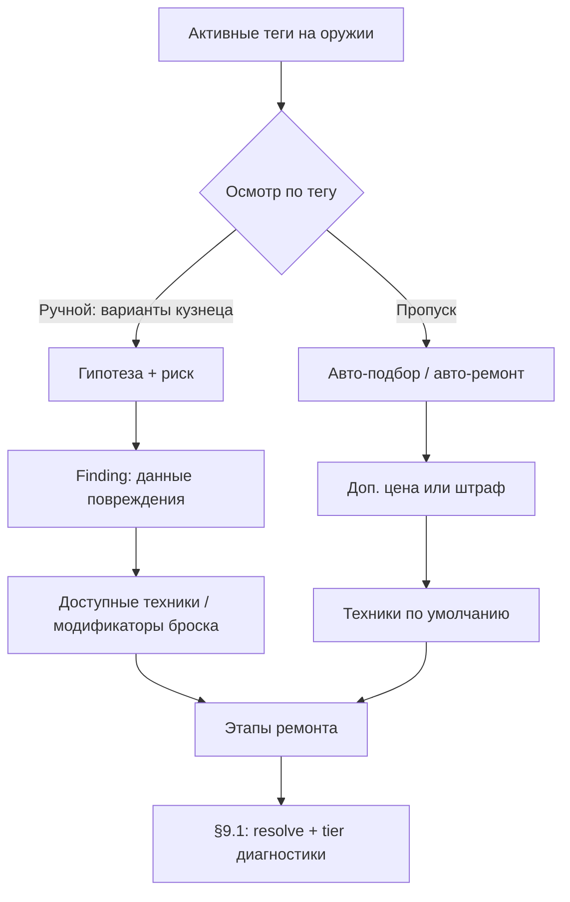
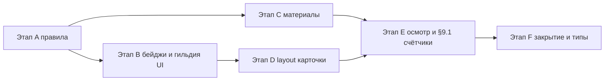

# Ремонт: спецификация доработки UI/UX и правил гильдии

**Навигация:** требования §1–§5 → план по этапам **§6** → **worklog §7** → сводный чеклист §8 → **решения и задел под зачарование §9**. **Итерация UX осмотра** (плей-тест): конец **§2**. **Согласованная модель v2** (риск, данные, авто с ценой, мета §9.1): подраздел **«Согласованная модель v2»** в **§2**.

Документ фиксирует требования и направление реализации по запросу: материалы как в крафте, единый сценарий осмотра с выбором версии кузнеца, бейдж вкладки «Ремонт», **невозможность отправить** в экспедицию оружие на верстаке при том, что оно **видно** в планировании гильдии (неактивно, с бейджем), каноничная карточка оружия и лаконичный layout (десктоп / мобильный).

**Состояние кода (ориентир, 2026-04-05):**

- Вкладки кузницы: `src/components/screens/forge-screen.tsx` — у «Инвентарь» есть бейдж по количеству оружия (без верстака), у «Ремонт» бейджа нет.
- Карточка инвентаря / верстака: `src/components/forge/weapon-inventory-card.tsx` — градация качества и тир души **справа под названием**; видимые повреждения и кнопка **«Отправить на ремонт»** — **внизу**, под **«Состав оружия»** (на верстаке кнопки отправки нет).
- Карточка ремонта: `src/components/ui/repair-card.tsx` — блок «Видимые повреждения»: автоподбор техник на **полной ширине** над колонками тег/осмотр; кнопка **«Отключить автоподбор»**; в «Дополнительно» — осмотр углём, **авто-ремонт за золото**, очередь «при следующем заходе в кузницу» (таймер как основная цена снят, см. [REPAIR_TECH_DEBT_AND_BALANCE_PLAN.md](REPAIR_TECH_DEBT_AND_BALANCE_PLAN.md)); блок техник снизу.
- Формулы баланса ремонта (золото авто-ремонта, наценка автоподбора от атаки): `src/lib/store-utils/repair-balance.ts` + `constants.ts`; адаптер ремонта — `repair-utils.ts`.
- Верстак: `repairBenchWeaponId` в `src/store/slices/craft-slice.ts`; отправка с инвентаря — `sendWeaponToRepairBench`.
- Экспедиции: список оружия в `src/components/guild/expeditions-section.tsx` (сейчас `availableWeapons` **фильтрует** кандидатов; целевое поведение — см. §4: показывать и верстак, но disabled); валидация старта — `src/lib/expedition-start-validation.ts` + `getWeaponGuildServiceBlockReason` из `src/lib/guild-weapon-service-eligibility.ts`.
- Важно: **`getWeaponGuildServiceBlockReason` не проверяет, стоит ли клинок на верстаке ремонта** — блокируются низкая прочность, видимые теги, `repairCondition`. Если у меча на верстаке нет активных тегов и прочность/состояние «ОК», он может пройти в экспедицию — это баг относительно желаемого правила.

---

## 1. Материалы и принцип «как в крафте»

### Проблема

Игрок не понимает, почему ремонт не запускается, и не видит привычного пути: «не хватает слитка → сделать/купить → вернуться».

### Цель

Повторить **модель крафта v2**: явный список нехватки, понятные действия, без «мёртвой» кнопки без объяснения.

### Требования

1. **Сводка потребности** — как минимум: недостающие `ResourceKey` / материалы из плана ремонта (`resolveWeaponRepairPlanEconomy`, `buildWeaponRepairPlan`), с количеством «есть / нужно».
2. **Если ресурс крафтится из рецепта** (как железный слиток из руды и т.д. по цепочкам проекта) — краткая подсказка или кнопка «Перейти к крафту» / предзаполнение вкладки крафта тем рецептом, если такой паттерн уже есть в UI крафта (не дублировать логику — переиспользовать существующие хелперы навигации).
3. **Закупка в магазине** — если ресурс **доступен за золото** (или иная валюта магазина), показывать опцию **«Закупить недостающее»** одной галочкой или переключателем: при подтверждении старта ремонта списать золото и добавить материалы (или выполнить покупку тем же путём, что магазин). Точные правила цены — из существующих данных магазина; если позиции нет — **не** показывать галочку, а показать короткое сообщение: ресурс только с миссий/экспедиций.
4. **Нельзя купить** — одна строка: «Нужно добыть: …» + при необходимости ссылка на гильдию / экспедиции (без перегруза текстом).

### Нефункционально

- Минимум дублирования с `CraftContainerV2` / инвентарными проверками: `getAvailableAmountForResourceKey`, `inventory-check`.
- Кнопка «Начать ремонт» активна только когда экономика закрыта **или** включена закупка и хватает золота.

---

## 2. Один сценарий осмотра: клик по тегу → версии кузнеца → техника → этапы (крафт)

### Проблема

Три режима («глубже», два «авто») размывают действие и не совпадают с ментальной моделью «сначала понять повреждение, потом чинить».

### Цель

Один понятный поток: **осмотреть повреждения** через интерактивные теги; после осмысленного выбора — подходящая техника и запуск ремонта как «крафт по этапам».

### Базовый сценарий (MVP+)

1. В блоке «Видимые повреждения» каждая строка (тег) — **интерактивна** (кнопка-чип / `role="button"` с фокусом для доступности).
2. По клику открывается **панель выводов** (справа на десктопе; см. layout ниже): **2–3 варианта формулировок кузнеца** о причине и способе работы с **этим** тегом.
   - Одна версия **намеренно неверная** или вводящая в заблуждение (лёгкая «мини-игра» без таймера).
   - Игрок выбирает одну; после выбора показывается краткий **фидбек** (верно / неверно) **без длинного текста**.
3. После **правильного** выбора (или после любого выбора с штрафом к финальному броску — см. «Баланс») под панелью или в том же блоке подсвечивается **рекомендованная техника** из реестра (`repair-techniques-registry`, `getApplicableRepairTechniquesForTags`), соответствующая тегу.
4. Повтор для других тегов **по необходимости**; итоговый набор техник должен **покрывать все активные теги** (логика уже есть: `getUncoveredActiveTags`).
5. Внизу экрана — **подтверждение набора техник** и **«Запустить ремонт (этапы)»** — как сейчас по смыслу, но без лишних кнопок сверху.

### Что убрать из UI

- Отдельная кнопка «Осмотреть глубже» (уголь, таймер) — поведение переносится в **клик по тегу** (стоимость/время можно встроить в первый клик по тегу или сделать бесплатным после упрощения — решение в балансе).
- **Авто-ремонт за золото** и очередь **«при следующем заходе в кузницу»** — **не в первой линии** UI (см. §9.2: логика **остаётся в коде**; минутный таймер как основная цена снят); спрятать в «Дополнительно», чтобы не путать новичков; позже — разблокировка по прокачке.

### Баланс и анти-усталость

| Идея | Назначение |
|------|------------|
| Неверный выбор не блокирует навсегда | Либо мягкий штраф к финальному броску, либо повтор выбора с подсказкой после 1 ошибки |
| Один раз осмотренный тег | Сохранять «разобранный» тег в состоянии оружия / сессии, не заставлять кликать снова при каждом заходе |
| Несколько тегов подряд | Короткие тексты вариантов (1–2 предложения), без простыней |
| Повторяемость | Чередовать пулы формулировок по `tagId` из данных, а не один фиксированный текст |

Детали чисел (штрафы, стоимость угля за «глубокий» осмотр) — вынести в `constants` и `FORMULAS.md` после согласования.

### Данные

- Пулы «версий кузнеца» лучше хранить рядом с тегами: расширение `damage-tag-registry` или отдельный `damage-tag-inspection-options.ts` с полями: `correctOptionId`, тексты, `linkedTechniqueHintId`.
- Связь «тег → допустимые техники» уже есть через `getApplicableRepairTechniquesForTags` — спецификация не ломает расчёт плана, только **порядок выбора** в UI.

### Плей-тест: дублирование «угадай строку» и блока техник

**Наблюдение:** при текущей реализации игроку кажется, что весь осмотр сводится к **клику по «правильной» строчке**, при этом **ниже уже виден список техник** и понятный путь «выбрать техники → запустить этапы». Отдельный квиз **не добавляет решения**, а только повторяет то, что система и так предлагает внизу — **смысловой выигрыш низкий**, риск ощущения «лишний клик».

**Цель следующей итерации:** осмотр должен давать **что-то, чего нет в списке техник** — риск, информацию, модификатор, рольплей или ускорение — **или** быть **опционально упрощён** до чистого выбора техник без квиза (режим «мастер / новичок»).

Ниже — **черновик направлений** для доработки (не обязательный чеклист; выбрать 1–2 оси и закрепить в балансе).

| Направление | Идея | Зачем интереснее |
|-------------|------|------------------|
| **Риск вместо квиза** | Неверный «вывод кузнеца» не «просто ошибка», а **предложение техники с штрафом** (к финальному броску, к душе, к прочности) или **лишний этап** «переделки». Правильный вывод — нормальный план; поспешный — чинится, но дороже. | Игрок решает не «какую строчку нажать», а **готов ли рискнуть** ради скорости. |
| **Осмотр даёт данные, а не технику** | Квиз открывает **скрытый модификатор**: «зона закалки смещена», «трещина глубже, чем кажется» → меняется **диапазон броска** или **доступные техники** (одна заблокирована до осмотра). Список техник снизу **до клика** неполный или помечен «?». | Техники остаются центром, осмотр — **разведкой**, а не дублем. |
| **Один осмотр — одна ставка** | После выбора варианта кузнеца игрок **подтверждает ставку** (материалы/время/«острота внимания» персонажа), и только потом подставляются техники. Ошибка = **потеря части заготовки** или откат таймера осмотра. | Связка «думаешь → платишь за уверенность» вместо бесплатного угадывания. |
| **Нарратив и детали мира** | Варианты — не «правильно/неправильно», а **разные истории повреждения** (кислота / удар / износ); выбор влияет только на **текст**, **флавор** и **косвенно** на скрытый учёт §9.1 (какой «тип истории» накапливается). Механика ремонта та же, но **удовлетворение** от осмысленного выбора. | Подходит, если не хотим усложнять бой; усиливаем **атмосферу** и задел под зачарование. |
| **Мини-игра на внимание** | Короткий паттерн: **совместить метки** на схеме клинка, **провести линию** по зонам износа, **время + точность** (лёгкий скилл-чек), а не выбор из текста. Успех сужает штрафы или открывает «идеальную» технику. | Отходит от «тыкни правильную строку» к **другому жанру** взаимодействия. |
| **Авто-подбор с ценой** | Кнопка «Кузнец советует» **сама** выставляет техники по тегам, но **без бонуса мастерства** или с **+N% к материалам** по сравнению с ручным осмотром, давшим бонус. | Игроки, кому не нужен квиз, **пропускают** осмотр осознанно. |
| **Режим «только техники»** | В настройках / флаге доступности: **скрыть панель вариантов кузнеца**, оставить теги как **информационные чипы** (лор + подсказка) и блок техник как единственное действие. | Закрывает запрос «не хочу угадывать» без удаления контента у других игроков. |
| **Связь с §9.1** | «Правильный» осмотр по тегу **один раз** помечает тег как **качественно диагностированный** и даёт **+1 к скрытому счётчику** или отдельный флаг для зачарования; ошибка — ремонт возможен, но **история «идеального» ремонта** не копится. | Квиз оправдан **мета-прогрессией**, а не копией списка техник. |

**Принцип отбора:** если механика не меняет **ни броска, ни затрат, ни данных для §9.1/зачарования, ни опцию пропуска** — её стоит **не показывать в первой линии** или заменить на **короткий лор** без обязательного клика.

---

### Согласованная модель v2 (проработка выбранных направлений)

Ниже — **единая целевая модель**, объединяющая четыре выбранные опоры: **риск вместо квиза**, **осмотр даёт данные**, **авто-подбор с ценой** (в т.ч. связка с **авто-ремонтом**), **мета-прогресс §9.1** как мост к **модулю зачарования**. Это не обязательно текущее состояние кода; это **спецификация для следующей итерации** `repair-card`, `repair-cross-slice` и данных на оружии.

#### Сводка четырёх опор

| Опора | Суть для игрока | Суть для системы |
|-------|-----------------|------------------|
| **Риск** | Выбор формулировки кузнеца — это **ставка на гипотезу**, а не школьный тест. | Неверная гипотеза **не запрещает** ремонт; она меняет **стоимость/исход** (броски, материалы, этапы). |
| **Данные** | Осмотр открывает **картину повреждения** (скрытые параметры), а не «подсвечивает правильную кнопку техники». | Список техник / доступность этапов зависят от **профиля осмотра** (`finding`), а не только от `tagId`. |
| **Авто с ценой** | Можно **не осматривать** и взять готовый набор работ — **дороже** и/или **хуже для меты**. | Один UX-паттерн для **«Кузнец подберёт техники»** и для **авто-ремонта за золото** (см. §9.2): плата за удобство. |
| **§9.1 мета** | «Хорошо отремонтированный» клинок для зачарования — это не только «сколько раз сняли тег», но и **насколько умели диагностировать**. | Отдельный персистируемый слой **качества диагностики** по тегам + существующие счётчики устранения (см. ниже). |

#### Поток (целевой)

#### 1. Риск вместо квиза

- Варианты в панели осмотра трактуются как **гипотезы о природе повреждения**, а не как «одна верная строка из трёх».
- **Верная гипотеза** (по данным тега / пулу `damage-tag-inspection-options`): формируется **полный / выгодный** `finding` — базовый диапазон броска, без лишнего этапа «переделки».
- **Неверная гипотеза**: ремонт **возможен**, но `finding` помечается как **ошибочный осмотр** — например: штраф к финальному броску, повышенный расход материалов на этапе, **дополнительный короткий этап** «переделка после неверной оценки» (один раз на тег за сессию ремонта — анти-спам).
- **Повторный выбор** (опционально): после ошибки — вторая попытка с **подсказкой** или уже с оплатой (уголь / время), чтобы не превращать в софтлок.

**Игровой смысл:** игрок взвешивает **риск ошибки** против **жадности по материалам/времени**, а не ищет «правильный пиксель».

#### 2. Осмотр даёт данные, а не «технику из квиза»

- До завершения осмотра по тегу (или при явном «пропуске») UI **не обещает полную уверенность**: часть техник может быть **заблокирована** (`?`, «нужен осмотр»), либо показывается **диапазон неопределённости** броска (например «успех 60–85%» вместо точного числа после `finding`).
- **После** выбора гипотезы (и фиксации `finding`) система **раскрывает**:
  - какие **техники допустимы** для этого тега в текущем контексте;
  - **модификаторы** к таблице ремонта (критический диапазон, штраф к душе и т.д. — детали в `FORMULAS.md` после баланса).
- Тексты вариантов кузнеца должны **описывать причину** (кислота / удар / усталость металла), а `finding` хранит **машиночитаемые ключи** для связки с реестром техник и с **§9.1**.

**Важно:** кнопка «добавить технику из осмотра» в текущем UI **убирается как дубль**; техники подтягиваются из **открытого finding + реестра**, либо игрок правит набор вручную в рамках допустимого.

#### 3. Авто-подбор с ценой и авто-ремонт (единая логика «удобство = цена»)

Цель — чтобы **два разных UI-входа** делили одну идею: **не тратить время на осмотр — заплатить иначе**.

| Режим | Что делает | Цена / штраф | §9.1 диагностика |
|-------|------------|--------------|-------------------|
| **Авто-подбор техник** (кнопка у верстака) | Подставляет техники по правилам «как сейчас по тегам», **без** пошагового осмотра | **+N% к материалам** от мощности в v1 (атака), границы min–max — см. FORMULAS / `repair-balance.ts` | **Не** даёт tier `precise`; максимум `skipped` или отдельный флаг `bulk` |
| **Авто-ремонт** (§9.2) | Ремонт без участия в осмотре | **Основная цена — золото** при claim; очередь **«при следующем заходе в кузницу»** без минутного ожидания как главной механики; мягкий штраф к наградам и `skipped` для меты | Аналогично: **не** накапливает «качественную диагностику»; счётчики **устранения тега** (resolve) могут расти как сейчас — см. раздел ниже |

**Связка:** в UI блока «Дополнительно» текстом зафиксировать: *«Быстрый ремонт и автоподбор не копят бонус к будущему зачарованию за счёт диагностики — только честный осмотр»* (формулировка для игрока, не техническая).

#### 4. Связь с §9.1: два слоя меты и мост к зачарованию

Уже есть (или в коде): **устранение тега** → `repairResolveCountByTagId`, `archivedDamageTagIds`. Для выбранной модели добавляется **второй слой** — **качество диагностики** на момент снятия тега (или на момент последнего осмотра перед снятием).

| Слой | Назначение | Примеры значений (черновик) |
|------|------------|----------------------------|
| **A. Устранение тега** | «Сколько раз клинок **победил** этот тип повреждения» | Карта `tagId → count` (как §9.1 сейчас) — база для **аффиксов опыта** («много раз чинил кислоту»). |
| **B. Качество диагностики** | «Насколько осмотр был **точным** перед ремонтом» | Per tag / per repair session: `precise` \| `risky` \| `skipped` (автоподбор/авторемонт) |

**Правила начисления (целевые):**

- **`precise`:** успешный осмотр — выбрана **верная** гипотеза для тега, затем в этом же цикле ремонта тег **снят** техниками, согласованными с `finding`.
- **`risky`:** выбрана **неверная** гипотеза, но ремонт **всё же** снял тег (игрок «дотянул» ценой ошибки).
- **`skipped`:** использованы **авто-подбор** или **авто-ремонт** без полноценного осмотра по тегу.

**Зачарование (направление):** модуль зачарования может читать **оба** слоя: например порог «скрытого свойства кислоты» = `resolveCount` по кислотному тегу **и** доля ремонтов с `precise` по этому тегу. Конкретные формулы — **не в этом документе**; здесь только **разделение ответственности данных**.

**Персист (ориентир):** расширение `weaponLegacy` (или соседний объект) полями вида `repairDiagnosisTierByTagId: Record<string, 'precise' \| 'risky' \| 'skipped'>` с **агрегацией** (последнее значение / счётчики по tier — решается при реализации). Согласовать с `cloud-save-feature.ts` и миграцией, как для §9.1.

#### UI-индикаторы (кратко)

- После осмотра: короткая строка **«Диагноз: уверенный / ошибочный / не проводился»** рядом с тегом или в сводке перед запуском этапов.
- У авто-кнопок: **«Без бонуса к зачарованию за диагностику»** (одна подсказка на обе).

#### Следующие шаги реализации (чеклист для §7 Worklog)

1. Спека данных: поля `finding`, enum диагностики, совместимость с `damage-tag-inspection-options.ts`.
2. Логика: `repair-cross-slice` / исполнение ремонта — вычисление tier при снятии тега.
3. UI: скрытие/блокировка техник до `finding`; кнопка авто-подбора с ценой; копирайт про §9.1.
4. Баланс: числа штрафов и наценок — `constants` + `FORMULAS.md`.
5. Тесты: unit на tier при precise/risky/skipped.

---

## 3. Бейдж на вкладке «Ремонт»

### Требование

В заголовке вкладки **цифра**: сколько единиц оружия сейчас в ремонте.

### Определение «в ремонте»

- **Минимально достаточно:** `repairBenchWeaponId != null` → счётчик **1** (один слот верстака — как в текущей модели).
- Если позже появится очередь или несколько слотов — счётчик = число оружия в очереди ремонта.

### UI

- Тот же визуальный паттерн, что бейдж у «Инвентарь» в `forge-screen.tsx` (`Badge` с числом).

---

## 4. Экспедиции (и согласованность с гильдией / заказами)

### Требование

Оружие, которое игрок **отправил на ремонт** (стоит на верстаке: `weapon.id === repairBenchWeaponId`), **нельзя** выбрать для экспедиции и **нельзя** использовать в других действиях гильдии, где передаётся то же оружие.

### Планирование гильдии: видимость без «исчезновения»

Игрок не должен терять контекст «где мой меч». Поэтому в интерфейсе выбора оружия для экспедиции **клинок на ремонте остаётся в списке**, но:

- **Не выбирается** — клик / тап не назначает оружие; состояние выбора не меняется на этот `weaponId`.
- **Визуально отключён** — приглушённые цвета (`opacity` / `muted` фон), без яркой рамки выбора; наведение может слегка подсвечивать, но не имитировать активную карточку.
- **Бейдж «На ремонте»** — всегда виден на карточке (как якорь памяти); короткий текст рядом или в `Tooltip`: «Сначала завершите ремонт или верните клинок в инвентарь».
- **Доступность:** `aria-disabled` / `aria-describedby` к пояснению; фокус с клавиатуры может переходить на карточку с объявлением причины блокировки.

Так список оружия в гильдии по составу ближе к «полному инвентарю», а правило «нельзя отправить» остаётся однозначным.

### Реализация (концепт)

1. **`getWeaponGuildServiceBlockReason`** — добавить проверку: если переданный `weapon.id` совпадает с `repairBenchWeaponId` из состояния, вернуть причину вроде: «Оружие на верстаке ремонта — сначала завершите или снимите с ремонта».
   - Потребуется расширить сигнатуру (передавать `repairBenchWeaponId` или вызывать валидацию на уровне store, где есть оба значения) **или** дублировать проверку в `validateExpeditionStart` / `startExpeditionFull` до вызова с тем же текстом.
2. **UI списка оружия** — в `expeditions-section.tsx` (и любых компонентах выбора оружия для экспедиции) **не исключать** оружие на верстаке из массива отображения. Вместо этого:
   - помечать `isOnRepairBench: weapon.id === repairBenchWeaponId`;
   - рендерить карточку в **disabled**-варианте + бейдж «На ремонте»;
   - обработчик выбора: `if (isOnRepairBench) return` (и при необходимости тост с тем же текстом, что в `getWeaponGuildServiceBlockReason`).
3. **Сортировка (опционально)** — можно поднимать «на ремонте» вверх или оставлять в порядке инвентаря; главное — предсказуемость (зафиксировать в коде один вариант).
4. **Заказы NPC** — `order-cross-slice.ts` уже использует `getWeaponGuildServiceBlockReason`; после расширения правила заказы тоже заблокируются для оружия на верстаке. Для заказов отдельный список может по-прежнему **скрывать** недоступное оружие или показывать disabled — это решается в UX заказов; минимум — **нельзя сдать** то же правило на уровне экшена.

### Согласованность логики и UX

| Слой | Поведение |
|------|-----------|
| Серверная валидация / store | `startExpeditionFull` и `validateExpeditionStart` отклоняют старт, если клинок на верстаке — **источник правды**. |
| UI гильдии | Игрок **видит** меч, понимает **почему** серый (бейдж + tooltip), не путается с «пропавшим» предметом. |
| Вкладка «Ремонт» (§3) | Бейдж по количеству в ремонте дублирует сигнал; гильдия напоминает о том же клинке в контексте отряда. |
| Кузница §5 | Бейдж «На ремонте» на каноничной карточке в ремонте и в гильдии — **одна и та же формулировка**, чтобы визуальный язык совпадал. |

### Тесты

- Юнит-тест на `getWeaponGuildServiceBlockReason` (или на `validateExpeditionStart`) с моком оружия на верстаке.
- При наличии тестов UI — проверка, что клик по disabled-карточке не меняет `selectedWeapon`.

---

## 5. Идентичность карточки и layout

### Проблема

На экране ремонта теряется ощущение «тот же меч, что в инвентаре».

### Цель

**Та же ширина и тот же визуальный каркас**, что у `WeaponInventoryCard`, с оверлеем/бейджем «На ремонте» при необходимости. Тот же бейдж и та же стилистика «приглушения», что и у неактивной карточки в планировании гильдии (§4), чтобы игрок узнавал состояние. Блок повреждений и дальнейшие шаги — **надстройка**, а не другая «карточка».

### Десктоп (≥ md)

- **Слева:** колонка фиксированной ширины = карточка инвентаря (max-width как у списка инвентаря).
- **Справа:** колонка «Осмотр и техники» — при клике по тегу появляются варианты кузнеца, затем предложенная техника; скролл только в правой колонке при длинном тексте.
- **Низ страницы (на всю ширину или под обеими колонками):** материалы, галочка закупки, кнопка запуска этапов.

### Мобильный

Варианты (выбрать один при реализации):

- **A.** Карточка оружия сверху полной ширины; теги; по тапу — **нижний sheet** (`Drawer` / bottom sheet) с версиями кузнеца и техникой.
- **B.** Карточка сверху; по тапу по тегу — **полноэкранный шаг** с кнопкой «Назад» к мечу.
- **C.** Одна колонка: карточка → аккордеон по каждому тегу (раскрытие = осмотр).

Критерий: не терять контекст «какой меч» — заголовок/миниатюра дублируются в sheet шапке.

### Лаконичность

- Скрывать второстепенное (старый длинный лог) в «Подробности» / сворачиваемый блок.
- «Запись осмотра» — либо сократить до последней строки, либо только после успешного осмотра.

---

## 6. План внедрения по этапам (до полного закрытия спеки)

Этапы идут **последовательно по смыслу зависимостей**; внутри этапа задачи можно распараллелить (например UI + тесты). После каждого этапа — **smoke**: кузница → гильдия → сохранение (локально / облако по флагу). Записи вести в **§7 Worklog**.

**Учёт решений §9 (зафиксировано в плане):**

| §9 | Суть | Где в плане |
|----|------|-------------|
| **9.1** | Скрытый архив тегов + счётчики ремонтов по `tagId` (задел под зачарование) | **E-§9.1 / E-§9.1.1** — данные и инкременты в коде; **F** — интеграционный тест персиста (**T3**, открыт); см. **§8** |
| **9.2** | Авто-ремонт **не удалять из кода**; в UI — не первая линия; разблокировка по прокачке — **отдельная задача** | **E-§9.2** — закрыто (баланс и UI: [REPAIR_TECH_DEBT_AND_BALANCE_PLAN.md](REPAIR_TECH_DEBT_AND_BALANCE_PLAN.md) §7); тикет разблокировки — **§8 F** |
| **9.3** | Все миссии PvE — **отдельной ветки валидации не делать** | Этап **A** — закрыт; единый `validateExpeditionStart` / eligibility |

### Этап A — Правила и защита от эксплойтов (без большого UI)

**Цель:** оружие на верстаке нельзя отправить в экспедицию и нельзя сдать по заказу, независимо от прочности/тегов.

| Действие | Детали |
|----------|--------|
| Расширить проверку | Ввести учёт `repairBenchWeaponId` в `getWeaponGuildServiceBlockReason` (предпочтительно вторым аргументом или объект контекста) **или** явная проверка в `validateExpeditionStart` + в экшене заказа; текст причины единый из одного хелпера. |
| Store | Все вызовы `getWeaponGuildServiceBlockReason` передать с актуальным `repairBenchWeaponId` из `get()`. |
| Тесты | `guild-weapon-service-eligibility.test.ts` — кейс «на верстаке»; `validateExpeditionStart` — отказ при совпадении id. |
| §9.3 Миссии | **Не** заводить отдельный код валидации «для PvE-миссий» — по §9 все миссии PvE; расширения только в общих правилах гильдии/экспедиции (этап A). |
| Критерий готовности | `npm run test` зелёный; ручной сценарий: меч на ремонте → `startExpeditionFull` возвращает false / валидация не пускает. |

**Зависимости:** нет. **Риск:** забыть второй вход (заказы) — пройтись по grep `getWeaponGuildServiceBlockReason`.

---

### Этап B — Вкладка «Ремонт» и гильдия: видимость состояния

**Цель:** игрок всегда видит сигнал «что в ремонте» и не теряет меч в списке гильдии.

| Действие | Детали |
|----------|--------|
| Бейдж вкладки | `forge-screen.tsx`: при `repairBenchWeaponId != null` показать `Badge` с **1** (как у инвентаря). |
| Список оружия в экспедиции | `expeditions-section.tsx`: перестать **полностью** исключать верстак из отображаемого списка; завести список «все для отображения» или маппинг с флагом `isOnRepairBench`; disabled-стили + бейдж «На ремонте»; клик не выбирает (опционально тост). |
| Другие экраны выбора оружия | Проверить `recruitment-interface.tsx` и аналоги — если есть выбор оружия для экспедиции/гильдии, применить тот же паттерн или явно исключить с комментарием «вне скоупа». |
| a11y | `aria-disabled`, подпись причины. |
| Критерий готовности | Меч на ремонте виден в гильдии серым с бейджем; выбрать нельзя; старт экспедиции с этим id по-прежнему невозможен (этап A). |

**Зависимости:** этап A (логика блокировки уже есть). **Риск:** дублирование стилей — вынести общий вариант карточки или `cn` пресет.

---

### Этап C — Материалы «как в крафте» (экономика ремонта в UI)

**Цель:** понятная нехватка, путь в крафт, опциональная закупка.

| Действие | Детали |
|----------|--------|
| Сводка | В зоне подтверждения ремонта: таблица/список «нужно / есть» по `resolveWeaponRepairPlanEconomy` + `buildWeaponRepairPlan`. |
| Крафт | Кнопка или ссылка «Скрафтить» с переходом на вкладку крафта с тем же паттерном, что уже есть в проекте (не изобретать навигацию). |
| Закупка | Чекбокс только если ресурс в магазине; иначе одна строка «добыть в экспедициях». |
| Кнопка старта | Активна при закрытой экономике или при включённой закупке и достаточном золоте. |
| Критерий готовности | Без слитка кнопка не «молчит» — видна причина и шаги. |

**Зависимости:** можно параллельно с B после A. **Риск:** дублирование с `CraftContainerV2` — максимально переиспользовать хелперы.

---

### Этап D — Каноничная карточка и layout ремонта (оболочка)

**Цель:** один визуальный язык с инвентарём и гильдией; сетка лево/право (десктоп).

| Действие | Детали |
|----------|--------|
| Карточка | Вынести общую оболочку или рендерить `WeaponInventoryCard` + слот под панель осмотра / вынести проп `variant="repairBench"`. |
| Сетка | `repair-section.tsx` + `repair-card`: колонки по §5; нижняя зона материалов и CTA. |
| Мобильный | Выбрать вариант A/B/C из §5 и зафиксировать в worklog. |
| Критерий готовности | Ширина и читаемость как в инвентаре; бейдж «На ремонте» согласован с этапом B. |

**Зависимости:** B желателен для общих стилей disabled/бейджа. **Риск:** раздувание пропов `WeaponInventoryCard` — минимальный API.

---

### Этап E — Осмотр по тегам (игровой поток) + §9.1 данные на оружии

**Цель:** клик по тегу → 2–3 версии кузнеца → выбор техники → этапы; старые три кнопки убраны из основного потока; **при снятии тега ремонтом** — задел под зачарование по §9.1.

| Действие | Детали |
|----------|--------|
| Данные осмотра | `damage-tag-inspection-options.ts` или расширение реестра тегов — пулы текстов, `correctOptionId`. |
| UI | Кликабельные чипы тегов; правая колонка / sheet на мобилке; связка с `getApplicableRepairTechniquesForTags`. |
| Удаление шума | «Осмотреть глубже» — убрать из первой линии. |
| §9.2 Авто-ремонт | Сохранить экшены/логику авто-ремонта в коде; в интерфейсе — **не первая линия** (блок «Дополнительно» или текущий доступ до появления разблокировки по прокачке). **Не** удалять функциональность ради упрощения UI. |
| §9.1 Скрытый учёт | При **полном снятии** активного тега ремонтом: тег убрать с карточки, но **сохранить привязку скрыто** (архив/история `tagId`); инкремент **счётчика** «сколько раз этот тег был устранён ремонтом» на оружии (структура вида map по `tagId` — зафиксировать в типах на этапе F). Повторные ремонты по другим тегам накапливают статистику независимо. |
| Критерий готовности | Один сценарий осмотра без лишних кнопок; `uncoveredTags` закрывается осмысленным выбором; после успешного ремонта, снявшего тег, счётчик по этому `tagId` увеличился, данные переживают перезагрузку (облако — этап F). |

**Зависимости:** D облегчает вставку панели; C даёт кнопку запуска после выбора техник. **Риск:** объём контента для всех `tagId` — можно MVP на подмножестве тегов + fallback; схема §9.1 — не блокировать MVP осмотра, но **не откладывать счётчики**, если снятие тегов уже в релизе.

---

### Этап F — Закрытие: тесты, документация, чистка, бэклог §9

| Действие | Детали |
|----------|--------|
| Тесты | Unit: ремонт/экспедиции; **§9.1** — инкремент счётчика при снятии тега, загрузка сохранения с непустой картой; при необходимости компонентные — клик по disabled в гильдии. |
| Доки | `FORMULAS.md` при новых константах; **`04_TYPES_SYSTEM.md`** — поля §9.1 (архив тегов, счётчики по `tagId`); `cloud-save-feature.ts` / API сохранения — при появлении новых полей оружия. |
| §9.2 Бэклог | Зафиксировать отдельной задачей: **разблокировка авто-ремонта по прокачке** (не блокер закрытия текущей ветки UI). |
| Регрессия | Полный прогон `npm run lint`, `npm run test`, `npm run build` (CI). |
| Критерий | Worklog §7 заполнен до этапа F; чеклист §8 отмечен; решения §9 отражены в коде или в бэклоге явно. |

---

### Порядок и параллели (схема)

*Этапы C и B можно вести параллельно после A; E опирается на D и желательно на C (кнопка старта осмысленна с экономикой). **§9.1** (скрытые счётчики) логично завершать вместе с E–F; **§9.3** закрывается в A без отдельных задач.*

---

## 7. Worklog

Ниже — **шаблон** для фиксации прогресса (копировать строки по мере работы). Можно вести прямо в этом файле или дублировать в PR / задаче трекера.

### Шаблон записи (одна строка = одна значимая итерация)

| Дата (YYYY-MM-DD) | Этап (A–F) | Сделано (кратко) | Файлы / ссылка PR | Тесты (команда / что проверено) | Заметки, блокеры |
|-------------------|------------|------------------|-------------------|--------------------------------|------------------|
| _пример_ | A | Добавлена проверка `repairBenchWeaponId` в eligibility | `guild-weapon-service-eligibility.ts`, тесты | `npm run test` | — |
| 2026-04-04 | v2-MVP | Согласованная модель v2: счётчики §9.1.1 (precise/risky/skipped), штраф к броску и наценка auto_pick, `executeWeaponRepairByTechniques`/`claimWeaponAutoRepair`, UI repair-card и свёртка §9.1 на верстаке | `repair-cross-slice`, `repair-utils`, `weapon-legacy`, `repair-card`, `weapon-inventory-card` | `npm run test`, `npm run type-check`, `npm run build` | — |
| 2026-04-05 | §7 баланс + UX | Полярности: авто-ремонт за **золото** (`repair-balance.ts`, `claimWeaponAutoRepair`); автоподбор с **наценкой от атаки**; таймер авто-ремонта снят; очередь next_visit; тесты repair-cross-slice / repair-utils. UX: карточка оружия — качество/тир справа, повреждения и «Отправить на ремонт» внизу; repair-card — вёрстка автоподбора, «Отключить автоподбор» | `repair-balance.ts`, `repair-cross-slice.ts`, `repair-card.tsx`, `weapon-inventory-card.tsx`, `constants.ts`, FORMULAS | CI-цепочка | См. [REPAIR_TECH_DEBT_AND_BALANCE_PLAN.md](REPAIR_TECH_DEBT_AND_BALANCE_PLAN.md) §7 |
| 2026-04-05 | D (мобилка) | Канон мобильного layout ремонта = **текущая** адаптивная вёрстка (`repair-card`, `weapon-inventory-card`, breakpoints); отдельный выбор «вариант A/B/C» из §5 не проводился — достаточно зафиксировать как канон для §8.D | — | — | См. §8 |
| | | | | | |

### Шаблон записи по блокеру / решению

| Дата | Тема | Решение или вопрос | Кто / где зафиксировано |
|------|------|--------------------|-------------------------|
| | | | |

### Шаблон финальной приёмки (после этапа F)

- [ ] Все этапы A–F пройдены или явно отложены с записью в бэклог / §9.
- [ ] CI (`lint`, `test`, `build`) зелёный.
- [ ] Smoke: верстак → гильдия (серый меч) → ремонт → экспедиция с другим оружием.

---

## 8. Сводный чеклист (мастер)

Использовать как **контроль перед релизом** фичи; детали — в §1–§5 и этапах §6. **Техдолг кода (T1–T3, T5)** и полировка UX осмотра согласованы с [REPAIR_TECH_DEBT_AND_BALANCE_PLAN.md](REPAIR_TECH_DEBT_AND_BALANCE_PLAN.md) §1; статусы UX-этапов **A–F** — ниже (подпункты **E** разведены по §9.2 / §9.1 / UX §2).

### A — Правила гильдии / экспедиции / заказы (без эксплойта верстака)

- [x] Учёт `repairBenchWeaponId` в [`getWeaponGuildServiceBlockReason`](../../src/lib/guild-weapon-service-eligibility.ts); единый текст блокировки.
- [x] Проброс в [`expedition-start-validation.ts`](../../src/lib/expedition-start-validation.ts), [`order-cross-slice.ts`](../../src/store/cross-slice/order-cross-slice.ts), [`expeditions-section.tsx`](../../src/components/guild/expeditions-section.tsx).
- [x] Тесты: [`guild-weapon-service-eligibility.test.ts`](../../src/lib/guild-weapon-service-eligibility.test.ts), [`expedition-start-validation.test.ts`](../../src/lib/expedition-start-validation.test.ts).
- [x] **§9.3** — отдельной ветки валидации под «тип миссии» нет.

### B — Вкладка «Ремонт» и гильдия: видимость

- [x] Индикатор на вкладке «Ремонт» при `repairBenchWeaponId != null` — [`forge-screen.tsx`](../../src/components/screens/forge-screen.tsx).
- [x] Список в гильдии: `displayWeapons` + disabled + бейдж «На ремонте» — [`expeditions-section.tsx`](../../src/components/guild/expeditions-section.tsx), [`WeaponSelectionCard.tsx`](../../src/components/guild/expeditions/WeaponSelectionCard.tsx) (`aria-disabled`, `title`).
- [x] [`recruitment-interface.tsx`](../../src/components/guild/recruitment-interface.tsx) не выбирает оружие (передаётся пропом); отдельная доработка по верстаку не требуется.

### C — Материалы «как в крафте»

- [x] Таблица «есть / нужно», опциональная закупка недостающего (если ресурс buyable), переход к крафту — блок материалов в [`repair-card.tsx`](../../src/components/ui/repair-card.tsx) (`resolveWeaponRepairPlanEconomy`, `buildWeaponRepairPlan`).

### D — Каноничная карточка и layout

- [x] Верстак: [`repair-section.tsx`](../../src/components/forge/repair-section.tsx) + [`weapon-inventory-card.tsx`](../../src/components/forge/weapon-inventory-card.tsx) (`context="repairBench"`) + [`repair-card.tsx`](../../src/components/ui/repair-card.tsx).
- [x] **Мобильный канон** — текущая адаптивная вёрстка; зафиксировано в worklog §7 (**2026-04-05**, строка «D (мобилка)»). Отдельный выбор «вариант A/B/C» из §5 не проводился.

### E — Осмотр, §9.1 / §9.1.1, §9.2 (раздельно)

- [x] **E-§9.2** — авто-ремонт и автоподбор: не первая линия UI; золото за claim; наценка от атаки; эпичность под «Дополнительно» — см. [REPAIR_TECH_DEBT_AND_BALANCE_PLAN.md](REPAIR_TECH_DEBT_AND_BALANCE_PLAN.md) §7, worklog **2026-04-04** / **2026-04-05**.
- [x] **E-§9.1 данные** — `repairResolveCountByTagId`, `archivedDamageTagIds`; инкремент в [`repair-cross-slice.ts`](../../src/store/cross-slice/repair-cross-slice.ts), нормализация в [`weapon-legacy.ts`](../../src/lib/weapon-damage/weapon-legacy.ts).
- [x] **E-§9.1.1** — `repairDiagnosis*CountByTagId`, `RepairDiagnosisTier`; unit-тесты в [`repair-cross-slice.test.ts`](../../src/store/cross-slice/repair-cross-slice.test.ts).
- [ ] **E-UX §2** — итерация осмотра по плей-тесту («квиз vs список техник») и направлениям из таблицы §2; пересекается с **T2** / **T3** в REPAIR_TECH_DEBT.

### F — Закрытие, типы, бэклог

- [x] Типы и описание `WeaponLegacy` / §9.1 / §9.1.1 — [`04_TYPES_SYSTEM.md`](../04_TYPES_SYSTEM.md); чеклист облака — [`cloud-save-feature.ts`](../../src/lib/cloud-save-feature.ts).
- [ ] **Интеграционный тест** полного цикла «теги → осмотр → этапы → успех» + `weaponLegacy` (**T3**).
- [ ] Опционально: компонентный тест клика по disabled-оружию в гильдии.
- [ ] Внешний тикет **разблокировка авто-ремонта по прокачке** (§9.2) — только при использовании внешнего трекера; в репозитории достаточно §9.2 в этом документе.

---

## 9. Решения по бывшим открытым вопросам (и задел под зачарование)

### 9.1 Скрытая привязка тегов и счётчики ремонтов по тегу

**Решение:** теги, которые **сняты с карточки** (не отображаются как активные повреждения), **продолжают быть привязаны к оружию скрыто**. Для каждого такого `tagId` ведётся **скрытый счётчик**: сколько раз это оружие было **починено именно через устранение этого тега** (полное снятие тега ремонтом, а не просто смена UI).

**Назначение данных:** база для **модуля зачарования** и скрытых свойств клинка. Пример направления (не финальный дизайн): оружие многократно участвовало в боях с противником, изрыгающим кислоту; после серии ремонтов, связанных с кислотным тегом, при зачаровании может проявиться **собственное кислотное** свойство. Это иллюстрирует связь «история тегов / ремонтов → скрытые аффиксы».

**Реализация (ориентир для типов и сохранения):**

- Хранить структуру уровня «карта `tagId` → число успешных ремонтов с полным снятием этого тега» на объекте оружия (или `weaponLegacy`), **персист** в Zustand + при облаке — по чеклисту `cloud-save-feature.ts`.
- При снятии тега с **визуальной** карточки не удалять историю: только переносить тег из активного списка в «архив» для подсчётов и будущих систем.
- Документировать поля в `docs/04_TYPES_SYSTEM.md` при появлении схемы.

**Связь с §2:** «осмотренные» теги в UI могут жить в сессии; **скрытый учёт снятых тегов и счётчиков** — отдельный персистируемый слой под зачарование и баланс.

#### 9.1.1 Качество диагностики (мета к зачарованию, модель v2)

**Дополнение к §9.1:** помимо «сколько раз устранили тег», на оружии учитывается **качество осмотра** перед ремонтом, снявшим тег. Подробная модель — в **§2, подраздел «Согласованная модель v2»** (опоры «риск», «данные осмотра», «авто с ценой», связь с зачарованием).

**Кратко:**

- **`precise` / `risky` / `skipped`** — tier диагностики на цикл ремонта (по тегу или по сессии); `skipped` для **авто-подбора техник** и **авто-ремонта** без осмотра.
- **Зачарование** может опираться на **комбинацию**: счётчики устранения тега + доля `precise` / накопленная «точность» по типу повреждения.
- Персист новых полей — по тому же чеклисту, что и остальной `weaponLegacy` / облако.

**Связь с §9.2:** авто-ремонт остаётся удобным путём, но **не** заменяет накопление `precise`-меты; игрок осознанно выбирает **скорость vs задел под зачарование**.

---

### 9.2 Авто-ремонт

**Решение:** функциональность **авто-ремонта остаётся в коде**; в UI — блок «Дополнительно» на `repair-card`. **Канон экономики (§7):** мгновенный claim за **золото** (см. `getWeaponAutoRepairGoldCost`); очередь **при следующем заходе в кузницу**; мета диагностики — `skipped`; мягкий штраф к скрытому множителю наград — в коде.

**Будущее:** отдельная задача — открыть авто-ремонт **после определённой прокачки** (как награда / разблокировка), чтобы не перегружать раннюю игру. До появления условия — доступ как сейчас.

**Связь с моделью v2 (§2):** авто-ремонт — тот же класс «**удобство за цену**», что и кнопка авто-подбора техник: не ожидается начисление tier **`precise`** для §9.1.1; счётчики устранения тега (§9.1) могут обновляться по-прежнему.

---

### 9.3 Миссии и отдельная валидация экспедиций

**Решение:** **отдельная ветка проверки под PvE-миссии не нужна** — все миссии в проекте считаются **PvE**; достаточно единого пути валидации (например `validateExpeditionStart` / правила гильдии) без дублирования под «тип миссии».

---

### Открытые пункты (вне трёх закрытых вопросов)

Появятся по мере проектирования зачарования: пороги счётчиков, маппинг тегов → потенциальные скрытые свойства, влияние на баланс; **веса `precise` / `risky` / `skipped`** в формулах зачарования (§9.1.1).

**UX осмотра:** см. **§2** — «Плей-тест: дублирование…» и **«Согласованная модель v2»** (целевая проработка четырёх опор и чеклист внедрения).

---

*Исходные требования зафиксированы в §1–§5 (гильдия: §4). План внедрения — §6, журнал работ — §7. Решения по персисту и зачарованию — §9.*
